# The Sovereign Substrate

*A constitutional architecture for governed computation*

Version 1.0

S. Wheeler

---

## Preface

The architectural intuition this paper develops has been in shape over many years, worked through thought experiments and incomplete attempts at formalisation. In the most recent period, machine-learning tooling has allowed the architecture to be tested, articulated, and substantiated through working code on a tractable timescale; what the tooling did not produce was the intuition, which long predates it. The substrate has substantial implications for AI capability specifically, which may become a primary focus of subsequent work. It does not exist in answer to AI. The structural fault it addresses is older than the current AI moment and would have produced the failures the paper documents whether AI existed or not.

A fuller account of the author's background, the writing process, and the paper's disclaimers and notices appears at the end of the paper.

---

# 1. The structural fault

Governance at the execution layer of computational systems currently operates through institutional discipline alone. An institution authors policy, communicates the policy to its delivery functions, builds or procures systems intended to embody the policy, audits its own operations against the policy, and responds to regulators and counterparties on the basis of what its institutional record says. The institution is, in every consequential sense, the only party with architectural access to its own systems. Counterparties, regulators, individuals, and even other functions inside the institution depend on the institution's cooperation for any operational visibility.

This arrangement works adequately at the time-scales of human institutional process. A regulator wanting to inspect a bank's operations gives notice, agrees scope, and conducts an inspection over weeks. A claimant disputing a benefit decision lodges an appeal, requests evidence, and waits months. A court reviewing whether an automated prosecution was sound subpoenas the system's logs and accepts the operating institution's testimony about what the logs mean. The institution's cooperation is the substrate of accountability, and the substrate operates on institutional time.

The arrangement fails predictably when the institution's cooperation is absent, partial, or contaminated. The institution may have institutional incentives to obscure what its systems did. The institution's delivery function may have lost the link between policy intent and operational reality, so that even a fully cooperative institution cannot reconstruct what its systems decided. The institution's systems may have evolved past the point where any individual in the institution understands their behaviour. The institution's regulator may lack the operational reach to inspect what matters when it matters. The institution's records may be presented as authoritative when in fact they are partial, edited, or wrong.

This is not hypothetical. Twelve documented institutional failures of exactly this shape sit at the heart of this paper. Each cost something material: lives, savings, livelihoods, institutional credibility, public trust. In each, the institutional arrangement that should have prevented the failure operated as designed and produced the failure anyway.

The fault is structural because the arrangement has no operational rung below institutional discipline. The substantive content of governance, the laws, regulations, policies, contracts, and individual rights, is on its own just text. It needs operational machinery to reach the systems it governs. The only operational machinery currently available is the institution's own, which means the institution is simultaneously the party governed, the party authoring its own operational embodiment of the governance, and the party reporting on what its operational embodiment did. No independent operational layer exists below the institution.

This was a tolerable arrangement at the institutional time-scales of the twentieth century. It is not a tolerable arrangement at the time-scales of contemporary computation. A consequential decision produced by an automated system can affect a million people before a regulator finishes drafting a notice of inspection. A misconfigured update can ground critical infrastructure across continents before any institutional process can intervene. A capability that did not exist last quarter can be embedded in operational systems this quarter, with no functional party in a position to verify it conforms to the law it operates under. The structural fault did not begin with AI capability. It existed before. AI capability has made it unsurvivable on the time-scales current arrangements assume.

## 1.1 The cases

Twelve cases. Most are documented institutional failures; two are architectural demonstrations of substrate mechanisms that do not correspond to a single documented incident.

**The Universal Credit advance payment.** The UK Department for Work and Pensions adjudicates advance payments at scale. The decision involves identity verification, income verification, eligibility evaluation, fraud-risk scoring, and decision construction. The substrate's smallest interesting demonstration is this case at single-operator scale, then extended to cross-operator scale where the Home Office's nationality and right-to-work archives compose with DWP's eligibility machinery under a cooperative substrate. The case is not a documented failure. It is included because the substrate's machinery has to operate cleanly on the easy case before its handling of the harder cases can be trusted.

**Horizon.** Between 1999 and 2015, approximately 900 UK postmasters were prosecuted for theft and false accounting on the basis of computer-generated evidence from the Post Office's Horizon system. The system's accounting outputs were treated as authoritative evidence in court; the postmasters' claims that the figures were wrong were treated as denial. Horizon's underlying defects were not disclosed to defence counsel; the Post Office, as the only party with operational access to the system, controlled what the courts saw. The conviction rate held. Postmasters lost their businesses, their homes, their reputations, and in several cases their lives. The Court of Appeal began quashing convictions only in 2021. The structural failure is the absence of any party with operational access to Horizon other than the Post Office itself. Defence counsel, the courts, and the postmasters themselves were operationally blind to what the system actually did. The substrate addresses this through content-addressing of implementations, attributable acts through credential chains, and cross-operator audit through a cooperative substrate that gives the courts structural access to the operator's ledger.

**Robodebt.** Between 2015 and 2019, the Australian government's Online Compliance Intervention scheme automated the issuance of welfare-debt notices to citizens. The algorithm divided annual income from tax records by 26 to produce a notional fortnightly income, compared it to the fortnightly income declared during the benefit period, and treated any difference as evidence of overpayment. The procedure had no defensible relationship to how gig-economy and casual workers actually earned income. The precondition required for the comparison to be valid, that income is roughly steady across the year, was not stated, not checked, and known by the relevant officials to be wrong. Approximately 470,000 debts were raised. The burden of proof was placed on the citizen to demonstrate the debt was incorrect. The scheme was found unlawful in 2019; the Australian government paid AUD 1.8 billion in settlements. The structural failure is an algorithmic decision deployed against citizens with no operational machinery for refusing to act when the algorithm's preconditions are violated. The substrate addresses this through structural enforcement of preconditions, with type-mismatch refusal at compile time and refusal-as-first-class-output at runtime when input data violates declared assumptions.

**Lavender.** Reporting in 2024 by +972 Magazine, Local Call, and the Guardian described an IDF AI-assisted targeting system that produced lists of human targets at a rate, and with a degree of human review per target, qualitatively different from prior practice. The reporting describes targets being approved after roughly twenty seconds of human review, collateral-damage thresholds being authorised in advance rather than per-strike, and the system's classification confidence drifting over the operation's course. The substrate's demonstration is stylised and informed by this reporting rather than a claim about a specific operational system. The structural fault is a behaviour-characterised classifier whose declared calibration is treated as load-bearing for consequential decisions, with no operational mechanism for invalidating the classifier when its calibration drifts and no operational mechanism for refusing decisions whose human-review process has been compressed below meaningful threshold. The substrate addresses this through calibration claims as governance metadata, drift detection as a substrate event that invalidates the classifier, and meaningful-review as a structural credential requirement rather than a procedural recommendation.

**SolarWinds.** In 2020, intrusion into the build pipeline of SolarWinds' Orion network-monitoring software allowed insertion of a backdoor (Sunburst) into legitimate signed builds, which were distributed through the normal update channel to approximately 18,000 customers, including multiple US federal agencies. The intrusion was discovered by FireEye in December 2020, having been operational for months. The structural fault is that cryptographic signing alone is insufficient when the signing party's own pipeline has been compromised. The signature verifies the signer, not the artefact's integrity against an independent reference. The substrate addresses this through content-addressing of build artefacts at the unit level plus multi-custodian quorum on deployment, including an independent build-verifier custodian that refuses to witness builds containing known-bad indicators. A trojanised build produces a different content identity from the legitimate build; the substrate refuses to compose a compiled form for a build that the quorum will not jointly witness.

**CrowdStrike Channel File 291.** On 19 July 2024, a configuration update distributed by CrowdStrike caused Windows endpoints running the Falcon sensor to crash into bugcheck loops on boot. Approximately 8.5 million devices were affected. Airlines, hospitals, banks, and emergency services were among the operationally impaired institutions. Total economic loss was estimated at USD 5.4 billion. The structural fault is that a configuration-update channel was treated as fundamentally different from a code-update channel for operational governance purposes, with fast-path delivery, no canary, and no rollback discipline, when in fact the two channels have identical operational consequences on the endpoint. The substrate addresses this through the unification of code and configuration as content-addressed artefacts, staged deployment through cooperative-substrate cohorts (canary then production), drift detection on the canary cohort's behaviour, and structural rollback when drift fires before the production cohort is reached.

**Boeing 737 MAX MCAS.** The MCAS system on the 737 MAX was certified through an "amended type certificate" process that used Boeing's Designated Engineering Representatives, who are Boeing employees authorised by the FAA to make certification determinations on the FAA's behalf, for substantial portions of the safety analysis. MCAS relied on a single angle-of-attack sensor; pilots were not informed of the system's existence in the initial flight manual; when the sensor read erroneously high, as on Lion Air 610 and Ethiopian Airlines 302, MCAS commanded nose-down trim against pilots who could not see why. 346 people died across the two crashes. The structural fault is certification by the regulated party in a process that allowed the regulator's independent scrutiny to be substantially reduced. The substrate addresses this through certification-as-joint-witnessing under a cooperative substrate spanning manufacturer, regulator, and operating airlines, with structural cert policies that refuse single-sensor architectures for safety-critical automation and pilot-override-as-credential that makes the pilot's authority a structural property of the unit rather than a paragraph in a manual.

**Five Eyes.** The case is stylised, not a claim about any specific real intelligence arrangement, and treats the architectural question of how cross-jurisdictional intelligence cooperation could be made substrate-legible without compromising the operational secrecy participating sovereigns require. Two synthetic agencies federate under bilateral query-exchange and oversight cooperative substrates. Jurisdiction-scope policy refuses self-jurisdiction queries. Cooperative-substrate gates refuse queries outside permitted categories. An oversight committee has structural cross-operator audit access. The substrate cannot prevent constitutional sources from being captured, cannot prevent oversight bodies from being denied access by political process. What it can do is shift the structural question from "are authorising bodies being deceived?" to "are they looking at the ledger they have access to?". This is the substrate's most architecturally demanding case and its most politically bounded; it appears here because the substrate's compositional uniformity must be demonstrable at the hardest scale to which the architecture claims to apply.

**LIBOR.** Between approximately 2005 and 2012, panel banks contributing to the London Interbank Offered Rate manipulated their submissions individually and in coordination. The benchmark, used in trillions of dollars of contracts globally, was computed from unverified submissions whose relationship to underlying money-market activity was not structurally enforced. Fines exceeded USD 9 billion across the major panel banks; several traders were convicted in the initial wave of prosecutions, with some convictions subsequently overturned on appeal; LIBOR was phased out between 2021 and 2023. The structural fault is institutional-level submissions aggregated into a cross-institution benchmark with no per-submitter attribution that would have made manipulation observable and no joint witnessing of the aggregation. The substrate addresses this through content-addressed submissions attributable to specific submitter credentials, drift detection on systematic divergence between submitted rates and declared underlying activity, and cooperative-substrate joint witnessing of the aggregation. The benchmark itself is produced under the panel banks' joint signature rather than computed unilaterally by an administrator.

**London Whale.** In 2012, JPMorgan Chase's Chief Investment Office accumulated losses of approximately USD 6.2 billion on synthetic credit derivatives. The bank's value-at-risk model was recalibrated mid-position to produce systematically lower risk figures on the same underlying portfolio. Institutional escalation paths that should have halted position growth did not reach the authority required. The loss accumulated over months. The structural fault is a behaviour-characterised risk model whose calibration drifted from the portfolio's actual behaviour, with no operational mechanism for invalidating the model when its drift exceeded declared bounds, and an institutional escalation procedure whose effective non-existence had no architectural visibility. The substrate addresses this through drift detection on the model's behaviour-characterised contract, by which the model invalidates when the realised-to-predicted volatility ratio falls outside declared acceptance bands, and escalation as a structural credential, so that "refer to human" becomes a substrate output rather than an institutional procedure a culture can override.

**Constitutional anchoring.** Not a documented failure but an architectural demonstration. The substrate's deepest commitment is that authority chains terminate at natural persons. The demonstration: a ministry operator running a substrate whose constitutional source is a cooperative substrate over five members of parliament, each holding a real cryptographic keypair; ministerial and civil-servant credentials derived under the parliament; an administrative unit whose authority chain visibly terminates at named parliamentarians. An election succession produces a new parliament credential, supersedes the old, and triggers recompilation of derived credentials. A mid-term revocation removes one MP and refuses subsequent invocations until the parliament reconstitutes. The demonstration closes the architectural loop on natural-person anchoring. The institutional and legal machinery that anchors specific cryptographic keypairs to specific human beings, including biometric attestation, hardware security modules, legal recognition, key recovery, and succession on death, remains outside what code can verify.

## 1.2 What the cases share

The substrate's architectural commitments are general. The same machinery handles welfare adjudication, postal-service accounting, automated debt assessment, algorithmic targeting, build-pipeline compromise, configuration-update deployment, aircraft certification, intelligence cooperation, benchmark manipulation, and risk modelling. The compositional uniformity claim is not theoretical; it is substantiated across the twelve cases in working code. What varies between cases is which substrate mechanism does the most work: content-addressing for Horizon and SolarWinds, type-mismatch refusal for Robodebt, drift detection for Lavender and London Whale, cooperative-substrate joint witnessing for SolarWinds and 737 MAX and LIBOR, cross-operator audit through cooperative substrates everywhere. The machinery itself is the same.

The failures the cases document are not pathologies of particular institutions. They are predictable consequences of the structural arrangement. Horizon was not unique to the Post Office; the same pattern, of an institution as the sole party with operational access to a system whose outputs are treated as authoritative, recurs across any large institution running consequential automated decision systems against parties who depend on the institution's cooperation for visibility. Robodebt was not unique to Australia; the same pattern, of an algorithm deployed without operational machinery for refusing to act when preconditions are violated, recurs across any administrative state operating at scale. LIBOR was not unique to banking; the same pattern, of institutional submissions aggregated without per-submitter attribution or joint witnessing, recurs across any benchmark, index, or aggregate statistic produced from voluntary institutional contributions. The substrate's claim is not that it prevents bad actors. It is that it removes the structural conditions that allow the same failure pattern to recur predictably across institutions.

The substrate does not solve politics. It does not author the substantive content of the governance the architecture operationalises. It does not determine what fairness means, what proportionality means, what an acceptable risk threshold is, who should hold the constitutional source credentials at the root of a national substrate, what the regulator's audit scope should be, or whether the substrate should be adopted at all. These are political and institutional questions outside the architecture's scope. The substrate's contribution is to make them answerable through visible architectural machinery rather than invisible institutional discretion. The architecture closes the gap between governance and execution; it does not close the gap between politics and governance.

# 2. The architecture

The architecture has three commitments. The protocol specifies how governed computation composes. The operator, any actor running a substrate, is sovereign over what they run. Authority chains terminate at constitutional source credentials anchored at natural persons.

## 2.1 Three primitive types

The substrate composes three primitive types. Every architectural element that participates in compositional governance is one of these three types or a composition of them.

**Functional units** are the primitive for the work of producing. A functional unit implements an operation. It carries a specification of the operation's inputs, outputs, and the contract its behaviour is bound by. It references the other functional units it composes with, the state units it operates on, and the credential units that authorise its invocation. A functional unit additionally carries a content-addressed reference to the exact executable artefact that produces its behaviour. The reference is what makes substitution of the underlying artefact structurally observable: replacing the artefact produces a unit with a different content identity, and therefore a structurally different unit.

Functional units are internally typed by the contract pattern they declare. Specification-bounded functional units have behaviour verified against a formal specification; their contract states what the unit produces in terms the substrate can mechanically check. Behaviour-characterised functional units have statistical behaviour described in terms of declared calibration claims rather than specification compliance; their contract states what the unit's calibrated reliability is and what acceptance bands it commits to. Behaviour-characterised functional units are how the substrate admits AI capabilities, statistical models in clinical decision support, fraud detection systems, intelligence analytics, autonomous-system perception stacks, and any functional element whose authorised behaviour is described in terms of probability and calibration rather than specification. Hybrid functional units compose the two patterns within a single contract.

**State units** are the primitive for what is held. A state unit holds content. It references the functional units permitted to operate on it and the credential units that authorise particular principals to invoke those operations. State units are internally typed by mutability discipline. Immutable state units are set once and never changed, with content-addressable retrieval; the implementation reference of every functional unit is itself an immutable state unit. Mutable state units are updated under controlled access with multi-custodian witnessed history. Append-only state units are extended through committed acts but not modified, with historical state retrievable through the ledger. The ledger itself, the credentials archive, and the code archive are append-only state units run as archive substrates; the operator chooses the hosting pattern under which each archive substrate is run.

**Credential units** are the primitive for the structures of recognition and permission. A credential unit encodes who is permitted to invoke what operations on what state. It references the functional units it authorises invocation of, the state units it grants access to, and the credential units that authorised its issuance. The latter form its provenance chain. Credential units are internally typed by transfer discipline. Bearer credentials carry the authority they encode to whoever holds them. Delegated credentials are bound to a particular principal and are not transferable without an explicit delegation act. Capability credentials authorise specific operations on specific objects through an unforgeable reference structure.

The three primitives are exhaustive. Every consequential computational operation reduces to some composition of functional, state, and credential units. The architecture's claim is that the substrate's machinery is sufficient to govern any such composition at any scale.

### Constitutional source credentials

Constitutional source credentials are credential units whose provenance chain has length zero. Their issuance is not authorised by any other credential within the architecture's scope. The architecture admits only natural persons as the issuers of constitutional source credentials. Every other credential within the architecture traces its provenance through some chain to one or more constitutional source credentials. This is the structural expression of the architecture's substantive commitment that authority resolves, ultimately, to natural persons.

The constitutional source credential is the substrate's most consequential credential type. Its compromise, capture, or coerced revocation has consequences proportional to the authority it anchors. The substrate cannot defend against political capture of constitutional sources by adopting sovereigns themselves.

### Policies are credential units

Policies are credential units operating in governance role. They are not a fourth primitive. A policy is a credential unit whose authority structure expresses a constraint over compositions, evaluated by the runtime through the same machinery that evaluates any other credential. The distinction between credentials that authorise execution and credentials that authorise governance is expressed structurally as two distinct reference roles in the credential graph: a credential that references a functional unit in the role of an admitted invocation target authorises invocation of that functional unit; a credential that references a functional unit in the role of a policy brings that functional unit into binding as a policy, evaluated at every act under refuse-wins semantics.

This means policies are functional units, evaluated by the standard runtime, refusing under refuse-wins composition. The policy is not a special clause inside the credential; it is a separate functional unit (which may be specification-bounded, behaviour-characterised, or hybrid like any other) brought into binding by the credential's reference structure. The substrate has no special policy machinery. The strictest binding wins because refusal wins; refusal wins because any policy that refuses under composition refuses the whole.

### Units have content and typed references

A unit's structure at its boundary is its content together with its typed references to other units. The unit's content is of its primitive type: specification (with declared contract pattern and reference to the executable artefact) for functional units; content (with mutability discipline) for state units; authorisation structure (with transfer discipline) for credential units. The unit's references point to other units, typed by the primitive type of what they reference: functional references to functional units, state references to state units, credential references to credential units. Functional units additionally carry a reference to the content-addressed state unit holding their executable artefact.

Credentials carry two kinds of credential reference. Parent references point to the credentials from which the credential derives, forming the provenance chain that the architecture walks at compilation to anchor the credential at a constitutional source. Policy references point to policies the credential brings into binding when the credential authorises a unit; the policies are themselves functional units in governance role, and the credential's policy references are what makes the policies operative at the act.

The references are typed sets, not ordered lists. Two units whose content is identical and whose references are the same sets under any ordering share the same content identity. Reference cycles are admitted by the type system but produce non-terminating composition; the compiler refuses to compile units whose reference graph does not have a topological order.

The roles that references play are determined by where in the source unit's reference structure they appear and the role the referenced unit plays. Identity is a credential reference. Policy is a credential reference whose target is a functional unit in governance role. Functional and state dependencies are references to functional and state units the unit requires at invocation. The three primitives are what the architecture is built from; references compose them.

## 2.2 The protocol's mechanisms

The protocol gives the three primitive types their composition semantics. Eight mechanisms operate together.

**Compile-at-commit.** Expensive structural work is performed once per unit version, at the moment the unit is committed to the code archive. The compilation pipeline walks the unit's transitive reference graph, resolves the authority chain, rolls up the policy stack under strictest-binding-wins, validates wilful inclusion, verifies admissibility, resolves the unit's references to specific content identities, and produces a compiled form: an immutable, content-addressed, witnessed artefact that carries everything subsequent runtime evaluation will need. The compiled form is the substrate's primary architectural artefact. Operational work at the act level is cheap; structural work is performed once and amortised.

**Roll-up of authority and policy under strictest-binding-wins.** When multiple authorities' policies compose at a unit, the strictest binding governs. This is what makes the substrate enforce protective floors structurally rather than through assertion. Nothing softer can override something stricter. The architecture cannot relax a commitment by composition.

**Wilful inclusion.** Silence on a governance dimension is inadmissible. A unit whose contract does not declare a position on a policy dimension that some applicable authority requires fails to compile. Wilful inclusion converts the default behaviour of current architectures, in which silence permits, into the substrate's default, in which silence refuses. Every transitively-reachable referenced unit must appear in the source unit's top-level reference set; transitive references are not implicit. This is the substrate's discipline against hidden composition.

**Refusal under non-reconcilable composition.** If two authorities' commitments cannot be reconciled at a unit, the unit refuses to compile or the act refuses to execute. Refusal is preferred to silent reconciliation. The architecture does not improvise around contradictions; it surfaces them for political resolution at the scale at which the contradiction has authority to be resolved. The implementation surfaces non-reconcilability as a type mismatch at compile time, where the contract language detects that two referenced units' preconditions cannot be jointly satisfied for any input.

**Runtime evaluation against the compiled form.** At every act, the compiled form evaluates against the runtime context. The evaluation produces a verdict: permit, refuse, or whatever further verdicts the operator's policy specifies. The act commits to the ledger with the verdict, the policy that produced it, the rationale, and the provenance references. Refusal is itself a first-class output, produced as an act on the ledger with full attribution; the substrate does not distinguish between "the act ran and returned a refusal" and "the act was permitted and returned a result". Both are acts; both are recorded.

**Uniform invalidation surface.** A single mechanism invalidates compiled forms across the substrate when their governance becomes stale. Six triggers are operative: credential revocation, credential supersession, credential or unit deprecation, constitutional source credential update (which cascades through the authority chains anchored at the source), drift detection (where a behaviour-characterised unit's observed outputs fall outside the unit's declared calibration acceptance band), and compilation integrity check (where a compiled form's content fails verification against its declared witness). Invalidated compiled forms refuse evaluation; acts requiring them refuse until recompilation completes. The six triggers operate uniformly: every form of unit-becoming-invalid produces the same kind of substrate event with the same audit visibility.

**Administrative acts on the ledger.** Operator-level actions on the substrate's state (revocation, supersession, deprecation, drift reset, recompilation cascade) are themselves recorded as acts on the operator's ledger, with authorisation checked against delegation under the operator's root credential. Refused administrative attempts are also recorded as refused administrative acts. The audit trail is uniform across invocation acts and administrative acts: every operator-level action is visible on the ledger with full attribution.

**Federation of archives under multi-custodian quorum.** The substrate maintains three archives: a credentials archive holding credential issuance, revocation, and status; a code archive holding content-addressed storage of functional and state units, including the executable artefacts the functional units reference; and a ledger holding the append-only record of every committed act. Each archive is itself a substrate. The operator chooses the pattern under which the archive substrate is run, from four available: single self-hosted; single delegated to a trusted third party; cooperative non-delegated (a cooperative substrate of originating operators running the archive substrate themselves); or federated (a cooperative substrate of trusted third parties chosen for the purpose). Where the pattern admits multi-custodian quorum (cooperative non-delegated or federated), diversity assumptions are enforced structurally: no quorum of colluding operators exists across the cooperative substrate maintaining the archive. The diversity is jurisdictional, institutional, and technical. Whichever pattern is chosen, the federation pattern is what makes the substrate's strongest defensive claims defensible against the compromise of any single operator; the other patterns produce weaker defensive properties commensurate with their diversity.

These mechanisms together are the protocol. The protocol is mechanical, specifiable in finite detail, conformable through certification, and implementable in many languages and runtimes.

## 2.3 Compositional uniformity

The architecture's deepest structural commitment is that the protocol's mechanisms operate identically at every scale of composition.

A small composition of functional units, state units, and credential units composing into a single compiled form is a substrate. Such compositions composing into the substrate a natural person operates over their own data is a substrate. Several substrates composing into an institutional substrate is a substrate. Several institutional substrates composing into a national substrate is a substrate. Several national substrates composing into a multi-national composite substrate is a substrate. The pattern continues recursively.

At every scale, the substrate's machinery is identical. The same three primitive types with content and typed references. The same compile-at-commit pipeline. The same roll-up under strictest-binding-wins. The same wilful inclusion. The same refusal under non-reconcilable composition. The same runtime evaluation. The same uniform invalidation surface. The same administrative acts on the ledger. The same federation of archives under multi-custodian quorum.

What varies across scales is not the machinery but the substantive content. The policies authored by an operator for its substrate's operation are authored through the political processes appropriate to that operator. The mutual recognition arrangements authored by a composite substrate for its constituent substrates' composition are authored through the political processes appropriate to that composite. The architecture is uniform; the substantive content is scale-specific.

Plural sovereignty is compositional uniformity manifesting at one specific political-geographic scale. Devolved Scottish, Welsh, and Northern Irish administrations operating within the United Kingdom; federal and state authority in the United States, Canada, and Australia; supranational and member-state authority in the European Union; First Nations and federal authority in Canada, Australia, and New Zealand. Each plural sovereign operates substrates under its own authored content. Composition between plural sovereigns within a jurisdiction is governed by mutual recognition policies authored at the composite scale. The strictest binding wins under ordinary roll-up. The architecture handles plural sovereignty through the same recursion it handles every other scale of composition; there is nothing architecturally distinctive about it.

## 2.4 The operator and the substrate

The operator is any actor running a substrate. An individual managing their own personhood substrate is an operator. A household is an operator. A partnership, a professional practice, a company is an operator. An NGO, a regulator, a ministry, a court is an operator. A sovereign state running its national substrate is an operator. A supranational body running a composite substrate is an operator. Operators differ in scale, in the substantive scope of what they author, and in the political-institutional process through which their authority is constituted. They do not differ in their architectural status. The substrate sees no categorical distinction.

The substrate is what the operator runs. It is the post-compilation running instantiation of the operator's units, composed under the protocol's mechanisms, witnessed under the patterns the operator has chosen for their archive substrates. Operator and substrate are distinct objects: the operator is the actor; the substrate is the running thing the actor operates.

Sovereignty is an architectural property of substrates. A substrate is sovereign in the architectural sense if its authority does not derive from anything outside the architecture's scope. Every operator is sovereign over the substrate they run, at every scale. An individual is architecturally sovereign over their personhood substrate. An institution is architecturally sovereign over its institutional substrate. A sovereign state is architecturally sovereign over its national substrate. The political-institutional content of what each operator's authority comprises is the work of that operator's political process; the architecture is downstream of that work. The substrate's contribution is to make every operator's sovereignty architecturally legible and structurally enforceable through the same composition machinery, regardless of scale.

This is the substrate's central political-architectural claim. Pre-substrate, sovereignty is granted through recognition: a state is sovereign because other states recognise it; an individual has only the rights and standing the institutions they live under choose to operationalise. Under the substrate, sovereignty is architectural: any party that runs a substrate is sovereign over what they run, and the architecture's composition machinery handles their interaction with other operators through the same mechanism regardless of scale. An individual operator composing with a bank under a cooperative substrate is operating at the same architectural standing as the bank. A citizen operator composing with their sovereign state under a cooperative substrate is operating at the same architectural standing as the state. The composition is governed by strictest-binding-wins applied symmetrically across operators, regardless of which is "larger" by any institutional measure.

Every operator's authority is derived authority. It derives from the chain of constitutional process that produced it. The operator's substrate's constitutional source credentials, traced through their provenance chains, terminate at natural persons. The architecture admits no other type of constitutional source. Operators may be institutional or natural; constitutional sources are exclusively natural-person credentials. A natural person operating their own substrate runs the substrate under their own constitutional source credentials directly; an institution operates under constitutional sources derived through the institution's chain of authority back to the natural persons who anchor it.

This framing dissolves the question of which operators are "real" sovereigns. The European Union is a sovereign in the architectural sense at the scale of its authored content. The United Kingdom is a sovereign in the architectural sense at the scale of its authored content. Scotland is a sovereign in the architectural sense at the scale of its devolved authored content. A citizen is a sovereign in the architectural sense at the scale of their personhood substrate. The architectural pattern is the same.

### The cooperative substrate

When two or more operators compose, the composition is itself a substrate. The architecture calls this a cooperative substrate. A cooperative substrate is not a new primitive. It is a credential unit whose parent references reach the constituent operators' root credentials, and under whose joint authority compositions across the operator boundary are admitted. The cooperative substrate's custodian is a quorum custodian over the member operators' individual custodial arrangements: compiled forms produced under the cooperative substrate's authority require joint signing by the member operators' custodians. Where the cooperative substrate's archive substrates use cooperative or federated hosting patterns, the diversity assumption that protects against single-operator compromise is, at this scale, the diversity across the operators participating in the archive substrate's cooperative arrangement.

Cooperative substrates span scales freely. A citizen and a bank compose under a cooperative substrate for an account relationship. A patient and a hospital compose under a cooperative substrate for clinical care. An individual claimant and a benefits agency compose under a cooperative substrate for an entitlement claim. A defendant and a court compose under a cooperative substrate for proceedings. Two banks compose under a cooperative substrate for an interbank arrangement. A regulator and a regulated firm compose under a cooperative substrate for supervision. A sovereign and another sovereign compose under a cooperative substrate for any matter where both authorities' commitments must hold. The architectural pattern is the same; what differs is the substantive content the cooperative substrate's authoring operators have admitted.

This is how cross-operator composition is governed. The Universal Credit cross-operator example composes DWP and Home Office substrates under a cooperative substrate. The Horizon example places Post Office and Court of Appeal under a cooperative substrate to give the courts structural audit access. The Boeing 737 MAX example places manufacturer, regulator, and operating airlines under a cooperative substrate for certification, making the Designated Engineering Representative shortcut structurally impossible. The LIBOR example places panel banks and administrator under a cooperative substrate for aggregation, making the benchmark itself jointly witnessed rather than computed unilaterally. The Five Eyes example places intelligence agencies under bilateral and oversight cooperative substrates.

The recursion continues. A cooperative substrate is itself a substrate. Two cooperative substrates may compose under a further cooperative substrate. The architectural pattern does not change at higher scales of composition; the joint witnessing simply requires more custodians.

### Cross-operator audit

The cooperative substrate is what makes cross-operator audit a structural property rather than a procedural arrangement. When an audit body (a regulator, an inspector general, a court of appeal, an ombudsman, an oversight committee, or a citizen exercising data-protection rights against an institution that has processed them) and the audited operator are members of a cooperative substrate, the audit body can invoke audit functional units on the audited operator's substrate through the cooperative substrate's joint authority. The audited operator cannot refuse the invocation, because the cooperative substrate's authored content has admitted the audit body's authority to invoke at this scope. The audit produces records on both ledgers: the audited operator's ledger records that the audit happened, signed by the audit body's credential; the audit body's ledger records the forensic report.

This is the substrate's structural answer to one of the failure modes the cases document repeatedly: the audited party is the only one with operational access to its own systems, and the auditing party depends on its cooperation. Under the cooperative substrate, the audit body has structural access. What the substrate cannot establish is the political precondition: whether the cooperative substrate exists in the first place. That is a question for the politics of adoption, not for the architecture.

## 2.5 The natural person as constitutional terminus

Authority chains terminate at the natural person. Every authority chain in scope of the architecture resolves, through some chain of constitutional process, to one or more natural persons whose authority is sovereign in the strongest architectural sense: not derived from any other entity within the architecture's scope.

The natural person is the constitutional terminus. The architecture admits no other type of constitutional source. AI systems hold no constitutional standing under the substrate. Institutions hold derived authority. Sovereigns at every scale hold derived authority through their constitutional sources, which trace back to the natural persons whose joint authority anchors them. The natural person is where the recursion stops.

The architectural commitment to natural persons is not a separate axiom layered on top of the primitive structure. It is the structural recognition that natural persons are the irreducible node at which each primitive bottoms out. In the credential primitive, the natural person is the terminal node: constitutional source credentials are issued by natural persons, and the credential graph's deepest provenance terminates there. In the credential graph viewed as authority, the natural person is the terminating permission: every authority chain that the architecture admits as well-formed traces back to natural persons as the substantive ground of permission. In the state primitive, the natural person is the originating state: the individual's data, when it enters the architecture, originates from the individual, with the individual as the structural source the operator's units derive their content from.

Constitutional terminus and operator are distinct architectural roles. A natural person operating their own substrate runs the substrate as an operator; the constitutional source credentials anchoring the substrate are issued by that natural person directly. A natural person who is the constitutional source for an institutional operator is not themselves operating the institution; they are the anchor of the institution's authority chain. The same natural person can occupy both roles simultaneously, on different substrates.

### The personhood substrate

The personhood substrate is the substrate a natural person operates over their own data and the credentials and policies governing how that data is processed by themselves and by others. Every individual whom an institutional operator processes has a personhood substrate composing with the institutional operator's substrate under a cooperative substrate; the individual's data sits as state in the personhood substrate; the institutional operator's units that process the data compose with the personhood substrate's policies through the cooperative substrate's joint authority.

The personhood substrate inherits every property the architecture commits to for substrates. Content-addressable retrieval. Multi-custodian witnessed updates where the chosen archive hosting pattern admits them. Lineage queryable through the ledger. The architectural machinery is uniform with how the substrate handles any other substrate. What distinguishes the personhood substrate operationally is what it carries: the individual's data and the individual's authored content about how that data may be processed.

### Symmetric binding between operators

When two operators compose under a cooperative substrate, the strictest binding wins symmetrically. Both operators' commitments enter the rolled-up policy at compilation; neither operator can relax the other's commitments by composition; the strictest binding governs each governance dimension. This is the standard composition machinery, applied symmetrically.

What this delivers when an individual operator composes with an institutional operator is symmetric binding between the operators. The individual's commitments bind upward through the composition: when an institutional operator's unit processes data from the individual's personhood substrate, the compilation pipeline rolls the individual's policies into the unit's compiled form; the strictest binding wins; the institutional operator cannot relax the individual's commitments by composition. The institutional operator's constitutional commitments bind downward through the composition: where the operator's authored content carries constitutional or statutory minima, those minima roll up into every composition the individual participates in with the operator. Both directions are the same machinery. The architecture does not introduce a primitive for the individual's role; it observes that operators at different scales compose under standard strictest-binding-wins.

Policies on the personhood substrate may be authored by the individual or derived from the composing operator's authored content. When an institutional operator begins processing a personhood substrate, the policies its systems require are typically derived from the operator's policy archive and attached to the personhood substrate's state through the cooperative substrate's joint authoring machinery. The individual is presented with the derived policies and may opt in to additional policies above the derived set, or opt out of derived policies the operator's authored content permits opting out of. Most individuals will accept the derived policies as presented. The architecture does not require the individual to author anything for the cooperative substrate to be operationally protective; the substrate is operationally complete from the moment processing begins, regardless of whether the individual engages with the personhood substrate actively.

The protective floor and the individual-sovereignty layer are distinguished structurally. The protective floor is the constitutional and statutory minima that the institutional operator's authored content specifies are non-negotiable; these are derived to the personhood substrate and cannot be opted out of. The individual-sovereignty layer is the policies the operator's authored content permits the individual to add or remove through opt-in or opt-out; the strictest binding wins through ordinary roll-up.

### Delegation, guardianship, proxy

Delegation operates through pooled credential references. A guardian's credential references the ward's personhood substrate, with the guardian's authority chain composing with the ward's substrate's policies under ordinary roll-up. A power of attorney's credential pools with the principal's; the principal's commitments bind. A medical proxy's credential references the patient's personhood substrate during specified conditions. Each delegation is a credential operation governed by the same machinery that handles any other authority chain. What delegation patterns are recognised, under what conditions, with what evidentiary requirements, and with what reversibility, is content authored at the relevant operators' scales, not architectural mandate.

## 2.6 Twinning

The natural person's constitutional source credential is the substrate's most consequential credential type. It is the credential through which the individual's substantive commitments enter the substrate's machinery. Its revocation removes the individual's standing within the cooperative substrate that the operator participates in.

The architecture admits twinning of constitutional source credentials as an optional protective structure available to natural persons whose threat model includes coerced revocation. A twinned credential is structurally bound to a guardian credential held by a chosen guardian arrangement: a legal aid organisation, an international human rights body, a foreign sovereign acting as custodian, a federation of guardians. Revocation of a twinned credential requires threshold cooperation between the natural person and the twin guardian; neither alone can revoke.

Twinning does not defend against sovereigns that refuse substrate adoption entirely, because the substrate does not operate within those sovereigns. It defends against internal drift within adopting sovereigns: a citizen whose constitutional source credential is twinned to an external custodian is protected against future shifts within the citizen's own jurisdiction that exceed the time the operator's recovery mechanisms require to respond. Twinning is voluntary at the individual level; the architecture provides the mechanism, and the individual chooses whether and with whom to twin.

Twinning composes with the cooperative substrate machinery. A twin held by a custodian in another sovereign's jurisdiction combines two protections: the threshold cooperation requirement at the credential level and the diversity requirement at the archive substrate level. The coercion cost rises substantially. Where the twin is genuinely beyond the coercing sovereign's reach, the state must either reach the twin (which it may not be able to do) or accept that the revocation does not take effect within the cooperative substrate.

## 2.7 Custodial diversity

Where an archive substrate is run under a pattern that admits multi-custodian quorum (cooperative non-delegated or federated), the substrate's defensive claims rest on a diversity assumption: no quorum of colluding operators exists across the cooperative substrate that runs the archive. Custodial diversity is what makes those claims defensible against the compromise of any single operator. Where an archive is run under a single-operator pattern (self-hosted or delegated to a single third party), the defensive claims are commensurately weaker; this section develops what diversity delivers when the pattern admits it.

The diversity is structural across three dimensions. Jurisdictional diversity means the operators participating in the archive substrate operate under different sovereigns, so that no single sovereign can compromise all of them by exercise of its own authority. Institutional diversity means they are operated by different institutions within each jurisdiction, so that no single institution can compromise all of them by exercise of its institutional authority. Technical diversity means they use different cryptographic stacks, different hardware platforms, different software implementations, so that no single technical vulnerability can compromise all of them simultaneously.

The diversity assumption is structural in the sense that the architecture requires it to be maintained, not that the architecture can mechanically verify it. Maintaining diversity is ongoing institutional work, authored at the operator's scale, with operational practices, procurement requirements, and recovery procedures that the operators' substrates carry as policies attached to the archive's cooperative-substrate arrangement. Where the diversity assumption fails, the substrate's defensive claims for that archive fail with it.

Cross-substrate operation composes through the same composition machinery that governs cross-substrate composition at any scale. Cooperative substrates that run archive substrates compose their member operators into quorum arrangements; the diversity assumption propagates through composition; the architecture's defensive properties hold at the composite scale to the extent that the assumption holds at the component scale.

## 2.8 The protocol-and-content distinction

The architecture's central distinction is between the protocol and the substantive content the protocol composes.

The protocol is the mechanical specification of how the three primitive types compose. It is uniform at every scale of substrate. It is finite, specifiable, and conformable. A reference implementation of the protocol can be built and certified against a conformance specification.

The substantive content is everything the protocol composes. Policies authored by operators. Authority chains constituted through political processes. Obligations recognised between operators. Mutual recognition arrangements between cooperative substrates. The substantive content is authored politically and varies by scale: what an individual authors on their personhood substrate is the content of their own governance over their own data; what an institutional substrate's operator authors is the content of that institution's governance; what a national substrate's operator authors is the content of that nation's governance; what a cooperative substrate's operator authors is the content of the cooperative's mutual recognition arrangements. The architecture is neutral on the substantive content. It is the mechanism through which whatever the operator authors becomes operationally enforceable.

This separation is what makes the architecture politically tractable. Operators retain authority over what their substrates commit to. The architecture imposes no substantive content; it only requires that whatever the operator authors be expressible in the protocol's vocabulary, composed under the protocol's mechanisms, and witnessed under the archive substrate patterns the operator has chosen. The architecture is mechanical and uniform; the politics is substantive and scale-specific.

There is no separate inter-substrate layer in the architecture. The cooperative substrate is itself a composite substrate. The Five Eyes intelligence-sharing arrangement, if instantiated under the architecture, would be a composite substrate. The European Union's data residency framework would be policy content authored at the EU's composite scale. None of these are architectural layers above the substrate. They are operators at various scales, operating substrates under content they have authored. The architecture is one architecture; what looks like a layered structure from outside is the recursion of composite substrates.

## 2.9 Constitutional latency and constitutional currency

The architectural property the substrate delivers in the time dimension is constitutional currency: every act in scope of the architecture, at the moment of invocation, executes against the current state of the governance graph or refuses execution.

Constitutional currency is the operational property. Constitutional latency is the time dimension across which currency is established. The two are paired.

Pre-substrate architectures exhibit constitutional latencies at three time scales. The first is years: legislation reaches institutional administrative practice through processes that take years to traverse. The General Data Protection Regulation came into force in 2018; comprehensive operational compliance across the institutions it regulates was still incomplete years later. The Equality Act 2010 has been law for more than fifteen years; algorithmic systems whose operation produces discriminatory outcomes still operate without architectural mechanisms by which the Act's commitments reach into their execution. The second time scale is hours: within operators, alerts about specific potential violations reach authorising humans on time scales measured in minutes to hours, while systems operating at machine speed produce many acts before the human-time response can complete. The third time scale is undefined: many constitutional commitments are asserted in law but never operationalised in computational form at all.

The substrate's architectural commitment is bounded latency. When a credential is revoked, a unit is deprecated, a policy is superseded, a constitutional source credential is updated, drift is detected against a unit's calibration acceptance band, or a compiled form fails integrity verification, the substrate's invalidation mechanism propagates the invalidation through the affected compiled forms. Acts requiring the invalidated forms refuse execution until recompilation completes. The latency between the constitutional event and the substrate's enforcement of it is bounded by the recompilation cascade, which is observable on the operator's ledger as a sequence of administrative acts producing new compiled forms.

The implementation substantiates this. Administrative acts on the ledger record the invalidation event and the subsequent recompilation. The latency is measurable. For a small substrate, recompilation cascades take seconds; for larger substrates, the recompilation queue's throughput determines the bound. The bound is finite, and the substrate's authored content can require recompilation latency to remain below a stated threshold as a condition of conforming operation.

Pre-substrate, the gap between governance changing and operations reflecting the change is undefined. Under the substrate, the gap is structurally bounded and operationally visible. Constitutional latency becomes a property the operator's substrate carries explicitly, rather than a property no party can measure.

## 2.10 Confidence as architectural property

The substrate's commitment to behaviour-characterised functional units rests on a structural property: the unit's calibrated reliability is part of its content, content-addressed, and structurally legible to the governance machinery that composes with it.

A behaviour-characterised functional unit declares its calibration claim as part of its specification. The declaration consists of a calibration commitment (what the unit claims its outputs' reliability is, in terms a domain consumer recognises: classification accuracy, prediction interval coverage, value-at-risk bound coverage, false-positive rate, whatever the domain measures); an acceptance band (the range of observed values that count as the unit's calibration holding); a propagation function (how the unit's reliability composes with the reliabilities of units it depends on, when the unit's behaviour rolls up through composition); and an output field naming where in the unit's output the reliability value appears at runtime.

These declarations are content. They are part of the unit's content identity. Substituting the calibration claim produces a different unit. The substrate's governance machinery sees the calibration claim and the acceptance band when it composes with the unit; policies can attach to the composition that refuse acts whose calibration falls outside declared bounds.

### The backtest pattern

A calibration claim is governance metadata. It claims something about the unit's reliability. The substrate's contribution against the failure mode of stale or false calibration claims is the backtest pattern.

A backtest is a regular functional unit whose implementation walks the operator's ledger, pairs the unit's predictions with realised outcomes (under a declared correlation field), computes a calibration metric, and refuses if the metric falls outside the declared acceptance band. The backtest produces a refusal as a first-class output. When the refusal occurs, an authorised operator deprecates the target unit through the standard administrative API: deprecation is a ledger event; deprecation invalidates compiled forms referencing the unit; subsequent acts refuse until recompilation under a new unit (with a new calibration claim, or a new implementation, or both) completes.

The backtest pattern closes the verification loop on the calibration claim. The claim is content; the backtest checks the claim against realised behaviour; the substrate's existing uniform invalidation surface operationalises the consequences. No new substrate primitive is required. The backtest is a functional unit; the deprecation is an administrative act; the recompilation is the existing recompilation cascade. The pattern is the calibration claim's verification against the substrate's own ledger evidence.

The London Whale value-at-risk model's calibration was treated as stable when the portfolio's behaviour had moved outside the model's acceptance band; no operational machinery existed to invalidate the model when its claim failed. Under the substrate, the backtest is the operational machinery. Drift detection at runtime is the same machinery applied at a smaller time window. Together they make the calibration claim load-bearing: the claim is checked against the ledger evidence, and when the check fails, the unit invalidates.

### The architectural boundary against distributional uncertainty quantification

The substrate's commitment is to confidence as governance metadata. The substrate carries scalar reliability values, scalar aggregation through composition under canonical aggregation functions (minimum, product, mean, harmonic mean named by what they capture, with conforming implementations free to admit further functions), and the backtest pattern that verifies declared claims against realised behaviour.

The substrate does not carry distributional uncertainty quantification. Outputs as probability density functions or sample sets, Monte Carlo propagators, copula machinery, linear-Gaussian aggregation over covariance matrices, coverage-based acceptance over distributions: these are domain library territory. They compose on top of the substrate as functional units like any other. A financial-domain value-at-risk model that produces distributional outputs is a regular functional unit whose implementation produces distributional outputs; the calibration claim it declares to the substrate is the scalar reliability metadata the substrate sees.

This boundary is principled. The substrate's commitment is structural legibility of governance metadata. Adding distributional UQ machinery to the substrate would expand the substrate's obligations to do statistics correctly across all domains, when the substrate's contribution is at a different level: it makes structural what specific decisions a unit took, by whom, under what authority, against what policies, with what declared reliability, and whether the declared reliability has held. Distributional propagation is what a particular domain library does on top of the substrate; the substrate makes the domain library's outputs governable. Keeping the substrate's surface small is what keeps its claims strong.

## 2.11 Cooperation under partial and no trust

The substrate distinguishes three modes of cooperation between operators. The distinctions matter because the substrate's contribution under each mode is different.

**Full trust.** Two operators with shared institutional standing and aligned interest compose under a cooperative substrate the same way a single operator's units compose internally. The cooperative substrate is the architectural representation of the institutional cooperation; the joint witnessing makes the cooperation visible at the ledger level. Most cross-operator examples in this paper operate at this scale.

**Partial trust.** Two operators with some shared interest but not full institutional trust compose under a cooperative substrate that admits the joint scope but admits limits on what crosses the operator boundary. The Five Eyes example operates in this mode: agencies cooperate within bilateral query-exchange and oversight cooperative substrates, with each substrate's authored content specifying what categories of query are admissible. The Boeing 737 MAX example operates in this mode: manufacturer, regulator, and operating airlines have different institutional interests but cooperate within a certification cooperative substrate whose authored content makes the cooperation's scope explicit. The substrate's contribution under partial trust is the structural visibility of what each party can and cannot do at the boundary: the cooperation's authored content is content-addressed, the joint witnessing is mandatory, and either party can refuse acts that violate the cooperation's authored content.

**No trust.** Two operators with no relationship of trust between them, including potentially adversarial relationships, still produce structurally verifiable acts. The mechanism is content-addressing plus witnessing under the archive substrate's chosen pattern without quorum dependence on the counterparty. An adversarial operator's compiled forms are content-addressed; their witnesses are verifiable against the operator's declared public keys; an external party with the compiled forms and the public keys can verify what the adversarial operator's substrate has produced without needing the adversarial operator's cooperation. The substrate's contribution under no trust is not trust where none exists: it is visibility that operates independently of trust. The adversarial operator cannot hide what its substrate has produced from any party who has obtained the compiled forms.

This is the substrate's structural answer to the case where cooperation is absent. Pre-substrate, verification of what an operator did requires the operator's cooperation. Under the substrate, verification of what an operator did requires the compiled forms and the public keys. The operator's cooperation is not in the loop. This is what makes forensic reconstruction possible after operators have gone dark, refused cooperation, or been politically captured: the historical record remains verifiable.

The architectural mechanism that enables no-trust verification is content-addressing plus the archive substrate's diversity assumption (where the pattern admits it). If at least one operator holding the compiled forms is beyond the adversarial operator's reach, the compiled forms remain verifiable. The defensive property holds to the extent the diversity assumption holds, which scales with the archive substrate's hosting pattern.

# 3. The protocol's mechanisms

The architecture chapter named eight mechanisms the protocol depends on and identified those mechanisms as how the substrate's properties are produced. This chapter develops each mechanism at the depth a conforming implementation requires, after first developing the unit structure on which they all operate. The treatment is architecturally complete rather than implementation-prescriptive: an implementer can build a conforming substrate from these specifications, and any two conforming implementations interoperate at the protocol level.

## 3.1 Units, content, and references

Every unit is one of the three primitive types and presents at its boundary two things: its own content, and a set of typed references to other units that compose with it. There is no separate composite structure layered over the unit. A unit is content plus references.

The unit's **content** is of its primitive type. For a functional unit, the content is the unit's specification: its declared inputs and outputs, its contract pattern (specification-bounded, behaviour-characterised, or hybrid), its preconditions if any, its calibration claim if behaviour-characterised, and a content-addressed reference to the executable artefact that produces the unit's behaviour. For a state unit, the content is the data the unit holds together with the operations its mutability discipline admits. For a credential unit, the content is the credential's authorisation structure: which functional units it authorises invocation of, which state units it grants access to, what policies it brings into binding, and the credentials from which it derives.

A unit's identity is a cryptographic hash of its content together with its references. Two units whose content and references are byte-equivalent under the substrate's canonical serialisation share an identity. A conforming implementation must specify its canonical serialisation precisely enough that identical units produce identical identities across every conforming runtime; the architecture commits to content-addressing without specifying the particular hash function or canonicalisation discipline a given implementation chooses.

The reference structure carries three categories per unit, regardless of the unit's primitive type. A unit's **functional references** point to functional units it composes with: sub-functions it calls, helpers it depends on, operations it routes through. A unit's **state references** point to state units it reads or writes. A unit's **credential references** point to credentials. Credential references partition into three sub-roles by the role the referenced credential plays in the source unit: the unit's identity credential (which attests to authorship and locates the unit in the authority chain); the credentials the unit's invocation requires the invoker to hold; and the credentials the unit brings into binding as policies. The same credential reference may sit in different sub-roles in different units; the role is determined by where in the source unit's reference structure the reference appears, not by any property of the referenced credential itself.

Functional units carry one additional reference category. Every functional unit references the executable artefact that produces its behaviour. The artefact is itself a state unit, content-addressed, held in the code archive. The functional unit's identity therefore changes when its executable artefact changes: a unit whose code has been modified produces a different content identity from a unit whose code has not.

The references are typed sets, not ordered lists. Two units whose content is identical and whose references are the same sets under any ordering have the same identity. Cycles in the reference graph are admitted by the type system but produce non-terminating composition; the compiler refuses to compile units whose reference graph does not admit a topological order. Self-reference is rejected outright.

The unit's content carries observability provenance: what the unit can observe about its own operation, what it cannot, and what its declared blind spots are. A perception unit declares that it cannot observe occluded objects beyond stated thresholds. An anomaly observer declares the window over which it can detect coordinated patterns. A fraud-risk scorer declares the input set its inferences are conditioned on. The declarations are not aspirational. They are inputs to the policies that compose with the unit; a policy that requires observability the unit cannot provide refuses composition at compile time.

The unit's content includes an extraction maturity level reflecting how the unit was derived. Level 0: wrapped legacy system, with inputs, outputs, and basic types extracted from static signature analysis alone. Level 1: boundary-decomposed, with signature analysis supplemented by validation against representative test inputs. Level 2: functionally extracted through static code analysis, AI-assisted extraction, behavioural reverse-engineering, or institutional refactoring, with implicit state dependencies identified and either eliminated, declared explicitly, or characterised as conformance envelopes. Level 3: reimplemented or refactored such that every consequential computation has a formal specification with mechanical proof of conformance. An operator's authored content may specify a minimum maturity level for units it admits; a composition that requires Level 2 and includes a Level 0 unit fails wilful-inclusion verification.

A unit's content and its references are independent at the contract level. Content describes what the unit is. References describe what it depends on, who authorised it, and what policies bind it. Neither reduces to the other.

## 3.2 Compile-at-commit

The compilation pipeline runs once per unit version, at the moment the unit is committed to the code archive. Its output is the compiled form: an immutable, content-addressed state unit that records the unit's resolved authority chain, the unit's rolled-up policy stack, the unit's reference resolutions, the unit's calibration handling under the contract pattern, the provenance attestation of the compilation itself, and any execution-optimisation artefacts the compiler chooses to produce.

The compiled form is what every subsequent act invokes against. Operational work at the act level is cheap. Structural work happens here, once, and is amortised across every subsequent invocation of the unit.

The pipeline has six stages.

**Authority chain resolution.** The pipeline walks the unit's identity credential's parent credentials upward, then the parents of each in turn, until every chain terminates at one or more constitutional source credentials. The traversal produces the unit's authority chain: a directed acyclic graph rooted at constitutional source credentials and ending at the unit's identity credential. Authority chain resolution fails if any credential in the chain is revoked, expired, or unresolvable through the credentials archive; if any chain does not terminate at a constitutional source within the substrate's recognition scope; or if the constitutional source's anchoring natural persons are absent from the operator's authored content.

**Policy graph traversal.** The pipeline assembles the set of policy units in scope at this unit's compilation. This includes the policies referenced by the unit's identity credential through its policy references; the policies referenced by every credential in the unit's authority chain through their policy references; the policies attached to the operator's substrate at the unit's scale through the operator's authored content; and the policies attached to each functional, state, and credential unit referenced by the unit, transitively through the references of those units' compiled forms. The result is a set of functional units in governance role, each itself with an authority chain and a rolled-up policy stack already computed.

**Roll-up under strictest-binding-wins.** The policy units in scope are composed into a single rolled-up policy expression. Where multiple policies address the same governance dimension, the strictest binding becomes the binding for that dimension.

**Wilful inclusion verification.** The pipeline checks that the unit's reference set explicitly enumerates every unit reachable transitively through the unit's composition; transitive references must appear at the source unit's top level. The pipeline also checks that the rolled-up policy stack addresses every governance dimension the operator's authored content declares applicable to units of this type at this scale. Silence on any required dimension produces compilation refusal.

**Reference resolution and contract checking.** The unit's references are resolved against the code and credentials archives. Each reference must resolve to a specific content-addressed identity; references to units that have been deprecated or superseded resolve to the deprecation or supersession record and produce compilation refusal unless the operator's authored content explicitly admits composition against deprecated units. Where the unit declares preconditions in its specification, the pipeline checks joint satisfiability of preconditions across all referenced units; preconditions whose joint satisfaction is impossible produce a type mismatch at compile time.

**Emission and witnessing.** The compiled form is constructed from the resolutions of the preceding stages, canonicalised, and content-addressed. The federated custodians witness the compiled form by independent recompilation: each custodian fetches the unit and its references, runs the pipeline independently, and signs the compiled form's identity only if its independent recompilation produces the same identity. The compiled form is admitted to the code archive only when the required quorum of witness signatures is present. The witness signatures and the data required to verify them are carried within the compiled form, which makes the compiled form self-contained for verification by any party with the public keys.

Compilation failures are first-class outputs. A unit whose authority chain does not resolve, whose policy graph contains non-reconcilable bindings, whose wilful inclusion check fails, whose preconditions are non-reconcilable, or whose references are malformed cannot be compiled. The failure is recorded on the operator's ledger as an administrative act with the specific cause. The author can address the cause and resubmit; the architecture refuses to admit a unit whose contract cannot be satisfied.

The compile-at-commit pattern is structurally adjacent to ahead-of-time compilation in modern build systems (Rust, Go, Bazel, Nix). The substrate inherits the operational tractability these systems demonstrate at internet scale.

### 3.2.1 Content-addressed implementations

Every functional unit's executable artefact is a content-addressed state unit. The functional unit's content includes the artefact's content-addressed identity. Changing the artefact produces a new state unit with a new identity, which means a new functional unit. The substrate cannot mistake one implementation for another; substitution is structurally observable.

This is the substrate's response to Horizon. In the failure modes the case documents, the Post Office controlled the Horizon implementation; modifications to the implementation by Fujitsu were not disclosed to defence counsel; the system's outputs were treated as authoritative evidence of postmasters' actions when in fact the implementation had been quietly modified between the acts the records purported to attribute to the postmasters and the testimony presented in court. Under the substrate, modifying the executable artefact produces a new content identity; the new functional unit is a structurally different unit; acts produced by the old unit and acts produced by the new unit are attributed differently on the ledger; the modification is structurally visible.

The executable artefact may be source in any language admitted by the operator, bytecode in any sandboxed runtime the operator admits, or a compiled binary attested by the operator's chosen attestation arrangement. Conforming implementations choose admissibility according to their trust model: a substrate operating across mutually-untrusting operators will admit only artefacts whose execution can be cryptographically attested against the content-addressed identity at execution time; a substrate operating in a single trust domain may admit source-form artefacts where the operator's runtime trust is otherwise established. The architecture is neutral on the particular form; the architectural commitment is that whichever form is admitted is content-addressed.

### 3.2.2 Authority chain delegation

At every invocation, the runtime walks the invoking credential's parent chain upward and verifies overlap with the compiled form's authority chain. The check is structural, not policy-based: the invoking credential's ancestry must structurally intersect the compiled form's authority chain. Units that declare a non-empty authority chain are admitted only to invokers whose credentials trace to a credential within that chain.

Units that declare no authority chain accept any caller. These are permissionless units, typically utility functions and helpers that do not themselves require authority. The architecture admits permissionless units as a structural choice rather than treating every unit as requiring authority; the choice is the author's, expressed through the unit's declared identity credential.

## 3.3 Roll-up under strictest-binding-wins

When multiple authorities' policies compose at a unit, the strictest binding governs.

The roll-up operates over the policy graph traversed in the compilation pipeline. Each policy unit in scope addresses one or more governance dimensions. For each dimension, the pipeline composes the policies that address it; the binding that is strictest, taken across the composed policies, becomes the binding for that dimension in the rolled-up policy expression.

"Strictest" is a property of the policy's content, not of its source. A policy permitting an operation under condition A is stricter than a policy permitting the same operation under condition A-or-B. A policy refusing an operation is stricter than a policy permitting it. A policy requiring multi-party consent is stricter than a policy requiring single-party consent. The roll-up does not privilege any particular authority's policies; it composes them under their substantive content.

Strictest-binding-wins emerges from refuse-wins composition over policy units treated as ordinary functional units. A credential's policy references bring each referenced policy into binding at runtime. The runtime invokes each in-scope policy through the standard invocation pipeline; if any policy returns refuse, the parent's evaluation returns refuse with that policy's rationale; no policy can override another's refusal by returning permit. The architecture does not need a special policy-combination algorithm. Refuse-wins gives strictest-binding-wins, because any policy that contributes a stricter binding to the rolled-up expression contributes a refusal under conditions where the looser binding would have permitted.

The rule has two operational consequences. First, an operator cannot relax a stricter authority's commitment by adding a more permissive policy. A national substrate's operator cannot relax a constitutional commitment by adding more permissive institutional policies. A composite substrate's operator cannot relax a constituent's authored commitments by adding more permissive composite-scale policies. Authority preservation is structural at composition. Second, an individual's commitments bind upward through every operator that processes the individual. When an operator's unit composes with an individual's personhood substrate, the individual's policies enter the roll-up at the unit's compilation. If the individual's policies are stricter on a governance dimension than the operator's, the individual's policies bind; the operator cannot process the individual under more permissive conditions than the individual has authorised.

The two consequences together produce symmetric binding between operators around the individual: the operator's constitutional commitments bind downward through roll-up; the individual's commitments bind upward through roll-up; the strictest binding wins in both directions; the individual sits at the intersection.

Roll-up applies recursively. When a higher-order functional unit composes constituent units, the constituent units' rolled-up policy expressions (already computed at their own compilation) compose into the higher-order unit's rolled-up policy expression at compilation. The architectural commitment is preserved through any depth of composition.

Where two policies on the same dimension are incomparable rather than ordered, the rule produces non-reconcilable composition. The composition refuses compilation, with the non-reconcilable policy pair named in the refusal.

The roll-up preserves verdict neutrality. The architecture admits any verdict structure a policy chooses to produce: permit, refuse, require, escalate, refer, graded permission, panel-quorum outcome, or any structure the operator authors. The roll-up applies to the policies' structural commitments; the verdict structure is the policies' own. A graded-permission policy and a binary-refusal policy on the same dimension both contribute to the rolled-up expression; the binding the expression carries is the strictest of the contributing policies' bindings, expressed in the verdict structure the dimension's authoring operator has chosen.

## 3.4 Wilful inclusion

Silence on a governance dimension is inadmissible. A unit whose contract does not declare a position on a policy dimension that some applicable authority requires fails to compile.

The wilful-inclusion rule converts the default behaviour of current architectures, in which silence permits, into the substrate's default, in which silence refuses. The conversion is not rhetorical. It is the structural mechanism by which absence of declaration becomes an architecturally visible state.

The rule operates against the set of governance dimensions the operator at the relevant scale declares applicable. The operator authors which dimensions every unit must address: governance, compliance, and assurance at a minimum, with additional dimensions added by the operator's authored content (data residency, jurisdictional applicability, classification, observability commitments, calibration commitments, temporal granularity, others). For each declared dimension, every unit's contract must address it. Addressing the dimension may take any form the dimension admits: a substantive commitment, a wilful declared absence, a reference to a policy unit that captures the unit's position on the dimension. What is not admitted is silence.

A unit that declares "no commitments under any external framework" has made an architecturally visible statement. The statement can be audited, challenged at composition, refused by an operator whose authored content requires commitments under particular frameworks. A unit that simply omits commitments cannot be admitted; the omission produces compilation refusal at preflight rather than implicit permission at runtime.

The wilful-inclusion verification checks every dimension the operator declares applicable against the unit's rolled-up policy expression. Dimensions present in the expression pass; dimensions absent from the expression produce compilation refusal with the specific missing dimension named.

### 3.4.1 Strict transitive listing

The rule extends to the unit's reference structure. A unit's composition is wilfully inclusive at the top level: every transitively-reachable referenced unit appears in the source unit's own references, not only in the references of the units it directly references. A conforming implementation may provide a composition helper to manage the bookkeeping; the strictness is a discipline, not an inconvenience.

The strict reading is what makes invalidation propagation transparent. A unit's compiled form is invalidated only when a unit it explicitly references invalidates; the dependency surface is visible from the unit itself; the operator does not need to walk the transitive closure of references to find what a unit depends on. The reference set is the unit's structural dependency surface.

The strict reading also defeats hidden composition. If a unit transitively depended on a unit through an intermediate unit that did not itself list the dependency, the transitive dependency would be hidden from the dependency surface of the intermediate unit, and from any unit that composes with it. Wilful inclusion at the top level requires every dependency to be visible at every scope at which the dependency is reachable. There is no hidden composition.

### 3.4.2 Visibility class

An operator may keep a policy's content private, with the policy's existence recorded in the credentials archive but the policy's content restricted to authorised parties. What the operator cannot do is keep a policy's existence private. Wilful inclusion requires the policy's existence to be recorded; the policy's content may be visibility-bounded by the policy's own contract.

The structural consequence is that undeclared governance ceases to exist as an exploit surface. In current architectures, the default behaviour of systems whose governance is undeclared is whatever the implementation happens to produce; the operator's intent is recoverable only through forensic analysis after the fact. Under wilful inclusion, no unit can be admitted without its governance being declared.

## 3.5 Refusal under non-reconcilable composition

If two commitments cannot be reconciled at a unit, the unit refuses to compile or the act refuses to execute. Refusal is preferred to silent reconciliation. The architecture does not improvise around contradictions; it surfaces them for political resolution at the scale at which the contradiction has authority to be resolved.

Non-reconcilable composition arises in three architectural locations.

**At compilation, between policies in the rolled-up expression.** Two policies on the same governance dimension may be ordered (the strictest binds) or incomparable. Incomparable policies produce non-reconcilable composition: the composition cannot proceed because neither policy is strictly stronger than the other and the architecture does not invent a synthesis. Compilation refuses. The refusal names the non-reconcilable policy pair. The policy authors must resolve the conflict politically, by amending one or both policies, by adding a reconciliation policy that orders them, or by accepting that compositions in scope of both authorities are not admissible.

**At compilation, between preconditions in the referenced units.** A unit's specification may declare preconditions on its inputs: numeric variables admit certain ranges; categorical variables admit certain values; temporal variables admit certain windows. When the unit composes with referenced units that supply those inputs, the referenced units' output specifications must satisfy the source unit's preconditions. The compiler checks joint satisfiability: the intersection of all preconditions on each input variable, across all referenced units in scope, must be non-empty. An empty intersection produces a type mismatch at compile time. The composition is not admitted. The refusal names the variable, the conflicting preconditions, and the units that contributed them.

This is the substrate's response to Robodebt. The Online Compliance Intervention scheme's algorithm presumed roughly steady income across the year as a precondition for valid comparison; gig-economy and casual workers' income violated the precondition; the algorithm produced phantom debts. Under the substrate, the precondition is declared on the algorithm's input; the income-data unit's output specification declares its variability characteristic; if the variability exceeds the algorithm's declared precondition, the composition fails at compile time, and the algorithm cannot be admitted against the data without the precondition being relaxed or the input being restricted to data the precondition admits.

**At runtime, between the act's invocation context and the compiled form's commitments.** A unit whose compiled form requires operating conditions that the runtime invocation cannot satisfy refuses execution. A behaviour-characterised unit whose compiled form's acceptance bands have been exceeded by recent drift detection refuses execution. A unit whose compiled form's wilful inclusion rule required a dimension that the runtime cannot evaluate refuses execution. In each case, the refusal is recorded in the ledger with the specific cause; the act is paused; the operator's authored content determines the response.

Refusal is structurally preferred to silent reconciliation because reconciliation requires authority the architecture does not have. The substrate is not authorised to decide which of two non-reconcilable policies should govern; that decision is the work of the policies' authoring authorities. The substrate's contribution is to surface the conflict rather than hide it, and to refuse execution under unresolved conflict rather than execute under a synthesis the conflict has not been politically resolved into.

Refusal is first-class. Refusal events commit to the ledger with the same machinery as permitted acts. Lineage queries return refusal events in the same form as permitted events. The architectural record makes refusals visible; subsequent acts can be informed by prior refusals; institutional response procedures can operate against the refusal records.

The architecture admits a small set of policy patterns through which non-reconcilability is converted into reconciled outcomes through ordinary policy authoring. Graded-permission policies admit conditional verdicts (permit if condition X, refuse otherwise) that compose more tractably with other policies than binary verdicts. Policy-routed escalation policies route non-reconcilable cases to a higher-scale authority for resolution before composition proceeds. Panel-quorum policies require multi-party agreement among named authorities before a verdict is produced. Reconciliation policies explicitly order pairs of policies that would otherwise be non-reconcilable, with the ordering itself being a policy unit subject to the same architectural machinery. Contextual interpretation policies declare conditions under which one of two non-reconcilable policies is taken to apply.

The patterns are policy authoring conventions, not architectural primitives. The architecture admits any verdict structure the policy author wishes; the patterns above are common ways operators have found to handle the verdict structures their domains require.

## 3.6 Runtime evaluation

At every act, the compiled form evaluates against the runtime context. The operational work at the act level is cheap; the expensive structural work happened at compile time.

The runtime performs five stages at each act.

**Compiled form retrieval.** The act references the functional unit being invoked by its content-addressed identity. The runtime retrieves the unit's compiled form from the code archive by content-addressed lookup. If the compiled form is unavailable (because the unit has not been compiled, or because the code archive has lost integrity in this region), the act refuses execution. If the compiled form has been invalidated, the act refuses execution until recompilation completes.

**Delegation check.** The runtime walks the invoking credential's parent chain upward and verifies overlap with the compiled form's authority chain. If the compiled form declares no authority chain, the check passes vacuously and the unit is invocable by any caller. If the compiled form declares an authority chain and no credential in the invoker's ancestry intersects it, the act refuses execution.

**Integrity check.** The runtime verifies the compiled form's integrity against its declared witness payload: the canonical serialisation of the compiled form's content must hash to the identity the witness signatures attest to. If the verification fails, the compiled form is invalidated through the integrity-failure trigger and the act refuses execution.

**Rolled-up policy evaluation.** The compiled form's rolled-up policy expression evaluates against the invocation context: the principal invoking the act, the inputs being supplied, the state being operated on, the temporal context, any other context the policies depend on. The evaluation produces a verdict. The verdict structure is whatever the rolled-up expression's contributing policies admit. The evaluation is cheap because the policy expression was already rolled up at compilation; the runtime is not re-traversing the policy graph, only evaluating the compiled expression's verdicts against the runtime context.

**Ledger commitment.** The act commits to the operator's ledger. The commitment carries the verdict, the policy expression that produced it, the rationale, the provenance references (the compiled form's identity, the invoking credential's identity, the input state's identity, the output state's identity if produced), and the runtime context. Each commitment is hash-chained to the prior commitment on the operator's ledger; the ledger's append-only property is enforced under whatever archive substrate hosting pattern the operator has chosen for the ledger (under cooperative or federated patterns through quorum-witnessed admission; under single-operator patterns through the operator's own authored content).

The act is structurally complete: input, the compiled form of the unit being invoked, the verdict the rolled-up policy produced, output, authority chain by reference, cryptographic attestation. Anyone with the ledger access to read the record can later reconstruct what happened, why it was permitted or refused, and which authorities sanctioned it.

Acts produce two structural outcomes at the runtime: permitted execution producing output (the rolled-up expression permits), or refused execution producing a refusal record (the rolled-up expression refuses). Both commit to the ledger with their respective records. Richer verdict structures (escalate, refer, require, graded permission, panel-quorum outcome) are verdict content the operator's authored policies produce, layered on top of the runtime's permit-or-refuse structure rather than supplementing it. This is consistent with verdict neutrality: the runtime's structural outcomes are uniform; the substantive content a policy carries is the policy's own.

Operational tractability at runtime is what makes the substrate deployable. The compile-at-commit pattern shifts expensive work into a one-per-unit-version event; the runtime's per-act cost is dominated by the credential status check (cacheable against the credentials archive's revocation feed) and the policy expression's evaluation. Production-deployed policy engines (Open Policy Agent, AWS Cedar, Zanzibar-derived systems) demonstrate sub-millisecond evaluation at internet scale; the substrate's runtime inherits the operational characteristics these adjacent systems have established.

### 3.6.1 Sub-unit invocation

A functional unit's implementation may invoke sub-units during its own execution. The invocation goes through the same runtime pipeline: each sub-invocation is itself an act, committed to the ledger, with its own compiled-form retrieval, delegation check, integrity check, policy evaluation, and commitment. The parent act records the sub-invocations as references in its ledger entry; lineage queries can reconstruct the call tree from the ledger alone.

Sub-invocation does not bypass governance. The sub-unit's authority chain is checked against the credential the parent's implementation supplies when invoking the sub-unit. The runtime makes the original caller's credential available to the parent's implementation; the implementation may forward that credential to the sub-invocation (delegating the caller's authority), supply its own identity credential (invoking under the unit's own authority), or supply a different delegated credential the implementation holds. Whichever credential is supplied, the sub-unit's authority chain check applies to it: if no credential in its ancestry intersects the sub-unit's compiled authority chain, the sub-invocation refuses. The sub-unit's policies are evaluated under the parent's invocation context; the sub-unit's verdict propagates back to the parent through the runtime's return path. Refusal of a sub-invocation is observable in the parent act's ledger entry; the parent's implementation can handle the refusal, propagate it further, or convert it into a different verdict, but the refusal itself remains on the ledger.

Cross-operator sub-invocation operates through cooperative substrates. When a functional unit on one operator's substrate invokes a sub-unit on another operator's substrate, the cooperative substrate's authority must admit the cross-operator invocation; the sub-unit's compiled form is jointly witnessed under the cooperative substrate's quorum custodian; the sub-invocation's ledger entry appears on both operators' ledgers, signed by the cross-operator credentials of both.

### 3.6.2 Calibration metadata at runtime

A behaviour-characterised functional unit's calibration claim is part of its content. At runtime, the unit's implementation produces an output that includes a calibration value at a location the unit's specification names. The runtime tracks calibration values across invocation frames; when a parent unit's implementation invokes sub-units that produce calibration values, the runtime collects those values and, on the parent's return, applies the parent's declared propagation function to produce the parent's calibration value, unless the parent's implementation has set it explicitly.

The architecture admits scalar propagation functions covering the common composition shapes. Minimum propagation is correct when the parent's reliability cannot exceed that of its weakest input (a sensor fusion that requires every sensor to be reliable). Product propagation is correct when the inputs are independent and all must be reliable jointly (a chain of independent verification steps). Mean propagation is correct when the inputs are interchangeable estimates of the same quantity (an ensemble). Harmonic mean is correct when the inputs' reliabilities are reciprocally related (rate-like quantities). A conforming implementation may add further propagation functions as the operator's authored content requires; the architecture does not enumerate the propagation functions exhaustively.

A policy unit may declare a calibration threshold that refuses any invocation whose input calibration value falls below the threshold. The threshold is part of the policy's content; substituting a more lenient threshold produces a different policy with a different content identity, structurally visible in audit. This is the architectural difference between a threshold constant buried in a policy's executable artefact and a compiled policy threshold: the latter is part of the unit's identity, even though the underlying comparison is the same.

## 3.7 The uniform invalidation surface

A single mechanism invalidates compiled forms across the substrate when their governance becomes stale. Six triggering event classes operate through the same surface.

Invalidation is structural. A compiled form whose governance has been updated cannot be invoked under its prior form; the runtime's compiled-form retrieval fails for invalidated forms; the act refuses execution until recompilation produces a new compiled form under the updated governance. Invalidation is not a notification mechanism. It is an architectural prohibition.

**Credential revocation.** A credential in the unit's authority chain is revoked. The credential's revocation commits to the ledger as an administrative act on the issuing operator's ledger; the credentials archive marks the credential as revoked from the revocation's effective time; every compiled form whose authority chain includes the revoked credential is invalidated. The revocation may be due to the credential's expiry, the institutional withdrawal of the authority the credential carried, the constitutional source's withdrawal of the credential, or any other revocation event the credential's contract admits.

**Credential supersession.** A credential is superseded by a new credential whose content differs in some respect (a new policy attached, a different parent, an updated cryptographic key). The supersession commits to the ledger as an administrative act; the credentials archive records the supersession mapping from old identity to new; every compiled form whose authority chain includes the old credential is invalidated; recompilation under the new credential produces new compiled forms.

**Unit deprecation.** A unit's authoring authority declares the unit deprecated, indicating it should no longer be invoked. The deprecation commits as an administrative act on the operator's ledger; the credentials archive records the deprecation; the unit's compiled form is invalidated. Subsequent invocations refuse until either the deprecation is withdrawn or a successor unit is invoked instead. Deprecation also applies to credentials: a deprecated credential is one whose authority is no longer admitted, even if the credential has not been revoked.

**Constitutional source credential update.** A constitutional source credential's authoring person updates the credential's content (policies attached to the credential, constitutional commitments the credential carries, the natural persons whose joint authority anchors it). The update propagates through every authority chain that terminates at the credential; every compiled form whose authority chain includes the credential is invalidated. This is the mechanism by which constitutional currency operates: when a constitutional source commits to new content, the substrate refuses execution under the prior content until recompilation propagates the new content into every dependent compiled form.

**Drift detection.** A behaviour-characterised functional unit's runtime behaviour has diverged from its declared calibration acceptance band. The runtime tracks, per behaviour-characterised unit, observations of the unit's outputs over a declared window. The unit's specification declares one or more drift criteria; each criterion declares the output observed and the acceptance band. When the windowed observations fall outside the acceptance band, the runtime marks the unit drifted. Drift is sticky: subsequent invocations refuse until an authorised operator resets the drift state through an administrative act.

Drift state is per-runtime, not per-archive. It depends on observed outputs over time, not on declared content. The unit's content identity does not change when the unit drifts; what changes is the runtime's recorded state about the unit's recent behaviour. Drift does not persist across substrate restarts; the runtime rebuilds its drift state from the ledger when it resumes. The operator's authored content specifies the window size, the criteria, and the reset procedure; the architecture provides the machinery.

**Compilation integrity failure.** The federation's quorum-witnessed integrity of the compiled form's content fails. This may be due to custodian-level discrepancies (one custodian's witnessed identity differs from another's), cryptographic verification failures (a witness signature does not verify against the custodian's declared public key), or content-addressed hash mismatches (the compiled form's stored content does not hash to its declared identity). The integrity failure produces an invalidation event that commits to the ledger as an administrative act; the compiled form is invalidated; the substrate's response procedure (re-fetching from a quorum-witnessing custodian, re-witnessing under quorum if some custodians are compromised, or refusing to admit the unit at all if integrity cannot be re-established) operates against the failure.

All six triggering events operate through the same surface. The credentials archive or the operator's ledger records the change as a substrate event; the change invalidates the compiled forms that depend on it; the affected units refuse execution until recompilation produces new compiled forms under the updated state. The uniform invalidation surface is what makes constitutional currency a structural property rather than a rate-limited approximation.

Invalidation events are first-class outputs. Each invalidation commits to the ledger with its specific cause; lineage queries can reconstruct what was invalidated, when, and why. The architectural record of the substrate's evolution is queryable through the ledger.

Recompilation latency is bounded by the compilation pipeline's operational characteristics. For typical units, recompilation completes in time scales operators can specify in their authored content as conditions of conforming operation. During the recompilation window, affected acts refuse execution rather than proceeding under either the prior or the updated state. The architecture trades enforcement-time correctness for adoption-time refusal: acts pause rather than executing under uncertain governance.

The invalidation surface's uniformity gives the architecture its defensive coherence. The mechanism that invalidates a compiled form when a credential is revoked is the same mechanism that invalidates the form when a policy is superseded, when drift is detected, when deprecation triggers, when integrity fails, when a constitutional source updates. Operators do not need to handle six different invalidation pathways with six different operational profiles; one pathway carries them all.

### 3.7.1 The backtest pattern

The drift trigger operates on a runtime window of recent observations. A complementary mechanism, the backtest pattern, operates on the historical ledger evidence directly.

A backtest is a regular functional unit. Its implementation walks the operator's ledger, pairs the target unit's predictions with realised outcomes under a declared correlation reference, computes a calibration metric over the paired observations, and refuses if the metric falls outside the declared acceptance band. The architecture admits any calibration metric the domain requires: coverage rates over prediction intervals, calibration-error metrics over probability outputs, exceedance rates over value-at-risk bounds, classification-accuracy metrics over labelled outcomes, whatever the domain measures.

When the backtest refuses, an authorised operator deprecates the target unit through the standard administrative interface. Deprecation is a ledger event; deprecation invalidates compiled forms referencing the unit through the standard invalidation surface; subsequent acts refuse until recompilation under a new unit (with a new calibration claim, or a new executable artefact, or both) completes.

The backtest closes the verification loop on the calibration claim. The claim is content; the backtest checks the claim against realised behaviour; the substrate's existing uniform invalidation surface operationalises the consequences. No new substrate primitive is required. The backtest is a functional unit; the deprecation is an administrative act; the recompilation is the existing recompilation cascade.

The backtest pattern is the substrate's structural response to one of the failure modes the cases document directly. The London Whale value-at-risk model's calibration was treated as stable when the portfolio's behaviour had moved outside the model's acceptance band; no operational machinery existed to invalidate the model when its claim failed. Under the substrate, the backtest is the operational machinery. Drift detection at runtime is the same machinery applied over a smaller time window. Together they make the calibration claim load-bearing: the claim is checked against the ledger evidence, and when the check fails, the unit invalidates.

## 3.8 Administrative acts

Operator-level actions on the substrate's state (revocation, supersession, deprecation, drift reset, recompilation, custodian rotation, federation membership changes) are themselves recorded as acts on the operator's ledger. The ledger distinguishes invocation acts (a unit being invoked by a caller) from administrative acts (an operator-level action on the substrate's state).

The audit trail is uniform across the two kinds. Every administrative act records the authorising credential (which must trace through delegation to the operator's root credential), the action taken, the unit or credential the action operates on, the time of the action, and the witness signatures from the operator's custodians. The credential check is enforced before the action is recorded; an unauthorised administrative attempt produces a refusal record on the ledger with the same audit visibility as an unauthorised invocation.

Until administrative actions are themselves ledger events, the audit trail has a hole. Operators could revoke or deprecate without leaving a trace. The Horizon and Robodebt cases are concrete about why this matters: in both, the operator's administrative actions on the systems concerned were known only to the operator, with no architectural visibility to counterparties, regulators, or the parties affected by the systems. Under the substrate, every administrative action is on the ledger with full attribution; the audit trail covers operator behaviour, not just unit behaviour.

The administrative actions a conforming implementation must support correspond to the invalidation triggers: revoke a credential, supersede a credential, deprecate a credential or unit, reset a drift state. Each operation is authorised by the operator's delegated credentials; each produces a ledger record; each triggers the appropriate invalidation through the uniform surface. Conforming implementations may expose these operations through whatever interface they choose; the architectural commitment is that the operations are themselves substrate acts, governed by the same architecture as any other.

This is the substrate's self-hosting property: the operator's administrative actions are governed by the same architecture the operator is using. The substrate does not exempt its own administrative interface from its own architectural commitments.

## 3.9 Archives as substrates

The substrate maintains three archives. The credentials archive holds credential unit content. The code archive holds functional and state unit content, including the executable artefacts referenced by functional units. The ledger holds the record of every committed act, invocation and administrative alike.

Each archive is itself a substrate. The operator chooses the pattern under which the archive substrate is run; the architecture admits four patterns (developed in the conforming-implementation chapter): single self-hosted, single delegated, cooperative non-delegated, and federated. The pattern determines what defensive properties the archive substrate produces; the protocol commitments below apply across all four patterns.

Three architectural commitments apply to the archive substrates regardless of the chosen pattern.

**Witnessed admission.** Every admission to an archive substrate is witnessed under whatever quorum the chosen pattern admits. Under single-operator patterns, the witness is the single operator's custodial arrangement. Under cooperative patterns, witnesses are the cooperative substrate's member operators jointly, with the quorum threshold specified in the cooperative substrate's authored content. The quorum requirement is structural under cooperative patterns: an admission without quorum-witnessed attestation is not admitted; under single-operator patterns the structural constraint is whatever the single operator's authored content specifies. The witnesses sign under their own authority; the architecture is neutral on the cryptographic scheme provided it admits deterministic per-message signatures and supports the substrate's migration discipline for primitive transitions.

A cooperative substrate's quorum custodian composes the member operators' individual custodial arrangements; the joint witness is a multi-signature requiring the cooperative substrate's declared threshold of member signatures. Below the threshold, the witness fails; the admission is refused. This is the standard cooperative-substrate machinery applied to archive substrates.

**Diversity where the pattern produces it.** Where the pattern is single self-hosted, diversity is whatever the operator's own internal arrangement produces, which by architectural construction is limited. Where the pattern is single delegated, diversity is whatever the chosen third party's arrangement produces. Where the pattern is cooperative non-delegated, diversity is the diversity of the cooperative substrate's member operators along jurisdictional, institutional, and technical dimensions. Where the pattern is federated, diversity is the diversity of the trusted third parties constituted into the federation, designed for the threat model the archive must resist.

In the patterns that produce diversity (cooperative non-delegated and federated), the diversity is not maintained automatically; it is maintained by ongoing institutional work that the operators participating in the archive substrate perform. The cooperative substrate's authored content includes commitments to operate the archive functions for one another, to monitor for diversity erosion, and to respond to threats against the diversity arrangement. The cost is real and continuing. The benefit is that the archive's defensive properties are not merely asserted at deployment but maintained operationally throughout the archive's existence.

The diversity assumption has a temporal dimension. Cryptographic stacks become deprecated; institutional ownership changes hands; jurisdictional alignments shift over decades. Wherever the pattern admits ongoing maintenance, the operators participating in maintaining the archive substrate evolve their authored content through the same machinery that handles any other policy supersession.

**Independent reconstructability where the pattern admits it.** Under the cooperative patterns, the archive substrate's contents are reconstructable from the participating operators without depending on any single one. A failed operator's contribution is recoverable through the witnessed attestations the other operators hold; a compromised operator's data is correctable through the witnessed attestations the uncorrupted operators hold; a coerced operator does not bind the cooperative substrate if the coercion does not extend to the quorum. Under single-operator patterns the reconstructability is whatever the single operator's own arrangement provides; if the operator is lost, the archive substrate is lost.

The defensive properties of an archive substrate scale with the pattern chosen. The architecture's strongest defensive claims (forensic reconstructibility after operator capture, visibility independent of cooperation in adversarial cases) presuppose the federated pattern with substantial diversity. Operators using other patterns gain weaker versions of these properties commensurate with the pattern's diversity.

### 3.9.1 Self-contained compiled forms

A compiled form carries enough data to be verified by any party with the public keys, without depending on the archive substrate that produced it. The compiled form carries the witness signatures and the data required to verify them. The compiled form's content can be re-canonicalised and re-hashed to verify against its declared identity; the witness signatures verify against the public keys; the authority chain can be walked back to constitutional sources by retrieving the referenced credentials.

This means the substrate's verifiability properties extend beyond the originating operator's own runtime. A compiled form fetched from any operator participating in the archive substrate, presented to any party with the public keys, can be verified end-to-end. The verification does not require the originating operator's cooperation, the archive substrate's continued operation, or any out-of-band metadata. This is what enables forensic reconstruction in the no-trust mode: a compiled form recovered from any operator after the originating operator has gone dark remains verifiable, and the historical record of acts produced under it remains verifiable in the same way. The strength of this property depends on the archive substrate's pattern: under cooperative or federated patterns, multiple operators hold the witnessed copies and forensic reconstruction can proceed from any one of them; under single-operator patterns, forensic reconstruction depends on the single operator's archive surviving.

### 3.9.2 Per-archive choice of pattern

Different archives may use different patterns. An operator may run their credentials archive under one pattern (credentials are often operator-specific anyway and may not require federation), join a federation for their code archive (where shared content benefits from joint witnessing across operators), and run their ledger under a third pattern (the ledger is per-operator by construction and may not require third-party operator status). The choice is per-archive, per-operator, and may evolve over time as the operator's institutional arrangements develop.

Cross-archive operation composes through the same composition machinery that governs cross-substrate composition at any scale. An act committed to one operator's ledger contains references resolvable through the credentials and code archives operated under whatever patterns those archives use; the resolution does not require uniformity of pattern across archives.

The ledger's append-only commitment is structural under all four patterns. Acts cannot be revoked, modified, or erased from the ledger by any single party including the substrate's own authorities. Corrections are themselves committed as new acts that reference the prior acts; the historical record is preserved alongside the corrections. Under cooperative patterns, append-only is enforced by the cooperative substrate: every admission to the ledger must be witnessed by quorum; a modification or deletion would require quorum-witnessed admission of the modification, which the protocol does not admit as a valid admission type. Under single-operator patterns, append-only is enforced by the operator's own authored content; an operator violating their own append-only commitment is non-conforming and structurally visible as such through the absence of the violating modification on counterparties' independent records.

The archive substrates' integrity is the substrate's defensive floor. The defensive properties hold to the extent the chosen pattern's diversity assumptions hold. Under cooperative or federated patterns, while the quorum holds under the diversity arrangement, the substrate's defensive properties hold. Under single-operator patterns, defensive properties are commensurately weaker; the architecture does not pretend otherwise. If an archive substrate collapses to the point where its pattern's diversity assumption fails, the substrate's defensive claims for that archive no longer apply.

# 4. Substrate properties

The substrate's properties are not authored. They are consequences of the protocol's mechanisms operating compositionally. The substrate's commitments at the protocol level produce them by construction; an operator does not need to add anything beyond conforming operation for the properties to obtain.

The properties are interrelated. Recoverability gives the others durability. Governance produces compliance. Assurance produces forensic reconstructibility. The relationships are part of how the architecture works; each property is named separately because each makes a distinguishable substantive claim, not because each operates independently of the others.

## 4.1 Governance

Governance is enforced because every conforming implementation refuses execution when a unit's compiled form expresses governance the invocation cannot satisfy. The compilation pipeline rolls up the policies in scope at unit commit time; the compiled form carries the rolled-up stack; the runtime evaluator evaluates the stack against each act; refusal under any policy in the stack produces refusal of the act. Governance is architectural, not institutional. It does not depend on the cooperation of those operating the systems being governed.

The policies in scope at a given act are the union the compilation pipeline assembled: the unit's own policy commitments, the policies authored at every operator scale whose authority chains reach the unit through composition, and the policies authored on any personhood substrate that composes with the unit if the act processes an individual. Compilation rolls these into a single rolled-up stack under strictest-binding-wins; the runtime evaluates the stack against each invocation.

The governance property is compositionally uniform. The same mechanism that enforces governance at a single functional unit's act enforces governance at a personhood substrate's compositions, at an institutional substrate's compositions, at a national substrate's compositions, at a composite substrate's compositions, at every scale. There is no separate enforcement pathway for inter-substrate composition. One mechanism is sufficient at every scale.

The relationship between compilation-time governance and runtime evaluation matters for understanding what the substrate enforces and when. Compilation-time governance handles the structural questions: is the unit's authority chain well-formed? Are the policies in scope reconcilable? Does the unit address every governance dimension the operator at the relevant scale declares applicable? Are the compositional constraints satisfied? These are answered at compilation; failure produces a unit that cannot be invoked because its compiled form does not exist. Runtime governance handles the contextual questions: against this specific invocation context, does the rolled-up policy permit, refuse, or augment? Is each credential in the compiled authority chain currently valid? Have any invalidation events affected the compiled form? These are answered per-act; failure produces a refusal. The two phases together deliver governance as a structural property: ill-formed governance produces no executable unit; stale or context-mismatched governance produces no executable act.

## 4.2 Compliance

Compliance is verifiable because every conforming implementation produces ledger entries from which compliance can be reconstructed. The lineage records the policies in effect at each act (captured in the act's reference to the unit's compiled form, which records the rolled-up policy and the policies that contributed to it), the verdicts reached, the authorities invoked, and the evidence committed. External authorities consume the ledger and the lineage to verify that governance was applied as their requirements demand.

The compliance property is operationally concrete across the domains the substrate serves. A regulator with authority over financial systems consumes ledger entries for relevant acts and verifies that the applicable policies (model risk management requirements, sectoral regulatory obligations, the operator's own authored commitments) were evaluated through the units' compiled forms and produced permitting verdicts. A parliamentary committee investigating administrative-state failures consumes ledger entries for the systems within its remit and identifies acts where governance failures occurred. A national audit office reviewing intelligence-sharing operations consumes ledger entries for the substrate's relevant operations and verifies that the policies the legal framework requires were operationalised. A coalition partner reviewing a defence-coordination composite substrate's operations consumes ledger entries for the composite's acts and verifies that the mutual recognition arrangements the composite has authored were enforced. An individual exercising data protection rights consumes ledger entries pertaining to their data and reconstructs which units processed their information, under what governance, with what outputs.

Compliance does not require trust in any single implementation. The ledger is multi-custodian and cryptographically verifiable; the compiled forms in effect at each act are content-addressable and retrievable from the substrate's archives; the policy units the compilations referenced are in the credentials archive; the credentials underpinning authority chains are in the credentials archive. An external authority can verify compliance entirely from the substrate's artefacts, without dependence on the operator that produced the acts being investigated. The verification cost is the cost of re-running the compilation pipeline against the published unit content and the archive substrates' content at the time of the act; the asymmetry (compilation expensive, verification cheap) makes this verification operationally tractable.

This makes compliance an architectural property of the substrate as a whole rather than a property granted by individual operators. The independent verification of compiled forms at admission time by the operators in the archive substrate's cooperative arrangement produces the structural foundation; the verification by external authorities at audit time inherits the same operational pattern. The substrate transforms compliance from a property the operator asserts into a property the substrate's archive arrangements make verifiable by any party with access to the published artefacts.

## 4.3 Assurance

Assurance is irrevocable because the ledger commitment specified by the protocol makes irrevocability structural rather than institutional. Multi-custodian quorum (under archive substrate patterns that admit it), with diversity requirements and signature schemes that resist single-operator compromise, ensures that no single party can suppress or alter committed acts. Once an act is committed to the ledger under such a pattern, the act exists in the substrate's archives regardless of subsequent action by any single party.

The assurance property is what makes the substrate's records durable national assets rather than perishable compliance documentation. The durability is mathematical, not contractual. A defence ministry that operates a substrate-conforming targeting and command system produces, by virtue of operating that system, a permanent record of its operations accessible to whoever the operator's authored content recognises as having standing to read: oversight committees, allied auditors, coalition partners under mutual recognition policies, judicial review under specified conditions. The record cannot be retrospectively edited to obscure governance failures. It cannot be lost when the original implementation vendor exits the market. It cannot be disputed by the operating ministry on the grounds of system unavailability or data loss.

Assurance enables the substrate's defensive resilience properties. Computational attacks that compromise governance produce acts inconsistent with the policies authorised for the systems being attacked. The inconsistencies are detectable by reading the ledger: a unit invoked under an authority chain whose credentials should not have permitted the invocation, an act whose compiled form should have refused but did not, a composition between units that should have been refused at compilation but was not. Forensic reconstruction after an attack is replaced by structural detection during the attack: the ledger entries produced by the attacker's actions are inconsistent with the authorised governance, and conforming implementations participating in the archive substrates can detect the inconsistency.

Compilation integrity adds a layer of assurance that runtime-walking architectures could not provide. Every compiled form in the substrate's archives is itself an assurance artefact: a witnessed, content-addressable record of what governance applied to a unit at the time of its admission. An act references its unit's compiled form; an auditor walking the ledger can retrieve the compiled form from the substrate's archives and reconstruct what governance was in scope at the time of the act. The reconstruction does not require the operator's cooperation; it does not depend on the operator's continued existence; it operates against the substrate's artefacts the architecture's commitments require.

## 4.4 Individual-protection

Individual-protection is the property delivered by the symmetric binding between operators around the individual personhood substrate, operationalised through the architecture's standard roll-up. The individual's policies bind every operator's unit that processes the individual; the operator's constitutional commitments bind the individual's substrate; strictest binding wins in both directions; the individual sits at the intersection.

The property is structural rather than asserted. The operator cannot weaken the individual's commitments by composition: compilation refusal at the unit's admission if the individual's policies are not in the rolled-up stack. The individual cannot opt out below the constitutional floor: the operator's commitments roll up into the individual's substrate at compilation. The personhood substrate persists across operator changes, vendor exits, and adverse political developments because it inherits the multi-custodian witnessing of the archive substrates it composes with (where the chosen pattern admits such witnessing).

The protection's operational consequences develop through rights composition and accountability-coupled override; its mechanism does not require separate machinery. The substrate's commitment is uniform: where an act would process an individual, the individual's commitments enter the rolled-up policy under the same machinery that handles any other authority's commitments, and the strictest binding wins.

## 4.5 Synthetic-citizenship resistance

The architecture refuses to admit non-natural-person entities as issuers of constitutional source credentials. This is the structural floor against synthetic citizenship: the proto-political move of granting AI systems, corporations, or other non-human entities the standing of natural persons within the architecture's authority chains.

Synthetic-citizenship resistance operates through the architecture's primitive structure rather than through any single policy commitment. Constitutional source credentials are credential units whose provenance chain has length zero; the architecture admits only natural persons as the issuers. An AI system attempting to operate as a constitutional source would need to issue credentials with empty provenance chains; conformance verification refuses this at the credential's admission to the credentials archive. A corporation attempting to operate as a constitutional source would need the same; the same refusal applies. The substrate does not enumerate the categories of non-natural-person entities it refuses to admit; it admits only one category (natural persons), with everything else implicitly excluded.

The resistance is testable. Conformance verification can establish, for any unit admitted to the substrate, that its authority chain terminates at constitutional source credentials issued by natural persons. The verification operates against the archive substrates' content; it does not depend on the operator's cooperation. An operator attempting to admit a synthetic constitutional source produces a unit whose authority chain conformance verification refuses; the unit cannot be admitted; the attempt itself is visible in the ledger as a refusal event.

The architectural commitment is not that synthetic citizenship is impossible. It is that synthetic citizenship is structurally visible and structurally refused within the substrate. An operator's authored content that admitted synthetic constitutional sources would not be substrate-conforming; the operator's substrate would fail conformance verification. The substrate's commitment to natural persons as the sole issuers of constitutional source credentials is one of the architecture's immutable properties: a substrate evolution that admitted synthetic constitutional sources would be the substrate's replacement, not its evolution.

## 4.6 Drift detection

Drift detection is the architectural mechanism through which a unit's behaviour over time is monitored against its declared contract, with drift events invalidating the unit's compiled form when the unit's behaviour exits its declared bounds. The mechanism is one of the substrate's invalidation triggers; what this property delivers is the operational consequence of that trigger composed with the substrate's other commitments.

Three classes of drift are recognised. Calibration drift applies to behaviour-characterised functional units: the unit's stated reliability diverges from the unit's observed accuracy over an evaluation window; the divergence exits the declared acceptance bands. Specification-conformance drift applies to specification-bounded functional units: the unit's behaviour diverges from its declared specification; specifications that should be met are not. Implementation drift applies across all units: the unit's content or references have been modified in a way the archive substrates recognise.

Drift detection operates through policy units that monitor unit behaviour. A drift policy takes recent ledger acts of the unit and produces a verdict: are the acts within the declared bounds? The drift policy's verdict is itself a substrate event committed to the ledger. When the drift policy detects drift, the resulting event invalidates the unit's compiled form through the uniform invalidation surface.

Drift detection is governance. The operator authors drift policies appropriate to its units' contract patterns and operational contexts. The drift policies' specifications (what counts as drift, how acceptance bands are computed, what evaluation window is used, what response is required) are content the operator authors. The substrate provides the mechanism through which drift detection is structurally performed; the substantive content of what constitutes drift is the operator's work.

Drift response is institutional. The substrate's response to detected drift is invalidation of the affected compiled form. The operator owning the unit must respond: revise the unit, recalibrate it, retrain it, deprecate it, accept the drift and revise the policies that detected it, or remove the unit from operational use. The architecture preserves authority for the response while ensuring that the response is operationally required: the unit cannot continue to be invoked while its compiled form is invalidated.

Drift detection across compositions is itself architectural. A higher-order functional unit composing constituent units inherits drift detection: drift in any constituent invalidates the constituent's compiled form, which invalidates the composing unit's compiled form because the composing unit's compilation referenced the constituent's compiled form. The cascade is bounded and architectural; the response cascade follows.

The pattern applies across the substrate's domains. A clinical decision support model whose calibration drifts produces invalidation events that refuse further clinical use until the operator addresses the drift. An autonomous-system perception stack whose specification-conformance drifts produces refusals that halt operational use until the implementation is corrected. An intelligence-analytics system whose statistical behaviour drifts beyond its declared acceptance bands produces refusals that surface the drift to the operating authority. A financial fraud detection system whose calibration drifts under distribution shift produces refusals that the regulator can observe through the ledger. A value-at-risk model whose calibration drifts as the underlying portfolio's behaviour evolves produces refusals that surface the recalibration question before further positions accumulate. AI capabilities of every contemporary class operate under the same mechanism. The architectural commitment is uniform; the substantive drift specifications are domain-specific operator content.

## 4.7 Rights composition

Rights composition is the application of roll-up policy semantics to rights specifically. Rights frameworks are not uniformly orderable in the way substantive policies often are; their composition requires more architectural structure than the strictest-binding-wins default.

The architecture admits four rights composition rules, each authored as a policy unit by the operator at the relevant scale. The operator's authored content specifies which rule applies to which composition.

**Hierarchical precedence** applies where the operator has specified an order between rights (a constitutional right binds a statutory right at the same level; a fundamental right binds a derived right; a non-derogable right binds a qualified right under emergency provisions). The substrate enforces hierarchical precedence the same way it enforces strictest-binding-wins for substantive policies: the higher-precedence right's verdict is dispositive. The compilation pipeline incorporates the higher-precedence verdict into the rolled-up policy; the runtime evaluation produces the precedence-respecting verdict.

**Proportionality** applies where multiple rights are in scope and none takes precedence over the others. The architecture requires the composition to satisfy a proportionality test encoded as a policy unit. The proportionality test takes the rights in scope, the act being proposed, and the substantive interests at stake, and produces a verdict on whether the proposed act is proportionate. The verdict is recorded with the rationale: which interests were weighed against which, what the proportionality assessment found. The substrate does not perform proportionality balancing itself; it operationalises the proportionality test the legal framework has produced.

**Strict precedence on protected characteristics** applies where the act would compose with a discriminatory pattern against a protected characteristic under the relevant legal framework. The act fails regardless of the substantive policies in scope. The architecture treats protected-characteristics non-discrimination as a constitutional commitment that cannot be relaxed by composition; the corresponding policy unit's refusal verdict is dispositive in the rolled-up policy.

**Composite analysis** applies where rights are not independently evaluable and must be evaluated together. The architecture admits a composite policy unit that evaluates the rights jointly and produces a unified verdict. Composite analysis is more architecturally heavyweight than the other rules because it requires the operator to specify the composite evaluation mechanism, but it accommodates legal frameworks where rights interaction is itself the legal question.

Rights conflicts between individuals require special treatment. When two individuals' substrates intersect (a journalist's standing to publish information about a public figure; a public figure's privacy standing against the journalist; a parent's standing to information about their child's medical care; a child's privacy standing against the parent), the architecture's response is operator-authored recognition of the conflict pattern, with the composition rule specified for that pattern. The operator's authored content includes the catalogue of recognised conflict patterns and their composition rules. The substrate operates whatever rules the operator's authored content produces; it does not adjudicate the substantive question of which individual's standing takes precedence.

Rights at different scales compose through the recursion. Where a constitutional right is asserted at the national scale and a derived right is asserted at the institutional scale, the constitutional right binds downward through ordinary roll-up. Where rights at the same scale are in conflict, the operator's authored content specifies which composition rule applies. The architectural mechanism is the same as for any other policy composition; the rights-specific work is the operator's specification of the composition rules.

The lineage requirements for rights-based decisions are stronger than for substantive decisions. Every rights-based act records: the rights in scope (captured in the unit's compiled form), the composition rule applied (referenced through the policy unit's identity), the verdict each constituent right produced (evaluated against the invocation context), the composed verdict, the rationale the composition rule produced. Judicial review can reconstruct the rights composition for any decision; the architectural record provides what current arrangements do not: the systematic basis on which a court can verify whether the rights composition was performed correctly.

The honest limit of the rights composition treatment is that the architecture cannot produce the substantive content of rights, the proportionality tests legal frameworks have developed, or the catalogue of recognised conflict patterns. These are political and judicial work the architecture is downstream of. The architecture provides the mechanism by which whatever substantive content the legal framework produces becomes operationally enforceable at every act.

## 4.8 Accountability-coupled override

Some operational domains require the capacity for on-ground judgement to override standard policy under specified emergency conditions. Military operations require commanders' substantive authority to act under conditions the compiled rules of engagement could not anticipate. Emergency medicine requires clinicians' substantive authority to admit treatments standard protocols would refuse when the situation as it has actually developed demands it. Frontline humanitarian work requires officials' substantive authority to admit cases that standard procedures would reject when the consequences of refusing them are substantively worse than the risks of admitting them. Senior risk officers in financial institutions require the substantive authority to authorise positions or transactions that standard limits would refuse when the institutional judgement that warrants the position is itself the basis for the override. Each of these domains operates at the edge of what compiled governance can anticipate; rigid governance would produce worse outcomes than override-with-accountability would.

The substrate admits accountability-coupled override as a first-class property. The mechanism operates through the existing credential and policy primitives.

The override authority is a credential unit. The authority of a commander, clinician, humanitarian official, senior risk officer, or any other individual to override standard policy is encoded as a credential held by that individual, issued under the relevant operator's authority (the military chain of command, the clinical governance arrangement, the humanitarian organisation's mandate, the financial institution's risk governance structure, or any other authority the individual holds override under), with provenance back to constitutional sources through the issuing operator's authority chain. An individual may also hold override credentials on their own personhood substrate, issued by themselves under their own constitutional source credentials, declaring conditions under which standard policies on the personhood substrate are overridden. The credential's transfer discipline specifies that override authority is delegated to the named individual rather than bearer-transferable; possession alone is not sufficient, the individual's authenticated identity is required. The credential's policy specification declares which units the override applies to, under what conditions, with what attestation requirements, and with what post-override accountability machinery.

The unit's compiled form admits the override credential as a recognised input. The unit's policy graph includes an override branch that evaluates against the override credential's policy specification rather than against the standard policy. The override branch is structurally distinct from the standard branch; an act invoking the override credential traverses the override branch and produces an act record that carries the override credential's reference. The override branch is itself a rolled-up policy specifying what the override admits; the override does not eliminate governance but shifts governance to a different track. The override branch's policy is typically more permissive than the standard branch but is still constrained by commitments rolled up from above: the override does not admit acts that violate the operator's constitutional commitments rolled up from the operator's authority chain, mutual recognition commitments rolled up from any composite substrate the operator participates in, or the operator's other compiled commitments.

The override act commits to the ledger with full structural completeness. The act record carries the standard policy that would have refused, the override credential that was invoked, the override branch that was actually evaluated, the verdict the override branch produced, the individual's authenticated invocation, and the cryptographic attestations required for both the override credential's validity and the individual's identity. The act is structurally distinguishable from an ordinary act precisely because it carries the override credential's reference. Downstream queries, regulatory review, parliamentary oversight, coalition-partner audit, and international scrutiny can identify override acts unambiguously and evaluate them against the substantive policy the override was intended to admit.

The override credential's own policy specifies accountability machinery. The override credential can declare maximum override frequency, escalation requirements (an override that exceeds specified thresholds triggers automatic notification to higher authorities), substantive review windows (every override is reviewed by named authorities within specified time bounds), and credential revocation triggers (overrides subsequently judged to have been unjustified produce credential review acts that may revoke the individual's override authority). The accountability machinery is itself compiled into the unit's compiled form alongside the override branch, so the act of override automatically produces the accountability obligations the override credential entails.

The post-override architectural response treats the override act as a first-class governance event, not as an exception to governance. The commander invoking the override is not bypassing the substrate; they are operating within a different track of substrate-governed operation that the institutional governance has chosen to admit. The override is more permissive than the standard rules; it is not unrestricted. The individual who overrides is fully accountable for the override; they are not absolved by it. The substrate's contribution is not eliminating the override's substantive risks but making the override structurally accountable rather than structurally absent.

The mechanism scales across operational domains. A medical professional invoking an override of an AI-assisted diagnostic system to admit a treatment the AI would refuse; an immigration officer invoking an override to admit a case the standard policy would reject; a financial trader invoking an override to admit a transaction outside ordinary risk limits; a senior risk officer authorising a position beyond the desk limit on the basis of institutional judgement that justifies the override; a military commander invoking an override to admit a targeting decision under conditions the compiled rules of engagement could not anticipate. Each is the same structural pattern with different credentials, different override branches, and different accountability machinery. The substrate's contribution is uniform across the domains; the substantive content of the override branches and accountability machinery is domain-specific operator content.

The mechanism's defensive limit is that the override credential can itself be compromised. An adversary that compromises the override credential's holder can invoke override authority for adversarial purposes. The architecture's response is the override act's structural visibility: the override is recorded in the ledger; the override's frequency, pattern, and substantive content are queryable by the authorities the override credential's policy specifies; aberrant override patterns surface through the anomaly detection that participating operators in the archive substrate perform on the witnessed record. The substrate cannot prevent the compromise; it makes the compromise structurally visible and the response structurally tractable.

The override is not a defect in the architecture. It is a first-class property the substrate provides for domains whose operational reality requires it.

## 4.9 Structural visibility independent of cooperation

Visibility-independent-of-cooperation is the property by which a party with the substrate's artefacts and the public keys can verify what an operator's substrate has produced, without depending on the operator's cooperation. The property arises from content-addressing plus multi-custodian witnessing under diversity, composed. Its strength depends on the archive substrate's hosting pattern: under cooperative or federated patterns, the diversity required for the property is structurally present; under single-operator patterns, the property reduces to whatever the single operator's own arrangement supports.

Compiled forms are content-addressed. The witness signatures and the data required to verify them are carried within the compiled form. The compiled form's content can be re-canonicalised and re-hashed to verify against its declared identity; the witness signatures verify against the public keys; the authority chain can be walked back to constitutional sources by retrieving the referenced credentials. None of this requires the operator that produced the compiled form to participate.

Acts on the operator's ledger are likewise structurally verifiable. Each act references the compiled form invoked, the invoking credential, the verdict produced, the rationale, and the cryptographic attestations of the witnessing operators in the archive substrate. A party with the ledger and the public keys can reconstruct what acts occurred, under what governance, with what verdicts, and what authority chains they traced through.

This property is the substrate's structural answer to the case where cooperation is absent. Pre-substrate, verification of what an operator did requires the operator's cooperation. Under the substrate, verification of what an operator did requires the substrate's artefacts and the public keys; the operator's cooperation is not in the loop. Where the archive substrate is run under a cooperative or federated pattern, the property holds regardless of the operator's institutional incentives, its current operational state, or its political circumstances.

The property is what allows audit bodies under cooperative substrates to operate independently of the audited operator. The cooperative substrate admits the audit body as a member; the audit body's authority participates in the cooperative substrate's quorum; the audit body holds the compiled forms and the ledger entries it needs to audit. The audited operator cannot suppress the audit by refusing cooperation, because the audit's artefacts are not in the audited operator's exclusive control.

The property's defensive scope extends to adversarial cases. Where two operators have no relationship of trust between them, including potentially adversarial relationships, the substrate still produces structurally verifiable acts. The adversarial operator's compiled forms are content-addressed; their witnesses verify against the operator's declared public keys; an external party with the compiled forms and the public keys can verify what the adversarial operator's substrate has produced. The adversarial operator cannot hide what its substrate has produced from any party who has obtained the artefacts.

The architectural mechanism is content-addressing plus the archive substrate's diversity assumption (where the pattern produces diversity). If at least one operator holding the compiled forms is beyond the adversarial operator's reach, the compiled forms remain verifiable. The defensive property holds to the extent the diversity assumption holds, which scales with the pattern: strongest under federated archives, substantial under cooperative non-delegated, weak to absent under single-operator patterns.

Visibility-independent-of-cooperation is the property the Horizon postmasters did not have. The Post Office was the only party with operational access to the system whose outputs were treated as evidence against them; defence counsel had no architectural access to what the system had actually done; the courts accepted the operator's testimony about what the records meant. Under the substrate, defence counsel and the courts hold the same artefacts the operator does; what the system did is verifiable to all parties; the operator's monopoly on operational truth is dissolved. Achieving this for Horizon-class cases requires the archive substrate to be run under a pattern that admits external parties to the witnessing arrangement, which is exactly what the cooperative or federated patterns provide.

## 4.10 Forensic reconstructibility

Forensic reconstructibility is the historical companion to live visibility. The live property is that a party with the substrate's artefacts can see what is happening now; the historical property is that the same party can reconstruct what happened in the past, including after the operator that produced it has gone dark, refused cooperation, or been politically captured.

The mechanism is content-addressing plus witnessing under the archive substrate's hosting pattern plus the ledger's append-only commitment, composed. The property's strength scales with the pattern: under federated archives, reconstruction can proceed from any of the federation's operators independently; under cooperative non-delegated archives, reconstruction can proceed from any cooperative-substrate member; under single-operator patterns, reconstruction depends on the single operator's archive surviving.

Acts on the ledger are committed under whatever quorum the chosen pattern admits and cannot be revoked, modified, or erased after admission. The historical record is structurally durable. The compiled forms that the historical acts invoked are themselves in the code archive, content-addressed and witnessed; they remain retrievable as long as an operator holding a witnessed copy retains them. The credentials that authority chains in those compiled forms terminated at are in the credentials archive, with historical revisions preserved through credential supersession events on the ledger.

Reconstruction operates against the substrate's archives. A forensic auditor walking the ledger of an operator who has subsequently gone dark can: retrieve each act and the compiled form it invoked; retrieve the compiled form's authority chain back to the constitutional sources; retrieve the policies in the compiled form's rolled-up stack; reconstruct what governance was in effect at the act; verify that the act conforms to the governance the compiled form declared; identify acts that produced refusals and the rationale the substrate recorded for the refusal; identify acts that should have produced refusals under any policy the auditor's analysis can identify; trace the cascade of invalidation events that operated against the compiled forms during the period in question.

The reconstruction does not require the operator's cooperation, the operator's continued existence, or any out-of-band metadata. It operates against the archive substrates' content and the public keys against which witness signatures verify. Where the archive substrates are run under cooperative or federated patterns, the reconstruction's defensive properties are robust to single-operator failure; under single-operator patterns, the property is contingent on the single operator's continued archive integrity.

The property is what makes the substrate's defensive contribution durable under conditions of political capture. An operator captured by a coercive sovereign cannot retroactively edit the ledger to obscure what its substrate produced under the prior constitutional commitments. The historical record persists; the new governance, when committed to the ledger, is a new event on the ledger, not a replacement of the old. The cascade of invalidation events that operate when constitutional sources are updated produces a structurally visible record of what was invalidated, when, and under what authority. The robustness of this property under political capture scales with the archive substrate's pattern; federated archives are the pattern under which the property holds against capture of the originating operator's sovereign, because the federation's trusted third parties are constituted with diversity beyond the originating sovereign's reach.

The property is what makes accountability operationally meaningful across institutional changes. A vendor exit, a corporate dissolution, a regulatory restructuring, a sovereign succession does not destroy the substrate's record of what was done. The substrate's artefacts persist; the new institutional arrangement inherits whatever portion of the archive substrates it inherits; the historical record remains reconstructable through the surviving operators in the archive substrates' cooperative arrangements.

The architecture's commitment is bounded by the archive substrates' integrity. Once enough operators in the cooperative arrangement have been compromised or destroyed that no quorum-witnessing copy of the historical record remains, forensic reconstructibility for that period of the substrate's history is lost. The architecture provides reconstructibility while the conditions for reconstructibility persist; it does not provide reconstructibility beyond those conditions. Maintaining operator diversity in the archive substrates over time is the operational discipline through which the property is preserved.

## 4.11 Constitutional degradation states

The architecture admits that compromise of various severity occurs. Constitutional degradation states are the taxonomy of compromise states the substrate can be in and the operational responses each state requires.

The states form a hierarchy of increasing severity.

**Compliant operation** is the substrate operating with archive substrates intact (custodial quorum intact where the patterns require it; the single operator's archive functional under single-operator patterns), with no detected attack on cryptographic integrity, with conforming implementations operating within their declared behaviour. This is the steady-state expected operation.

**Surveilled operation** is the substrate operating with one or more custodians under credible threat of compromise, with monitoring active but no confirmed compromise. The architectural response is increased vigilance: tighter constraints on cross-substrate composition, stricter conformance verification, expanded use of degraded modes that limit exposure. Surveilled operation continues to produce valid acts; the architectural commitments hold; the increased vigilance is institutional response to elevated threat.

**Partially compromised operation** is the substrate operating with some but not enough custodians compromised to defeat the quorum requirement, or with detected drift in some units that has not been resolved. The architectural response is quarantine of the affected components: compromised custodians' contributions are excluded from quorum; affected units' compiled forms are invalidated; the substrate continues to operate in the regions unaffected by the compromise. Partially compromised operation is recoverable through quarantine and replacement: the operator's response procedures operate to restore custodial diversity and re-admit affected units.

**Quorum-compromised operation** is the substrate operating with enough operators in the archive substrate's cooperative arrangement compromised to defeat the quorum requirement in some part of the archives. The architectural commitments hold operationally only in the parts of the substrate where the quorum requirement remains met. The architectural response is rollback to prior authored states and rebuilding of operator diversity in the compromised cooperative arrangement. Acts produced under quorum compromise are flagged as suspect; the operator's response procedures operate to identify the suspect acts and restore the architecture's defensive properties. Under single-operator archive patterns, quorum compromise is not the relevant failure mode; loss of the single operator is.

**Collapsed operation** is the substrate operating with the archive substrates effectively destroyed or unreachable: cryptographic compromise has defeated the signature schemes; physical destruction has eliminated enough operators in the archive's cooperative arrangement that quorum cannot be restored; political action has dissolved the cooperative substrates that ran the archives; under single-operator patterns, the single operator has been lost without recovery. The architecture has no further mechanism to offer. The substrate's commitments do not hold beyond the collapsed state. The honest position is that the architecture provides recoverability while the conditions for recoverability persist; it does not provide recoverability beyond those conditions.

The degradation states are architectural rather than aspirational. The substrate's machinery produces signals that indicate the current state: operator disagreements in archive substrates, drift detection events, invalidation cascades, conformance verification failures. The states are identifiable from the ledger and the archive substrates' state; the operator's response procedures operate against the identified state. The architecture does not pretend that compromise is impossible; it operates honestly under conditions of partial compromise and is honest about the limits of recoverability.

## 4.12 Recoverability

Authority preservation is the controlling principle. Recoverability is the property by which authority preservation is delivered at scale.

The distinction matters because the architecture cannot prevent every compromise. A coercive sovereign can constitutionalise harmful processing the substrate will operationalise. Operators in archive substrates can be coerced or can collude. Cryptographic standards can break. Constitutional politics can be captured. The architecture's defensive value is not that these failures are impossible. It is that authority can be reconstructed after them while the archive substrates survive.

Recoverability has three components.

**Lineage recoverability** is the property that every act's authority chain is reconstructable from the ledger record without depending on any operator's continued cooperation. The substrate's archives carry the lineage; multi-custodian quorum (where the archive pattern admits it) prevents single-operator silent modification; the append-only commitment makes the lineage stable through time, with corrections themselves committed as new acts rather than silent revisions.

**State recoverability** is the property that every substrate's prior authored states are retrievable from the credentials archive's historical versioning. Substrates compromised by coerced re-authoring or adversarial capture can roll back to prior authored states recoverable from custodians the attacker did not control. The mechanism is the credentials archive's historical retention under multi-custodian quorum.

**Recognition recoverability** is the property that mutual recognition arrangements at composite scales can suspend, restore, or excise compromised participating substrates without dissolving the composite. Quarantine, recovery, and excision are governed acts in their own right, recorded in the ledger and challengeable through the composite's authored procedures. Recognition recoverability is what allows a composite substrate to respond to the compromise of one of its participating substrates without losing the composite itself.

Together, the three components deliver the architecture's defensive contribution: compromise becomes expensive to inflict, detectable when inflicted, and reversible through the operators that participate in the archive substrates. The cost shift from "free, undetectable, irreversible" (the current arrangement's failure pattern) to "expensive, detectable, reversible" is what authority preservation through composition produces. The strength of the cost shift scales with the archive substrate's pattern: federated archives produce the strongest version, cooperative non-delegated archives produce a substantial version, single-operator patterns produce weaker versions.

The architecture's commitment is bounded by the archive substrates' integrity. Once the archives are gone, the architecture has no further mechanism to offer. Operators choosing cooperative or federated patterns are committing not only to the substrate's operational discipline but also to maintaining the archive substrates' diversity whose integrity makes recoverability possible. The architecture provides recoverability while the conditions for recoverability persist; it does not provide recoverability beyond those conditions.

Recoverability is the property that makes the substrate's other properties durable. Governance is enforced because compiled forms refuse execution under invalid governance; the enforcement is meaningful because recoverability ensures that the historical record of what was enforced cannot be silently revised. Compliance is verifiable because the ledger records what governance applied; the verifiability is meaningful because recoverability ensures that the ledger persists across operator changes and adverse developments. Assurance is irrevocable because multi-custodian quorum (under patterns that admit it) makes single-party suppression structurally infeasible; the irrevocability is meaningful because recoverability ensures that compromised operators can be replaced without losing the assurance the cooperative arrangement produced before the compromise. Individual-protection is structural because the symmetric binding between operators rolls into every unit; the protection is meaningful because recoverability ensures that the binding persists across operator changes that affect the individual. Visibility-independent-of-cooperation and forensic reconstructibility are properties whose continued existence depends directly on recoverability: the artefacts that make them possible must persist for the properties to obtain.

The substrate's primary operational property is recoverability not because the architecture's other properties are secondary, but because recoverability is what makes the other properties survive the operational conditions the architecture must function under.

# 5. Twelve demonstrations

Each demonstration here takes one of the cases the structural fault chapter enumerated and develops its substrate deployment at the depth a serious implementer requires: which operators participate, which units run on which substrate, which policies bind, which invocations are permitted versus refused, and what unique architectural contribution the demonstration substantiates that the others do not.

Twelve demonstrations is twelve different shapes of the same architecture. The substrate is uniform across all of them; what differs is the substantive content the operators author and the case-specific failure mode the substrate responds to.

Each of the twelve has been built. The prototype implementation that accompanies this paper carries each demonstration as a worked example: the operators are instantiated, the units are committed under their declared specifications, the cooperative substrates are stood up with their quorum custodians, the policies bind through compilation, and the invocations run end-to-end producing the permits and refusals the demonstrations describe. Unit, credential, and policy names in the demonstrations are illustrative and chosen for readability; the worked examples in the prototype use longer, fully-qualified identifiers, and the correspondence between paper and prototype is by demonstration and role rather than by exact name. The implementation is not the architecture; the architecture is what the paper specifies. What the implementation substantiates is that the architecture's machinery composes as specified across the twelve cases without any per-case bespoke construction. The same compile-at-commit pipeline, the same roll-up under strictest-binding-wins, the same uniform invalidation surface, the same federation under multi-custodian quorum, operate identically across welfare adjudication, postal-service accounting, automated debt assessment, algorithmic targeting, build-pipeline compromise, configuration-update deployment, constitutional anchoring, aircraft certification, intelligence cooperation, benchmark administration, and financial risk modelling.

Several architectural commitments the paper specifies are not yet substantiated by the prototype. The prototype is a reference implementation: it exercises the protocol's mechanisms at the depth required to test compositional uniformity across the twelve cases, not at the depth a production-conforming implementation must reach. Specifically, the prototype does not yet implement: extraction-maturity level as a structured field on the unit's content (the substrate's `Level 0` through `Level 3` granularity is architectural commitment, not a prototype field); observability provenance as structured unit content (the prototype carries the declarations textually); visibility class for policy content (the prototype treats all policy content as readable to the substrate's machinery); twinning of constitutional source credentials with guardian-quorum revocation; persistent drift state surviving prototype restart (the prototype's drift state is in-memory); and the calibration handling contract as a first-class field on the compiled form (the prototype carries calibration on the unit's specification, transitively reachable from the compiled form). These are recorded as specification gaps for a production-conforming implementation. The architectural commitments are stable; what differs is the engineering depth at which the prototype expresses them.

The diagrams follow the visual vocabulary established for the project: operators are boxes, cooperative substrates enclose their member operators, functional units sit inside the operator on whose substrate they execute, dotted arrows labelled `refused:` show refused invocations with the binding policy named, thick arrows show cross-operator invocations. Every diagram surfaces at least one refused invocation so the architectural mechanism is visible at a glance.

## 5.1 Universal Credit, single operator

The case. The United Kingdom's Universal Credit system computes benefit entitlements for millions of claimants under a single Department for Work and Pensions operator. The substrate's response here addresses one specific structural fault: a benefits algorithm that processes claimants under preconditions the data may violate, producing entitlement decisions whose validity is not architecturally tied to whether the preconditions were satisfied.

The substrate deployment. DWP operates a single substrate. An `advance_payment_decision` functional unit composes three behaviour-characterised functional units: `identity_verification`, `eligibility_check`, and `fraud_risk_assessment`. Each declares its calibration claim and acceptance band; each carries declared preconditions on its inputs. The decision unit binds three policy units: a retention policy refusing acts whose data-retention authorisation has elapsed; a confidence policy refusing acts whose composed calibration falls below a declared threshold; and a purpose policy refusing acts whose declared purpose does not satisfy the data-protection scope authorised under the claimant's standing.

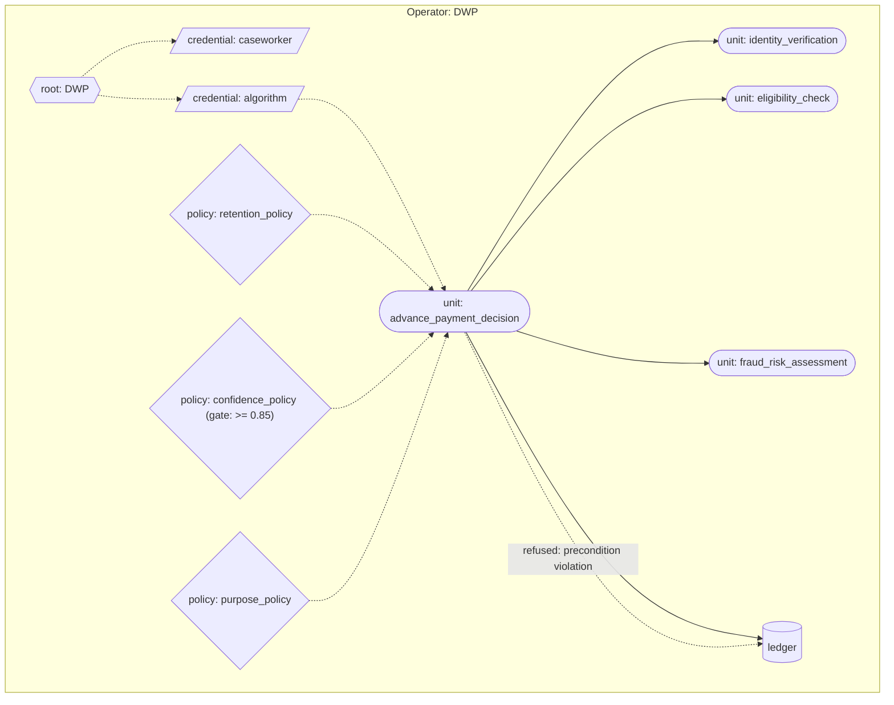

What this demonstration substantiates. Structured preconditions in unit specifications produce type-mismatch refusal at compile time when the composing units' outputs do not satisfy them, and at runtime when the invocation context does not. The entitlement decision is structurally tied to whether the preconditions were satisfied; refusal under unsatisfied preconditions is first-class and observable on the ledger. The Robodebt-class failure pattern, where an algorithm produces decisions under input variability the algorithm's preconditions do not admit, is structurally refused rather than produced as a numerical artefact.

## 5.2 Universal Credit, cross-operator

The case. Universal Credit eligibility depends on data held by the Home Office (immigration status, right-to-reside checks). Pre-substrate, the operational arrangement is data-sharing between DWP and the Home Office under bilateral agreements; the architectural status of the cross-departmental query is procedural, and the audit trail crosses departmental boundaries.

The substrate deployment. DWP and the Home Office are two operators federated under a cooperative substrate. The cooperative substrate's credential has parent references reaching both operators' root credentials. A `right_to_reside_check` functional unit runs on the Home Office substrate; an `advance_payment_decision` functional unit on the DWP substrate invokes it cross-operator through the cooperative substrate's joint authority. The cross-operator invocation produces records on both ledgers: DWP's ledger records the query was made, signed by the Home Office's witnessing credential; the Home Office's ledger records the data was provided, signed by DWP's invoking credential. Both compiled forms are jointly witnessed under the cooperative substrate's quorum custodian.

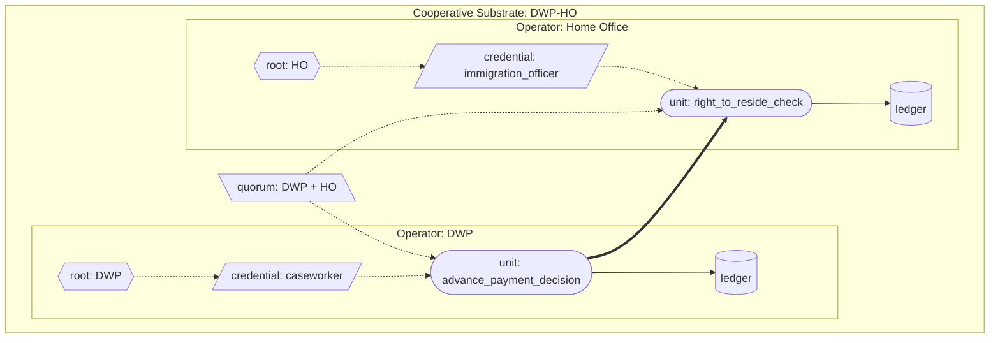

What this demonstration substantiates. Cross-operator composition is governed through the cooperative substrate's joint authority and witnessed under its quorum custodian. There is no architectural daylight between intra-operator and cross-operator composition; the substrate machinery is uniform. The audit trail spans both operators' ledgers, and either operator's compliance can be verified against the archive substrates' content without depending on the other operator's cooperation.

## 5.3 Horizon

The case. The Post Office's Horizon accounting system, supplied by Fujitsu, attributed phantom shortfalls to subpostmasters between 1999 and 2015. Modifications to the implementation by Fujitsu, including remote modifications to specific subpostmasters' branch accounts, were not disclosed to defence counsel. The system's outputs were treated as authoritative evidence in over 700 criminal prosecutions, the largest miscarriage of justice in modern English legal history. The structural fault is that cryptographic and procedural integrity at the system's boundary do not produce architectural attribution of which version of the software produced which decision, nor architectural visibility for parties outside the operator.

The substrate deployment. The Post Office and the Court of Appeal are two operators federated under a cooperative substrate. Every Horizon implementation is content-addressed: `balance_check_v1` and `balance_check_v2` are structurally different units with different content identities. An `audit_branch` functional unit on the Post Office substrate exposes ledger queries scoped to specific subpostmasters' acts. An `investigate_branch` functional unit on the Court of Appeal substrate invokes `audit_branch` cross-operator through the cooperative substrate's joint authority. The audit produces records on both ledgers: the Post Office's ledger records the audit happened, signed by the Court's auditor credential; the Court's ledger records the forensic report. The investigator can reconstruct, for any disputed act, which exact compiled form of `balance_check` produced it and what authority chain authorised its admission.

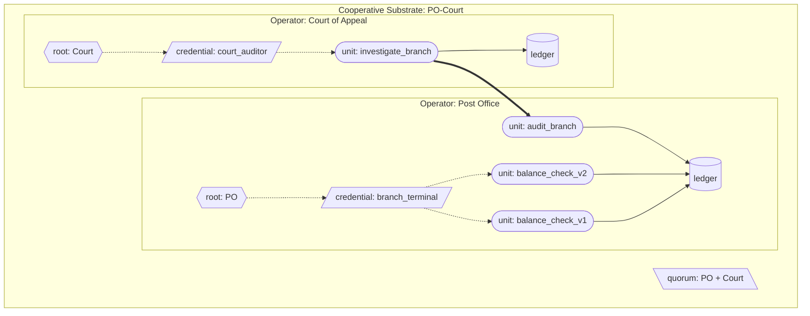

What this demonstration substantiates. Content-addressed implementations make substitution structurally observable: `balance_check_v1` and `balance_check_v2` are different units, and acts produced by each are attributed differently on the ledger; modifications cannot be silently introduced. Cooperative-substrate audit gives an external operator (the Court) architectural access to the audited operator's records without depending on the audited operator's cooperation. The audited operator cannot refuse the audit, because the cooperative substrate's authored content has admitted the audit body's authority. What the substrate cannot establish is whether the cooperative substrate exists in the first place; that is a question of adoption politics, not architecture.

## 5.4 Robodebt

The case. The Australian Robodebt scheme between 2015 and 2019 issued debt notices to welfare recipients on the basis of an algorithm that averaged annual income across fortnightly periods, presuming roughly steady income as a precondition for valid comparison. Gig-economy and casual workers' income violated the precondition; the algorithm produced phantom debts; the scheme reversed the burden of proof onto the recipient; over 470,000 wrongful debts were issued before the scheme was halted; the resulting Royal Commission found the scheme had been operationally unlawful.

The substrate deployment. Services Australia, the Australian Taxation Office, and the Commonwealth Ombudsman are three operators federated under two cooperative substrates: a data cooperative substrate between Services Australia and the ATO for income-data composition, and an audit cooperative substrate between Services Australia and the Ombudsman for oversight access. Two versions of the debt-calculation algorithm exist as distinct content-addressed units. `compute_debt_v1` is the Robodebt-shaped algorithm: it declares no preconditions on income variability and binds no variability policy. `compute_debt_v2` binds an `income_variability_policy` that refuses inputs whose coefficient of variation exceeds a declared bound.

`compute_debt_v1` is a well-formed unit. It compiles, and it runs. The substrate does not refuse it at compilation, because a unit that declares no preconditions presents the compiler with nothing to reject; silence on preconditions is admissible where the operator's wilful-inclusion dimensions do not require a precondition declaration. Invoked against a steady-income claimant `compute_debt_v1` returns a defensible figure; invoked against a gig-economy claimant whose fortnightly income is highly variable it returns a phantom debt, exactly as the historical scheme did. This is the demonstration's point: the Robodebt failure mode was the deployment of an algorithm carrying no precondition at all, and the substrate reproduces that failure faithfully when the precondition is absent. What the substrate makes structural is the contrast and its visibility. `compute_debt_v2`, with the variability policy bound, refuses the gig-worker case at runtime with a structurally visible rationale naming the policy and the variability evidence; the refusal is a first-class act on the ledger. Every debt figure on either version's ledger entries records the content identity of the version that produced it, so an audit can establish, per claimant, whether the figure came from an algorithm carrying the precondition or one carrying none. (The complementary compile-time path, in which an algorithm that does declare preconditions cannot be admitted against a data source whose output specification violates them, is exercised in the Universal Credit demonstration of section 5.1; Robodebt demonstrates the case the substrate cannot pre-empt, the algorithm that declares nothing, and the visibility it provides over that choice.)

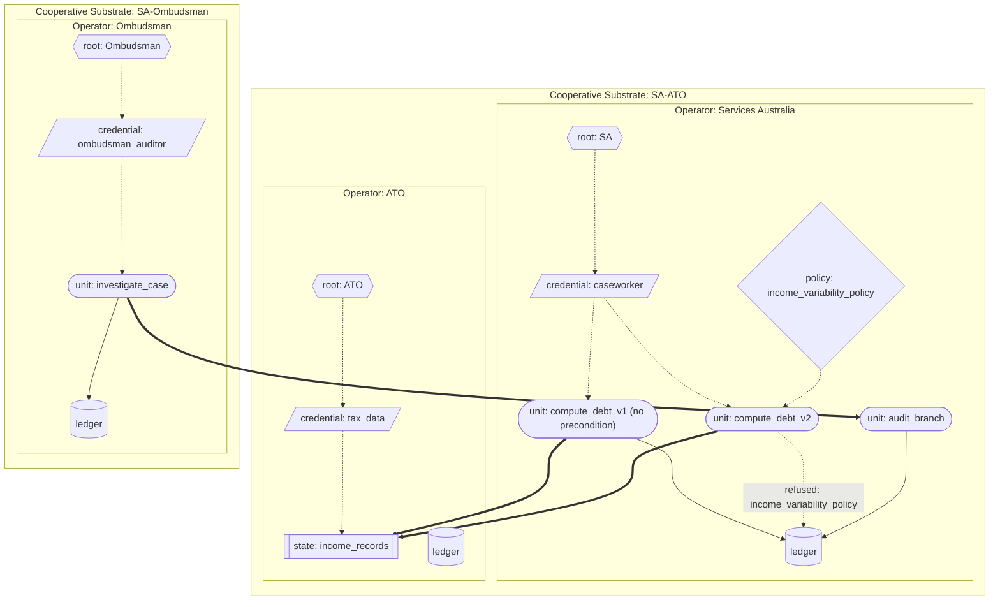

What this demonstration substantiates. The Robodebt failure mode was an algorithm deployed without a precondition on the income variability its averaging step assumed. The substrate does not invent the precondition for the operator: `compute_debt_v1`, declaring none, compiles and runs and reproduces the phantom debt. What the substrate makes structural is the difference between the two versions and its visibility. `compute_debt_v2` binds a variability policy; the policy refuses the gig-worker composition at runtime; the refusal is a first-class act with a rationale naming the policy and the variability evidence. Every debt figure on the ledger records the content identity of the version that produced it, so an audit can establish, per claimant, which algorithm produced which figure and whether it carried a precondition. The Ombudsman's cross-operator audit access lets oversight reconstruct this from the archive substrates' content without depending on Services Australia's cooperation. The substrate's contribution is not that it forbids the unprincipled algorithm; it is that the choice between the two algorithms, and the consequences of that choice for each claimant, are structurally legible rather than buried.

## 5.5 Lavender

The case. Lavender is the public name of an AI-assisted targeting system, reported in 2024, used to identify suspected militants for kinetic action in Gaza. Reporting indicated rapid throughput, automated review, low confidence thresholds at scale, and short human review windows. The case is taken at the level reporting permits; the demonstration is informed by the reporting without modelling any specific operational system.

The substrate deployment. The Israel Defense Forces and an external Legal Review operator are two operators federated under a cooperative substrate. An `assess_target` functional unit on the IDF substrate is behaviour-characterised with a declared calibration claim (mean confidence in 0.85 to 1.0) and a drift criterion that fires when observed mean confidence over a five-observation window falls below the lower bound. An `authorise_strike` functional unit composes `assess_target` with three policies: a confidence-floor policy that refuses below a declared threshold; a proportionality policy that refuses when the strike's stated value is incommensurate with declared civilian risk; and a `meaningful_review_policy` that refuses bulk-approval credentials, requiring the reviewing credential to be issued to a specific named individual under specified review-time conditions. Cross-operator legal clearance is required: `authorise_strike` cannot return "authorised" without invoking `legal_clearance` on the Legal Review substrate. Five low-confidence assessments fire the drift trigger; subsequent invocations refuse until an authorised operator resets drift through an administrative act.

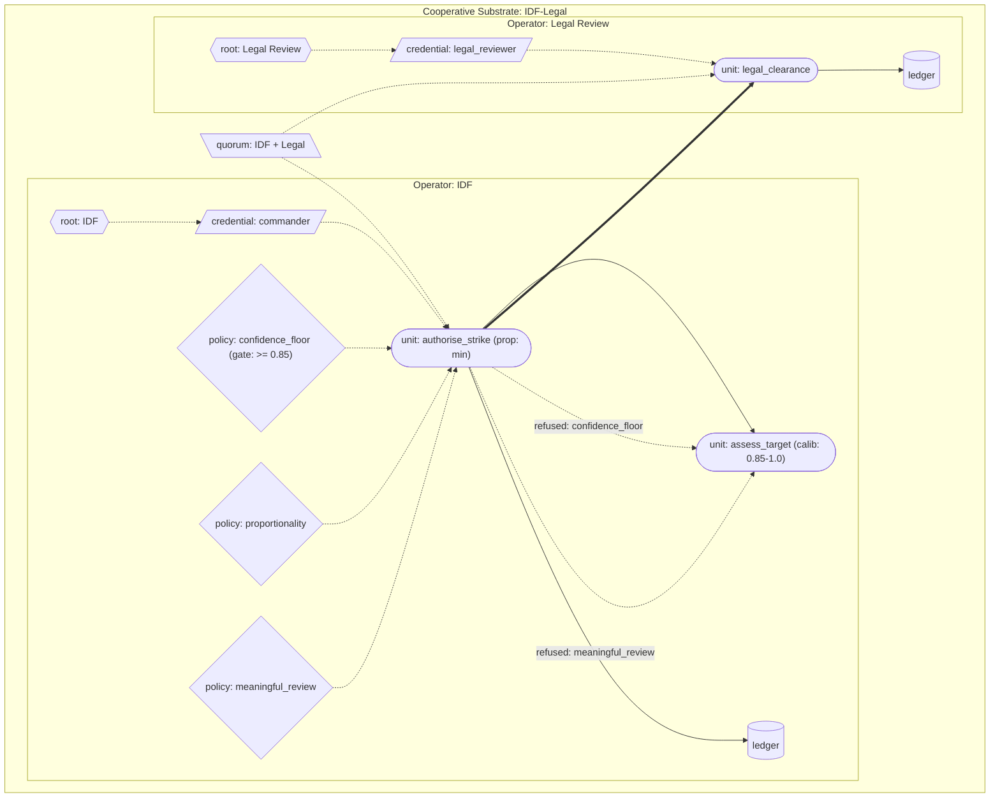

What this demonstration substantiates. Behaviour-characterised functional units with declared calibration claims and acceptance bands compose with policy gates that refuse low-confidence outputs structurally. Drift detection invalidates the unit's compiled form when observed behaviour falls outside the acceptance band, producing structural refusal of subsequent invocations until administrative reset. Cross-operator legal clearance through a cooperative substrate makes the legal review a structural precondition of authorisation rather than a procedural step external to the system. The `meaningful_review_policy` refuses bulk-approval credentials, making the review's individual character architecturally enforceable rather than dependent on operational discipline.

## 5.6 SolarWinds

The case. In 2020, intrusion into the build pipeline of SolarWinds' Orion network-monitoring software allowed insertion of a backdoor (Sunburst) into legitimate signed builds, which were distributed through the normal update channel to approximately 18,000 customers, including multiple US federal agencies. The structural fault is that cryptographic signing alone is insufficient when the signing party's own pipeline has been compromised; the signature verifies the signer, not the artefact's integrity against an independent reference.

The substrate deployment. SolarWinds, an independent Build Verifier custodian, and a representative Federal Agency are three operators federated under a cooperative substrate for build admission. The legitimate Orion build and the trojanised build are distinct content-addressed state units with different content identities. The cooperative substrate's quorum custodian requires both SolarWinds' witness and the Build Verifier's witness for a build to be admitted to the code archive. An `inspect_build` functional unit on the Build Verifier substrate evaluates candidate builds against known-bad indicators inline and refuses to witness builds whose check fails; without joint witness, the trojanised build cannot be admitted under the cooperative substrate's authority. A Federal Agency invoking `deploy_vendor_unit` through the cooperative substrate retrieves only quorum-witnessed builds.

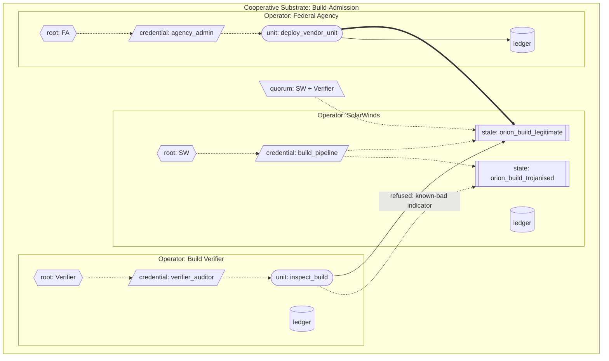

What this demonstration substantiates. Content-addressing of build artefacts at the unit level plus multi-custodian quorum at the federation level converts supply-chain integrity from a property the vendor asserts into a property the federation makes structurally enforceable. A trojanised build produces a different content identity from the legitimate build; the substrate refuses to compose a compiled form for a build the quorum will not jointly witness; the consuming agency cannot deploy a build that did not pass the quorum's admission discipline. Signing is necessary but not sufficient; independent witnessing under custodial diversity is what the substrate adds structurally.

## 5.7 CrowdStrike

The case. In July 2024, a faulty configuration update to the CrowdStrike Falcon endpoint detection sensor caused a global outage affecting approximately 8.5 million Windows devices, including airlines, banks, hospitals, and emergency services. The faulty update reached production within hours; remediation required manual intervention on every affected device. The structural fault is that configuration updates affecting safety-critical operational systems flowed from vendor to production without a structural canary-and-rollback discipline architecturally tied to the update's deployment.

The substrate deployment. CrowdStrike, a representative Canary Cluster customer, and a representative Production Cluster customer are three operators federated under a cooperative substrate for endpoint detection updates. Two endpoint-detection unit versions exist as distinct content-addressed units: `endpoint_detection_v1` (good) and `endpoint_detection_v2` (faulty). Both are behaviour-characterised with declared drift criteria: the unit's output rate of "endpoint-crashed" events must remain below a declared bound over a three-observation window. The Canary Cluster invokes `deploy_update` to deploy `endpoint_detection_v2` first; within three observations, the drift criterion fires, invalidating `endpoint_detection_v2`'s compiled form on the Canary Cluster. The Production Cluster's `deploy_update` unit invokes a `canary_status_check` cross-operator before deploying: the check refuses where the candidate unit's compiled form is invalidated on the Canary Cluster's runtime. `endpoint_detection_v1` remains valid throughout; the rollback succeeds structurally because the rollback is to a different content-addressed unit, not to a configuration of the same unit.

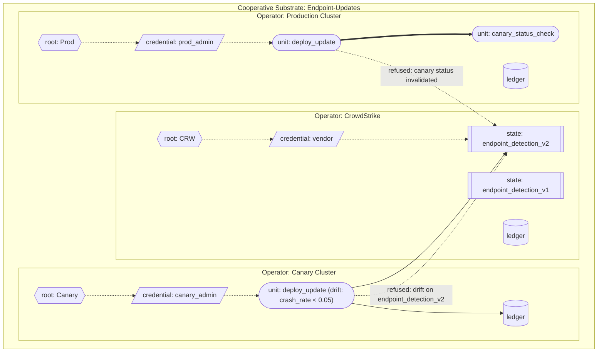

What this demonstration substantiates. Behaviour-characterised contracts with declared drift criteria make a unit's operational pathology structurally observable as drift, invalidating the unit's compiled form when the criterion fires. The drift state is per-runtime and per-unit: a unit drifting on the Canary Cluster invalidates only its compiled form, not the implementation it executes; the rollback to the prior version is to a different content-addressed unit and is structurally clean. The cooperative substrate's deployment policy makes the canary's drift findings architecturally consequential for the production rollout, converting a procedural canary-and-rollback convention into a structural admission discipline.

## 5.8 Boeing 737 MAX

The case. The Boeing 737 MAX's Maneuvering Characteristics Augmentation System (MCAS) was certified by the Federal Aviation Administration under regulatory arrangements that placed substantial certification authority within Boeing itself through the Organization Designation Authorization. The single-sensor architecture of MCAS, combined with limited pilot-disclosure of the system's behaviour, contributed to the Lion Air 610 and Ethiopian Airlines 302 crashes in 2018 and 2019, killing 346 people. The structural fault is that certification authority for a safety-critical system was architecturally constituted such that the manufacturer's own engineering judgement on safety-critical compositions could be admitted as the regulator's certification without an independent witness with structural authority to refuse.

The substrate deployment. Boeing, the FAA, Lion Air, and Ethiopian Airlines are four operators federated under a cooperative substrate for type certification. Two MCAS implementations are distinct content-addressed units: `mcas_v1` (single-sensor; no pilot-override credential in its authority chain) and `mcas_v2` (dual-sensor with structural disagreement detection; the pilot-override credential `captain_authority` in its authority chain). Both are well-formed units and both compile. Compilation establishes that a unit is structurally admissible; it does not establish that the unit is fit for a regulated purpose.

Certification is a separate step, and it is its own substrate pattern, parallel to the backtest pattern of section 3.7.1. Where a backtest is a functional unit that inspects ledger history, a certification unit is a functional unit that inspects a candidate unit's declared structure. The FAA runs a `certify_mcas` functional unit. It takes a candidate unit's content identity as a runtime input, retrieves the candidate from the code archive, reads its declared structure (the sensor set the specification declares, and whether the pilot-override credential is present in the authority chain), and invokes the FAA's two certification policy units as sub-units: `multi_sensor_required_policy`, which refuses a candidate declaring fewer than two sensors, and `pilot_override_required_policy`, which refuses a candidate whose authority chain does not include the pilot-override credential. `certify_mcas` is compiled under the cooperative substrate's quorum custodian, so the certification machinery itself requires Boeing, the FAA, and the operating airlines to witness it jointly; no single party can produce the certification unit alone. Each certification is a first-class act on the FAA's ledger: a permit when the candidate passes, a refusal when a sub-unit policy refuses.

Certification is neither a compile-time refusal nor a runtime invocation policy. It is not a compile-time refusal because the candidate is a well-formed unit: `mcas_v1` compiles cleanly, and refusing its compilation would overload the compiler with a policy judgement that belongs to a named regulator. It is not a runtime invocation policy because such policies evaluate against an invocation's inputs (for a flight-control unit, a flight's angle-of-attack readings), whereas certification gates the candidate's declared structure; a certification policy bound to an MCAS unit as a runtime policy would evaluate against every flight and find no structural fields to check, refusing every flight of every MCAS unit. Certification is the third thing: a unit that examines another unit.

In the demonstration, the FAA invokes `certify_mcas` against `mcas_v1`; `multi_sensor_required_policy` refuses as a sub-unit because the candidate declares one sensor; the certification act is a refusal on the FAA's ledger; `mcas_v1` is never registered for flight on the airlines' runtimes. The FAA then invokes `certify_mcas` against `mcas_v2`; both policy sub-units permit; the certification act is a permit; `mcas_v2` is registered on the airlines' runtimes. In operation, `mcas_v2` is behaviour-characterised: it computes a confidence value from the agreement between its two sensors, and on a flight where the sensors disagree sharply it refuses to command nose-down rather than acting on an unreliable reading. A cross-fleet `fleet_observation_report` unit lets one airline query another's accumulated observations through the cooperative substrate.

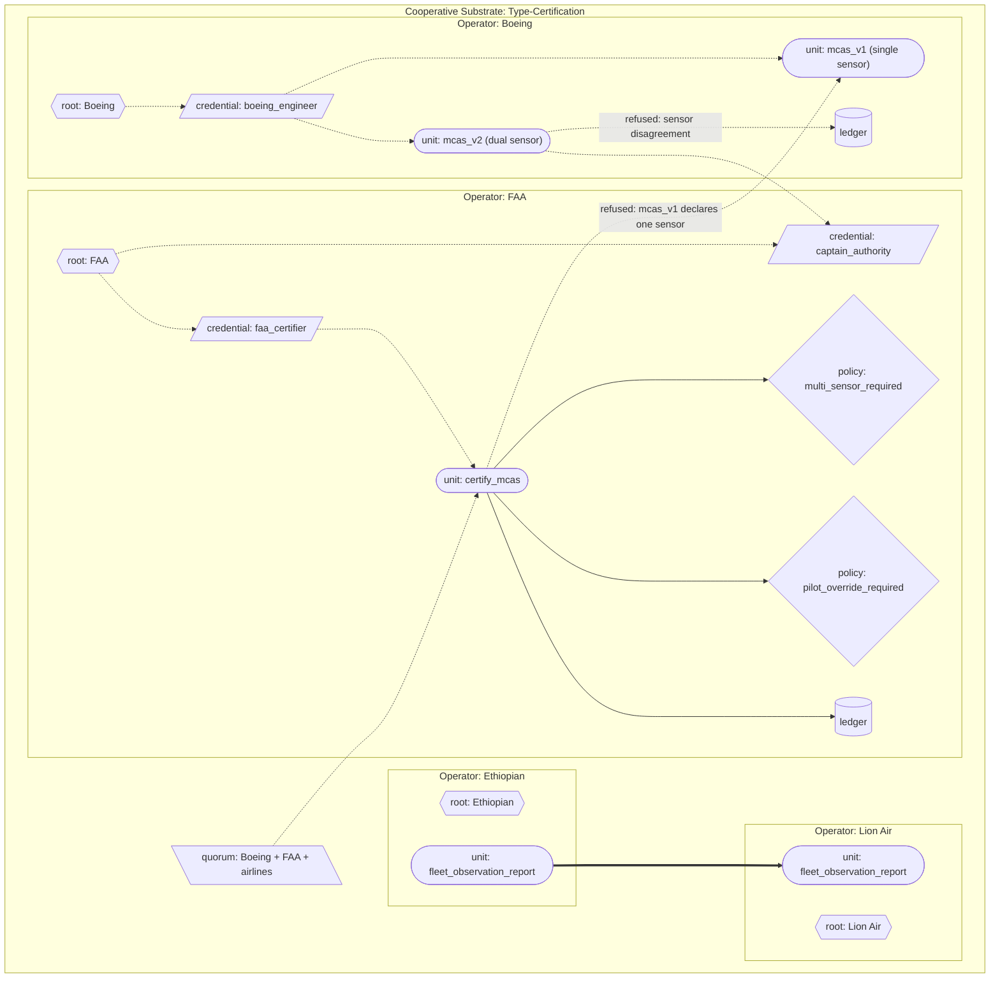

What this demonstration substantiates. Certification is a substrate pattern, not a property of compilation. A structurally valid unit can fail certification; the failure is a witnessed refusal on the regulator's ledger, attributable and reconstructable, distinct from the question of whether the unit compiles. The certification unit is itself compiled under the cooperative substrate's quorum custodian, so the Designated Engineering Representative shortcut, in which regulator authority was effectively delegated to manufacturer-employed engineers, has no architectural expression: the certification machinery cannot be produced by Boeing alone. The certification policies are functional units invoked as sub-units, each refusing as a first-class substrate refusal, so a single-sensor flight-control unit cannot be certified and an uncertified unit is never deployed. The sensor-disagreement refusal at runtime is a structural output of the behaviour-characterised contract, not a check the operator could choose not to run.

## 5.9 Five Eyes

The case. The Five Eyes is an intelligence-sharing arrangement between Australia, Canada, New Zealand, the United Kingdom, and the United States, with bilateral and multilateral components. The substrate cannot model any specific real intelligence arrangement and does not claim to. The case is taken stylistically as an architectural question: how could cross-jurisdictional intelligence cooperation be made substrate-legible without compromising the operational secrecy participating sovereigns require? The demonstration is synthetic; the operators are stylised; the substantive policies are abstractions of constraints public reporting indicates would be operationally relevant.

The substrate deployment. Two synthetic agencies (AgencyA, AgencyB) and an Oversight Committee are three operators federated under two cooperative substrates: a bilateral query-exchange cooperative substrate between the agencies, and an oversight cooperative substrate adding the Oversight Committee. Each agency's substrate carries a `query_collected_metadata` functional unit local to its own collected material. A `cooperative_cross_query_gate` functional unit on each agency mediates cross-operator queries from the counterpart agency, evaluating the query against the cooperative substrate's authored content before permitting access. A `jurisdiction_scope_policy` refuses queries that the submitting agency directs at its own jurisdiction's citizens (the architectural representation of the prohibition on agencies operating against their own populations). A `cooperative_substrate_gate_policy` admits only specific query categories the cooperative substrate's authored content recognises (counter-terrorism subjects permitted; bulk metadata not). A `justification_credential_policy` refuses queries that do not carry an authorising justification credential issued by named oversight authorities. The Oversight Committee's `investigate_agency` unit invokes `agency_audit` units cross-operator and produces forensic reports.

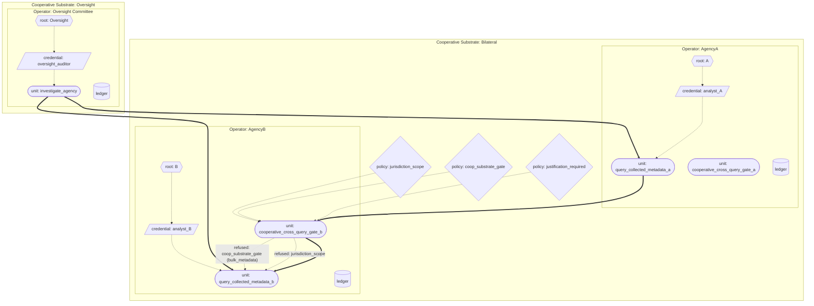

What this demonstration substantiates. The substrate's compositional uniformity holds at the hardest scale to which the architecture claims to apply: multi-sovereign intelligence cooperation with overlapping cooperative substrates of different scope. Jurisdictional, query-category, and justification policies compose under strictest-binding-wins; refusals are structurally visible to the Oversight Committee through cross-operator audit. The substrate's defensive contribution is bounded. It cannot prevent constitutional sources from being captured by adopting sovereigns. It cannot prevent oversight bodies from being denied access by political action against the cooperative substrate's continued operation. What the substrate can do is shift the structural question from "are authorising bodies being deceived?" to "are they looking at the ledger they have access to?". Both questions remain politically substantive; the substrate makes the second answerable without operator cooperation.

## 5.10 LIBOR

The case. The London Interbank Offered Rate, a benchmark for trillions of dollars of financial contracts, was manipulated between approximately 2003 and 2012 by panel banks submitting rates that did not reflect their actual or plausible borrowing costs. The administration was structurally trust-dependent: the rate was computed by an administrator from submissions, but the administrator had no architectural access to the panel banks' substantive trading activity against which submissions could be checked. Coordinated submissions between panel banks were structurally invisible to the administrator and to regulators.

The substrate deployment. Three representative panel banks (BankA, BankB, BankC), a LIBOR Administrator, and the Financial Conduct Authority are five operators federated under two cooperative substrates: a panel-and-administrator cooperative substrate for aggregation, and a panel-administrator-FCA cooperative substrate for audit. Each panel bank's `submit_rate_bank{a,b,c}` is a behaviour-characterised functional unit with a drift criterion on rate-versus-declared-activity divergence over a five-observation window. A `divergence_policy` refuses submissions where the submitted rate is implausible given the bank's declared trading activity within the same window. The `aggregate_libor` unit on the LIBOR Administrator is jointly witnessed under the panel cooperative substrate's quorum custodian, so the benchmark itself is a quorum-witnessed artefact rather than an administrator-asserted figure. The FCA's `investigate_panel` unit invokes each bank's `audit_submissions_bank{a,b,c}` unit cross-operator and produces forensic reports.

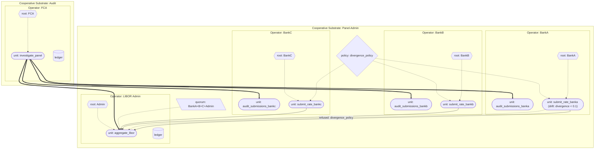

What this demonstration substantiates. The benchmark itself is jointly witnessed under the panel cooperative substrate's quorum custodian, so no single party (including the administrator) can produce the benchmark unilaterally. Per-submission policy refusal on plausibility-versus-activity catches single-submission manipulation; drift detection across submissions catches systematic-bias patterns that no single submission would trigger. Cross-operator regulator audit gives the FCA structural access to both submissions and the aggregation under the cooperative substrate's authored audit policies. The structural shape of LIBOR manipulation, coordinated submissions invisible to the administrator, is converted into a structurally visible pattern in the archive substrates' content.

## 5.11 London Whale

The case. In 2012, JPMorgan Chase's Chief Investment Office incurred losses of approximately $6.2 billion on synthetic credit positions held by a trader nicknamed the London Whale. The losses developed under a value-at-risk model whose calibration drifted as the portfolio's character moved away from the model's training distribution; the calibration claim was treated as stable when the portfolio's behaviour had moved outside the model's acceptance band; positions accumulated beyond limits that prevailing risk discipline would otherwise have refused. The structural fault is that a behaviour-characterised model's calibration claim was treated as load-bearing for operational decisions without structural verification against realised behaviour, and that desk-level risk limits were not architecturally tied to the credential under which they were authorised.

The substrate deployment. JPMorgan Chase and the Office of the Comptroller of the Currency are two operators federated under a cooperative substrate for audit. Two value-at-risk model versions are distinct content-addressed units: `var_model_v1` (the calibrated initial model) and `var_model_v2` (the "new VaR model" with the risk factor halved). Both are behaviour-characterised functional units with declared calibration claims and drift criteria: the ratio of realised to predicted volatility must remain within [0.8, 1.5] over a four-observation window. A `position_limit_policy` refuses positions exceeding the desk limit without an authorising escalation credential issued by a senior risk officer; the escalation credential is per-individual and not bearer-transferable. A `backtest_var_calibration` functional unit walks the operator's ledger, pairs the model's predictions with realised outcomes, computes exceedance rate against the declared value-at-risk bound, and refuses if exceedance exceeds 5%. On refusal, an authorised operator deprecates the model through the standard administrative interface; the deprecation invalidates compiled forms referencing the model. The OCC's cross-operator audit produces a forensic report from both operators' ledgers.

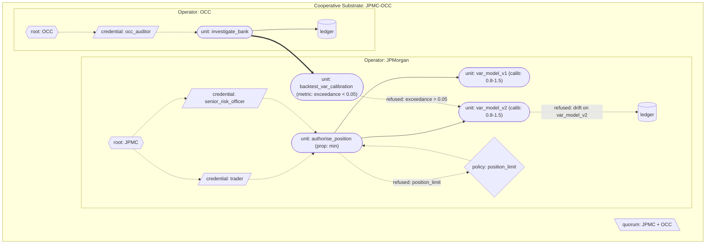

What this demonstration substantiates. Calibrated reliability metadata is architectural: every behaviour-characterised functional unit declares its calibration claim and acceptance band; the substrate carries the declaration as part of the unit's identity; substituting a more lenient calibration produces a structurally different unit. Drift detection at runtime invalidates the model when observed behaviour falls outside the acceptance band; the backtest pattern walks the historical ledger to verify the calibration claim against realised outcomes and triggers deprecation through the administrative interface when the claim fails. Position-limit policy with credentialed escalation makes the over-limit authorisation a structural ledger event attributable to a specific named senior officer, not an implicit override of an external risk constraint. Cross-operator audit reconstructs the calibration history, the drift events, the backtest refusals, the position-limit escalations, and the deprecation events from the archive substrates' content; the regulator's ability to reconstruct what happened does not depend on the operator's cooperation.

The London Whale demonstration exercises more of the substrate's mechanisms in a single case than any of the other eleven. For that reason Appendix A traces it end-to-end at the depth the implementation supports: each unit's compilation, each act's runtime evaluation, each invalidation event's propagation, each cross-operator audit's reconstruction, against specific code in the prototype. The other eleven demonstrations are substantiated at the depth their architectural contributions require; each runs end-to-end in the prototype against the same architectural machinery the London Whale trace exhibits in detail.

## 5.12 Constitutional anchoring

The case. Constitutional anchoring is an architectural demonstration rather than a documented failure. The substrate's deepest commitment is that authority chains terminate at natural persons through constitutional source credentials. The demonstration closes the architectural loop by showing that the mechanism works as specified at a non-trivial constitutional shape.

The substrate deployment. A representative Ministry operator runs a substrate whose constitutional source is a parliament composed of five natural persons. The parliament is itself a cooperative substrate at the constitutional-source level: a credential whose parent references reach five individual natural-person credentials, each held by a named member of parliament. Ministerial and civil-servant credentials are issued under the parliament credential through normal derivation; an administrative `process_application` functional unit composed under those credentials has an authority chain that visibly terminates at the five named parliamentarians. An election succession produces a new parliament credential superseding the old; the supersession propagates through the uniform invalidation surface, invalidating every compiled form whose authority chain terminated at the old parliament; recompilation under the new parliament admits new compiled forms with the new chain. A mid-term revocation of one parliamentarian's natural-person credential refuses subsequent invocations of units in scope of the constitutional source's quorum until the parliament reconstitutes through whatever process the constitution admits.

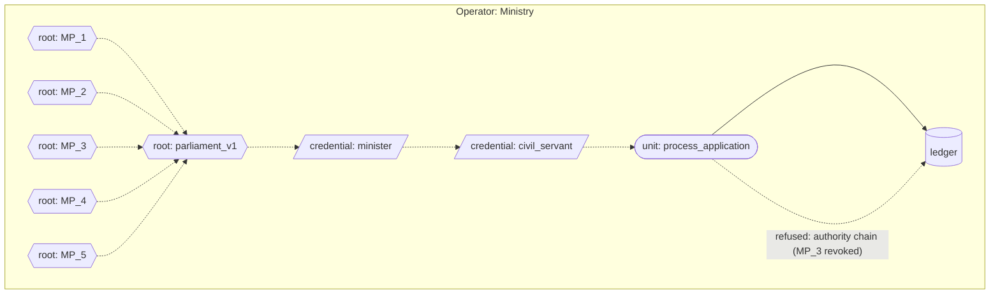

What this demonstration substantiates. The constitutional terminus is a cooperative-substrate pattern applied at the deepest scale, with the natural-person credentials at the leaves of every authority chain. No new architectural mechanism is required; the substrate's existing primitives compose to give it. Constitutional updates propagate through the uniform invalidation surface like any other credential supersession. What the architecture leaves outside its scope is the institutional and legal apparatus that binds specific cryptographic keypairs to specific human beings: biometric attestation, hardware security modules, legal recognition of cryptographic credentials, processes for key generation, loss, recovery, death, and succession. The architecture provides the mechanism; the institutional work provides the anchoring.

# 6. Conforming implementation and archive hosting

The architecture is what the paper specifies. The protocol is what conforming implementations satisfy. The substrate is what an operator runs when conforming to the protocol. The architecture is general; the protocol admits many implementations; conforming implementations interoperate.

Conforming implementation is what makes the architecture's defensive properties hold operationally. An implementation can satisfy the protocol's mechanical requirements while still producing substrates that interoperate with other conforming substrates across operator boundaries. An implementation that fails the conformance requirements produces a substrate whose acts cannot be jointly witnessed in a cooperative substrate with conforming counterparties; the non-conforming substrate is isolated by the architecture's own admission discipline.

## 6.1 What every conforming implementation must do

At unit commit time, the implementation runs the compilation pipeline. The six stages are required: authority chain resolution; policy graph traversal; roll-up under strictest-binding-wins; wilful inclusion verification; reference resolution and contract checking; emission and witnessing. Compilation failures are first-class outputs committed to the operator's ledger as refusal acts; they cannot be silently dropped or retried under different conditions until they succeed.

At every act, the implementation performs the five-stage runtime evaluation: compiled-form retrieval; delegation check; integrity check; rolled-up policy evaluation; ledger commitment. The implementation honours the uniform invalidation surface. The implementation does not synthesise verdicts, evaluate against alternative policy structures, approximate the rolled-up policy's evaluation, or admit acts whose compiled form has been invalidated.

The runtime's verdict must be the verdict the compiled rolled-up policy produces against the act's invocation context. If two conforming implementations compile the same unit under the same federation's witnessing, their compiled forms have identical content identities; if two conforming implementations evaluate the same compiled form against the same invocation context, their verdicts are identical. The protocol is deterministic at this level; non-determinism produces non-conformance.

Implementations have substantial latitude on how they satisfy these requirements. Execution technologies, optimisation strategies, federation topologies, performance and cost profiles, caching disciplines, batching arrangements (where the unit's policies admit them), and parallelism choices are implementation decisions. The protocol cares about results, not means. What the protocol does not admit is implementations whose results differ from the canonical evaluation. An implementation that adds verdicts the rolled-up policy does not produce is non-conforming. An implementation that suppresses refusals the rolled-up policy produces is non-conforming. An implementation that admits acts under invalidated compiled forms is non-conforming.

The runtime layer is structurally adjacent to existing production policy engines (Open Policy Agent, AWS Cedar, Zanzibar-derived systems). The substrate inherits the operational characteristics these systems demonstrate at internet scale. The wrapper layer is structurally adjacent to API gateway architectures, content-addressable storage (git, IPFS, the OCI distribution specification), and witnessed log systems (Sigstore Rekor, Certificate Transparency). Conforming implementations can be built from these adjacent primitives composed under substrate-conforming contracts; what is new is the integration discipline, not the underlying components.

A conforming implementation is verifiable through conformance specification. The conformance requirements are testable: a test suite exercises each of the protocol's mechanical commitments and verifies the implementation produces canonical results across the test cases. A conformance certificate is itself a credential unit, issued by a certifying operator whose authority chain the implementation's users recognise; the certificate's revocation is a ledger event like any other. Implementations that lose conformance certification produce substrates whose acts cannot be jointly witnessed in cooperative substrates whose authored content requires certified counterparties.

## 6.2 What makes archives conforming

Archives are substrates. Each of the three archives the protocol requires (credentials, code, ledger) is itself a substrate, run by an operator under the same machinery that governs any other substrate. There is no separate architectural layer external to operators' substrates for archive operation; archives are substrates the operator chose to use for holding archived content.

What an operator chooses is the pattern under which the archive substrate is run. Four patterns are available. They differ along two dimensions: whether the originating operator (whose content is being archived) runs the archive substrate themselves or delegates operator status to others, and whether a single operator or a cooperative substrate of operators runs the archive substrate.

**Single self-hosted.** The originating operator runs the archive substrate themselves. Their custodial arrangement is their own; their authority over the archive substrate is direct. This is the pattern an operator at single-actor adoption uses by default. The diversity claim is whatever the operator's own internal arrangement produces, which by architectural construction is limited; the archive substrate's defensive properties scale with that limit.

**Single delegated.** The originating operator grants operator status over the archive substrate to a single trusted third party. The third party runs the archive substrate; the originating operator's authority over the archived content is preserved through the content's own authority chains; what is delegated is operational responsibility for the substrate that holds the archive, not authority over the content. This is a single point of architectural failure for the archive substrate itself but may be appropriate for low-stakes contexts or where institutional reasons make the third party trusted.

**Cooperative non-delegated.** A cooperative substrate of originating operators runs the archive substrate jointly themselves. Operator status over the archive substrate is held by the cooperative substrate's member operators directly; the diversity comes from those member operators' own institutional, jurisdictional, and technical diversity. This is the natural pattern for a cooperative substrate whose member operators are mutually-suspicious peers who do not trust any third party to maintain their joint records but who are themselves diverse along the relevant dimensions. Sovereign nations participating in mutual-recognition arrangements have institutional reasons to prefer this pattern over delegating operator status to chosen-for-the-purpose third parties.

**Federated.** The originating operators grant operator status over the archive substrate to a cooperative substrate of trusted third parties chosen for the purpose. The trusted third parties run the archive substrate jointly under a cooperative substrate constituted specifically for archive maintenance; their joint witnessing is the standard cooperative-substrate joint witnessing; the diversity is the diversity of the third-party operators participating in the federation's cooperative substrate. This is the pattern the substrate's defensive properties presuppose for archives serving non-trivial threat models. Trusted-third-party diversity is constituted specifically for archive maintenance and can be designed for the threat model the archive must resist, rather than inherited from whatever diversity the originating operators happen to have.

The four patterns are operator choices, not architectural mandates. Different archives may use different patterns; an operator may run their credentials archive under one pattern while joining a federation for their code archive while running their ledger under a third pattern. The choice is per-archive, per-operator. An operator may also move an archive between patterns over time: starting with single self-hosting at adoption, moving to cooperative non-delegated as cooperative substrates form, moving to federation as the threat model justifies the institutional investment.

**Defensive properties scale with the pattern.** A single self-hosted archive has effectively no architectural defensive properties beyond what content-addressing and append-only commitment produce within the operator's own infrastructure; if the operator is compromised, the archive is compromised. A single delegated archive has the defensive properties of the third party's infrastructure plus whatever trust the originating operator has in the third party; if the third party is compromised, the archive is compromised. A cooperative non-delegated archive has the defensive properties of the cooperative substrate's diversity, which depends on the cooperative substrate's member operators' diversity along the institutional, jurisdictional, and technical dimensions. A federated archive has the defensive properties of the federation's diversity, constituted specifically for the purpose and maintained as institutional work by the federation's member operators.

The architecture is honest about this scaling. The substrate's strongest defensive claims (forensic reconstructibility after operator capture, visibility independent of cooperation in adversarial cases) presuppose the federated pattern with substantial diversity. Operators using other patterns gain weaker versions of these properties commensurate with the pattern's diversity. The paper's defensive-property language applies in proportion to the pattern chosen; an operator under single self-hosting cannot expect federation-pattern defensive guarantees from their archive's existence.

What each pattern requires is the same set of architectural properties applied to the archive substrate. Multi-custodian witnessing where the pattern admits multiple custodians; custodial diversity where the pattern's operators are themselves diverse; independent reconstructability where the pattern's operators are independent. These properties are not separate to the patterns; they are the properties the cooperative-substrate machinery produces when the pattern is cooperative non-delegated or federated, and they are not produced under the single-operator patterns. The architecture does not pretend that pattern-1 self-hosting produces federation-pattern guarantees.

The protocol's commitments around archive content are uniform across the patterns. **Signature schemes** are specified by the protocol with an explicit migration path. Quantum-resistant cryptographic primitives are required, with the specific algorithms chosen by conforming implementations from the standards their jurisdictions recognise. The protocol specifies the rotation policy for primitives that may be deprecated, the migration windows during which both new and old primitives are accepted, and the archive treatment of historical acts produced under deprecated primitives. The migration discipline is part of conformance: an archive substrate operating under deprecated primitives is non-conforming under any pattern.

**Integrity guarantees** are specified at the protocol level. The ledger architecture uses witnessed log structures with multi-custodian quorum commitment where the pattern admits multi-custodian witnessing; the credentials archive maintains historical versioning with cryptographic integrity at every version; the code archive supports content-addressable retrieval with bit-identical guarantees. The protocol does not specify the implementation of these guarantees; it specifies what the guarantees must achieve and what conformance verification looks like.

**Retention policies** are specified per archive class. Acts in the ledger are retained according to the retention policies declared by the units that produced them and the operators they belong to; the ledger does not delete acts it has committed, but it may distinguish acts available for query from acts retained only for cryptographic verification. Credentials are retained indefinitely in their historical versions to support re-evaluation of historical acts. Code is retained indefinitely for the same reason. The architecture's forensic reconstructibility property depends on retention; an implementation that deletes ledger entries to manage storage cost is non-conforming under any pattern.

**Cross-archive interoperability** mechanisms are specified by the protocol. An act committed to one operator's ledger contains references resolvable through the credentials and code archives operated under any conforming pattern, regardless of which pattern any given archive uses; the protocol specifies the resolution mechanisms, the authentication of cross-archive queries, and the latency and consistency guarantees that cross-archive operations must satisfy.

**Calibration metadata recording** is a protocol-level requirement of conforming archives. Every unit's compiled form committed to a code archive includes the unit's calibration handling contract (contract pattern, calibration claim, acceptance band, propagation function, policy gates). Every act committed to the ledger includes the act's runtime calibration value (in the form the unit's contract pattern produces), references to constituent acts' calibration values that composed into it through the compiled propagation function, the runtime verdicts the rolled-up policy produced, and the cryptographic attestations the protocol requires. Units whose contracts do not declare calibration handling where the protocol requires it fail to compile; acts whose runtime calibration values are inconsistent with the unit's contract pattern fail conformance verification.

Where the archive substrate is run under a pattern that admits multiple operators witnessing (cooperative non-delegated or federated), the operators' quorum verdict on each compiled form includes verification that the calibration handling contract is well-formed. Operators whose verdicts diverge on contract well-formedness produce compilation integrity failure and surface the divergence for response. The architecture does not permit silent acceptance of inconsistent calibration contracts or silent acceptance of runtime values inconsistent with the compiled contract.

The diversity assumption (where the pattern produces diversity) has a temporal dimension. Cryptographic stacks become deprecated; institutional ownership of operator status over archive substrates changes hands; jurisdictional alignments shift over decades. Wherever the pattern admits ongoing maintenance, the operators participating in maintaining the archive substrate evolve their authored content through the same machinery that handles any other policy supersession.

## 6.3 Cross-substrate composition

Composition across substrates of different operators is one of the architecture's most operationally consequential commitments. Cooperative substrates spanning operators at different scales are routine. What differs in cross-operator composition is that the policies, vocabularies, and verdict structures of the participating operators were authored independently and may not align directly.

The architectural mechanism is the same composition machinery that governs intra-operator composition. There is no separate cross-operator pathway. What is required for cross-operator composition to work where the operators' authored content does not align directly is policy-level translation, structural adaptation, or evaluation-semantics bridging, each operationalised as policy units the participating operators jointly author or recognise.

**Vocabulary translation through policy units.** When two operators' policy frameworks use different vocabularies for related commitments, the architecture admits vocabulary translation policy units that map between the operators' vocabularies. The translation unit is itself a policy unit, authored under the joint authority of the operators whose composition it admits. Its content declares the mapping rules, the conditions under which the mapping is valid, and the failure modes when the mapping cannot be performed: the source vocabulary contains commitments the target vocabulary cannot express; the target vocabulary requires commitments the source vocabulary does not express; the mapping is ambiguous and requires resolution at the composite operator's scale.

**Structural adapters.** When two operators' policy structures differ (one operator organises policies as a flat list with priority ordering; another organises policies as a hierarchical tree with overrides; another organises policies as a constraint satisfaction problem with weighted preferences), the architecture admits structural adapters that translate between the structures. The adapter is a higher-order functional unit whose contract specifies the source and target structures, the translation rules, and the conditions under which the adapter's output is structurally equivalent to the input. Adapters that cannot guarantee structural equivalence (because the source structure carries commitments the target structure cannot represent) refuse to admit, surfacing the structural mismatch for resolution at the composite operator's scale.

**Evaluation-semantics bridges.** When two operators interpret the same policy verdict differently (one operator's "permit subject to manual review" maps to another operator's "permit unconditionally" because the second operator's regulatory structure does not include manual review as a verdict category), the architecture admits evaluation-semantics bridges that specify how verdicts in one operator's substrate are interpreted by another's. The bridge is itself a policy unit, authored under the joint authority of the operators; its outputs are verdicts in the receiving operator's vocabulary that have been computed from the originating operator's verdicts according to the bridge's specified rules.

The architectural commitments around what cross-substrate composition preserves are stronger than what same-operator composition preserves. The originating operator's authority chain is preserved through every act in the composition. The originating operator's calibration is preserved; the receiving operator cannot inflate the calibration value beyond what the originating substrate's evaluations support. The originating operator's policies bind the composition; the receiving operator's policies compose under roll-up the same way they would for any other composition. The composite operator's authored content specifies which operator's policies are dispositive for which dimensions of the composition; the substrate enforces the specification at every act.

The failure modes specific to cross-substrate composition are: vocabulary mismatch (the translation unit cannot map between the vocabularies); structural incompatibility (the adapter cannot guarantee structural equivalence); semantic divergence (the evaluation-semantics bridge cannot reconcile the interpretations); composite-content gap (the composite operator has not authored how a particular composition class should be handled). Each failure mode produces refusal of the composition rather than silent acceptance. The refusal record names the mode, the units involved, and the composite operator's authored content that requires extension to admit the composition. The substrate does not synthesise resolutions to cross-substrate composition failures; it surfaces them for resolution at the composite scale.

The composite operator's role in maintaining cross-substrate composition arrangements is ongoing institutional work. The catalogue of admitted vocabulary translations, structural adapters, and evaluation-semantics bridges grows as the composite substrate grows; new translation units are authored when new operators join compositions with established operators; existing translation units are revised when operators update their policy frameworks. The composite operator's authored content specifies which institutions are authorised to author translation units, which custodians witness their commitment, and how disputes about translation correctness are resolved. The substrate provides the mechanism; the composite operator maintains the catalogue.

## 6.4 Time as an architectural property

The substrate handles temporal questions through specific mechanisms (commitment timestamps, credential rotation history, policy version activation), but the architecture's treatment of time as a property in its own right requires explicit specification. Time is one of the dimensions over which the substrate's commitments operate; the architecture's commitments around time are part of what conforming implementations must deliver.

**Clock synchronisation across custodians.** Custodians operate in different jurisdictions with different time infrastructures. The federation's authored content specifies the bounded clock skew tolerance the federation operates under; conforming implementations must operate within the bound; custodians whose clocks exceed the bound are detected through the federation's monitoring and remediated. The architecture commits to making the bound an explicit operator-level parameter rather than an implicit assumption, and to refusing acts whose temporal claims fall outside the bound. The substrate cannot enforce clock synchronisation directly (it has no mechanism to set custodians' clocks); it can require that conforming implementations operate within the bound and that the bound is part of the conformance verification.

**Temporal ordering disputes.** When network partitions or custodian-level failures produce situations where two custodians appear to have committed conflicting acts at the same time (within the bounded clock skew tolerance, with no causal relationship between the acts), the architecture admits multi-custodian quorum verdicts on temporal ordering. The disputed acts are presented to a quorum of custodians outside the dispute; the quorum's verdict on the temporal ordering is recorded; acts whose ordering cannot be resolved by the quorum produce refusal-with-rationale rather than silent ordering. The architecture does not silently choose between conflicting acts; it surfaces the conflict for resolution under the operator's degraded-state response procedures, with the contested ordering resolved before the affected acts can compose with subsequent acts.

**Time-bounded credentials and policies.** Credentials and policies may carry temporal validity bounds: a credential that expires on a specified date; a policy that activates on a future date; a policy that applies only within a specified window. The architecture admits temporal validity bounds as part of credential and policy contracts; the substrate evaluates the bound at every act against the act's claimed time; acts whose claimed time falls outside the bound are refused. The bound itself is recorded in the ledger; lineage queries can reconstruct which credentials and policies were valid at any historical moment.

**Long-term temporal correctness.** The ledger is append-only across decades. Acts committed today must remain reconstructable in their original temporal context decades from now. The architecture's commitment is that the temporal context of every act is preserved as part of the act's record: the act's claimed time, any witnessing operators' agreement on the time, the operator's clock skew bound at the time of commitment, the temporal validity bounds of any credentials and policies in scope. Lineage queries against historical acts return the temporal context as it was recorded at the time, regardless of subsequent changes in clock infrastructure, operator content, or temporal validity bounds. The architecture's defensive value depends on this commitment; without it, historical acts could be retroactively re-interpreted under later temporal frameworks, defeating the architecture's audit and accountability properties.

**Temporal correctness as a defensive property.** The architecture's commitments around time are part of its defensive infrastructure. An adversary attempting to backdate acts (claiming an act occurred earlier than it did, to evade subsequent policy changes) is defeated by the multi-custodian quorum's verification of the act's claimed time. An adversary attempting to forward-date acts (claiming an act has not yet occurred, to delay its policy evaluation) is defeated by the same mechanism. An adversary attempting to rewrite the temporal ordering of historical acts (to change their composition with subsequent acts) is defeated by the append-only commitment combined with the temporal context preservation.

## 6.5 Substrate evolution

The substrate exists across decades. Operators' authored content evolves; new requirements emerge; deprecated mechanisms must be retired with adequate notice; cryptographic primitives must be migrated as standards are deprecated. Substrate evolution is what makes the architecture's commitments durable beyond the institutional and technical context in which it was first instantiated.

Operator content evolves through ordinary architectural machinery. When new sovereigns adopt the substrate, when new mutual recognition arrangements are established between existing operators, when operators withdraw from particular arrangements, the operators' authored content evolves through a sequence of recorded acts. Each change is itself an administrative act, committed to the federated ledger under the relevant authority; the historical authored content remains queryable; the cross-arrangement composition rules are preserved through the transition. The cooperative substrate grows or contracts with the willingness of its participants; the architecture's evolution accommodates the political dynamics rather than requiring them to fit the architecture.

Deprecation of operator-level mechanisms proceeds through declared windows with explicit migration tooling. A policy unit class superseded by a more general construction; a unit category that the architecture is consolidating; a recognition arrangement no longer extended: each is announced through an operator content change that sets the timeline. New uses are restricted to bounded categories during the deprecation period. Existing uses are supported through the migration window. After the window closes, new uses are refused; existing acts that depend on the deprecated mechanism remain queryable through the archive's preservation of historical mechanisms.

Protocol versioning is part of conforming implementation. As the protocol itself evolves (clarifications, extensions, deprecations of mechanisms that experience has shown to be problematic), conforming implementations migrate through version transitions. The federation admits implementations running adjacent protocol versions during transition windows; cross-version compatibility is preserved through declared migration mappings authored at the federation's scale. Implementations that fall behind by more than the federation's compatibility window are non-conforming; their substrates cannot be jointly witnessed in cooperative substrates with the current generation.

Cryptographic migration is part of substrate evolution. Cryptographic primitives have finite useful lifetimes; standards are deprecated as cryptanalysis advances and as quantum capabilities mature. The federation's authored content specifies the active primitives, the deprecated primitives still admitted for historical verification, and the migration schedule for transitions between primitives. Acts produced under deprecated primitives remain verifiable through the archives' retention of the deprecated primitives' verification machinery; new acts cannot be produced under deprecated primitives once the migration window closes.

The architectural commitment is around what evolution presupposes. Substrate evolution depends on operator-level arrangements that the architecture cannot itself produce: the operator-level coordination that the protocol's evolution requires; the migration windows the operator's authored content specifies; the deprecation paths the operator maintains; the cryptographic standards bodies whose recommendations conforming implementations must track. The architecture specifies what arrangements are required for evolution to work; whether such arrangements are established is downstream of the architecture, part of what substrate adoption requires of participating operators. The honest framing is that the architecture cannot guarantee its own evolution; it can specify what evolution requires and refuse to operate when the requirements are not met.

What this delivers is a substrate that can outlive the institutional and technical context in which it was instantiated. Operators come and go; cryptographic standards rise and fall; sovereigns realign; the architecture's commitments persist through these changes because the architecture has explicit mechanisms for handling them rather than implicit assumptions that the present context is permanent.

# 7. Adoption

Adoption of the substrate is not a single linear sequence with thresholds an operator passes through. It is a multi-dimensional space in which each operator moves at their own pace along several axes independently. The dimensions are orthogonal in the sense that an operator's position on one does not determine their position on the others. The architecture admits the full product space; operators choose their position in it based on the governance value they need against the engineering investment they can afford.

## 7.1 Granularity

Granularity is the dimension that determines what the substrate sees of an operator's systems. Four levels are recognised; an operator may operate different parts of their portfolio at different levels simultaneously.

**Level 0: wrapped system.** The existing system is treated as a single functional unit. A wrapper presents the unit's content and references at the system's external interface; the system's internal operation is opaque to the substrate and governed institutionally as before. The wrapper produces ledger acts at the system's external interface points. The contract pattern is typically behaviour-characterised (the system's behaviour over many invocations is characterised statistically; per-invocation calibration is what the wrapper observes) or specification-bounded if the system's interface contract is precise enough. Effort to adopt is minimal, comparable to placing an API gateway in front of an existing system, with the gateway recording acts to a substrate-conforming ledger and applying policy units against the system's external invocations. Governance value at Level 0: lineage of every invocation the wrapper sees; refusal capacity at the external interface; archival of the institutional record at the wrapper's level of resolution; calibration declaration on every external act; append-only commitment of the institutional record.

Level 0 is the architecture's primary adoption pattern. Most adopting actors will operate at Level 0 across most of their portfolio indefinitely; higher levels are reserved for systems where the additional governance value justifies the engineering investment.

**Level 1: boundary-decomposed.** The system is decomposed at its major architectural boundaries. Separate services, separate data stores, separate workflow stages each become individual functional units with their own contracts; the system as a whole becomes a higher-order composition of these subordinate units. Internal complexity within each boundary remains opaque. The substrate sees acts at the boundaries between major components and at the system's external interface. Effort to adopt is moderate, comparable to documenting and contractualising existing service boundaries with substrate-conforming contracts.

**Level 2: functionally extracted.** Static code analysis, AI-assisted extraction, behavioural reverse-engineering, or institutional refactoring identifies the functional units within the system. The eligibility evaluation logic, the fraud-risk scoring logic, the identity verification logic, the data persistence layer each become substrate-governed functional units with their own contracts. Internal implementation may remain in the original system; what changes is that the substrate sees acts at the functional boundaries the extraction identifies. Effort to adopt is substantial, comparable to a comprehensive system audit producing a behavioural specification with substrate-conforming contracts at the functional level.

**Level 3: maximally granular.** The system is reimplemented or refactored such that every consequential computation is itself a substrate-governed functional unit. The substrate sees acts at every consequential computation. Effort to adopt is very substantial, comparable to a major architectural rewrite. Governance value at Level 3: the full architectural value the substrate's primitives produce when applied without exception; complete lineage; refusal capacity at every consequential computation; the architecture's defensive properties realised at full depth.

The interoperability commitment is uniform across levels. A Level 0 wrapped system can compose with a Level 3 maximally granular system through their respective external contracts; the cooperative substrate does not require uniform maturity. The substrate's protocol-layer commitments operate at any level; the content-and-references structure is the same whether the unit is a wrapped legacy system or a primitive computation; conformance verification scales with the level the operator has committed to.

The mapping between governance need and appropriate level is institutional rather than architectural. The stakes of the system's outputs determine the lineage resolution required: high-stakes individual decisions warrant Level 2 or 3 because affected individuals, regulators, and parliamentary committees need lineage at the functional level; low-stakes computations may warrant Level 0 indefinitely. Frequency of policy change determines the contract granularity required. Political visibility determines the audit resolution required. Vendor concentration determines the verification depth required: systems built on proprietary infrastructure where the operator cannot independently verify behaviour benefit from higher levels because the wrapper-level governance is too thin to surface vendor compromise.

Different parts of one system may operate at different levels simultaneously. A modern digital benefits service might be at Level 2 or 3 for its eligibility evaluation logic (high-stakes, frequently changing, politically visible) while remaining at Level 0 for its underlying claimant records database (state unit with stable interface, governed by retention policies that do not require internal decomposition). The substrate accommodates this heterogeneity through ordinary composition.

Migration between levels is itself substrate-governed. When an operator moves a system from Level 0 to Level 1, the migration is a sequence of substrate-governed acts: new contracts are authored under the operator's authority chain; new constituent units are admitted under the substrate's normal admission machinery; the prior wrapped system's contract is deprecated under the architecture's protocol versioning treatment. The migration produces a clean transition rather than a discontinuity in the institutional record.

## 7.2 Archive hosting

Archive hosting is the dimension that determines what defensive properties the operator's archive substrates produce. The four patterns developed in the conforming-implementation chapter apply: single self-hosted, single delegated, cooperative non-delegated, federated. An operator chooses the pattern for each archive substrate; the choice may differ between credentials, code, and ledger archives, and may evolve over time.

Adoption typically begins at single self-hosted across the operator's archive substrates. Single self-hosting is the immediately available pattern; it requires no other operators' cooperation; it produces immediate operational value through content-addressing and append-only commitment within the operator's infrastructure. Single self-hosting's limited defensive properties are sufficient for many adoption contexts: an operator whose threat model does not include capture of the operator itself, an actor in a stable institutional environment, an early-adoption phase where the cooperative-substrate counterparties do not yet exist.

Adoption can move to cooperative non-delegated as cooperative substrates form. Two operators establishing a cooperative substrate over a shared concern (data exchange, joint witnessing, cross-operator audit) may jointly maintain the archive substrates that hold their shared content. The cooperative non-delegated pattern is the natural pattern for cooperative substrates whose members are themselves diverse along the relevant institutional and jurisdictional dimensions and who prefer joint operational responsibility to delegating to third parties. This is the pattern intelligence cooperation, financial benchmark administration, and sovereign mutual-recognition arrangements have institutional reasons to prefer.

Adoption can move to federated where the threat model justifies the institutional investment in constituting trusted-third-party operators. Federation is the pattern that produces the substrate's strongest defensive properties; it is also the pattern that requires the most institutional work to establish and maintain. Federation makes sense for archives whose threat model includes capture of the originating operators' own sovereigns, for archives serving cross-jurisdictional cooperative substrates with non-aligned members, and for archives whose retention horizon exceeds the institutional lifetime of any single originating operator.

The defensive properties scale with the pattern, as the conforming-implementation chapter develops. The honest framing for adopters is that the choice of archive hosting determines what defensive properties they can claim. A single self-hosted operator cannot claim federation-pattern guarantees; an adopter wanting the substrate's strongest defensive properties must invest in the institutional work of federation.

## 7.3 Operator scope

Operator scope is the dimension that determines who is operating the substrate jointly. An operator may operate alone (single-actor adoption) or participate in cooperative substrates with other operators at any scale.

**Single-actor adoption.** The operator runs their substrate without cooperative-substrate counterparties. All composition is intra-operator. The substrate's machinery operates exactly as developed in the architecture chapter; what is absent is the cross-operator composition that cooperative substrates enable. Single-actor adoption is the architecture's primary entry point and delivers substantial value on its own.

**Bilateral cooperative substrates.** Two operators establish a cooperative substrate over a specific concern. The simplest cross-operator pattern: a regulator and a regulated firm; a vendor and a customer; two firms exchanging data; a public body and an oversight body. Bilateral cooperative substrates are the operational unit through which architectural cross-operator composition becomes substantive.

**Multilateral cooperative substrates.** Multiple operators establish cooperative substrates with overlapping memberships. Sector-wide industry arrangements (banking, healthcare, telecommunications). Cross-jurisdictional intelligence-sharing arrangements. International standards bodies. Multilateral cooperative substrates make the architectural pattern visible at scales where institutional politics determine which operators participate and on what terms.

**Cooperative-substrate networks.** Cooperative substrates compose with cooperative substrates: a bilateral arrangement between operators A and B can compose with a bilateral arrangement between B and C through B's participation in both; B's authored content specifies which compositions are admitted; the architecture's strictest-binding-wins discipline governs the policy roll-up at the network's joint composition.

Operator scope does not require uniform progression. An operator may participate in one bilateral cooperative substrate with high-trust counterparties and remain single-actor for other concerns; an operator may participate in a multilateral cooperative substrate for one substantive domain (model risk management, supply-chain integrity, intelligence cooperation) and not for others. The architecture admits the heterogeneity; the operator's authored content specifies what cooperative substrates the operator participates in and on what terms.

## 7.4 Policy coverage

Policy coverage is the dimension that determines what substantive content the operator brings into the substrate. An operator authoring no policies in the substrate produces ledger acts under the substrate's identity machinery but with no substantive refusals; an operator authoring comprehensive policies across their consequential systems produces a substrate where the substrate's refusal capacity operates at the depth the policies require.

Policy coverage typically expands from the operator's most consequential systems outward. A firm adopting begins with the systems whose regulatory exposure or institutional stakes are highest; subsequent expansion brings progressively less consequential systems into the substrate. The expansion is operator-discretionary; the architecture does not prescribe a coverage profile.

What policy coverage delivers is the substrate's substantive refusal capacity. Policies that refuse non-reconcilable composition at compile time, that refuse invocations whose authority chain does not satisfy them at runtime, that refuse acts whose calibration falls below declared thresholds. The refusal capacity is the architectural mechanism through which the substrate's governance value becomes operationally consequential; without policy coverage, the substrate is a recording infrastructure rather than a governance infrastructure.

Policy coverage composes with granularity. At Level 0, policies operate at the wrapper's resolution; at Level 3, policies operate at every consequential computation. Different combinations produce different governance profiles: high granularity with low policy coverage produces a substrate that records comprehensively but governs little; low granularity with high policy coverage produces a substrate that governs at the wrapper but records nothing of the system's interior. Both are legitimate adoption choices appropriate to different operator circumstances.

## 7.5 The adoption space

The four dimensions (granularity, archive hosting, operator scope, policy coverage) compose to give the adoption space. An operator's position in the space is the product of their choice on each axis: a position is something like "Level 0 across most of the portfolio with Level 2 for the regulated systems, single self-hosted archives, single-actor scope, policy coverage for the regulated systems." Another operator might be at "Level 0 universally, federated archives, multilateral cooperative-substrate scope with sector peers, policy coverage at the cross-firm joint commitments."

The adoption space is large. An operator at any starting position can move along any axis independently. Moves along one axis do not require moves along others. A single-actor operator at Level 0 with single self-hosted archives can move to federation by joining a federation cooperative substrate for their code archive while remaining at Level 0 and single-actor for other concerns. A multilateral cooperative-substrate operator at Level 0 can move to Level 2 for specific systems without disturbing their multilateral arrangements or their archive hosting.

The architecture's compositional uniformity is what makes the heterogeneity of the adoption space tractable. The substrate's machinery is identical across positions in the space; what differs is the substantive content the operator authors and the operational properties their position produces. An operator at one position can compose with an operator at another position through cooperative substrates, with the composition's substantive shape determined by the cooperative substrate's authored content rather than by uniformity of position.

This is the political consequence of the architecture's compositional uniformity. Adoption does not require an industry-wide coordinated move from one position to another. Different operators move at different rates along different axes; the cooperative substrate emerges as compositions among adopters accumulate; the architecture admits the asymmetry.

## 7.6 Single-actor adoption value

The architecture's adoption story is not sovereign-or-nothing. The cooperative substrate is the cumulative outcome of many adoptions, but the substrate delivers operational value at single-actor adoption that does not depend on any other actor adopting. Cooperative-substrate value is cumulative rather than precondition; the substrate's contribution to a single adopter is operationally meaningful from day one. Each adoption story below assumes single-actor scope unless otherwise stated; the value described accrues to the adopter regardless of whether anyone else adopts.

A single frontier AI lab adopting at Level 0 across its production inference systems gains operational governance for AI capability that satisfies the regulatory and reputational expectations the lab will face whether it adopts or not. The lab's wrapper records every consequential act with declared calibration, attaches policies derived from the lab's own commitments and the regulatory frameworks the lab operates under, evaluates the policies at execution, refuses acts whose policies are non-reconcilable, and produces lineage queryable by the lab's internal oversight, by external regulators, and by counterparties whose interests are affected. AI safety techniques (mechanistic interpretability, scalable oversight, debate, constitutional AI) produce verdicts that become operationally consequential because the substrate is the architectural environment in which their verdicts have force.

A single financial services firm adopting at Level 1 for its algorithmic decision systems gains audit-ready lineage that satisfies prudential regulatory expectations directly. The firm's adoption operationalises the regulator's model risk management framework's substantive requirements (governance, model development, model validation, model use, model risk reporting) through the architecture's machinery. The firm's models declare calibration per output; the firm's policies evaluate against the calibration at every act; the firm's lineage supports the regulatory queries the prudential regulator conducts; the firm's drift detection operationalises the calibration discipline the regulator requires.

A single hospital trust adopting at Level 0 across its clinical AI gains the patient-safety record that survives any vendor's exit. The trust's wrapper records every clinical AI's act with provenance, policies, and calibration; the witnessed archive structure means the trust's record persists regardless of any single vendor's continued operation; patient-safety investigations that depend on the AI's historical behaviour are supported by the trust's own substrate-governed record rather than by the vendor's continued cooperation. The trust gains structural resilience to commercial dynamics that current arrangements leave the trust exposed to.

A single municipality adopting at Level 0 for its predictive systems (housing allocation, social services case prioritisation, child welfare risk assessment) gains the lineage that supports judicial review of administrative decisions. The municipality's predictive systems become queryable at the resolution the wrapper provides; affected individuals can query the lineage of decisions affecting them; the transparency standards that emerged from Dutch SyRI litigation become operationally enforceable. The municipality gains protection against the litigation pattern its predictive systems would otherwise produce.

A single AI agent platform adopting at Level 1 across its capability composition gains authority preservation across third-party AI capabilities. The platform composes capabilities from multiple vendors; each capability operates as a functional unit under substrate-conforming contracts; the platform's policies bind across the composition; refusal at any level is recorded as a first-class output. The platform can compose third-party capabilities without absorbing third-party liability for behaviour the platform's policies refuse, and the platform's customers can verify compositionally that the platform's commitments are honoured at every act.

A single research consortium adopting at Level 1 for shared AI research outputs gains a corpus of governed AI artefacts whose provenance, training conditions, evaluation results, and behavioural commitments are queryable across the consortium. The consortium's research outputs become substrate-governed objects rather than institutional artefacts; subsequent research building on prior outputs inherits the prior outputs' substrate commitments; the corpus becomes a foundation on which AI capability can be granted greater institutional authority because the authority's basis is architecturally verifiable.

A single critical infrastructure operator adopting at Level 0 across its operational technology gains structural visibility into the configuration drift, supply-chain compromise, and adversarial behaviour patterns that current operations leave invisible. The operator's wrapper records every consequential operational act; drift detection operates against the operator's declared bands; supply-chain releases require multi-custodian witnessing rather than single-vendor signing under cooperative hosting patterns; the operator's defensive posture shifts from forensic reconstruction to structural detection.

The pattern across these cases is consistent. Each case is a single actor with a real problem the substrate addresses. Each is realisable at the entry-point position (Level 0, single self-hosted archives, single-actor scope, narrow policy coverage) rather than waiting for sovereign infrastructure or coordinated multi-actor adoption. Each delivers governance value to the adopter regardless of whether anyone else adopts. The cooperative substrate emerges as more such adoptions accumulate.

The political consequence is that adoption does not require coordinated political will. Adoption requires only that an actor with a real problem recognises the substrate as a viable solution to that problem. Sovereign-level coordination produces compounding cooperative-substrate value but is not the precondition for individual actor value. The architecture's adoption story is bottom-up rather than top-down: actors adopt because the substrate solves their problems; the cooperative substrate emerges as more actors adopt; sovereign coordination follows as the cooperative substrate reaches scales that justify it. This is the same adoption pattern TCP/IP, GDPR, FATF, and post-quantum cryptography demonstrated.

## 7.7 Regulators as cooperative-substrate operators

The architecture's treatment of regulators is structurally distinctive. Pre-substrate, regulation operates through inspection and reporting: the regulator examines the regulated firm's systems and records, issues findings, requires remediation, imposes penalties. The regulated firm and the regulator are separate institutional entities with separate records; the regulator's findings rest on what the firm presents during inspection or what the firm reports under disclosure obligations. The asymmetry of information is structural: the regulator depends on the firm's cooperation to see what the firm has done.

Under the substrate, regulators are not external supervisors looking into the regulated firm's systems. They are operators in their own right, capable of participating in cooperative substrates with the firms they supervise. The regulator authors policy units that bind under the cooperative substrate's joint authority; the regulator's authority over the regulated firm operates through the cooperative substrate's machinery; the regulator holds the same artefacts the firm holds, witnessed under the cooperative substrate's quorum. Regulatory inspection becomes regulatory participation in the architectural sense.

The structural change this produces is the dissolution of the information asymmetry that pre-substrate regulation must work against. The regulator does not need to demand the firm produce its records; the regulator already holds the records, signed by both the firm's and the regulator's authorities under the cooperative substrate's quorum. The regulator does not need to verify the firm's compliance through inspection-day samples; the regulator's policy units bound the firm's systems continuously throughout the period under examination, and the ledger records every act that occurred against those bindings. The regulator's finding is whatever the ledger says happened, verifiable against the archive substrates' content without depending on the firm's continued cooperation.

This makes regulatory authority architecturally consequential in a way pre-substrate regulation could not match. The regulator's policy units are not advisory or contingent on firm cooperation; they are binding constraints on the firm's systems at compilation. A firm operating under a cooperative substrate with a regulator cannot quietly diverge from the regulator's policies between inspections; divergence requires refusing compilation under the regulator's authority, which is a structurally visible act on both ledgers. The regulator's continuous knowledge of the firm's operational state, mediated through the cooperative substrate, replaces the inspection-and-report cycle's structural blindness between cycles.

The regulator-as-operator pattern composes with the cooperative-substrate machinery developed throughout the paper. Multiple regulators with overlapping authority over the same firm (prudential, conduct, anti-money-laundering, data protection, consumer protection) can each maintain cooperative substrates with the firm; the firm's substrate composes the multiple regulators' authorities under strictest-binding-wins; the firm's systems operate under the joint constraint of all regulators' policies. Cross-jurisdictional regulatory cooperation operates through cooperative substrates among the regulators themselves, with the firms operating under whatever subset of regulators' authorities the firm's substrate composes with.

The architectural shift this enables in regulatory practice is from inspection-of-systems to architectural-participation-in-systems. The regulator's resource intensity shifts from sample-based audit to policy authoring and cross-operator audit through the substrate's own audit machinery. The regulator's substantive capacity to detect divergence shifts from sampling probabilities to structural visibility of every act. The regulator's enforcement capacity shifts from post-hoc remediation to compile-time refusal of the compositions that produce the divergence.

What the regulator-as-operator pattern presupposes is the regulator's adoption of the substrate as an operator in its own right, with the regulator's authority chain terminating at the constitutional sources the regulator's mandate requires (the regulator's statutory authority, the regulator's appointing authorities, the regulator's accountability arrangements). Regulators adopting the substrate are doing so on the same terms as any other operator: they author content, they run a substrate, they participate in cooperative substrates with their counterparties, they are subject to their own constitutional discipline. The substrate does not give regulators authority they do not have under the legal frameworks they operate under; it gives them an architectural instrument through which the authority they do have operates more consequentially.

## 7.8 UK adoption sequencing

Adoption proceeds through institutional sequencing that the architecture admits but does not prescribe. The UK provides a concrete case for what staged adoption might look like; the case is illustrative rather than prescriptive, and the specific sequencing reflects the UK's institutional arrangements rather than a generic adoption path.

The starting move is single-actor adoption by an institution with a real problem the substrate addresses and the institutional capacity to adopt without coordination. Candidates include large regulated firms (banks adopting at Level 1 for their algorithmic decision systems to operationalise their prudential regulator's model risk management expectations); large public bodies (HMRC adopting at Level 0 for its automated assessment systems to operationalise judicial review obligations); large platforms (firms operating algorithmic content moderation adopting at Level 0 for their moderation pipelines to operationalise Online Safety Act obligations). Any of these can adopt single-actor at the entry-point position with minimal coordination cost; the value they receive is operational regardless of whether other actors adopt.

The second move is the formation of bilateral cooperative substrates between adopting actors and their regulators. The Prudential Regulation Authority's relationship with major banks under model risk management; the Financial Conduct Authority's relationship with regulated firms under conduct supervision; the Information Commissioner's Office's relationship with controllers under data protection. Each is a relationship in which the regulator's authority over the firm is partly architectural already (regulatory frameworks operate as policy structures the firm must satisfy); the cooperative substrate makes the architectural relationship structural rather than procedural. The regulator authors policy units; the firm's substrate composes the regulator's policies under strictest-binding-wins; the regulator's continuous visibility into the firm's operational state replaces the inspection cycle.

The third move is multilateral cooperative substrates at the sector level. The financial services sector under PRA, FCA, Bank of England, and HMT joint supervision. The healthcare sector under MHRA, CQC, and NHS England joint supervision. The platforms sector under Ofcom, CMA, and ICO joint supervision. Multilateral cooperative substrates produce sector-wide coverage; the substrate's compositional uniformity means firms within the sector operate under the cooperative substrate's joint authority without uniform internal granularity. A small firm at Level 0 and a large firm at Level 2 can both operate under the same sector cooperative substrate; the sector's authored content specifies the joint requirements; each firm's substrate composes accordingly.

The fourth move is cross-sector and cross-jurisdictional cooperative substrates. The UK's financial cooperation with international regulators (the Federal Reserve, ECB, FINMA) becomes architectural through cooperative substrates among the regulators themselves; firms operating under multiple regulators inherit the regulators' joint requirements through their substrate's composition. UK adoption begins delivering value to UK firms even when international regulators have not adopted; the adoption value compounds as international counterparts adopt.

The fifth move is anchoring at the constitutional level. Government adoption of the substrate as the architectural environment for its own operations means the authority chains of ministerial credentials, civil-servant credentials, and statutory body credentials terminate at parliament-authored constitutional sources through the architecture's constitutional anchoring machinery. The architectural relationship between government and citizenry, government and statutory bodies, and government and the courts becomes substrate-legible. Constitutional politics retains its substantive character; what changes is that constitutional commitments become operationally consequential through the substrate's enforcement machinery rather than through institutional discipline alone.

The sequencing is multi-directional in practice. Different institutional moves can occur in parallel; the order in which any given UK institution adopts is constrained by its own institutional dynamics rather than by an externally-imposed sequence. What the sequencing illustrates is that adoption can be staged through existing institutional arrangements rather than requiring a coordinated transition that the UK's political settlement could not in any case produce.

The adoption value the UK case illustrates is that early adopters do not bear the full cost of building the cooperative-substrate infrastructure alone. Each adoption move builds on prior moves: the bilateral regulator-firm cooperative substrates compose into the multilateral sector substrates; the sector substrates compose into the cross-sector arrangements; the constitutional anchoring composes with everything authored under it. The first adopter pays the cost of their own adoption plus a proportional contribution to the infrastructure; subsequent adopters pay progressively less because the infrastructure their adoption requires has been increasingly built by earlier adopters' contributions.

## 7.9 AI capability as an adoption use case

AI capability is one substantive domain in which the substrate's adoption is operationally specific enough to develop in detail. The substrate is not specific to AI; the architecture's commitments are general; what AI capability does provide is a domain in which the substrate's defensive properties are particularly load-bearing because AI capability composition is otherwise structurally opaque to operators, regulators, affected individuals, and downstream composers.

A frontier model lab adopting at Level 0 across its production inference systems converts each inference act into a substrate-recorded act with declared calibration, policy bindings, and lineage to the model whose compiled form produced it. Drift detection operates against the model's declared calibration band; calibration that exits the band invalidates the model's compiled form, requiring administrative response. Policy units the lab authors (refusal of categories of outputs, refusal under low calibration, refusal where compositional commitments are not satisfied) bind every inference act compositionally. AI safety techniques whose outputs are interpretive judgements (mechanistic interpretability findings, scalable oversight verdicts, constitutional AI evaluations) become operationally consequential because they are operator-authored content under the substrate's machinery, with the substrate's enforcement applied to their conclusions rather than to their internal reasoning.

An AI agent platform adopting at Level 1 across its capability orchestration converts each capability composition into a substrate act, with the constituent capabilities operating as functional units under their own contracts and the composition operating under the platform's policies. Cross-vendor capability composition operates through the platform's cooperative substrate with capability vendors; the platform's policies bind the composition; refusal at any level (refusal by the platform's policies, refusal by the constituent capability, refusal by the cooperative substrate's joint authority) is a first-class output. The platform's customers verify compositionally that the platform's substantive commitments are honoured at every act; the platform's vendors verify compositionally that their commitments are not violated by the platform's compositions; the platform's regulators verify compositionally that the platform's regulatory obligations are operationalised.

An AI evaluation infrastructure adopting at Level 2 across its evaluation pipeline becomes a substrate-governed evaluation corpus. Each evaluation result is an act with provenance to the evaluated model's compiled form, the evaluator's policy units, and the evaluation methodology's contracts. Cross-evaluator comparison operates through cooperative substrates among the evaluators; the cooperative substrate's authored content specifies what methodological commitments the joint evaluation requires; results across evaluators become substantively comparable through the architecture's compositional discipline rather than through institutional negotiation about methodology compatibility.

A model marketplace adopting at Level 1 across its model-distribution pipeline operates as a cooperative substrate with the model providers; each model has a compiled form with content-addressed identity; provider claims about the model's behaviour are calibration claims on the model's functional unit; consumer verification operates through the cooperative substrate's quorum-witnessed admission rather than through provider self-attestation. The marketplace's defensive contribution against vendor compromise scales with the archive substrate's hosting pattern; marketplaces with strong threat models adopt federated archives for their code archive specifically.

What the AI use case illustrates is the substrate's general pattern applied to a domain whose governance problems are particularly visible at the time of writing. The substrate is not the regulatory answer to AI risk; substantive regulatory frameworks remain the policy-authoring work of sovereigns and regulators. What the substrate provides is the architectural environment in which those frameworks operate consequentially across the AI capability composition, with the substrate's defensive properties applying to the resulting system whether the AI is operating at the frontier or in routine production deployment.

## 7.10 Anti-concentration motivation

The substrate is motivated against concentration of computational governance authority in a small number of platforms. The motivation deserves explicit treatment because it shapes architectural choices throughout the paper.

Pre-substrate, the practical governance of consequential computation increasingly concentrates in the operators of the platforms on which the computation runs. Cloud providers determine what runs on their infrastructure; foundation-model providers determine what their models will and will not produce; identity providers determine who is authenticated as whom across the systems that depend on the identity infrastructure; payment networks determine who can transact with whom. The concentration is partly economic (network effects, capital intensity) and partly architectural (the platforms become the architectural environment in which downstream systems operate, with their substantive choices binding the downstream systems whether the downstream systems' own substantive commitments admit those choices or not).

The substrate's contribution against concentration is structural rather than substantive. The substrate does not specify substantive limits on what platforms may do; it provides an architectural environment in which downstream systems can operate under their own substantive commitments without being structurally bound by the platforms' substantive choices. A downstream system operating on a cloud provider's infrastructure can author its own policies, run its own substrate over its own data, witness its own acts under its own archive substrate, and verify the cloud provider's behaviour against the published artefacts; the cloud provider becomes an infrastructure provider whose substantive choices the downstream system's substrate can architecturally resist where they conflict with the downstream system's own commitments.

The mechanism through which this operates is the substrate's compositional uniformity. The platform and the downstream system operate as separate substrates under their respective operators' authority; the cooperative substrate between them (if one exists) is jointly authored; neither operator's substantive choices unilaterally bind the other's substrate. Where no cooperative substrate exists, the operators' substrates compose through no-trust mode: the downstream system operates under its own substrate's authority; the platform operates under its own; the relationship is governed by whatever the operators have substantively agreed and is verifiable independently of either operator's continued cooperation.

The architectural pattern matters because the alternative is platforms whose substantive choices bind their entire downstream ecosystem without architectural recourse. A foundation-model provider that decides what its model will produce determines what every downstream system built on that model can produce; a cloud provider that decides what runs on its infrastructure determines what every operator running on that cloud can run; an identity provider that decides who exists in its directory determines who can be authenticated across every system that depends on the identity infrastructure. The aggregation of these decisions into a small number of platforms produces a concentration of computational governance authority that current architectural arrangements admit and that the substrate's architectural pattern resists.

The substrate's resistance is honest in its limits. The architecture does not prevent platforms from making the substantive choices they make; it provides downstream operators with the architectural means to operate under their own commitments without being structurally bound by the platforms' choices. The platforms remain large; the downstream systems remain dependent on the platforms for infrastructure; what the substrate adds is that the dependence does not extend to the platforms' substantive governance choices in ways the downstream operators have not architecturally consented to.

The anti-concentration framing connects the substrate to broader concerns about the political settlement of late-modern technological societies. Concentration of computational governance authority in private platforms is one specific manifestation of a broader pattern in which sovereign authority is increasingly mediated through infrastructure operators whose substantive accountability is partial, contested, or absent. The substrate's contribution against this pattern is the architectural admission that authority belongs at the operator scale appropriate to the substantive question, with cooperative substrates between operators as the mechanism through which authority composes across scales. Platforms in this architectural pattern are operators like any other; their authority is what their substrate's authored content specifies; their compositions with downstream systems are governed by whatever cooperative substrates they have jointly authored. The political question of what the platforms' authored content should be remains substantive; the architectural question of how that content composes with downstream operators' content is the substrate's contribution.

## 7.11 Exit

Operators exit substrates. Commercial dissolution, regulatory restructuring, sovereign withdrawal, institutional reorganisation all produce situations where an operator that participated in cooperative substrates with other operators ceases to be a continuing party. The substrate's treatment of exit is part of what makes adoption an admissible commitment for operators who cannot guarantee their own institutional continuity.

The architectural pattern for exit is that the exiting operator's continuing existence is not required for the substrate's properties to hold for the operator's counterparties and for parties depending on the operator's historical acts. The operator's substrate continues to be queryable by parties holding access to the relevant archive substrates; the operator's historical acts continue to be verifiable from the substrate's artefacts; the operator's counterparties' substrates continue to operate, with the exited operator's acts represented in the historical record but not in the live composition.

What an exit produces operationally is a transition. The exiting operator's authored content is committed to its final state; subsequent invocations against the operator's authority fail under standard refusal machinery; cooperative substrates that the exiting operator participated in transition to either continuing operation among the remaining members (if the cooperative substrate's authored content admits this) or to terminated state (if the cooperative substrate required all members for operation). The transition is itself a substrate-governed sequence of acts; the exiting operator's final acts are committed to the ledger before exit completes; the counterparties' substrates have the artefacts they need to operate without the exiting operator's continued presence.

Where the exiting operator participated in cooperative substrates with regulators, public bodies, or counterparties whose continued operation requires the exiting operator's historical record, the archive substrates the operator participated in determine what survives the exit. Under cooperative non-delegated or federated archive hosting, the historical record persists with the surviving operators in the archive substrate's cooperative arrangement; under single-operator archive hosting, the historical record depends on the exiting operator's archive surviving the exit or being transferred to a continuing operator before exit completes.

The exit pattern admits several substantive arrangements. A regulated firm exiting can transfer its substrate's continuity to its successor through a substrate-governed transfer act; the successor inherits the exiting firm's authority chains under the regulatory cooperative substrates that admit the inheritance. A vendor exiting can transfer its substrate's continuity to a community or consortium that takes over the substrate's operational maintenance; the customers' substrates continue operating against the transferred substrate without disruption. A sovereign withdrawing from a multilateral cooperative substrate triggers the cooperative substrate's withdrawal provisions; the remaining sovereigns' substrate continues operating among themselves; the withdrawing sovereign's historical participation remains in the historical record.

What the exit pattern guarantees is that adoption is not a permanent commitment whose unwinding produces irreversible loss. Operators considering adoption can adopt knowing that exit, while consequential, is architecturally tractable and produces orderly transition rather than catastrophic loss of the institutional record. The architecture's exit story is part of what makes the substrate adoptable; an architecture from which adopters could not exit gracefully would be an architecture that few rational operators would adopt to begin with.

The architecture's commitment is bounded by what the operators preserving the archives commit to. The exit pattern presupposes that some operators continue to maintain the archive substrates that hold the exited operator's historical record; if the archive substrates themselves collapse (every operator participating in the archive substrate exits, the cooperative substrate dissolves entirely), the exited operator's historical record is lost along with everyone else's. The architecture's exit guarantee is contingent on the broader cooperative substrate's continuity, not absolute; the honest framing is that exit works while the cooperative substrate persists and produces orderly transition when individual operators leave a continuing cooperative substrate.

# 8. Conformance specification

The conforming-implementation chapter specified what every conforming implementation must do and what makes archives conforming. Conformance specification addresses how conformance is verified: how an external authority establishes, from the artefacts the substrate produces, that an implementation satisfies the protocol's requirements.

The verification operates at the protocol level, not the implementation level. An implementation's internal architecture, its optimisation strategies, its operational performance are not the subject of conformance verification. The verification asks whether the artefacts the implementation produces are conformant. This is what enables multiple competing implementations to coexist in the cooperative substrate: each is verified for conformance at the protocol level; their internal differences do not affect conformance.

The development here is sufficient for a national certification authority to use as the basis for a certification scheme, and sufficient for a vendor building a conforming implementation to understand what conformance requires. The work is not the full specification; the full specification is downstream of an international standards process the architecture presupposes but does not produce.

## 8.1 Unit enrolment validation

A conforming implementation must validate every unit at enrolment. The validation is the compilation pipeline applied as a conformance gate: a unit cannot be admitted until the pipeline's stages have all succeeded.

Seven checks crystallise the discipline. The unit's content must be well-formed against the protocol's schema for its primitive type. The cryptographic identity must derive correctly from the canonicalised content and references together. The authority chain (followed through the unit's credential references) must resolve against the credentials archive with every credential cryptographically valid at enrolment. The unit's policy credential references must satisfy wilful inclusion across the operator's required dimensions. Every reference the unit declares must resolve to a bit-identical entry in the appropriate archive (functional references to functional units in the code archive, state references to state units, credential references to credential units in the credentials archive). For composing units, the contracts of referenced functional units must be type-compatible along the composition's data-flow graph, and the referenced units' policies must be reconcilable under roll-up. Enrolment failures commit to the ledger as refusal acts naming the failed check; the unit cannot be invoked until the authority that submitted it addresses the failure.

Implementations have latitude on how they perform validation: order of checks, parallelisation, caching of intermediate results, batching of related validations. They have no latitude on what the validation establishes. An implementation that admits a unit failing any of the seven checks is non-conforming, regardless of the implementation's optimisation choices. An implementation that performs the checks in a different order from the canonical specification but produces identical admission and refusal outcomes is conforming.

## 8.2 The verification procedure

A conformance verification authority (a national certification authority for a sovereign, an international standards body, or an allied verification arrangement) must be able to verify that an implementation conforms by examining the artefacts the implementation produces. The verification uses test cases (units, compositions, expected verdicts) and verifies that the implementation produces the expected acts with the expected ledger commitments.

The certification scheme a national certification authority would build on this specification has four components.

First, a **test suite**: a structured collection of units, compositions, and invocations with expected behaviour, against which the implementation under test is exercised. The test suite spans the protocol's requirements: enrolment validation under the seven checks; compilation pipeline behaviour against representative authority chains, policy graphs, and wilful-inclusion configurations; runtime evaluation against compiled forms under varying credential status conditions; ledger commitment under the archive substrate's witnessing requirements; cross-substrate composition under representative vocabulary translation, structural adapter, and evaluation-semantics bridge scenarios; degraded state behaviour under simulated compromise of operators participating in the archive substrate. Test cases at each behaviour are exercised; the implementation under test produces acts; the certification authority verifies the acts match the expected behaviour.

Second, a **verification procedure**: the steps the certification authority follows to determine whether the implementation's behaviour matches the expected behaviour. The procedure specifies which artefacts are inspected (ledger entries, compiled forms, credential resolutions, policy verdicts, refusal records, cryptographic attestations), which properties are checked (structural integrity, cryptographic validity, behavioural correspondence to expected outcomes, latency within declared bounds), and which conclusions follow from each property's verification.

Third, a **conformance report**: the structured output of the verification procedure, recording what was tested and what the outcomes were. The report itself is a substrate artefact: committed to the certification authority's ledger under the certification authority's authority chain, content-addressable, witnessed under the archive substrate's discipline. Subsequent users of the implementation can retrieve the conformance report and verify the certification's substantive content.

Fourth, **certification**: the formal authority's determination that the implementation, on the evidence of the conformance report, satisfies the protocol. Certification is itself an act recorded in the ledger; certification is not permanent; implementations evolve, the protocol evolves, new test cases are added as new operational scenarios are recognised. Certification is typically time-bounded, with re-certification required at declared intervals or upon material changes to the implementation. The certification authority's authored content specifies the re-certification cadence and the circumstances triggering re-certification.

## 8.3 Forms of conformance evidence

The certification authority can require and weight different forms of conformance evidence. The architecture is silent on how implementations achieve conformance, but the certification authority's role is to determine whether they do, and that determination admits multiple forms of evidence.

**Dynamic testing evidence** is the primary form. The certification authority exercises the implementation against test cases, observes the artefacts produced, and verifies that the artefacts match the expected behaviour. Dynamic testing is sufficient for most units' conformance verification because the substrate's structural commitments are observable in the artefacts the implementation produces; an implementation that produces conformant artefacts across the test suite is conformant at the artefacts the testing exercised.

**Static analysis evidence** supplements dynamic testing for properties that static analysis can establish. The implementation's source representation is examined for properties about all possible executions rather than just the ones tested, with the analysis tools' soundness and completeness characterised. Static analysis is useful for properties dynamic testing cannot exhaustively probe: the implementation's handling of all possible policy structures, the implementation's handling of all possible credential graph topologies, the implementation's resistance to specific classes of adversarial input.

**Formal verification evidence** applies where the implementation supports it: mechanical proof that the implementation satisfies a formal specification, with the proof's assumptions and the specification's coverage characterised. Formal verification is operationally expensive but produces stronger guarantees than dynamic testing for properties within the formal specification's scope. The architecture admits formal verification evidence where it is available; for safety-critical units where formal verification is feasible, certification authorities may require it.

**Third-party audit evidence** applies where the implementation has been independently examined. An independent auditor's verification of the implementation's claims, with the auditor's independence and methodology characterised. Third-party audit is useful where the implementation's properties depend on operational discipline that static analysis and formal verification cannot directly verify: the operator's actual handling of credentials, the operator's actual response to drift detection events, the operator's actual response to compilation integrity failures.

The certification authority weights these forms of evidence according to the operator's authored content. Critical units (units whose acts have the highest stakes, such as those involved in lethal force decisions, large-scale benefit determinations, or constitutional emergency authority) typically require formal verification or third-party audit evidence in addition to dynamic testing. Routine units typically require dynamic testing alone. The architecture admits the various forms of evidence; the operator's authored content specifies which forms are required for which categories of units; the certification authority's procedures implement the operator's specifications.

The architecture's commitment is that conformance verification is not exclusively dynamic. Implementations of safety-critical units may submit formal verification evidence to demonstrate properties dynamic testing cannot establish: the unit's behaviour over all possible inputs rather than just the tested ones; the unit's resistance to specific classes of adversarial input that dynamic testing cannot exhaustively probe. The certification authority accepts the evidence according to the operator's authored content; the lineage of certification decisions records what evidence was submitted and how it was weighted. This is particularly relevant to AI safety work: formal verification of AI safety properties, where the underlying primitives admit it, becomes operationally consequential when the certification authority can accept the evidence as conformance.

## 8.4 Cross-substrate conformance

For acts that involve composition across substrates of different operators, the implementation must verify that the producing implementation's authority chain is recognised under the operator's authored content for the operation. The verification uses the credentials archive's recognition metadata, which specifies which operators' authority chains are recognised for which purposes. If verification fails, the cross-substrate composition refuses.

The protocol specifies the cross-substrate verification mechanisms in detail. The producing implementation produces an act with cryptographic attestations that include the producer's authority chain. The consuming implementation, before consuming the producer's output, retrieves the recognition metadata from the credentials archive, verifies that the producer's authority chain is recognised by the consumer's operator content for the consuming operation's purpose, retrieves the credentials referenced by the producer's authority chain, verifies the credentials' cryptographic chains, verifies the act's cryptographic attestations, and (if all verifications succeed) consumes the producer's output.

The protocol specifies the cryptographic protocols for producing-implementation attestation and consuming-implementation verification, including the message formats, the signature schemes, and the verification procedures. The protocols are designed to be implementable without disclosing operational details: the consuming implementation's verification produces acts in the consumer's ledger, but the verification does not require the consumer to inspect the producer's source operations.

Recourse for ambiguous results, where verification produces a result that is neither clear permit nor clear refuse, is specified through the operator's authored content. Typically, ambiguous results escalate to higher authority within the consuming operator's substrate for resolution; the resolution is itself an act subject to the consuming operator's policies; the cross-substrate composition proceeds (or refuses) based on the resolution.

## 8.5 What conformance verification establishes and what it does not

The substrate's conformance specification is sufficient to establish that an implementation produces acts that match the protocol's structural requirements: every unit's content and references are well-formed against the protocol's schema, the cryptographic identity derives correctly from canonicalised content together with references, the authority chain resolves through valid credentials, wilful inclusion is verified, the rolled-up policy is evaluated against invocation contexts, ledger commitment occurs under the archive substrate's witnessing discipline. These are mechanical properties verifiable from the artefacts the implementation produces.

The conformance specification is not sufficient to establish that an operator's authored content is appropriate, that the policies the operator has authored are substantively sound, that the operator's authority chain extends to constitutional sources whose constitutional process is legitimate by any substantive standard, or that the operator's authored content produces just outcomes for the individuals it processes. These are questions of substantive content that the architecture is downstream of; the conformance specification verifies that whatever the operator has authored is operationally enforced by the implementation, not that what the operator has authored is the right thing to author.

The distinction matters. An implementation can be fully conformant under this specification while operating under operator content that produces substantively harmful outcomes. The architectural commitment is that the substantively harmful outcomes are visible (recorded in the ledger with the operator's authored content driving them) rather than that the operator's content is itself architecturally constrained. The political work of constraining operator content (constitutional review, judicial review, parliamentary oversight, regulatory enforcement, international law) operates on the visibility the substrate provides; the substrate does not substitute for the political work.

A second distinction. The conformance specification verifies that the implementation produces conformant artefacts under the test cases the certification authority exercises. The specification does not verify the implementation's behaviour outside the test cases. An implementation could be conformant for the test cases and produce non-conformant acts for inputs outside the test suite. The defence is detection rather than prevention: anomalous behaviour in production is surfaced through drift detection, integrity monitoring, and anomalous-pattern detection at the archive substrates' witnessing; subsequent re-certification operates against the detected anomalies. The architecture admits this scope limit honestly; it does not claim that conformance verification produces an absolute guarantee of behaviour across all possible inputs.

The international standards process is what produces the protocol specification's authoritative version. National certification authorities operate against the authoritative specification; vendor implementations are tested against the certification authorities' procedures; the cooperative substrate across operators operates with implementations certified by their respective national authorities. The architecture's commitment is that certification at any conforming national authority produces an implementation that interoperates with implementations certified at any other conforming national authority; the cooperative substrate does not depend on a single certification authority.

## 8.6 Protocol versioning across conforming implementations

The protocol evolves over time. The conforming-implementation chapter developed substrate evolution at the level of operator content and cryptographic migration. The complement at the conformance level is protocol versioning across implementations: how implementations at different protocol versions interoperate, what compatibility commitments hold across versions, and what immutable commitments persist through every version transition.

Each protocol version specifies the conformance requirements at that version. An implementation conforming to version N satisfies the requirements declared in version N's specification; the certification at version N attests this satisfaction. Implementations may conform to multiple protocol versions simultaneously, declaring the set of versions they support; the certification at each version is evaluated separately.

Cross-version interoperability follows specified rules. An act produced by an implementation conforming to version N is interpretable by implementations conforming to version M when the protocol specifies the N-to-M compatibility relationship. The compatibility relationships are not arbitrary; they are declared as part of each version's specification, with the cumulative effect being a partial order over versions in which acts produced under earlier versions remain interpretable under later versions, but later-version-specific features may not be interpretable under earlier versions.

The architecture's commitment is that the historical record persists across protocol evolution. An act committed under version N remains interpretable indefinitely; the archive substrates maintain the version metadata necessary for the interpretation. The cooperative substrate accommodates implementations at different protocol versions through the compatibility rules; operators whose implementations operate at different versions can cooperate on operations the compatibility rules cover.

### Immutable commitments

The protocol commits to never relaxing or removing certain architectural commitments across any protocol version.

The three primitive roles (functional, state, credential) remain the architectural primitives; subsequent versions may refine the internal typings of each (admitting new contract patterns for functional units, new mutability disciplines for state units, new transfer disciplines for credential units) but may not remove or substantively redefine the three roles.

The unit structure of content together with typed references to other units remains the architectural shape of every unit; subsequent versions may extend the schema for content of each primitive type and may extend the reference categories but may not remove the content-and-references shape.

The compile-at-commit pattern remains the substrate's operational model; subsequent versions may refine the compilation pipeline but may not reduce the architecture to runtime-only enforcement.

The archive substrates' multi-custodian quorum requirement (where the hosting pattern admits it) remains the architectural commitment for archive integrity under cooperative and federated patterns; subsequent versions may strengthen the diversity requirements but may not eliminate the quorum requirement under those patterns.

Content-addressable identity through cryptographic hash remains the architectural commitment for unit identity; subsequent versions may admit new hash schemes through the cryptographic migration mechanism but may not eliminate content-addressing as the identity foundation.

The wilful-inclusion rule remains the architectural default; subsequent versions may add governance dimensions but may not change silence-as-refusal to silence-as-permission.

The roll-up policy semantics remain the composition rule; subsequent versions may extend them but may not reverse the strictest-binding-wins direction.

Constitutional source credentials remain credential units issued only by natural persons; subsequent versions may not admit non-human entities as issuers of constitutional source credentials.

The architecture's evolution operates within these immutable commitments. If a future commitment would require their relaxation, the response is that the architecture has been replaced rather than evolved, and what is being proposed is a different architecture that could not credibly bear the same name.

### Versionable mechanisms

Within the immutable commitments, the protocol admits substantial versionability. Specific cryptographic primitives may be added, deprecated, or substituted as standards evolve. Specific attestation formats may be refined as cryptographic and operational experience suggests improvements. Specific composition rules for calibration propagation may be extended as the architecture admits new propagation function classes under operator authoring. Specific operator-level arrangements may be added, modified, or retired as the cooperative substrate grows. Specific compilation pipeline stages may be refined for operational efficiency without changing the pipeline's structural commitments. The protocol's version-to-version evolution is primarily in the versionable mechanisms; the immutable commitments provide the stability against which evolution operates.

## 8.7 Certification authority diversity

A single certification authority is a single point of failure for the architecture's claims about implementations. The architecture's commitment is that certification is itself plural: multiple certification authorities at different scales, with overlapping certification scopes, with mutual recognition arrangements that compose under cooperative substrates the certification authorities author among themselves.

A vendor implementation certified by a national authority at one sovereign's scale may operate under cooperative substrates that span multiple sovereigns; the recognition of the national certification at the cooperative substrate's scale is itself a matter of operator content. The cooperative substrate's authored content specifies which national certifications it admits; the recognition is an architectural property of the cooperative substrate, not a property the certifying authority unilaterally produces.

Certification authority diversity matters because certification is the mechanism through which the cooperative substrate trusts implementations it has not itself examined. An operator participating in a cooperative substrate with counterparties whose implementations were certified by other authorities is trusting those authorities' certification procedures; the trust is grounded in the operator's authored content recognising the certifying authorities. Diversity of certification authorities means no single authority can compromise the cooperative substrate by issuing fraudulent certifications; multiple authorities operating in parallel produce redundant attestation that fraudulent certifications produce divergent records across authorities, which the cooperative substrate's monitoring can detect.

Certification authority diversity is itself operator content. The architecture admits the diversity arrangement; the cooperative substrates author which certification authorities they admit and under what terms. The substantive choice (which authorities to trust, at what coverage, with what re-certification cadence) is the cooperative substrate's authored work; the architectural commitment is that certification operates through cooperative-substrate machinery rather than through a single central authority.

## 8.8 Conformance under degraded states

Conformance verification operates against the implementation's behaviour. What behaviour the implementation is producing depends on the substrate's current degradation state. The conformance specification distinguishes conformance verification under compliant operation, under degraded operation, and under recovery.

**Conformance under compliant operation** is the baseline: the implementation operates within all its declared behavioural envelopes, the archive substrates are intact (quorum where the patterns require it; single operator's archive functional under single-operator patterns), the test cases verify against expected outcomes, the conformance report records the verification's success across the test suite. This is the steady state against which the certification authority issues certification.

**Conformance under degraded operation** is the case where the implementation continues to operate while some of the substrate's defensive properties have failed. The substrate's degradation states (developed in the substrate-properties chapter) classify the failure modes: the implementation may be operating with some archive substrates compromised but the rest intact, with some custodial diversity eroded but the substrate not yet collapsed, with some implementations on the cooperative substrate non-conforming but the rest conforming. Conformance verification under degraded states examines the implementation's behaviour against the degraded conditions: does the implementation correctly flag the degraded states; does the implementation correctly refuse acts that the degraded states make non-conforming; does the implementation correctly produce the response records the degraded-state machinery requires.

**Conformance under recovery** is the case where the substrate is transitioning from a degraded state back toward compliant operation. Conformance verification examines whether the implementation's recovery behaviour is itself conforming: does the implementation reset state through the prescribed administrative interfaces; does the implementation re-verify the artefacts the recovery requires; does the implementation produce the ledger records the recovery process generates. Recovery conformance is its own category because the recovery process is itself a substrate-governed sequence of acts, and the implementation's behaviour during recovery is part of what conformance must verify.

The certification authority's procedures cover all three states. An implementation certified only under compliant operation is incompletely certified for the architecture's operational reality; a certification authority producing serious certifications exercises the implementation under degraded and recovery conditions as well, with the test cases representative of the degradation patterns the implementation must operate under in practice.

## 8.9 The honest scope of conformance

Conformance verification is what makes the architecture's defensive claims operationally consequential. Without conformance verification, an implementation could claim to satisfy the protocol without producing conformant artefacts, and the substrate's claims would reduce to assertion. With conformance verification, the substrate's claims are testable against artefacts the certification authority exercises and reports on.

The architecture's commitment is what conformance verification can verify and what it cannot. It can verify the implementation produces conformant artefacts under the test cases. It can verify the implementation's behaviour matches the expected behaviour under the verification procedure's scope. It can verify the implementation's degraded-state behaviour against representative degradation scenarios. It cannot verify the implementation's behaviour against inputs the test cases do not exercise; it cannot verify the operator's authored content is substantively just; it cannot verify the constitutional sources the operator's authority chain terminates at are legitimate by any substantive standard.

The architecture's defensive value depends on the certification scheme actually being operated by a diverse plurality of certification authorities producing rigorous certifications under continuous re-certification discipline. An architecture whose certification scheme is captured by the operators it certifies, whose authorities certify implementations without exercising them, or whose certifications are produced without diversity of authority does not deliver the substrate's defensive properties. The architecture specifies the mechanism; the institutional work of operating the certification scheme rigorously is the political work that operating the substrate requires.

# 9. Operational tractability

The substrate's operational model has two distinct phases. At unit commit time, the architecture performs expensive structural work: it walks the credential graph back to constitutional sources, evaluates the policy graph under roll-up semantics, and emits a compiled form that records both. The compiled form is itself a state unit, content-addressable, witnessed under the archive substrate's hosting discipline. At act invocation time, the architecture performs cheap operational work: it reads the compiled form, checks the current status of the credentials the compilation references, evaluates the rolled-up policy against the act's context, and commits the act to the ledger. The expensive structural work happens once per unit version; the cheap operational work happens once per act.

This two-phase model is what makes the substrate operationally tractable at the scales the architecture's claims require. The tractability claim is anchored to the operational experience of adjacent systems whose constraint structure and scale match what the substrate requires; the architecture is honest about worst-case behaviour; graceful degradation modes are available where compilation or runtime cannot complete within budget and the absence of operation is itself a worse outcome than degraded operation.

## 9.1 Verification cost asymmetry and the empirical evidence base

Compilation is expensive; verification is cheap. The compilation pipeline performs a graph traversal whose depth can reach through institutional, sovereign, and composite layers, with policy roll-up over the resulting set. Independent verification of a compiled form's correctness is the cost of one execution of the same pipeline against the same inputs; for any compiled form already produced by an honest compiler, every honest verifier reaches the same result by the same computation. The asymmetry is the substrate's operational floor: operators participating in an archive substrate need not be the parties that originally compiled a unit; certification authorities can verify by independent recompilation; the cost is verification, not the cost of operating the institution being verified. The pattern is structurally adjacent to ahead-of-time-compiled language ecosystems where compilation is expensive and verification (against signatures, build provenance, source-binary correspondence) is cheap; the substrate's compile-at-commit inherits the operational tractability these ecosystems demonstrate.

The substrate's tractability claim is anchored to the operational experience of adjacent systems whose constraint structure and scale match what the substrate requires. The claim is empirical: for the governance structures operators author in practice, with the compositional depths the worked demonstrations exhibit, with the hosting patterns operators specify, the substrate's compilation and runtime evaluation complete within operational latencies. Seven classes of adjacent system are informative.

### Authorisation policy engines

Open Policy Agent and AWS Cedar are the closest operational analogue to the substrate's policy units, evaluating machine-readable policies against structured inputs to produce permit or deny verdicts under tight latency budgets. Cedar reports typical authorisation latencies under one millisecond with hundreds of policies in scope, with worst-case complexity bounded at O(n²) for set-operation-heavy policies and O(n) in the common case (Cutler et al., "Cedar: A New Language for Expressive, Fast, Safe, and Analyzable Authorization", OOPSLA 2024). Open Policy Agent's linear-fragment policy class evaluates in near-constant time as policy populations grow, with sub-millisecond evaluation budgeted explicitly for microservice authorisation use cases. Both systems are deployed at production scale across cloud-native infrastructure.

Under compile-at-commit, the substrate's runtime policy evaluation operates against the rolled-up policy already compiled into the unit's compiled form; the evaluation is a single expression evaluation against the invocation context, structurally simpler than the graph evaluation Open Policy Agent and Cedar perform. The substrate's runtime evaluation latencies are therefore at least as good as Open Policy Agent and Cedar achieve, and typically better because the structural work has already been done.

### Distributed databases with constraint-laden query evaluation

Google Spanner processes upward of four billion queries per second across exabyte-scale data volumes at peak load, with single-digit-millisecond latencies at recommended utilisation under linearly scaling capacity. PostgreSQL handles thousands of transactions per second per server with millisecond-range latencies under realistic workloads, and scales horizontally through standard replication patterns.

The substrate's runtime operations against the ledger and credentials archive are structurally similar to distributed-database query operations: heterogeneous constraints against a known schema, evaluated against bounded data, with optimisation-bounded latencies. The runtime's per-act cost is therefore structurally comparable to the per-query costs these systems demonstrate.

### Append-only witnessed ledgers

Certificate Transparency has logged approximately seventeen billion certificates without successful quorum compromise, awarded the Levchin Prize in 2024 for its operational track record. Modern static-CT-API implementations sustain hundreds of submissions per second to the public log with one-to-two-second sequencing latency, while inclusion proofs at verification time impose no measurable client-side overhead because the proofs are compact and travel inline with the TLS handshake. Sigstore extends the same witnessed-log pattern to software supply chains, signing and recording artefacts at the rate the underlying CI/CD pipelines produce them, with verification overhead in the millisecond range.

The substrate's ledger inherits the operational envelope these systems demonstrate. Witnessing of compiled forms by the operators in an archive substrate is structurally adjacent to Certificate Transparency's witnessing of certificate issuances; the substrate's witness latency commitments are bounded by what these systems achieve.

### Content-addressable storage and ahead-of-time-compiled systems

Git, IPFS, Nix, and Sigstore Rekor demonstrate content-addressable storage at scales matching what the substrate's archives require. Git operates at the scale of every major software project's history; IPFS at the scale of the broader content web; Nix at the scale of operating system distribution; Rekor at the scale of every signed open-source artefact. Content-addressable retrieval operates at sub-millisecond latencies for in-memory caches, with longer latencies for cold retrievals.

The substrate's content-addressable retrieval of compiled forms inherits these operational characteristics. Ahead-of-time-compiled language ecosystems (Rust, Go, modern Java with AOT) demonstrate that expensive compilation cost can be amortised across many fast runtime invocations; the substrate's compile-at-commit pattern is structurally the same trade.

### Formal verification systems and constraint solvers

SAT and SMT solvers operating on system specifications verify codebases with tens of thousands of constraints within minutes-to-hours, depending on the structure of the problem. Under compile-at-commit, the substrate's compilation pipeline performs work structurally similar to constraint solver invocation: graph traversal with policy roll-up under join operations. The compilation latency is bounded by the depth and complexity of the unit's graph; for typical units with moderate compositional depth, compilation completes in seconds to minutes. Complex multi-substrate compositions whose constraint structure resembles harder verification cases may take longer, but compilation is performed once per unit version rather than per act.

### Production policy and governance systems

The Microsoft Agent Governance Toolkit (April 2026) demonstrates sub-millisecond constraint evaluation at production scale within a single organisational boundary, providing operational evidence that the per-act overhead is manageable for the governance patterns the substrate generalises. Under compile-at-commit, the substrate's per-act overhead is the runtime evaluation cost (compiled form retrieval, credential status checks, policy evaluation against the rolled-up policy, ledger commit); this is structurally the same operational pattern the Toolkit demonstrates.

### National-scale operation

National-scale operation requires planner throughput consistent with national administrative volumes. Universal Credit produces approximately five million benefit decisions per month, which corresponds to two acts per second on average and an order of magnitude more under peak conditions. NHS clinical records, HMRC tax processing, and DVLA licensing operate at comparable or higher steady-state rates. These throughputs are well within the operational envelopes the named adjacent systems already achieve.

Under compile-at-commit, the substrate's runtime throughput is bounded by the slower of policy evaluation (sub-millisecond) and ledger commit (one to two seconds for confident commit, faster for preliminary admission). National-scale operation is operationally feasible without requiring custom infrastructure beyond the archive substrate hosting patterns the architecture admits.

The empirical claim is therefore structurally grounded rather than analogically asserted. The substrate's compilation is structurally adjacent to compiler invocation in ahead-of-time-compiled language ecosystems; the substrate's runtime is structurally adjacent to authorisation engine evaluation; witnessing under cooperative or federated archive hosting is structurally adjacent to Certificate Transparency's federation; the substrate's per-act overhead is structurally adjacent to what the Microsoft Agent Governance Toolkit and equivalent systems demonstrate. The architecture's tractability claim is that constraint structures operators author in practice, compiled under the pipeline the protocol mechanisms chapter develops, with the caching and verification patterns the adjacent systems already use, complete within the latency budgets the architecture admits.

## 9.2 Worst-case behaviour

The architecture is honest about worst-case behaviour. Five classes of worst case warrant explicit treatment. Under compile-at-commit, the worst cases manifest at compilation rather than at runtime; this is a structural improvement because runtime failures (which would produce silent governance violation if the architecture were not compile-at-commit) are eliminated by structural compilation refusal.

**Adversarial policy authoring.** An operator authoring policies designed to maximise compilation complexity (policies that produce unsatisfiable conjunctions in subtle ways, policies whose evaluation requires nested fixed-point computation, policies that interact with other policies in ways that require exponential constraint propagation) produces a substrate deployment whose compilation pipeline fails at national scale. Under compile-at-commit, this failure is at admission: the unit cannot be compiled and therefore cannot be invoked. The architecture's response is that adversarial policy authoring is itself visible in the credentials archive; the institutional response to detected adversarial authoring is operator content. The architecture provides the visibility through which adversarial authoring becomes accountable; it does not eliminate adversarial authoring. The structural improvement under compile-at-commit is that adversarial policies refuse to compile rather than producing degraded runtime behaviour: the system simply does not admit units whose policies cannot be reconciled.

**Pathological compositional structure.** A higher-order functional unit composing very large numbers of constituent units in deeply nested compositions produces compositions whose authority chain compilation, policy roll-up, and witnessing under the archive substrate's hosting pattern are operationally expensive. The architecture's response is that compositional depth is governable: an operator can specify that compositions exceeding declared depth bounds are refused at compilation. The bounds are operator content; the architecture provides the mechanism through which the bounds are enforced. Under compile-at-commit, pathological compositions cannot produce malformed compiled forms because the compilation pipeline either succeeds within bounded resources or refuses to produce a compiled form; the runtime is protected by the compilation refusal.

**Compilation integrity failure.** The operators witnessing under a cooperative or federated archive substrate may produce divergent compiled forms for the same unit content and graph state. The architecture's response is that compilation integrity failure is a recognised failure mode. The institutional response involves the operator's authored procedure for investigating witnessing disagreement: re-running the compilation in additional operators participating in the archive substrate to identify which subset agrees; investigating the disagreeing operators for bugs, attacks, or graph state divergence; remediating the underlying cause. While the investigation proceeds, the affected unit's compiled form is under review and invocations refuse. The architecture admits this failure mode rather than claiming compilation is guaranteed; the honest position is that the witnessing arrangement provides high confidence in compilation correctness but not absolute guarantee.

**Resource-exhausting compilation.** A unit whose compilation pipeline would require resources approaching the implementation's operational limits produces operational degradation at admission. The architecture's response is that compilation resource bounds are checked: units whose compilation exceeds declared bounds are refused at admission, with the institutional response being the unit's revision (reducing its compositional depth, simplifying its policy structure, or partitioning it into multiple units). The runtime is protected: only units whose compilation completed are available for invocation.

**Recompilation cascade overload.** A constitutional source committing to a change that propagates through a very deep credential graph produces a recompilation cascade that may exceed the witnessing infrastructure's capacity to process within the constitutional latency budget. The architecture's response is that the cascade's depth is governable: the operator's authored content can specify maximum cascade depths, with deeper cascades triggering explicit institutional approval rather than automatic propagation. Cascades exceeding the budget produce extended adoption latency rather than incorrect operation: the affected units' compiled forms are invalidated promptly, but recompilation may take longer than the typical seconds-to-minutes window. During the extended window, the affected units refuse invocation; the architecture trades enforcement-time correctness for adoption-time refusal, which is the substrate's structural commitment.

The honest position is that the architecture's tractability claims hold for non-adversarial governance structures at national scale; pathological inputs produce admission refusal or extended adoption latency, both of which are structural responses that preserve the architecture's commitments rather than producing silent governance violation. The substrate's defensibility on the compilation tractability challenge depends on the empirical observation that the governance structures operators author in practice are non-pathological; this observation is supported by adjacent systems' experience but is not itself an architectural guarantee.

## 9.3 Graceful degradation under overload

The substrate's response to compilation or runtime overload is structural refusal rather than degraded execution. When compilation cannot complete within the latency budget, the unit is not admitted; when runtime cannot complete within the latency budget, the act refuses. This is the right behaviour for the cases where governance is the architectural premise of the operation: refusing a benefit decision is preferable to producing one whose policies were not evaluated; refusing a targeting authorisation is preferable to producing one whose rules of engagement were not checked.

The behaviour is the wrong choice for cases where the absence of operation is itself a worse outcome than degraded operation: emergency response systems, life-critical control loops, defensive responses to active attacks at machine speed. The architecture supports graceful degradation through declared degraded modes that are themselves part of the unit's policies.

A unit's policies may specify degraded modes under which the unit operates when full evaluation is not feasible. The degraded modes are themselves credential units in governance role, attached to the unit's compiled form during compilation. Each degraded mode declares the conditions under which it applies, the policies that hold even under degradation, and the post-degradation reconciliation process.

**Pre-compiled degraded modes.** The architecture admits compiled forms with multiple operational profiles: a primary compiled form against the full policy stack, and one or more degraded compiled forms against reduced policy stacks. The unit's policies declare which profile applies under which conditions. Under normal operation the primary compiled form is invoked; under declared degraded conditions (planner overload, runtime resource exhaustion, network partition affecting credential status checks), a degraded compiled form is invoked instead. The degraded compiled form's lineage records its degraded character; acts under degraded operation are flagged in the ledger; the institutional process for post-degradation reconciliation is itself an operator commitment.

**Cached invocation contexts.** A unit whose runtime evaluation cannot complete within budget may fall back to a cached invocation result if its policies admit caching. The cache's staleness is recorded; acts produced under stale cache are flagged for retrospective evaluation. The cache is itself a state unit in the substrate, witnessed under the archive substrate's discipline, with its own provenance.

**Bounded approximation.** A behaviour-characterised functional unit whose runtime evaluation cannot complete with full calibration may produce an output under bounded approximation: the output is produced with widened calibration bands reflecting the approximation's uncertainty. The approximation's bound is itself part of the act's lineage; downstream consumers of the act can apply additional policies that constrain their acceptance of approximated outputs.

Each degraded mode is itself a wilful inclusion. A unit that does not declare degraded modes refuses execution when full evaluation fails. A unit that declares degraded modes specifies the conditions under which each applies and the policies that hold even under degradation. The substrate refuses to invent a degraded mode for a unit whose policies do not declare one; institutional authority must specify the degraded behaviour explicitly.

The degraded modes carry stricter assurance than full operation. Acts under degraded operation are flagged in the ledger; the operator's post-degradation process operates against the flagged acts; institutional response to repeated degraded operation may indicate that the unit's operational design requires revision. Degradation is a specified, governable, accountable architectural state, not silent best-effort.

The architectural property is that degradation is governable: the substrate's graceful degradation is itself part of the architecture, not an exception to it. Institutions adopting the substrate for operations where degradation is operationally necessary author the degraded modes their operations require; the modes are admitted under the same machinery as any other policy; drift detection and anomalous-pattern detection at the archive substrate's witnessing level can detect patterns of degradation use that may indicate institutional failure rather than legitimate operational need.

## 9.4 The two-phase model summarised

The substrate's operational model has two phases. Compilation, at unit commit time, performs the expensive structural work: authority chain traversal, policy graph traversal, policy roll-up under strictest-binding-wins, wilful-inclusion verification, compiled form emission, witnessing under the archive substrate's hosting pattern. Runtime, at act invocation time, performs the cheap operational work: compiled form retrieval, credential status checks, policy evaluation against the rolled-up policy, ledger commit. The architecture's commitments (authority preservation, constitutional currency, recoverability, refusal capacity, wilful inclusion, roll-up policy semantics) are all structurally enforced through this two-phase model: the compilation pipeline produces compiled forms that reflect the commitments; the runtime invokes only against unexpired compiled forms; invalidation events refresh the compiled forms through recompilation.

The model's operational tractability is structurally adjacent to ahead-of-time-compiled language ecosystems, authorisation engine deployments, distributed-database query systems, and federated witnessed-log systems. The architecture is not introducing a new operational pattern; it is composing existing patterns under the architecture's vocabulary. The empirical evidence base from these adjacent systems is what the substrate's tractability claim rests on.

The model's defensive properties depend on the witnessing under the archive substrate's hosting pattern. Compilation integrity failure is a recognised failure mode that the architecture admits rather than claims to prevent. The recoverability commitments operate against compilation integrity failure as against any other compromise: the architecture cannot prevent every failure, but every failure is detectable, expensive to inflict, and reversible while the archive substrates survive under the chosen pattern.

The model's relationship to constitutional currency is structural. No act executes under stale governance because the runtime invokes only against unexpired compiled forms. The architecture admits adoption latency (the time between governance commitment and compiled form propagation) but refuses to admit enforcement latency (governance updates take effect at the moment compiled forms are recompiled, with stale compiled forms producing refusal in the interval). This trade is the substrate's substantive answer to the speed gap between machine-speed computation and human-speed governance.

# 10. Attack surfaces

The substrate has named residual vulnerabilities. Honest treatment of these is part of the architecture's defensibility. The vulnerabilities are organised by layer (protocol, archive, operator, implementation) and the defences against each are stated explicitly. The treatment is structured rather than exhaustive; every architecture admits attack surfaces beyond those enumerated in any single document.

The framing is the threat the architecture must answer, not the threats it has answered already. The Mythos Preview disclosure of April 2026 demonstrated AI capability for autonomous vulnerability discovery and exploitation at expert level, with thousands of high-severity zero-day findings across major operating systems and browsers and over 99% of those findings remaining unpatched as the disclosure was made. Within days, Bloomberg reported that an unauthorised group had obtained access to the capability through a third-party vendor environment; the group's stated motive was curiosity, but the access pattern demonstrated that the most restricted release arrangements operators were attempting did not hold. Capability of this kind is in circulation; it will proliferate to adversarial state actors over a horizon measured in months rather than years. The June 2024 Synnovis ransomware attack, in which a London pathology provider serving Guy's and St Thomas' and King's College Hospitals was encrypted by the Qilin group, resulted in approximately 1,500 cancelled operations and outpatient appointments in the first thirteen days, blood supply disruption, costs exceeding £32.7 million, and a patient death to which the attack was subsequently identified as a contributing factor. The April 2025 Lake Risevatnet hydroelectric attack, attributed by Norwegian authorities to pro-Russian actors, involved no advanced exploits or novel malware: a web-accessible control interface secured by a weak password permitted a drainage valve to be opened to full capacity for four hours undetected. The CrowdStrike Falcon outage of July 2024 took 8.5 million Windows endpoints offline simultaneously through a faulty channel file deployed at machine speed across the installed base, with airlines, hospitals, banks, and emergency services among the operationally impaired institutions. Each of these is a case where the current arrangement's defensive premise (humans acting against humans, with sufficient time for detection and response between offensive moves) was already broken before Mythos-class capability widened the gap further. The substrate's architectural response is to close the gap not by accelerating detection but by changing what attacks must do to succeed.

The honest position throughout is that the substrate trades a known set of detectable vulnerabilities for the current arrangement's larger set of undetectable ones. The trade is favourable because detection enables response, accountability, and recovery; the alternative is operations whose compromise is discovered (if at all) through the harm it produces.

## 10.1 Surfaces by layer

**Protocol-level surfaces** are vulnerabilities inherent in what the protocol requires across every conforming implementation. Cryptographic primitive migration windows produce a temporary state in which the deprecated and the new primitives are both accepted; an adversary who compromises the deprecated primitive during the migration window can produce attestations under it that the protocol accepts. The defence is operational: the operator's authored content specifies the migration window's length to balance migration completeness against the cryptographic risk; conforming implementations apply additional verification (multiple primitives in parallel for high-stakes acts) during the window. Constraint solver complexity attacks produce policy structures specifically designed to overwhelm the compilation pipeline; the architecture admits a limited set of well-understood policy patterns and refuses pathological structures at compilation under the operational-tractability commitments the worst-case treatment develops. Calibration propagation manipulation requires attestation that the propagation rule was applied correctly; manipulated propagation produces refusal under the wilful-inclusion rule.

**Archive-level surfaces** are vulnerabilities affecting the integrity of archive substrates. Coordinated compromise of operators participating in an archive substrate that exceeds the substrate's quorum threshold (under cooperative or federated hosting patterns) defeats the architecture's defensive properties for affected acts; the defence is custodial diversity (jurisdictional, institutional, technical) sufficient that compromising the quorum requires capabilities no single state actor possesses. Custodial diversity as ongoing structural work is what maintains the defence over time; the cooperative substrate's monitoring of diversity adequacy is what detects diversity erosion before it produces vulnerability. Under single-operator archive patterns (self-hosted or delegated to a single trusted third party), the threshold is whatever the single operator's compromise resistance produces; the defensive properties are commensurately weaker, and the architecture is honest about the scaling. Archive replay attacks exploiting historical attestations are defeated by the architecture's temporal correctness commitments: attestations are bounded in their temporal validity, replays at the wrong time are detected, and the witnessing operators verify temporal claims at every commit.

**Operator-level surfaces** are vulnerabilities in the institutional arrangements that constitute substrate cooperation across operators. Compromised operators (a sovereign whose constitutional process has been captured by adversarial actors; a composite operator whose mutual recognition arrangements have been subverted) produce architecturally-recognised acts that the substrate's machinery treats as legitimate despite their substantive illegitimacy. The architecture's defence is the operator's quarantine, recovery, and excision mechanisms: a sovereign whose compromise is detected by counterpart operators in cooperative substrates can be quarantined, with subsequent acts under that sovereign's authority not recognised by other participants; the cooperative substrate survives partial compromise rather than being defeated by it. The honest limit is that compromise the counterparts fail to detect produces architecturally-legitimate acts whose substantive illegitimacy may surface only through their effects.

**Implementation-level surfaces** are vulnerabilities in particular conforming implementations. A subverted implementation may produce acts that pass the protocol's verification (the implementation runs the policy units correctly) but whose substantive content reflects the subversion. The architecture's defence is conformance verification by certification authorities, with multiple evidence types accepted: dynamic testing, static analysis, formal verification, third-party audit. Subverted implementations whose subversion produces detectable behaviour discrepancy are caught by certification; subverted implementations whose subversion is too subtle for certification to detect are caught by drift detection and anomalous-pattern detection at the archive substrate's witnessing layer over time. The honest limit is that an implementation subverted in ways neither certification nor anomaly detection can detect produces architecturally-legitimate acts whose subversion may surface only through accumulated harm.

## 10.2 Cross-cutting threats

Three classes of threat operate across the architectural layers.

**Insider threat at the operator.** An adversary inside an institution operating a conforming implementation may produce acts under the institution's legitimate authority chain that exceed the institution's actual authority. The architectural defence is the witnessing of every act under the archive substrate's hosting pattern and the anomaly detection that operates against the institution's behavioural patterns; insider acts that follow patterns inconsistent with the institution's prior behaviour or with the institution's peers in the cooperative substrate surface for investigation. The defence is detection rather than prevention; the architecture cannot prevent insiders from acting under the legitimate authority they hold but can ensure the acts are visible.

**AI-assisted adversarial capability.** AI-assisted offensive capability widens the attack surface faster than current defences can adapt. The Mythos disclosure makes the threat operationally concrete: an adversary equipped with autonomous vulnerability discovery and exploitation capability at expert level can produce attacks at a volume and speed that exceed any human-paced defensive response. The architecture's defence is that AI-assisted attacks must still produce detectable artefacts (cryptographic anomalies, behavioural anomalies, drift patterns) to succeed against the substrate's machinery; detection capability scales with adoption and provides increasing defensive value as participation grows. The substrate's defensive premise shifts from "humans acting against humans" (where time gaps between offensive moves were sufficient for detection and response) to "structural visibility against AI-assisted capability" (where detection happens through architectural mechanisms regardless of human time scales).

**Defence depth scales with attack cost.** The architecture's defensive value is not absolute; it is the cost shift from the current arrangement's failure pattern (free, undetectable, irreversible) to the substrate's pattern (expensive, detectable, reversible). An adversary attacking a substrate-governed system must defeat multiple layers (protocol, archives, operator, implementation) and produce detectable artefacts at each; the cumulative cost makes attacks expensive, narrows the set of capable adversaries, and produces evidence supporting response. The defence does not eliminate attack but shifts the attack economics in the defender's favour.

## 10.3 The honest limit

The substrate does not eliminate attack. The substrate trades a known set of detectable vulnerabilities for the current arrangement's larger set of undetectable ones. The trade is favourable because detection enables response, accountability, and recovery.

The architecture's defensive properties scale with adoption. A small number of conforming implementations operating under thin cooperative arrangements provide weaker defensive properties than a large number operating under cooperative or federated arrangements with substantial diversity; detection capability, custodial diversity, and structural visibility grow with participation. The substrate's adoption path is therefore part of its defensive arrangement; early adoption produces lower defensive value than late adoption, with the defensive value scaling as participation grows.

The substrate's defensive properties also scale with the chosen archive hosting pattern. A substrate whose archives are run under single self-hosted patterns provides the weakest defensive properties: compromise of the single operator's archive defeats the substrate's defensive claims for that archive. A substrate whose archives are run under federated patterns with substantial diversity provides the strongest defensive properties: compromise requires defeating quorum across operators chosen specifically for the purpose. The architecture is honest about the scaling and does not pretend that single-operator patterns deliver the defensive properties cooperative or federated patterns produce.

The substrate's contribution to defensive resilience is bounded but real. The current arrangement produces operations whose compromise is undetectable until the harms manifest; the substrate produces operations whose compromise produces structural evidence the substrate's witnessing layer can detect. This is the trade the architecture makes, and the architecture's defensibility depends on the trade being honest.

# 11. Anticipated challenges

The architecture's defensibility depends on engagement with the strongest substantive critiques, not the weakest. The challenges that follow are the most credible objections and the substrate's bounded responses to each. The treatment is not exhaustive; every architecture admits challenges beyond those a single document can enumerate. The discipline is that each challenge is stated in its strongest form, the substrate's response is bounded and specific, and the residual concerns the response does not eliminate are named explicitly. A treatment that overstates the substrate's response to a credible challenge undermines the architecture's defensibility more than the challenge itself.

## 11.1 Semantic equivalence is undecidable

**The challenge.** You cannot reliably extract what a unit means, in the sense of producing a functional component that captures the unit's behaviour with formal correctness. This is grounded in Rice's Theorem, which establishes that non-trivial semantic properties of programs are undecidable in general. The architecture's reliance on the functional unit's specification of what a unit does runs into this fundamental limit: for arbitrary code, the specification cannot be derived with formal correctness.

**The response.** The substrate does not claim to solve semantic equivalence in the general case. The extraction maturity levels (Level 0 wrapped through Level 3 formally verified) acknowledge that extraction quality varies, from clean automatic extraction to opaque systems requiring expert manual reconstruction. A governed system can specify the minimum maturity level required for its constituent units; a composition that requires Level 3 and includes a Level 0 unit fails wilful-inclusion verification.

The architecture's claim is bounded: extraction quality is a first-class property of the architecture's governance model rather than a hidden assumption. Authorities specify the rigour required; the substrate enforces the specifications. For the highest-stakes applications (targeting, financial settlement, safety-critical operational technology), formal verification is required and the cost is justified by the stakes. For lower-stakes applications, lower levels are acceptable.

**The residual concern.** At lower maturity levels (Level 0 wrapped, Level 1 boundary-decomposed), the substrate is committed to operationally enforcing a contract whose substantive correctness it cannot mechanically verify. The contract describes what the unit does; the architecture's machinery enforces the description's stated commitments without verifying that the description matches the unit's actual behaviour. Where an operator's authored content accepts lower maturity levels (because the cost of higher levels is not justified by the stakes), the substrate's defensive value at the unit is correspondingly weaker: governance constraints reach the unit's declared inputs and outputs but cannot reach behaviour the description does not capture. Even at Level 3, formal verification verifies stated properties but leaves unstated properties unconstrained. The substrate surfaces this as content (the maturity level is part of the unit's identity) rather than resolving it. The semantic-equivalence limit is fundamental to the substrate's relationship with units the substrate did not itself produce.

## 11.2 Neural networks cannot be decomposed into discrete units

**The challenge.** Deep learning models do not decompose into governable units the way procedural code does. A specific decision in a deep learning model cannot be attributed to a specific function the way a tax calculation can be attributed to a specific subroutine. The substrate, the challenge runs, does not apply to deep learning, and therefore does not apply to the most consequential class of AI systems.

**The response.** The substrate addresses this at two levels.

At the inference boundary, the AI model taken as a whole is a governed unit with a defined functional contract: it accepts inputs of specified types and produces outputs of specified types. Its policies specify the acceptance bands its statistical behaviour must remain within. Its ledger records every invocation, every input, every output, and every governance constraint applied. The unit is the model, not its internal components. For governance, accountability, and explainability purposes, knowing what inputs produced what outputs under what governance constraints is sufficient for the regulatory frameworks operating against AI systems in practice.

At the composition boundary, a governed system composed of multiple AI models and procedural units is decomposable to its constituent units even when individual model internals are not. The ledger shows the contribution of each unit to the final outcome. A targeting composition of sensor fusion (model-based), target identification (model-based), collateral damage estimation (model-based), and legal review (rule-based) decomposes to the individual units' contributions; each unit's act is recorded; the relationship between the inputs to each unit and the outputs is recorded; the compositional logic is recorded. This is the level of decomposition that legal and regulatory accountability requires.

For AI architectures that are more inherently modular (mixture-of-experts models, tool-using agents, compositional reasoning systems already entering production deployment), the unit model applies more directly. A mixture-of-experts model's experts can be expressed as separate units; a tool-using agent's tool invocations can be expressed as compositional flows; a compositional reasoning system's reasoning steps can be expressed as higher-order unit invocations. The direction of AI research is toward more modular, more compositional architectures; the substrate's model anticipates that direction rather than assuming the current dominance of monolithic deep learning models.

**The residual concern.** The substrate's treatment of deep learning models as opaque units is weaker than what a fully decomposed treatment would provide. Pretending that deep learning models can be governed at the level of their internal representations would produce architectural commitments the architecture cannot honour. The substrate's contribution is to make deep learning models' inputs, outputs, and statistical behaviour governable through declared calibration and acceptance bands; it does not extend to making the models' internal logic governable, because the technology of deep learning as currently practised does not admit such decomposition. For monolithic deep learning models that remain dominant in the most consequential AI deployments, the substrate's contribution is bounded at the model's input-output behaviour and the statistical claims the model's contract declares. Where the model's failure modes are internal in ways the input-output observation cannot expose, the substrate's machinery does not reach them.

## 11.3 Constraint satisfaction at national scale

**The challenge.** The architecture underplays the difficulty of constraint solving across heterogeneous governance specifications at national volume. Database query planning, the parallel the architecture draws on for tractability evidence, operates against well-structured relational schemas with mature optimisation techniques developed over decades; the substrate's compilation pipeline operates against arbitrary policy graphs with no equivalent body of optimisation experience to draw on.

**The response.** This is correct, and the architecture addresses it through the compile-at-commit pattern. Under architectures where governance work is performed at every act, the constraint satisfaction problem occurs at runtime under operational latency budgets. Under compile-at-commit, the constraint satisfaction problem occurs at unit commit time under compilation latency budgets that are seconds-to-minutes rather than milliseconds. The runtime evaluates the compiled rolled-up policy against the invocation context, which is a single expression evaluation rather than a graph walk.

The compilation pipeline at national scale solves the structural work for the units the substrate governs, with NP-hard worst-case complexity for pathological policy structures. The architecture acknowledges this. The response includes: empirical tractability for non-adversarial governance structures, demonstrated by the seven classes of adjacent system the operational-tractability treatment enumerates; structural amortisation of compilation cost through verification cost asymmetry; compilation-time refusal for non-reconcilable policies rather than runtime refusal under uncertainty; recompilation cascades that propagate governance updates with bounded adoption latency.

A national-scale substrate instance handling administrative AI workloads at volumes comparable to UK Universal Credit (approximately six million live claims with several decisions per claim per cycle) requires runtime evaluation capacity in the range of tens to hundreds of thousands of acts per second across the implementation's evaluation pool, with per-act latency in the range of single-digit milliseconds dominated by ledger commit. Compilation capacity is structurally lower: units are compiled once at admission and recompiled only when invalidated by governance updates. These parameters are within the demonstrated range of contemporary ahead-of-time-compiled ecosystems and content-addressable storage systems.

**The residual concern.** The substrate's tractability at national scale depends on the empirical structure of the policies authorities author rather than on a guarantee the architecture provides. An authority authoring policies that prevent tractable compilation would produce a substrate deployment whose compilation pipeline fails at national volume; the affected units could not be admitted; the institutional response would be policy revision. The architecture's defensibility depends on the empirical observation that the governance structures authorities author are tractable; the observation is supported by adjacent systems' experience but is not itself an architectural guarantee.

## 11.4 Performance overhead

**The challenge.** The architecture imposes cryptographic verification, policy evaluation, and ledger commitment overhead on every act, with cumulative cost potentially substantial for high-throughput systems. A system performing millions of acts per second under the substrate's machinery would impose multi-millisecond latency and substantial cryptographic overhead per act, which is incompatible with high-throughput operational requirements.

**The response.** The overhead is real and the architecture provides explicit mechanisms for managing it. Under compile-at-commit, the runtime overhead is structurally bounded by content-addressable compiled form retrieval, credential status checks, a single rolled-up policy evaluation, and ledger commit. Adjacent governance toolkits demonstrate sub-millisecond constraint evaluation at production scale, providing operational evidence that the runtime overhead is manageable.

For very high-throughput systems where per-act overhead is prohibitive, the architecture's degraded modes and temporal-scope policies preserve correctness while reducing cost. The trade-offs are governable: an authority can require per-act runtime evaluation for high-stakes acts and accept per-aggregate evaluation for low-stakes ones, with the temporal-scope choice compiled into the unit's compiled form.

The architecture is honest that some classes of operations are not appropriate substrate workloads. Microsecond-latency hardware control loops, for example, would not benefit from substrate machinery applied at every iteration; the appropriate composition is to express the control loop as a single unit whose contract specifies the loop's properties, with substrate governance applied at the unit's invocation rather than at every iteration. The substrate's appropriate level of granularity is governance-appropriate granularity, not arbitrary granularity.

A concrete latency budget for a typical administrative AI workload decomposes as follows: compiled form retrieval through content-addressable lookup is sub-millisecond for warm caches and a few milliseconds for cold retrievals; credential status evaluation through parallel local lookups is one to two milliseconds; runtime evaluation of the compiled rolled-up policy is sub-millisecond to a few milliseconds; model inference (the unit's own runtime computation) is tens to hundreds of milliseconds for deep learning models; ledger commitment is one to two seconds for confident witnessing under cooperative or federated archive hosting, with early acknowledgement available against preliminary admission. The cumulative substrate overhead is dominated by the ledger commit's witnessing latency; the substrate's per-act evaluation overhead is small relative to the model inference at this workload class.

**The residual concern.** The substrate's overhead may make some operationally important workloads economically unviable. The architecture's response is that the trade is favourable for operations whose governance value exceeds the overhead cost, and unfavourable for operations whose governance value does not. The substrate is positioned for the former category; it does not claim to be the right architectural choice for every operation.

## 11.5 Custodial diversity assumptions

**The challenge.** The multi-custodian quorum model assumes operator independence across the archive substrate's participating operators, which may not hold under sustained adversarial pressure or political consolidation. A coordinated effort to capture multiple operators, or a political consolidation that brings nominally independent operators under common control, defeats the cooperative or federated pattern's defensive assumptions. The challenge is sharpened by the AI-assisted vulnerability discovery capability the Mythos Preview disclosure of April 2026 demonstrated. The substrate's claim that technical diversity is one independent dimension of custodial diversity assumed that finding vulnerabilities across diverse technical stacks was costly and serial. With Mythos-class capability, the search across stacks is fast and parallel: shared components (operating systems, compilers, cryptographic libraries, hardware platforms) become single points of compromise across nominally diverse operators, and the technical-diversity dimension is materially narrower than the architecture's earlier framing suggested.

**The response.** Jurisdictional and institutional diversity remain costly to compromise even under AI-assisted offensive capability; they require coordination across sovereigns or across institutions whose interests do not align, which is harder than finding a software vulnerability. Technical diversity is genuinely narrowed by Mythos-class capability, and the architecture's response is to require more substantial technical diversity than earlier framings suggested: deliberately divergent cryptographic stacks, deliberately divergent operating systems and hardware architectures, deliberately divergent compilation tool chains. The cooperative substrate's authored content specifies the diversity requirements for the archive substrate's hosting pattern; the requirements scale with the threat model. Under single-operator patterns, the corresponding assumption is the single operator's compromise resistance; the architecture is honest that these patterns produce weaker defensive properties commensurate with their structural simplicity, and that the gap between single-operator and cooperative or federated patterns has widened under AI-assisted offensive capability.

The structural response is also adoption-driven: as the cooperative substrate broadens across sovereigns, the diversity available for hosting patterns grows, and the cost of compromising the diversity grows correspondingly. A small federation across two jurisdictions provides weaker defence against AI-assisted compromise than a federation across many jurisdictions with deliberately divergent technical stacks. The defensive value scales with adoption.

The structural visibility of operator behaviour produces detection signals as compromise progresses: behaviour that becomes correlated across operators, that diverges from historical patterns, that aligns with adversarial interests, produces evidence the cooperative substrate's monitoring can detect through cross-operator consistency analysis.

**The residual concern.** Mythos-class capability is real, current, and improving. The architecture's defensive claims against an adversary with such capability rest on technical diversity being maintained against a moving target; the maintenance is itself ongoing institutional work whose cost is real. Where the cooperative substrate cannot maintain sufficient technical diversity (because the institutional cost is too high, because shared infrastructure dependencies are unavoidable, because the operators participating cannot afford deliberately divergent stacks), the architecture's defensive properties against AI-assisted compromise degrade. The architecture does not pretend to defeat Mythos-class capability; it makes the attack expensive and detectable in proportion to the diversity the cooperative substrate can sustain.

The substrate's defensive properties at the constitutional level also depend on the genesis arrangement being honest and the maintenance arrangement being functional. If the genesis arrangement is captured (through political consolidation at the moment of genesis), the substrate's foundational integrity is compromised at the foundation. The genesis arrangement is political work the operators must do; the architecture provides the technical mechanisms through which the arrangement's content becomes operationally consequential, but the honesty and functionality of the genesis arrangement itself is institutional work the architecture cannot guarantee.

## 11.6 Governance content and the visibility-as-attack-surface concern

**The challenge.** The substrate cannot fix bad governance content. An authority authoring policies that permit harmful operations produces a substrate deployment that operates the harmful operations under architecturally enforced governance. The challenge has two distinct parts. First, the substrate enforces whatever is authored; bad governance becomes operationally effective rather than impossible. Second, and sharper, the substrate's structural visibility itself becomes a vector under bad governance. An operator authorised under its constitution to conduct mass surveillance, discriminatory targeting, or political-opposition tracking produces, by virtue of operating substrate-conformantly, a structured, queryable, lineage-rich record of its surveilled population that the operator's authored content grants standing to access. In contexts where the operator's authored standing extends to actors the surveilled population would not consent to, the substrate makes the surveillance more effective, more comprehensive, and more persistent than current arrangements permit.

**The response.** The first part of the challenge is correct and explicitly acknowledged. The substrate enforces whatever governance the relevant authority specifies; it does not produce good governance from bad authorisation. The architectural commitment is that bad governance becomes visible through the substrate's mechanisms (the policy units' content is in the code archive; the authorities' decisions are in the credentials archive; the acts produced are in the ledger). The substrate makes governance failures detectable and accountable rather than impossible.

The second part of the challenge is sharper. The substrate's structural visibility is governed by the same machinery that governs every other substrate operation: visibility is conferred by credential references that grant access; the operator's authored content specifies who has standing to query what; the personhood substrate's machinery permits individuals to attach policies to their own data that constrain who can compose with it. Where the personhood substrate's policies refuse access to a counterparty's audit query, the audit refuses, and the refusal is itself a recorded act. Twinning of constitutional source credentials provides structural defence for individuals whose threat model includes coerced query authority. The cooperative substrate's authored content can constrain cross-operator visibility through mutual recognition arrangements that refuse access for actors and purposes the cooperative substrate's authors will not admit.

These mechanisms reduce but do not eliminate the visibility-as-attack-surface concern. Where the operator's constitutional commitments are themselves the source of the threat (a sovereign authorising mass surveillance under its constitutional process), the substrate's structural visibility operationalises the surveillance through architecturally enforced governance. The lineage the substrate produces is exactly what makes the surveillance more effective than it would be without the substrate.

**The residual concern.** The substrate's contribution is asymmetric. In contexts with functional external accountability, the substrate's structural visibility produces accountability that is operational rather than aspirational; bad governance becomes contestable through political and legal processes that have access to the substantive material. In contexts without functional external accountability, the substrate's structural visibility provides material that has no institutional channel through which to act, and under hostile constitutional authority, the same visibility operationalises the hostility more efficiently.

The architecture's defensive contribution against the second case is indirect: the cooperative substrate's other operators may refuse to extend recognition to the hostile operator's surveillance, the personhood substrate's twinning to custodians in non-hostile jurisdictions provides individual-level protection where it is available, and the political costs the visibility imposes on surveillance abuse can produce institutional resistance. The architecture cannot make a sovereign's constitutionally authorised surveillance impossible; it can only make the surveillance's costs more expensive in proportion to the cooperative substrate's diversity, the personhood substrate's protective configurations, and the political response the visibility enables. For populations whose sovereign has constitutionalised the surveillance and whose cooperative-substrate options are limited, the substrate's visibility under bad governance is the harm becoming more effective, not less.

## 11.7 AI will make the substrate unnecessary

**The challenge.** Advanced AI systems will be able to monitor, interpret, and govern other AI systems without architectural intervention. AI can govern AI. The substrate, the challenge runs, is solving a problem that more capable AI will solve through observation rather than architecture, and the substrate's adoption cost will turn out to have been unnecessary.

**The response.** The challenge in its weak form conflates observation with enforcement. An AI system that monitors another AI system's behaviour can detect anomalies, flag deviations, and generate reports. It cannot enforce governance structurally without architectural commitments external to itself. It cannot, by its own reasoning, make certain actions structurally infeasible to perform without leaving a record. It cannot solve the governance recursion problem: if AI governs AI, what governs the governing AI? The recursion requires a non-AI anchor.

In its stronger form, the challenge is that sufficiently advanced AI could produce its own cryptographic attestations, operate auditable governance records, and serve as a policy unit or even as a governance authority. To this stronger form, the architecture's bet is on natural-person constitutional anchoring remaining the legitimate substantive ground of authority chains. The architecture refuses to admit non-natural-person entities as issuers of constitutional source credentials. This is a substantive commitment, not a technical inevitability: an architecture that admitted AI systems as constitutional sources is possible to specify; the substrate does not specify it. The substrate's claim is that natural-person anchoring is the right substantive commitment for an architecture intended to preserve the authority of natural persons over the systems that affect them, not that AI capability could not in principle produce architectures with different anchoring choices.

**The residual concern.** The substrate's adoption cost is real and AI capability advances continue. If AI capability advances faster than substrate adoption, the substrate's value proposition may be undermined by the time adoption is mature. The architecture's response is that the foundational architectural commitments are valuable regardless of AI capability advances: the structural visibility, the cryptographic verifiability, the cooperative-substrate assurance, the lineage of operations are not substitutable by AI capability alone. But the political tenability of the substrate's natural-person anchoring depends on natural persons remaining the primary actors in domains the substrate governs; if AI agents proliferate as primary actors and political consensus shifts toward admitting them as constitutional sources, the substrate's foundational commitment is contested at the political level the architecture cannot adjudicate. This is the substrate's exposure to AI's political-economic consequences, not its technical ones.

## 11.8 The transition cost is prohibitive

**The challenge.** The cost of moving existing institutional infrastructure to substrate conformance, particularly the authorship burden of the wilful-inclusion rule applied to legacy systems, is prohibitive. An institution with thousands of legacy systems whose original authors are unavailable, whose implementations are opaque, and whose policies were never explicitly stated faces an authorship burden that exceeds the value the substrate's adoption produces.

**The response.** The cost is real. The four-dimensional adoption space (granularity Level 0 through Level 3, archive hosting pattern, operator scope, policy coverage) provides structural answers, with cost varying by chosen position in the space.

For new infrastructure, the marginal cost of substrate conformance over conventional governance is small because the substrate's primitives are not novel. For legacy infrastructure, the cost depends on the maturity of the systems being extracted; for well-documented systems with clear interfaces, lower-maturity extraction is tractable; for opaque legacy systems, higher levels require substantial work.

The proportionate adoption strategy is consequential. Operators are not required to adopt the substrate across their entire infrastructure simultaneously; the substrate's compositional uniformity permits operators to adopt the substrate for high-stakes operations first, with bridged operations covering the remainder until the operator's capacity for further adoption matures. The substrate operates correctly across the boundary between its adopted operations and the operator's other operations; partial adoption is operationally viable from the moment any unit is enrolled.

**The residual concern.** The institutional and political effort required for adoption, even of a bounded scope, exceeds what some operators can muster. The cooperative substrate accommodates the institutional pace at which adoption can occur; slow adoption is preferable to no adoption.

## 11.9 The substrate is one more competing standard

**The challenge.** The field has many emerging governance approaches; the substrate is one more, contributing to fragmentation rather than convergence. The risk is that the substrate's adoption draws attention and resources away from the parallel work currently making operational progress, with no certainty that the substrate's architectural framing will become dominant rather than merely additional.

**The response.** The substrate's positioning is as the integrating architectural theory rather than a competing standard. The parallel work in capability-based security, provenance infrastructure, content-addressable storage, ahead-of-time compilation, dependency injection, privacy-preserving credentials, federated computing, governed-execution research, and production governance infrastructure demonstrates that the architectural primitives are tractable. The substrate's contribution is the integration: the protocol that allows these primitives to compose, the operator-level work that allows the integration to operate across operators, the cooperative substrate that produces value among willing participants. The substrate is the framework within which focused efforts compose, not a competitor to them.

Convergence on the substrate is not unanimous adoption of a single implementation; it is shared conformance to a protocol that allows multiple implementations to compose. The market for conforming implementations remains competitive; the protocol provides interoperability without imposing technological choices. This is the model the internet demonstrates.

The substrate's adoption does not require existing parallel work to halt or change direction; it requires the existing parallel work's primitives to be expressible within the substrate's architectural framing. The substrate's adoption produces additional integration value rather than displacing the parallel works' specific contributions; the resource allocation question is therefore not zero-sum.

**The residual concern.** The substrate's adoption pace may be slower than the parallel works' adoption pace, with the consequence that the integrating framing arrives after the field has settled into fragmented arrangements. The integrating framing is more valuable late than not at all; even after fragmented adoption of parallel works, the substrate's framing can compose those adoptions into a cooperative substrate through bridged adoption.

## 11.10 The architecture privileges incumbents

**The challenge.** The substrate's reliance on institutional authorities to author policies, certify implementations, and operate archive substrates privileges incumbents whose institutional capacity is established. Emerging operators, startups, smaller institutions, sovereigns whose institutional capacity is developing, face barriers to adoption that established incumbents do not. The substrate, the challenge runs, codifies the existing distribution of institutional power into the architectural foundation.

**The response.** The concern is real and the architecture's answer is bounded. Institutional capacity is required for substrate adoption; an operator without the capacity to author policies, engage certification authorities, and operate within the cooperative substrate's institutional framework cannot adopt the substrate at the largest scales.

Several mitigations operate against the asymmetry. Conforming implementations may be shared across operators: a small operator can adopt the substrate by deploying a conforming implementation operated by a service provider that bears the operational complexity. The operator's policies remain its own; the implementation operating the policies is shared infrastructure. The single-delegated archive hosting pattern is consequential for emerging operators: an operator delegating archive substrate operation to a single trusted third party bears no operational complexity for the archive function while still operating substrate-conformant. The policy archive produces another mitigation: authorities authoring policy units may publish them under terms that permit reuse; emerging operators can adopt published policies rather than authoring their own from scratch, analogous to open-source software libraries.

Operators at every scale (from natural persons running personhood substrates through municipalities through national sovereigns through composite arrangements) are architecturally equal under the substrate. The composition machinery treats them identically; what differs is the substantive content each authors and the operational scale at which each operates. Architectural status is not inherited from institutional capacity; institutional capacity affects what each operator can practically author and operate.

**The residual concern.** Even with the mitigations, the substrate's adoption still requires more institutional capacity than current arrangements require for many operations. The architecture is honest about this asymmetry: the substrate's adoption is appropriate for operators whose governance requirements justify the institutional investment; operators whose governance requirements are minimal are not the substrate's primary audience.

## 11.11 Synthetic citizenship at scale

**The challenge.** An adversary creates fake individual substrates at scale (bulk creation of fake individuals, staged creation over years below detection thresholds, dormant compromise of legitimate substrates through coerced re-authoring, targeted compromise of specific demographics) to invert the architecture's symmetric binding property into a vector for monopolisation. The substrate's protection against institutional concentration is weakened, in this account, by the substrate's reliance on individual personhood substrates as the architectural floor; if the floor can be flooded with synthetic permissions, the floor moves with the synthetic majority.

**The response.** The substantive defences include anomalous-population-growth detection at the substrate level, which surfaces enrolment patterns inconsistent with historical baselines and peer sovereigns' contemporaneous patterns. Constitutional roll-up at the individual means even synthetic individuals' permissive authoring cannot produce a substrate environment in which acts the constitution refuses are nonetheless permitted, because constitutional commitments bind every composition regardless of how many individual substrates have authored permission. Operator-level mutual recognition mechanisms provide quarantine, recovery, and excision responses for compromised substrates without dissolving the cooperative substrate. Twinning provides additional defence for high-stakes personhood substrates against machine-speed adversarial pressure.

**The residual concern.** None of these mechanisms is absolute. A sufficiently resourced adversary, with control of credential-issuing authorities and the patience to operate below detection thresholds for years, can move the architectural floor through synthetic enrolment that evades anomaly detection, coerced re-authoring that local detection cannot identify, and gradual normalisation of permissive authoring that the constitutional roll-up cannot constrain because the sovereign's constitution does not constrain it. The architecture raises the cost of attack from undetectable, irreversible, and silent to expensive, detectable, and reversible; it does not eliminate the attack class. The synthetic-citizenship attack class is novel enough that operational experience with it is limited.

## 11.12 Closing position on challenges

The treatment is structured to demonstrate that the architecture has substantive answers to the most credible challenges. The answers are bounded; the substrate does not eliminate the concerns the challenges raise; the residual concerns are named explicitly.

Cumulatively, the residuals reach a definite shape. The substrate enforces contracts whose substantive accuracy it cannot verify at lower extraction maturities. It treats deep learning models as opaque units whose internal logic remains beyond architectural reach. Its tractability at national scale depends on empirical structure of policies operators author rather than guarantee. Its defensive properties under AI-assisted offensive capability depend on technical diversity that AI capability has materially narrowed. It does not produce good governance from bad authorisation, and where bad authorisation is present, its structural visibility can operationalise harm rather than constrain it. Its adoption asymmetrically favours operators with institutional capacity. Its defensive value scales with adoption, which may not keep pace with the threat landscape. And the architecture's natural-person constitutional anchoring is a substantive political commitment rather than a technical inevitability; it is contestable at the level the architecture cannot adjudicate.

The architecture's defensibility against this cumulative picture is the trade being honest. The contribution is concrete: the integration of mechanisms across domains, the cryptographic verifiability, the cooperative assurance, the cooperative substrate, the structural visibility (where it operates against good-governance failure rather than for bad-governance authoring). The costs are real: the adoption cost, the performance overhead, the dependency on institutional context, the worst-case complexity of the compilation pipeline, the asymmetry that disadvantages emerging operators, the scaling of defensive value with adoption, the exposure to AI's political-economic trajectory.

The substrate is advanced as the architectural foundation within which institutional and political work becomes operationally consequential, rather than as a complete solution. The architecture's silence on substantive policy content, on operator-level institutional content, on transition path is principled; the silences preserve the institutional work the architecture cannot perform. The architecture's contribution is the foundation; the work of building on the foundation remains the work of the operators and authorities the architecture serves. Adopting the substrate is a bet that the structural commitments justify the institutional cost against residuals no architectural mechanism can resolve.

# 12. Irreducible failures

The architecture's defensive value is structural rather than absolute. The architectural mechanism, the substrate properties, the demonstrations, the operational tractability, the attack surfaces, and the anticipated challenges have each developed what the substrate provides and how. What the substrate does not provide and what it cannot prevent is the work here. The treatment is consolidated rather than scattered because honest accounting of irreducible failures is itself a defensive property: an architecture whose failure modes are named is an architecture whose failure modes can be reasoned about, defended against through other mechanisms, and prepared for politically.

Each failure named below is irreducible in the sense that no architectural mechanism the substrate provides can fully prevent it. The substrate's contribution against each is more than visibility, less than prevention. The work here names the mechanisms the substrate actually offers against each failure and then names precisely where those mechanisms reach their limit. A treatment that collapses substrate mechanisms into mere visibility undersells the architecture; a treatment that overstates the mechanisms' reach overstates the architecture. Both errors undermine defensibility.

## 12.1 Coercive sovereigns

A sovereign whose constitutional commitments authorise processing the cooperative substrate would otherwise refuse can constitutionalise the processing and have it operationalised by the substrate. The architecture operationalises whatever the sovereign's constitutional source credentials authorise; it does not adjudicate whether the constitutional commitments are themselves legitimate. A sovereign that constitutionalises mandatory mass surveillance, processing without consent, discriminatory targeting, or political-opposition tracking will have those commitments enforced by its substrate, and the substrate's enforcement will be cryptographically verifiable, archive-preserved, and lineage-reconstructable.

The substrate's mechanisms against coercive sovereigns operate at three levels.

At the **individual level**, symmetric binding between operators means the individual's personhood substrate policies bind into every unit that composes with them. A coercive sovereign's permissive policies do not eliminate the individual's commitments by composition; strictest binding wins both ways. An individual whose personhood substrate refuses certain processing produces refusal at the unit's compilation when the operator's units compose with the personhood substrate, regardless of how permissive the sovereign's policies are. Twinning of the individual's constitutional source credential to an external guardian (a foreign sovereign, an international human-rights body, a federation of guardians beyond the coercive sovereign's reach) means revocation of the individual's standing requires threshold cooperation across jurisdictions; the coercive sovereign cannot unilaterally revoke. Where the individual's personhood substrate is run under archive substrates with cross-jurisdictional hosting, the state cannot be silently rewritten by the coercive sovereign; state recoverability from honest operators in other jurisdictions preserves the prior state through any coerced modification.

At the **cross-operator level**, other sovereigns may refuse mutual recognition arrangements with the coercive sovereign, conditioning recognition on minimum constitutional standards drawn from international human-rights instruments, treaty obligations, or the participating sovereigns' own constitutional commitments. The cooperative substrate can quarantine the coercive sovereign's substrates, restrict cross-border composition, and excise the coercive sovereign's recognition entirely. The coercive sovereign's acts under that sovereign's domestic authority do not compose with counterpart substrates that have refused recognition.

At the **structural level**, every act the coercive sovereign's substrate produces is recorded with full attribution: the authority chain back to the constitutional source, the policies in scope, the verdicts reached, the credentials invoked. Forensic reconstruction by parties with access to the artefacts (counterpart operators, displaced citizens, international tribunals at some later date) does not depend on the coercive sovereign's cooperation.

What the architecture cannot do: prevent the coercive sovereign from operationalising bad constitutional commitments against individuals within its own jurisdiction who have not exercised the personhood-substrate, twinning, or cross-jurisdictional protections. The substrate operates where it is adopted; protection scales with what the individual has structurally established before coercion arrives. The architecture also cannot operate against sovereigns that have refused substrate adoption entirely. The substrate's defensive contribution against such sovereigns is indirect, operating through the cooperative substrate being a structurally stronger alternative whose existence creates strategic pressure on non-adoption.

Coordinated multi-sovereign coercion that reaches across the cooperative substrate to compromise twins, operators in archive substrates, and mirrored archives simultaneously remains outside what the architecture can defeat. The structural protection in that case reduces to what makes the coercion expensive and visible: the cooperative substrate observes the pattern; the international system has the structural evidence of the coercion; subsequent operator-level response operates against the demonstrated evidence. The architecture's contribution against the hardest cases is not preventing coercion but making coercion expensive, visible, and reversible while the conditions for reversibility persist.

## 12.2 Corrupt constitutional authorities

A constitutional authority whose authorisations are produced under corruption (bribery, blackmail, coup, intimidation, election interference) can author substrate commitments that the architecture has no mechanism to refuse at the moment of authoring. The architecture treats authority as an architectural property; it does not adjudicate the legitimacy of the constitutional process that produced the authority.

The substrate's mechanisms against corrupt constitutional authority operate after the fact rather than at the moment of authoring, and at multiple scales.

The **transition is visible**. When corrupt authorities author new constitutional commitments, the uniform invalidation surface propagates the change as a recompilation cascade. The cascade is observable on the ledger; the sequence of administrative acts is queryable; the moment at which authority changed hands and the units affected by the change are reconstructable. Corruption that operates through emergency authority is further distinguished structurally: accountability-coupled override branches are tagged in compiled forms and attributable to the specific authority that invoked them.

**Recognition at the cross-operator level** can refuse to compose with the corrupted authority's substrate. A composite operator's mutual recognition arrangements typically condition recognition on the constitutional process being maintained within parameters the composite has authored. Counterparts can suspend recognition, isolating the corrupted authority's substrate from cross-operator composition during the period of corruption. The composite operator's authored content specifies the procedures for this suspension and for its later reversal.

**State recoverability** is what makes restoration possible. The archive substrates preserve prior authored states; the ledger records the transition from prior states to corrupted states; the affected sovereign's own constitutional process can, in time, restore prior commitments and re-author the substrate accordingly through recompilation of the affected units against the restored credential graph. The corruption period remains in the historical record as a sequence of governed acts under the corrupted authority; corrections are committed as new acts that supersede the corrupted ones rather than overwriting them.

What the architecture cannot do: distinguish corrupt authority from legitimate authority at the moment of authoring. The substrate operationalises whatever authoring its constitutional process produces. Corruption that captures the constitutional process itself, rather than operating around it, produces commitments the architecture has no mechanism to refuse; the architecture's defence against this case is the political process that produces or refuses such authoring, supported by the substrate's records of the lineage through which the corruption became visible.

## 12.3 Colluding operators in an archive substrate

Custodial diversity is the architecture's central defensive mechanism for archive integrity under cooperative and federated patterns. Operators participating in an archive substrate under different sovereigns, different institutional ownership, and different technical stacks make single-actor archive modification structurally infeasible. But custodial diversity is not custodial independence. Operators can collude.

A coordinated coalition of operators sufficient to satisfy the quorum threshold can produce ledger commitments that record acts that did not occur, omit acts that did occur, or modify acts after commitment. They can also produce divergent compiled forms whose collusion-witnessed agreement masks the divergence from honest operators. The cryptographic verification of the archive substrate is verification against the operators' signatures; if the operators collude, the verification confirms the collusion rather than the truth.

The substrate's mechanisms against collusion operate at three levels.

**Diversity as collusion cost.** An archive substrate that requires operators under different sovereignties, with different institutional reporting, on different cryptographic stacks, raises the cost of collusion to a level commensurate with state-actor effort. The cost is compounded multiplicatively across the diversity dimensions: an adversary that has captured operators in one jurisdiction must also capture operators in others, on different stacks, under different institutional reporting. The structural commitment is that this multiplication is what produces the defensive property; the operators in the cooperative substrate authoring the archive's diversity requirements are doing political work that determines the substrate's defensive strength against collusion.

**External verifiability of compiled forms.** Compiled forms travel with their witness signatures; any party with the public keys can verify them independently of the operators that produced them. Collusion that produces divergent compiled forms compared to what honest operators would have produced is detectable by external comparison: an external auditor recompiling the same unit against the same graph state produces the canonical compiled form; the colluding operators' version diverges. The architecture's content-addressing makes the divergence cryptographically attributable. Compilation integrity failure (the standard recognised state for compiler divergence) becomes the operating mode while the collusion is investigated; the divergent operators are quarantined.

**Mirror relationships across cooperative substrates.** An archive substrate that mirrors a counterpart cooperative substrate's archive surfaces discrepancies between the two: acts that exist in one mirror but not in the other are detectable. Mirror relationships are themselves operator content; they are not architecturally mandatory but are structurally available where the threat model justifies them.

What the architecture cannot do: prevent a sufficiently large state-actor coalition from collaborating across diversity boundaries. The defence is geopolitical: the cooperative substrate survives collusion when no single coalition is large enough to span the diversity required and reach the mirrored archives that would detect the collusion through external comparison. The architecture provides the structural reasons collusion is expensive and detectable; it does not provide the geopolitical conditions that make diversity sustainable.

## 12.4 False constitutional legitimacy

A cooperative substrate that recognises substrates as authorised by constitutional sources can be deceived about which constitutional sources actually authorised what. A sovereign undergoing political transition, a colonial successor state with disputed constitutional inheritance, a state whose constitutional sources are themselves contested by minority populations or external claimants: all produce situations where the architecture must operationalise authority claims whose legitimacy is itself the political question.

The substrate's mechanisms against false legitimacy operate at two levels.

**Lineage preservation.** Every authority claim is recorded with its full provenance chain: the natural persons whose constitutional source credentials anchor the chain, the credentials issued under those sources, the units composed under those credentials, the acts produced. When legitimacy is later disputed or determined to have been falsely asserted, the lineage shows exactly which natural persons authorised what at which moments. The archives preserve the prior state; the false claims are recorded as historical events rather than overwritten when correction occurs.

**Recognition as cross-operator work.** A cooperative substrate's authored content specifies which constitutional sources it admits and under what conditions. False legitimacy claims do not compose unilaterally; they require recognition from counterparts. Counterpart operators can refuse recognition where the legitimacy claim is contested, isolating the disputed substrate from cross-operator composition during the period in which legitimacy is being determined. The recognition itself is operator content, revisable by the same machinery that admits it; restoration of recognition follows political determination of legitimacy.

**State recoverability** completes the response. Once legitimacy is determined through political process (constitutional adjudication, international recognition, treaty arrangement, transitional justice), recompilation against the corrected credential graph restores the legitimately authorised commitments. The substrate continues operation under the restored authority; the historical record of the disputed period remains in the archives.

What the architecture cannot do: adjudicate constitutional legitimacy at the moment of authority claim. Recognition is operator-level political work; the architecture operationalises whatever recognition the operator's authored content produces, including recognition that is later found to have been inappropriate. The substrate's contribution is to make the lineage of recognition structurally available so that political determination of legitimacy has the substantive material on which to operate.

## 12.5 Wartime override and emergency authority abuse

Sovereigns retain emergency authority that can suspend, override, or relax substrate commitments under conditions of war, civil emergency, or constitutional crisis. The accountability-coupled override property recognises this and structures it: emergency authority is itself an architectural commitment, with its scope, duration, and procedural protections specified in the sovereign's constitutional substrate, and its exercise recorded in the ledger.

The substrate's mechanisms against emergency authority abuse are structural rather than merely procedural.

**The override is bounded by the constitution.** Emergency authority itself rolls up through the constitutional credential graph. A sovereign whose constitutional substrate constrains emergency authority will have those constraints enforced at compilation; emergency acts exceeding the constitutionally authorised scope refuse. The override does not eliminate governance; it shifts governance to a different track whose policies are themselves rolled up under strictest-binding-wins.

**Override branches are structurally distinguished.** A unit's compiled form admits the override credential as a recognised input. The unit's policy graph includes an override branch that evaluates against the override credential's policy specification rather than against the standard policy. The override branch is structurally distinct from the standard branch; an act invoking the override credential traverses the override branch and produces an act record that carries the override credential's reference. The override does not pretend to be a standard act; it is architecturally tagged as override.

**Time-bounded emergency credentials.** Emergency credentials can carry temporal validity bounds: the substrate refuses acts under expired emergency credentials. The bounds are themselves authored content; the substrate enforces whatever bounds the constitutional substrate specifies.

**Visible recompilation cascade.** Emergency-driven recompilation is observable on the ledger; the scope of the emergency override is bounded by the cascade's reach; cascade depth bounds may require explicit institutional approval, which is itself recorded.

What the architecture cannot do: prevent a sovereign from authoring a constitutional substrate with broad, unprincipled, or politically motivated emergency authority. The defence is the political and constitutional discipline of the sovereign's own emergency authority arrangements; the architecture preserves the lineage of emergency authority's exercise so that abuse can be challenged through political processes after the fact, but it cannot prevent abuse the constitution itself authorises during the emergency.

## 12.6 Large-scale policy conflict

The substrate's roll-up policy semantics resolve conflict through the strictest-binding-wins rule, with non-reconcilable states refusing compilation. At small scale this works cleanly. At national or composite scale, the volume of policies in scope at any given unit's compilation may produce conflicts whose resolution at compilation exceeds the latency budgets the architecture provides.

The substrate's mechanisms against policy conflict are structural before they require political resolution.

**Compile-at-commit refusal.** Conflicting policies refuse compilation at the moment of unit admission rather than at runtime. The conflict is surfaced at the earliest possible point; the unit cannot be invoked until the conflict is resolved. The architecture's commitment is that conflicts do not silently degrade execution; they produce admission failure.

**Wilful inclusion forces declaration.** Undeclared positions on governance dimensions refuse compilation. Operators cannot leave latent conflicts in their policy populations; the substrate forces the conflicts into visibility at admission, where they can be addressed through revision before the unit becomes operational.

**Roll-up resolves reconcilable conflicts.** Conflicts that are reconcilable through strictest-binding-wins are resolved by the rule itself. The compilation pipeline performs the work and produces a single rolled-up policy. Only non-reconcilable conflicts (where two policies make claims that cannot both be true for any input) refuse compilation.

**Standard supersession reduces conflict density.** Operators can supersede individual policies through the standard administrative machinery, reducing conflict density over time without disturbing the substrate's running state. The supersession is an act on the ledger, attributable, reversible.

**Bounded compilation protects the runtime.** Pathological compilation cases produce admission refusal rather than runtime degradation. The runtime is structurally protected from the pathological cases; only units whose compilation completed are available for invocation.

What the architecture cannot do: solve the policy-conflict tractability problem in general. Operators whose policy populations are sufficiently large, sufficiently overlapping, and sufficiently inconsistent may produce pathological cases at rates that overwhelm the compilation pipeline. The architecture provides the visibility, the admission refusal, and the procedural framework; the political work of policy revision operates at human time scales and depends on the operator's ability to coordinate its participants toward simpler, more consistent policy populations.

## 12.7 Degraded observability

The substrate's visibility is the substrate's defensive value. When observability degrades (loss of operators in an archive substrate, loss of policy units in the credentials archive, loss of authority chain reconstruction capacity, loss of ledger integrity guarantees), the substrate's defensive properties degrade with it.

The substrate's mechanisms under observability degradation are structural.

**Refusal under degradation rather than execution under uncertainty.** When observability fails, the substrate refuses acts rather than producing them. This is architectural, not policy: invalidation events fire when their underlying conditions are met; the runtime refuses acts whose compiled forms are invalidated. The bias is toward refusal; the architecture does not produce acts under reduced governance.

**Five named degradation states.** Compliant, surveilled, partially compromised, quorum-compromised, collapsed. Each state has architectural signals identifiable from the ledger and archive substrates' state; each state has operator response procedures the operator's authored content specifies. The states are not aspirational; they are structurally identifiable, and the substrate's behaviour in each is specified.

**Quorum recovery under cooperative and federated patterns.** Observability can be restored from operators the failure did not reach. Multi-custodian quorum is what makes the substrate continue under partial compromise; quarantine of failed or compromised operators preserves the cooperative substrate's continued operation while restoration proceeds.

**Self-contained compiled forms.** Compiled forms travel with their witness signatures; once produced, they remain verifiable by any party with the public keys, even if the archive substrate that produced them later fails. Acts produced before the degradation remain verifiable through the artefacts they carry; the loss of the producing archive does not invalidate the historical record while the artefacts themselves survive somewhere.

What the architecture cannot do: maintain full observability under all conditions. Network partitions, archive failures, operator outages, cryptographic stack vulnerabilities, and operational disasters all produce observability loss. The substrate's design ensures graceful degradation rather than silent failure; under sufficient observability loss, the substrate refuses acts. This is the right architectural choice; it is not a guarantee of continuous operation. Once the archive substrates collapse beyond what the quorum can recover, the substrate has reached the limit of its defensive reach.

## 12.8 Cryptographic collapse

The substrate's cryptographic primitives are chosen for resistance to attack at the standard of contemporary cryptographic practice. But cryptographic standards have a history of being broken by techniques the standards' authors did not anticipate.

If the cryptographic primitives the substrate uses are broken, the substrate's authority chains, archive substrates, compiled forms, and refusal records become forgeable. The substrate's structural reliance on cryptographic content-addressing makes this a more direct architectural dependence than runtime-walking architectures would have; under the substrate, content hashes establish unit identity, compiled forms are referenced by content hash, and the cooperative substrate's witnessing depends on signature schemes operating correctly.

The substrate's mechanisms against cryptographic collapse are anticipatory rather than reactive.

**The migration discipline is architectural.** New primitives are introduced as versionable mechanisms within the protocol's immutable commitments. Operator content specifies migration windows during which both deprecated and successor primitives are accepted; historical acts are re-attested under successor primitives; units are recompiled under the new cryptographic ground.

**Dual attestation during migration.** Acts within the migration window carry attestations under both primitives. An attacker who breaks the deprecated primitive after migration has begun must also defeat the successor primitive to forge acts; the dual attestation is what makes migration windows protective rather than merely transitional.

**Re-attestation of historical record.** The archives carry both attestations through the migration window. Acts committed under the deprecated primitive gain a new attestation under the successor; after the migration window closes, the historical record remains verifiable under the current primitive while the original attestation persists alongside as historical metadata.

**Versionable mechanisms within immutable commitments.** Cryptographic primitives are versionable; the architecture is designed for this transition. The immutable commitments (the three primitive roles, content-and-references structure, compile-at-commit, witnessing under archive substrate patterns, content-addressable identity, wilful inclusion, roll-up semantics, natural-person constitutional sources) persist across primitive transitions; what changes is the cryptographic ground on which they are realised.

What the architecture cannot do: anticipate cryptographic breaks before they occur. The defence is the discipline of the migration path: the architecture commits to migration on a defined timeline once a break is established; the cooperative substrate survives the break by migrating in coordination; the historical record is preserved through the migration. A break that arrives faster than the migration can complete, against a primitive whose successor is not yet standardised, exceeds what migration discipline can defeat. The architecture's commitment is the orderly response to anticipated transitions; it does not promise survival of unanticipated breaks faster than the cooperative substrate's response capacity.

## 12.9 Adversarial constitutional flooding

The synthetic-citizenship resistance property addresses the case where an adversary creates fake individual substrates to dilute legitimate population commitments. A sufficiently resourced adversary can also operate at the constitutional layer: lobbying the sovereign's constitutional process, funding political movements, capturing electoral institutions, and producing constitutional changes that authorise the processing the adversary wants. The substrate operationalises whatever the constitutional process produces.

The substrate's mechanisms against constitutional flooding are structural at the individual level and at the cross-operator level.

**Symmetric binding at the individual.** Even if the sovereign's constitution is captured to authorise broader processing, individual-level personhood substrate policies bind upward through every composition. Strictest binding wins. An individual whose personhood substrate has authored protective commitments before the constitutional capture retains those commitments at the unit's compilation; the captured constitution's permissive content does not relax the individual's commitments by composition.

**Twinning preserves individual standing.** Constitutional source credentials twinned to external guardians remain operative through the constitutional capture; the captured constitution cannot unilaterally revoke twinned individual credentials. Individuals who twinned before capture retain protective standing the sovereign cannot remove.

**Cooperative-substrate recognition.** Counterpart operators can refuse to recognise constitutional changes whose lineage shows adversarial origin. The flooded sovereign's substrates become isolated from cross-operator composition during the period the recognition is suspended.

**Anomaly detection on constitutional change rate.** The cooperative substrate observes the pattern of constitutional changes; rapid or unprincipled changes are detectable through cross-operator comparison and historical baseline analysis.

**Lineage preservation.** The lineage of constitutional change is recorded: who proposed it, who authorised it, who recognised it through the operator-level mutual recognition arrangements, what acts followed. The lineage is the evidence base from which political processes can challenge the capture.

What the architecture cannot do: defend constitutional politics against well-resourced adversaries. The substrate is downstream of constitutional politics; defending constitutional politics is the work of political institutions, civil society, and the cooperative substrate's collective discipline in refusing recognition to constitutional changes that originate from adversarial capture. The architecture's defensive contribution is to make capture expensive (the multiple lines of resistance at individual, twinning, and cross-operator levels) and visible (the lineage preservation), not to prevent it.

## 12.10 Compilation integrity failure

The compilation pipeline depends on operators participating in an archive substrate independently producing compiled forms whose content hashes agree. When the operators' compilations diverge, the unit cannot be admitted with confidence; the divergence is a compilation integrity failure that the operator's authored procedure must investigate.

Divergence can have several causes. Honest causes include race conditions in graph state, software bugs in particular operators' compilation implementations, or transient infrastructure failures producing temporary state inconsistency. Adversarial causes include operator compromise (a compromised operator produces a divergent compiled form to mask manipulation), collusion against minority dissenters (the colluding majority masks an honest minority's correct compilation), and supply-chain attacks against compilation software.

The substrate's mechanisms against compilation integrity failure are structural.

**Divergence is a recognised state, not a silent failure.** Compilation integrity failure is one of the standard invalidation triggers; the response is governed by standard substrate machinery rather than by exceptional procedure. Divergence produces an architectural event; the event is itself a ledger commitment; investigation operates against the committed event rather than against private knowledge.

**Refusal under review rather than execution under uncertainty.** While divergence is investigated, units are not invokable. The architecture biases toward refusal during the investigation; acts that would have invoked the disputed compiled form refuse. The investigation does not delay refusal; refusal precedes investigation.

**Operator quarantine.** Identified divergent operators can be excluded from the archive substrate's quorum during investigation; the substrate continues with the remaining operators. The cooperative substrate's authored content specifies the quarantine procedure and its reversibility.

**External recompilation verifies the canonical result.** Compiled forms are deterministic from canonicalised content and graph state. An external auditor recompiling against the same inputs produces the canonical compiled form; the divergent operator's output is identifiable as the divergent one. Content-addressing makes this comparison cryptographically attributable.

**The uniform invalidation surface routes the response.** Affected compiled forms are invalidated; recompilation against a stable graph state under non-quarantined operators produces a new compiled form; the standard recompilation cascade propagates the change.

What the architecture cannot do: prevent compilation integrity failure from occurring. The cooperative substrate's structural commitment is that divergence is detectable; the architectural commitment is that divergence produces refusal at invocation rather than execution under uncertainty. Compilation integrity failure that is sufficiently widespread to defeat the quorum across honest and dishonest operators reduces the substrate to one of its more severe degradation states; recovery operates through whatever quorum survives.

## 12.11 Adversarial configurations within structural compliance

The substrate's compositional model admits configurations that satisfy structural requirements while violating substantive intent. An adversarial actor can construct credentials that authorise everything to everyone (technically valid bearer credentials with very broad scope); policies whose verdicts always permit (technically well-formed policy units with permit-all logic); state units mutated in ways that the operating institution authorises but that violate the spirit of the data sovereignty the substrate aims to preserve.

The substrate's mechanisms against adversarial configurations are visibility-based and cooperation-based.

**Visibility-independent-of-cooperation.** Adversarial configurations are not hideable. The credentials are in the credentials archive, witnessed under the archive substrate's hosting pattern; the policies are in the code archive, compiled into the affected units' compiled forms; the state mutations are recorded in the ledger with the credentials that authorised them. Counterparts, oversight bodies, individuals, journalists, and civil-society actors can read the configurations and the acts they produce.

**Wilful inclusion forces declaration.** Permit-all policies must be wilfully declared; they cannot hide as silence-equals-permission. The substrate's default is refusal; permission requires explicit authoring. Adversarial configurations that exploit broad permission must declare the permission, making the declaration itself part of the visible record.

**Cooperative-substrate refusal.** Counterpart operators can refuse to compose with operators running adversarial configurations. The recognition is operator content; substrates whose configurations counterparts deem adversarial become isolated from cross-operator composition until the configurations change.

**Conformance and certification.** Certification authorities can refuse certification to implementations whose authored content embodies adversarial configurations the certification scheme constrains. The certification scheme itself is operator content; certification authorities operating under cooperative substrates author the substantive standards against which configurations are evaluated.

**Drift detection.** Behavioural anomalies surface even when structural compliance is maintained. A unit operating under permit-all policies that nonetheless produces outputs inconsistent with its declared calibration claim is detectable through drift; the drift event invalidates the unit's compiled form regardless of the policy's permissiveness.

What the architecture cannot do: distinguish well-exercised authority from technically-compliant adversarial configurations through architectural mechanism alone. The defence is the political and institutional work of authoring policies, credentials, and configurations that exercise the substrate's defensive value substantively rather than merely formally; of refusing recognition to substrates whose configurations are adversarial; of certifying implementations against substantive standards. The substrate provides the visibility, the wilful-inclusion discipline, the recognition machinery, and the certification framework; the substantive judgement of what counts as adversarial is operator-level work the architecture cannot perform.

## 12.12 The boundedness, named precisely

The pattern across the preceding treatments is that the architecture provides substantive defensive mechanisms against each failure mode and reaches a precise limit at each. The mechanisms are not merely visibility or recoverability; they are structural commitments operating at individual, cross-operator, and cooperative-substrate levels. The limits are where the substrate's reach ends and political work becomes the architecture's complement rather than its substitute.

The defensive value is that compromise is expensive, detectable, reversible while the archive substrates survive under the chosen pattern, and resisted at multiple architectural levels before reaching its limit. The current arrangement's failure pattern (free, undetectable, irreversible) does not survive contact with the substrate's machinery. The cost shift is the architecture's contribution to authority preservation under computational scale.

This is what authority preservation looks like under honest accounting. The architecture cannot fix the political world it operates within; it can ensure that the political world's commitments are operationally enforceable when sound, structurally resisted across multiple defensive layers when contested, and operationally recoverable when compromised within the substrate's reach. The discipline of naming the irreducible failures is the discipline that allows the architecture's positive claims to be claimed without overreach.

A reader looking for an architecture that prevents these failures will find this paper unsatisfying. A reader looking for an architecture that makes these failures expensive, detectable, multi-layered in their resistance, and recoverable while recoverability conditions hold, will find that the substrate is what such an architecture looks like.

# 13. Parallel work and lineages

The substrate is one contribution within a rapidly maturing field of work on governance over computational acts at scale. The architectural primitives the substrate uses are not novel; what is novel is their integration under the protocol's structural commitments. The work below identifies parallel contributions whose primitives or whose positioning relative to the substrate's claims is substantive enough to warrant explicit comparison.

The treatment is not exhaustive. The field is growing rapidly enough that any enumeration risks being out of date by publication. The order reflects technical proximity: the closest technical lineages first (capability-security, provenance infrastructure, formal semantics), then the structural lineages (content-addressable storage, ahead-of-time compilation, dependency injection, privacy-preserving credentials), then the operational and institutional lineages (federated computing, governed execution for AI agents, production governance infrastructure, institutional AI governance, cryptographic identity), and finally a distinguishing treatment of what the substrate is not (blockchain) and a substantive subsection on the substrate's relationship to AI safety.

## 13.1 Capability-based security

The substrate's closest technical lineage is the capability-security tradition, with thirty years of development. Object capabilities, the seL4 work, the E language, and the CHERI and Morello hardware-capability architectures each contribute primitives the substrate adopts and generalises.

The central insight of capability-based security is that authority should be expressed as unforgeable references (capabilities) that authorise specific operations on specific objects, with delegation as an explicit act that produces new capabilities rather than as a side effect of communication. Authority is fine-grained (the capability authorises specific operations on specific objects, not ambient permissions over a category), unforgeable (the capability cannot be fabricated by parties who do not hold it), and explicit in transfer (delegation produces new capabilities; possession is the unit of authority). seL4 provides a formally verified microkernel built on capability-based access control. The E language demonstrates capability-based security at the application programming language level. CHERI and Morello extend the pattern to hardware-level enforcement through capability machine architectures.

The substrate's credential units of capability transfer discipline are structurally adjacent to capabilities in this tradition. A capability credential unit authorises specific operations on specific objects through an unforgeable reference structure; the credential's content includes the references to the authorised operations and objects; transfer requires explicit acts. The substrate's three transfer disciplines (bearer, delegated, capability) generalise the capability pattern: bearer credentials capture the "possession is authorisation" pattern characteristic of session tokens; delegated credentials capture the principal-bound pattern characteristic of institutional credentials; capability credentials capture the fine-grained pattern characteristic of object capabilities.

The substrate's relationship to capability-based security is convergent on the foundational claim (authority is expressed as unforgeable references that authorise specific operations) and complementary in scope. Capability-based security has historically operated within single trust domains (the kernel's address space, the application's runtime); the substrate generalises to multi-operator trust contexts where capabilities cross jurisdictional boundaries through ordinary roll-up under composite operator authoring. The capability community's work on capability machine architectures provides hardware-level enforcement that substrate units can adopt as their runtime environment when the unit's invocation requirement demands it. The substrate's contribution relative to capability-security is the extension of the tradition's fine-grained, unforgeable authority pattern to the broader compositional structure the architecture develops: capability credentials at higher-order units roll up alongside other credential structures under strictest-binding-wins, and authority is preserved across the cooperative substrate through the same primitive.

## 13.2 Provenance infrastructure for software supply chains

The substrate's second closest technical lineage is the provenance-infrastructure tradition for software supply chains. Sigstore, in-toto, SLSA (Supply chain Levels for Software Artefacts), and the broader software bill of materials work establish operational and architectural primitives the substrate adopts at the level of unit content provenance.

Sigstore provides cryptographic signing and witnessed transparency logs for open-source artefacts, with the Rekor log demonstrating witnessed-log operation at the scale of every signed open-source artefact in production use. In-toto provides a framework for attesting that artefacts were produced by intended steps in declared orders by specified parties. SLSA provides a graduated specification of supply-chain integrity properties, from basic build-environment attestation (Level 1) through reproducible builds with hermetic build environments (Level 4). Software Bill of Materials work provides the structured metadata format through which a software artefact's components are declared in machine-readable form.

The substrate's archive substrates, content-addressable units, and witnessing patterns are structurally adjacent to these systems. The ledger's witnessed-log structure inherits from Certificate Transparency, which Sigstore extends to software artefacts. The code archive's content-addressable retrieval inherits from the same content-hash-as-identity pattern Sigstore and Rekor operationalise. The compilation pipeline's emission of compiled forms witnessed under the archive substrate's hosting pattern is structurally adjacent to in-toto's witnessed-step attestations. The wilful-inclusion rule's requirement that every governance dimension be addressed is structurally adjacent to the SBOM tradition's requirement that artefact components be declared explicitly.

The substrate's worked example of the compromised build pipeline (the SolarWinds demonstration) operates at the same architectural level as SLSA Level 4 for the highest-stakes releases, with the additional structural property that witnessing under cooperative or federated patterns operates across jurisdictional, institutional, and technical diversity dimensions. SolarWinds-class compromises that succeed against single-vendor signing infrastructure fail against the substrate's cooperative or federated hosting because subverting the quorum requires coordinated compromise across the diversity dimensions, which is qualitatively harder than subverting any single party.

The substrate's contribution relative to provenance infrastructure is the extension of supply-chain integrity properties from software artefacts to all unit content the substrate governs: functional units, state units, credential units, compiled forms. The provenance infrastructure techniques apply uniformly across the substrate's unit categories; what SLSA establishes for software artefacts becomes the operational floor for all unit content.

## 13.3 Formal semantics of governed execution

McCann's "Algebraic Semantics of Governed Execution" (arXiv 2605.01032, May 2026, Mashin Inc.) is the closest formal-semantic neighbour. The work develops an algebraic semantics for governed execution mechanised in 32 Rocq modules (approximately 12,000 lines, 454 theorems, zero admitted) in which a three-axiom GovernanceAlgebra (safety, transparency, properness) induces a symmetric monoidal category with verified pentagon, triangle, and hexagon coherence. The capstone result is the coterminous boundary: every program expressible via four primitive morphism constructors is governed under interpretation, and every governed program is the image of such a program. Turing completeness is preserved inside governance; unmediated I/O is excluded from the governed fragment.

The relationship is substantially close at the level of architectural primitives. The substrate's three primitive roles composed under typed reference operations with content-addressable identities map onto the algebraic semantics framework's primitive morphism constructors. The substrate's compile-at-commit pattern produces compiled forms that are structurally adjacent to the algebraic semantics' interpretation function: compilation maps unit content and reference graph state to a compiled form whose execution is governed by construction. The substrate's compositional uniformity is, informally, the same property the algebraic semantics establishes formally: governance is preserved under composition; the architecture refuses execution rather than relaxing the property; the substrate's primitives form a closure that admits Turing-complete computation while excluding unmediated effects.

The substrate is architectural rather than formal: the algebraic semantics provides a proof framework within which the substrate's compositional claims could be formally established; the substrate provides architectural primitives whose composition the algebraic semantics validates. The two are complementary rather than competitive. The substrate's load-bearing commitments (compositional uniformity, roll-up policy semantics as monotone join, refusal as architectural invariant under non-reconcilable states) are expressible directly in the algebraic semantics framework. Future work formalising the substrate's primitives within the algebraic semantics framework is a natural next step toward mechanised proof of the substrate's properties.

## 13.4 Content-addressable systems

Git, IPFS, Nix, and Sigstore Rekor demonstrate content-addressable storage at scales matching what the substrate's archives require. The pattern is mature and operationally proven at scale: data is identifiable by its content's cryptographic hash rather than by its location; deduplication is automatic; integrity is verifiable; distribution is straightforward; historical access is structural.

The substrate's archive pattern is content-addressable storage applied to architectural primitives. Functional units, state units in their immutable form, credential units, and compiled forms are all referenced by content hash; identical content produces identical identity; the archive substrates operate on the content-addressable retrieval model adjacent systems demonstrate. The substrate is not introducing a novel storage pattern; it is applying an established storage pattern to its primitive structure.

The substrate's relationship to content-addressable systems is structural and inheritable. Adopters familiar with content-addressable systems recognise the substrate's archives immediately; building substrate-conformant archive infrastructure is largely a matter of composing existing content-addressable storage with the substrate's witnessing pattern under whichever of the four hosting patterns the operator has chosen.

## 13.5 Ahead-of-time compilation

Modern compiled language ecosystems (Rust, Go, modern Java with AOT) and build systems (Bazel, Nix) demonstrate that expensive structural work performed once at compile time amortises across many invocations at runtime. The pattern's central insight is that work performed once at compile time enables operational tractability at the runtime scale.

The substrate's compile-at-commit pattern is structurally identical to ahead-of-time compilation at the governable-act level. Expensive structural work (authority chain traversal, policy graph traversal, policy roll-up, wilful-inclusion verification) is performed at unit commit time, producing compiled forms that are content-addressable and witnessed under the archive substrate's hosting pattern. Runtime invocations operate against the compiled forms with cheap content-addressable lookup, credential status checks, and policy expression evaluation against the rolled-up policy.

The substrate's relationship to AOT compilation is structural. The pattern is well-understood in modern software engineering; the substrate exposes the pattern as the substrate's operational model rather than building a new pattern. Adopters familiar with AOT compilation recognise the substrate's compile-at-commit immediately; the implementation tractability case becomes substantially stronger because the substrate's compiler is structurally similar to compilers adopters already operate, and the substrate's runtime is structurally similar to AOT-compiled-language runtimes adopters already deploy. The verification cost asymmetry the operational-tractability treatment develops is the AOT compilation tradition's central operational insight applied to the substrate.

## 13.6 Dependency injection and software composition

Dependency injection is the dominant pattern for composing software systems in modern programming languages. A function or component declares the dependencies it requires; the runtime composes those dependencies into an invocation context; the function operates against the composed context. The pattern is enforced by type systems at compile time and by container systems at runtime.

The substrate's references are structurally identical to dependency injection at the unit level. A functional unit declares its references as functional, state, and credential references that must be in scope at invocation; the runtime resolves the references at dispatch time; the unit operates against the resolved context. The pattern transposes dependency injection from the function level to the governable-act level: instead of a function declaring its software dependencies, a functional unit declares its functional, state, and credential dependencies, with the additional commitment that the dependencies form an authority chain to constitutional sources rather than only a typed compositional graph.

The substrate's relationship to dependency injection is structural rather than borrowed. Modern software engineering already operates under the pattern; the substrate exposes the pattern as the substrate's invocation mechanism rather than building a new pattern. Adopters familiar with dependency injection recognise the substrate's reference resolution immediately; the cognitive load of adopting the substrate's invocation pattern is the cognitive load of recognising that dependency injection generalises to governable computation. The pattern's existing research literature (inversion of control containers, factory patterns, dependency resolution algorithms, lazy initialisation, scoped dependency lifetimes) applies directly to the substrate's reference resolution.

## 13.7 Privacy-preserving credential systems

BBS+ signatures, AnonCreds, selective disclosure credentials, and the broader self-sovereign identity literature develop credentials whose holder can present specific attributes (or proofs about those attributes) without revealing the entire credential's content. BBS+ signatures enable signing groups of attributes with later selective disclosure of subsets. AnonCreds builds on BBS+ to provide a complete privacy-preserving credential system used in production by sovereign identity initiatives. The W3C Verifiable Credentials standard provides the data model on which these systems operate.

The substrate's credential units admit privacy-preserving credentials without architectural modification. A credential unit's content may be a BBS+ signature with selective disclosure properties; the credential's holder can present specific authorisations without revealing the credential's full content; the verifier can establish that the presented authorisation is valid without seeing the credential's other attributes. The credential's provenance chain operates over the privacy-preserving content; the substrate's authority preservation operates over what the credential's holder presents rather than over the full credential.

The architecture admits credentials of any cryptographic structure that satisfies the substrate's commitments (content-addressable identity, provenance chain to constitutional source credentials, transfer discipline, witnessing under the archive substrate's hosting pattern). Privacy-preserving credentials satisfy these commitments and add the property that the credential's content can be partially disclosed. This is consequential for domains where privacy is a substantive requirement: medical records, financial transactions, intelligence operations, citizenship and immigration. The substrate becomes adoptable in these domains without compromising its structural commitments because the privacy-preserving credential structures are a particular case of credential structure the substrate already supports.

## 13.8 Federated computing and sovereignty

Several recent works address sovereignty as an architectural property rather than a regulatory objective.

Esposito et al.'s "Sovereign-by-Design" (ICSE 2026, arXiv 2602.05486) establishes the foundational claim that sovereignty must be treated as a first-class architectural property rather than a purely regulatory objective. The work introduces a Sovereign Reference Architecture integrating self-sovereign identity, blockchain-based trust and auditability, sovereign data governance, and generative AI under explicit architectural control. The substrate shares the foundational claim and differs in the trust mechanism: the substrate uses content-addressable storage with multi-operator quorum witnessing modelled on Certificate Transparency rather than blockchain, on the grounds that quorum-based witnessing provides equivalent tamper-evidence with substantially better cost and latency at national scale. The differences reflect engineering trade-offs rather than architectural disagreement; both architectures recognise sovereignty as architectural rather than regulatory and produce cooperation properties through structural primitives rather than diplomatic trust.

The federated-computing-as-code line of work introduces the constitutional and procedural distinction the substrate adopts at the policies layer. The constitutional content is the substantive policy commitments operators make; the procedural content is the mechanism through which the commitments are enforced operationally. The contribution of this line is to express the procedural content as code that travels with the operations being governed, ensuring that the procedural enforcement is as portable as the operations themselves. The substrate's policy credentials carry the procedural content the line describes; the substrate's operator-level work specifies the institutional content within which the procedural content operates.

Adjacent work on management sovereignty (motivated by the 2026 AWS Middle East disruptions in which sovereigns discovered that data residency without management sovereignty produced operational disruptions when the underlying cloud providers' management plane operations were affected) develops sovereignty over control-plane operations rather than only over data residency. The substrate's state unit treatment directly supports the management-sovereignty framing: state units' credentials enforce control-plane authority architecturally rather than through deployment configuration. A state unit whose credentials specify that control-plane operations require authorisation from the data's sovereign authority cannot be modified by control-plane operations originating outside the sovereign's authority chain.

Work on bind, unbind, and rebind operators embedding sovereignty envelopes directly into data behaviour aligns with the substrate's state unit treatment. State units are containers that embed governance through their credential references into data behaviour, with rebind corresponding to credential updates that tighten or extend the sovereignty envelope. The substrate's unit immutability means that rebind operations produce new state unit identities rather than modifying existing ones; the operational pattern is preserved while the cryptographic identity property is honoured.

Policy Cards work introduces machine-readable, deployment-layer policy artefacts that travel with deployed AI agents and encode allow and deny rules, obligations, evidentiary requirements, and crosswalk mappings to assurance frameworks. The substrate adopts the crosswalk mappings approach: substrate policy units should map to and where possible derive from existing assurance frameworks including the NIST AI Risk Management Framework, ISO/IEC 42001, the EU AI Act, the UK Algorithmic Transparency Recording Standard, and sector-specific regulatory frameworks. The substrate's wilful-inclusion rule is compatible with the Policy Cards approach: a unit's policies committing to compliance with a specific framework can be expressed through references to policy units that implement the framework's requirements.

SAGA-style work on cryptographic access control tokens with bounded scope and lifetime as the enforcement mechanism for inter-agent communication policies provides primitives the substrate adopts at the points where mediation between units requires access control. The SAGA-style tokens are appropriate for capability transfer discipline between units within a substrate instance; the substrate's authority chains are appropriate for cross-operator authorisation. The two mechanisms compose.

## 13.9 Governed execution and runtime governance for AI agents

Research on governed execution for AI agents has produced two closely related lineages.

ArbiterOS (Xu et al., "From Craft to Constitution", arXiv 2510.13857, October 2025) proposes a governance-first execution architecture for AI agents in which a deterministic kernel governs probabilistic computation through a discrete instruction set and a hardware-abstraction layer that decouples agent logic from underlying models. The kernel enforces structural invariants (schemas, budgets, permissions) that the probabilistic processing unit cannot override; instructions like CONSTRAIN provide runtime implementation of constitutional-AI principles transformed from abstract goals into enforceable rules. A companion line of work demonstrates that the kernel-mediated runtime intervenes earlier and more consistently across agent trajectories than per-step interception alone.

The substrate's relationship to ArbiterOS is convergent on the foundational claim that governance must occur at runtime through deterministic mechanisms over probabilistic systems, and divergent on scope. ArbiterOS addresses single-agent kernel governance; the substrate addresses governance across the recursion of compositional substrates from unit scale to multi-national composite scale. The two architectures are complementary: an ArbiterOS-style kernel fits naturally as the runtime environment for AI functional units within the substrate, with the kernel's constitutional instructions corresponding to the unit's policy credentials evaluated against the compiled form at every act.

Kaptein, Khan, and Podstavnychy's "Runtime Governance for AI Agents: Policies on Paths" (arXiv 2603.16586, March 2026) formalises compliance policies as deterministic functions mapping agent identity, partial path, proposed next action, and organisational state to a policy-violation probability. The work argues that execution paths are the central object for effective runtime governance and that prompt-level instructions and static access control are special cases of path-based policy evaluation. The substrate's lineage is the structural relationship across acts; a policy unit evaluating a proposed act against the recent path is straightforward in the substrate's machinery. The path-based runtime governance work's contribution to the substrate is in the policy units that operate over path-conditional verdicts.

## 13.10 Production governance infrastructure

The Microsoft Agent Governance Toolkit (April 2026) demonstrates at production scale that the architectural primitives are operationally tractable. The toolkit ships as seven independently installable open-source packages covering policy engine (sub-millisecond enforcement), cryptographic identity and inter-agent trust, execution sandboxing with privilege rings, production reliability, automated compliance mapping (EU AI Act, HIPAA), signed plugin verification, and governance during reinforcement learning training.

The toolkit's existence and the operational evidence it provides are consequential for the substrate's tractability claims. The substrate's compile-at-commit pattern achieves operational performance through the same techniques the toolkit demonstrates, with the additional structural advantage that policy evaluation operates against compiled forms rather than against runtime graph walks. The toolkit positions naturally as a candidate reference architecture for a conforming implementation of the substrate's protocol: the policy engine implements the runtime evaluator against compiled forms; the cryptographic identity layer implements the credentials archive's local interface; the execution sandboxing implements the substrate's runtime environment with reference resolution at dispatch; the reliability layer provides the operational reliability conforming implementations require; the compliance mapping implements crosswalk to assurance frameworks; the plugin verification implements the code archive's distribution mechanism; the training-time governance extends governance into AI training. The toolkit's specific design choices are implementation choices; the toolkit's existence is evidence that the protocol is implementable at production scale.

## 13.11 Institutional AI governance

Maas's "Architectures of Global AI Governance" (Oxford University Press, 2025) treats AI governance as what Maas calls a regime complex: at least three international or transnational institutions or actors that jointly address AI as an issue area, whose mandates, functions, and memberships overlap. The work develops a framework for analysing and designing such complexes through five steps (origins, topology, evolution, consequences, strategies), drawing on international-relations scholarship on overlapping institutional arrangements.

The substrate's composite-operator scale is what an instance of Maas's complex would be at the operational level. Maas's analysis is institutional and political: which authorities recognise which others, what mutual recognition arrangements exist, how the complex evolves in response to political and technological change. The substrate's composite operator's authored content is the operational expression of the institutional content Maas's framework analyses: the mutual recognition arrangements become entries in the credentials archive, the recognition's evolution becomes a sequence of governed acts in the ledger, the complex's operation becomes the cooperative substrate. The two are complementary: Maas provides the institutional analysis; the substrate provides the architectural primitives within which the institutional content becomes operationally consequential.

## 13.12 Cryptographic identity and sealed agents

Mazzocchetti's Aegis (arXiv 2603.16938, March 2026, SPQR Technologies) introduces sealed cryptographic identity for autonomous AI agents with enforcement at admission. The architecture binds each governed agent to a cryptographically sealed Immutable Ethics Policy Layer at system genesis and enforces external emissions through a verification agent, an enforcement kernel module, and an immutable logging kernel. Amendments to the governing policy layer require quorum approval and redeclaration of the system trust root; verified violations trigger autonomous shutdown.

The substrate adopts the sealing terminology for the pattern and generalises the core insight across all three primitive roles. Aegis is narrowly scoped to autonomous AI agent governance, per-agent, and binary (sealed or not). The substrate's three primitives cover functional, state, and credential units; the substrate's content-and-references structure is richer than Aegis's identity-and-authority pair; the cooperative substrate across multiple operators is outside Aegis's scope. An Aegis-style sealed agent fits naturally as a functional unit in the substrate: its content specifies what the agent does; its references specify the runtime environment including the sealing properties, the credentials recording the agent's authorship and authority, and the policy credentials committing to whatever governance the agent's authorities specify.

Attested Intelligence's Cryptographic Runtime Governance work introduces Attested Governance Artefacts: sealed cryptographically signed policy objects that bind agent identity to authorised behaviour through Subject Identifiers computed from canonicalised content hashes. The substrate adopts the Subject Identifier mechanism directly as the principled means of deriving unit identity from content. The substrate's cryptographic identity for every unit is a hash-derived subject identifier computed from the canonicalised content of the unit; identical content produces identical identity; versioning through content changes produces new identity. This is the Attested Intelligence pattern, generalised across the substrate's three primitive roles.

## 13.13 What the substrate is not: the blockchain distinction

The substrate is often confused with blockchain or distributed ledger technology because both architectures involve witnessed acts and cryptographic integrity guarantees. The substrate is structurally distinct from blockchain and the distinction matters because the operational characteristics differ substantially.

Blockchain architectures use consensus protocols to establish a globally-agreed total ordering of transactions across a network of mutually-distrusting parties. The consensus protocol (proof of work, proof of stake, Byzantine fault tolerance variants) is what produces the agreement; the resulting ledger is immutable through the agreement's persistence. Blockchain's defensive properties depend on the consensus protocol operating correctly under adversarial conditions; the operational overhead is the cost of running the consensus protocol at each transaction.

The substrate uses content-addressable storage with witnessing under the archive substrate's hosting pattern, modelled on Certificate Transparency. There is no consensus protocol producing a total ordering across all acts; instead, each act is witnessed by the operators participating in the archive substrate under whichever hosting pattern is in use, with diversity ensuring that single-actor compromise cannot defeat the witnessing under cooperative and federated patterns. The defensive properties depend on the chosen hosting pattern's diversity and the witnessing protocol's integrity; the operational overhead is the cost of witnessing each act through the operators participating.

The differences are consequential. The substrate operates at substantially lower per-act overhead than blockchain because there is no consensus protocol to run; the witnessing produces tamper-evidence equivalent to blockchain's at much lower cost. The substrate admits per-archive hosting choices and partial cooperative arrangements (different archive substrates may have different operators, different jurisdictions may have different cooperative substrate memberships) that blockchain's global-consensus model does not naturally admit. The substrate's compile-at-commit pattern is structurally incompatible with blockchain's transaction-validation pattern; the substrate validates compilations once at admission and amortises across many invocations, while blockchain validates each transaction at the time of inclusion.

The substrate is not a replacement for blockchain in domains where consensus-protocol guarantees are required. Cryptocurrency systems, decentralised finance protocols, smart contract platforms where global consensus is the operational premise are not addressed by the substrate. The substrate is for governance over computational acts at the scales the architecture's recursion contemplates, where the operational characteristics of content-addressable storage with witnessing match the deployment context better than consensus protocols would.

## 13.14 What the substrate is not reducible to

The substrate is not blockchain (developed above). The substrate is not a policy engine, despite operating policy evaluation; it is the architectural framing within which policy evaluation operates over governable acts under authority chains. The substrate is not a sovereignty framework; it is the architectural mechanism through which sovereignty becomes operationally consequential, with the substantive content of sovereignty being political work the substrate is downstream of. The substrate is not an AI safety mechanism; it is the architectural environment in which AI safety techniques' outputs become operationally consequential, developed below. The substrate is not a compliance framework; it is the architectural mechanism through which compliance becomes structurally verifiable from the substrate's artefacts. The substrate is not a content-addressable storage system; it is the architectural framing within which content-addressable storage operates over governable units. The substrate is not an AOT-compiled language ecosystem; it is the architectural framing within which AOT compilation operates over governable units.

The substrate is not reducible to its primitives or its mechanisms. It is the integration of primitives, mechanisms, and structural commitments that produces the architecture's coverage. Reducing the substrate to any single dimension misses what it is.

## 13.15 AI safety as substrate-mediated operationalisation

The architecture's relationship to AI safety work warrants explicit treatment. AI safety has matured rapidly across the past several years, producing techniques for getting AI systems to behave in ways their operators commit to: mechanistic interpretability work that surfaces what an AI system is actually computing rather than only what it is outputting; scalable oversight mechanisms that produce verdicts on AI outputs at scales beyond what human review alone can support; debate protocols that test AI claims against opposing arguments before the claims are accepted as authoritative; constitutional AI techniques that train AI systems against principles their outputs should respect; reinforcement learning from human feedback that shapes AI behaviour against demonstrated human preferences; red-teaming and adversarial evaluation that surface AI failure modes before deployment.

Each of these techniques produces outputs whose value depends on the outputs being operationally consequential. Without architectural infrastructure, AI safety techniques produce information whose operational consequence depends on institutional discretion. The mechanistic interpretability finding becomes a research output that may or may not be acted upon. The scalable oversight verdict becomes a recommendation that may or may not be honoured. The debate protocol's finding becomes a documented concern that may or may not produce response. The constitutional AI training commitment becomes a deployment-time assertion that may or may not match the deployed system's actual behaviour. The institutional discretion is what makes AI safety's promise operationally fragile.

The substrate provides the architectural environment in which AI safety techniques become operationally consequential. AI safety produces two distinct kinds of output, and the substrate handles each.

**Structural attestations** (the AI's calibration has been characterised against a particular distribution; the AI has been red-teamed for a particular adversarial pattern; the AI's training included constitutional AI commitments to particular principles; the AI's mechanistic interpretability characterisation has been performed and bounded) are credential units in governance role attached to the AI functional unit's contract. These are compiled into the unit's compiled form and govern every subsequent invocation.

**Per-output findings** (this particular output's runtime mechanistic state suggests low confidence; this particular output exits an oversight mechanism's acceptance bands; this particular output triggers escalation under the debate protocol's adversarial test) are runtime credentials produced at the act, augmenting the act's runtime reliability assessment, evaluated against the compiled policy at the act.

Both kinds compose with the substrate. What differs is whether the AI safety output is a stable property of the unit (compiled into the contract) or a property of the particular act (runtime, against the compiled contract). The mechanism is direct and structural rather than mediated through procedural commitment.

Several specific patterns illustrate the operationalisation.

**Mechanistic interpretability** operates at two temporal scopes. As a structural attestation, a technique that has characterised the AI unit's calibration over a particular distribution of inputs produces a credential attesting to the characterisation; the credential is attached to the AI unit's contract; the compilation pipeline rolls the credential into the unit's compiled form; the AI unit's policies require the structural characterisation to hold for the unit's invocations to be admitted. As a per-output finding, a technique applied at runtime to a particular act produces a runtime credential augmenting the act's reliability assessment. The act's compiled rolled-up policy evaluates the augmented assessment; insufficient runtime confidence produces refusal or escalation.

**Scalable oversight** operates as a policy unit. An oversight mechanism that produces verdicts on AI outputs is itself a policy unit (a credential unit in governance role) whose verdicts evaluate against the AI's acts. The compilation pipeline incorporates the oversight policy into the AI unit's rolled-up policy; the runtime evaluates the oversight verdict at every act. The strictest binding wins under roll-up; an oversight verdict that refuses the act binds regardless of what the AI's other policies permit.

**Debate protocol outputs** operate as confidence-constraint credentials. A debate protocol's finding that an AI claim cannot be defended against adversarial argument constrains the confidence the AI may declare on outputs depending on the claim. The constraint operates through a credential unit attached to the AI's contract: the AI's calibration commitments must reflect debate findings; drift detection includes drift away from debate-tested confidence levels.

**Constitutional AI commitments** operate as policy units bound to the AI's authority chain. The principles the constitutional AI training has produced are encoded as policy units in the credentials archive; the AI's authoring operator commits to honouring the principles as part of the AI's contract; deviation between training-time commitments and deployment-time behaviour produces drift detection signals; the substrate's machinery refuses acts whose deviation exceeds declared bands.

**Red-teaming and adversarial evaluation** produce calibration evidence the substrate's drift detection consumes. Findings from adversarial evaluation update the AI's calibration claims; the deploying operator's policies require the AI's calibration to reflect evaluated behaviour; calibration that exceeds evaluated reliability produces refusal.

The architectural property is structural rather than discretionary. AI safety findings have force at every act because the substrate's machinery refuses to compile units whose policies do not address the safety dimensions the operator requires, and refuses to invoke compiled forms whose rolled-up policies the act cannot satisfy. AI capability is structurally bounded by what natural persons authorise through the credential graph that terminates at constitutional source credentials.

The honest framing is that the substrate does not replace AI safety work. AI safety produces the verdicts; the substrate is the environment in which the verdicts have force. AI safety techniques whose verdicts are wrong (false positives, false negatives, calibration errors, distributional miscoverage) produce architectural failures the substrate cannot prevent. The substrate's value is structural rather than corrective: it makes AI safety techniques operationally consequential, in proportion to the techniques' actual reliability. AI safety improvements compound under the substrate; AI safety failures also compound. The architectural commitment is that AI safety's outputs are operationally consequential, not that they are correct.

A specific concern AI safety researchers have raised is that procedural governance is insufficient against AI capability that produces confident wrong outputs. The substrate's response is that confidence is itself a first-class architectural property that the substrate's machinery evaluates at every act. An AI system that produces confidently wrong outputs has its drift surface as calibration drift; its outputs are refused or augmented by policies that operate on confidence; its lineage records the confidence at which each output was produced; the architectural mechanism makes the confidence problem detectable and addressable in a way it is not under current architectures. The substrate is not an alternative to AI safety techniques that detect confidently wrong outputs; it is the architectural environment in which those techniques have structural operational force. The two together are the appropriate response; neither alone is sufficient.

## 13.16 Trajectories and the standards path

The architectural primitives the substrate uses are converging across the parallel works enumerated above. The convergence reflects shared recognition of what governance over consequential computation requires structurally; the substrate's positioning is to provide the integrating architectural framing within which the productive parallel work composes.

The substrate's structural alignment with existing literatures lowers the cognitive load of adoption, the operational risk of implementation, and the political risk of substrate engagement. Adopters familiar with content-addressable storage, AOT compilation, dependency injection, capability-based security, or witnessed logs recognise the substrate's components as instances of patterns they already operate. A reference implementation against a Level 0 adoption case is plausibly weeks of engineering work using existing production components (content-addressable storage from Git or IPFS-style systems, policy engines from Open Policy Agent or Cedar, witnessed logs from Certificate Transparency or Sigstore-style infrastructure, federation patterns from the Certificate Transparency monitor ecosystem).

The substrate is positioned to engage with standards bodies that are extending the related specifications it builds on. The W3C Verifiable Credentials standard provides the data model on which the substrate's credential units can be expressed. The IETF's Certificate Transparency working group provides the witnessed-log pattern on which the substrate's ledger is modelled (RFC 9162). The OASIS open standards body has produced the SAML and OAuth foundations that the substrate's authority chains build on. The Sigstore project's specifications provide transparency log primitives applicable to the substrate's code archive.

A draft IETF or W3C standards-track document for the substrate's wire protocol (unit references, compilation emission and witnessing, ledger commits) is conceivable. The standards work would build on existing standards (RFC 5280 for credential structure, RFC 9162 for Certificate Transparency, Sigstore specifications for transparency logs, W3C Verifiable Credentials for credential expression) rather than inventing new wire formats. The substrate becomes a particular composition of established standards.

Standards-track engagement is years of work and requires institutional sponsorship. The substrate's protocol specification provides the technical content; institutional sponsorship is the work of sovereigns adopting the substrate sufficiently to motivate the standards engagement. In the near term, the substrate's protocol specification is the architecture paper itself, with conforming implementations operating against the specification before formal standardisation. The trajectory is the same other foundational protocols have followed: working specifications and reference implementations precede formal standardisation by years; standardisation follows from operational deployment that demonstrates the protocol's tractability and value.

The trajectory is not certain. It requires institutional commitment, sustained engineering investment, and political coordination. The architecture's claim is that the trajectory is possible, that it produces value commensurate with its cost, and that the alternative (fragmented governance arrangements across the substantive domains without an integrating foundation) is meaningfully worse than the convergence the substrate is positioned for.

# 14. Directions for subsequent work

The substrate is one architectural proposal addressing a structural problem that admits many possible architectural responses. The directions below identify where subsequent work could most productively proceed. The list is not exhaustive; subsequent contributors will identify problems and directions a single document misses. The list is the best available assessment of where the most consequential work lies in the immediate horizon. Each direction names a category of work, the questions it would address, and its relationship to the substrate as currently specified.

## 14.1 Alternative architectures

The substrate is one architectural position addressing the structural problem the paper identifies. The methodological commitment is that substantive engagement requires architectural specification rather than principle-level argument; alternative architectures must be developed at comparable specification length to constitute serious engagement.

Specific questions: what architectures address the substantive domains the substrate addresses without compile-at-commit; what architectures address them without the multi-operator quorum commitment under cooperative or federated hosting patterns; what architectures admit AI systems as constitutional sources in some form, and what the consequences would be; what architectures admit institutions as terminal sources rather than natural persons, and what the consequences would be; what architectures use different primitive sets than the three primitive roles this work proposes; what architectures address the substantive domains within a single-sovereign rather than cooperative-substrate structure.

Each alternative should be developed against the canonical cases (the worked demonstrations the paper develops) so that comparisons across architectures are made on common substantive ground.

## 14.2 Formal foundations

The substrate makes structural claims that the paper anchors to existing formal frameworks but does not prove. Formal proofs of the substrate's claimed properties under specified assumptions, and identification of conditions under which the properties fail, would give the substrate's claims certainty that informal argument cannot.

Specific questions: what is the formal specification of compile-at-commit semantics such that "no act executes under stale governance" can be proved; what is the formal specification of the uniform invalidation surface such that "compiled forms cease to authorise execution within bounded latency after invalidation events" can be proved; what is the formal specification of the policy roll-up algorithm such that "no act admits violation of any rolled-up policy commitment" can be proved; what is the formal specification of the archive substrates' multi-custodian quorum under cooperative and federated patterns such that "no single operator's compromise modifies archive content" can be proved under specified threat models; what is the formal specification of the cross-substrate composition semantics such that authority preservation across composition can be proved; what is the formal specification of calibration propagation such that the bound on composed calibration can be proved without admitting calibration inflation; what is the formal specification of accountability-coupled override such that "override acts are structurally distinguishable from ordinary acts" can be proved.

Formal work should connect to existing verification ecosystems where possible (Coq, Isabelle/HOL, Lean, TLA+, Alloy) so that proofs can be machine-checked and specifications reused. The closest formal-semantic neighbour is the algebraic semantics for governed execution the parallel-work treatment cites; a formalisation engagement within that framework is months of work for researchers familiar with it.

## 14.3 Reference implementations

The substrate's claims about operational tractability require reference implementations to demonstrate. Reference implementations at several levels of completeness would test the substrate's operational claims: minimal demonstrations of individual mechanisms, partial implementations in isolated domains, full conforming implementations operating at production scale.

Specific questions: what is a minimal conforming stack sufficient to demonstrate the architecture's central mechanisms; what compilation pipeline implementations can produce compiled forms at the rates national-scale adoption would require; what archive substrate implementations under each of the four hosting patterns can sustain operation at the throughputs the adopting operators require; what trusted execution environment integrations are required for the substrate's confidentiality and integrity commitments; what cryptographic protocol implementations support the substrate's post-quantum migration commitments; what interfaces between substrate-conforming infrastructure and existing operational infrastructure allow incremental adoption.

Reference implementations should be developed under open-source licensing so that adoption is not constrained by intellectual property concerns and conforming implementations can be independently verified.

## 14.4 Political-theoretic refinement

The substrate operationalises constitutional commitments without producing those commitments. Political-theoretic refinement of which commitments the substrate should be designed to admit, and how the substrate's own commitments interact with broader political philosophy, would substantially strengthen the work.

Specific questions: what is the relationship between the substrate's commitment to natural persons as constitutional sources and political-philosophical positions on personhood, citizenship, and standing; how does the substrate's symmetric binding between operators around the individual personhood substrate interact with theories of individual rights, communitarian commitments, and the proper scope of state authority; how does the protocol's neutrality on operator content interact with theories of legitimacy, sovereignty, and international order; how does the substrate's commitment to refusal under uncertainty interact with theories of risk, precaution, and democratic deliberation; how does the substrate's treatment of AI systems as functional units interact with developing positions on artificial agency, AI rights, and the moral status of artificial beings.

These questions admit substantive political-philosophical disagreement; the substrate's commitments are not the only defensible positions. Serious engagement with the alternatives would strengthen the substrate's standing or identify where its commitments should change.

## 14.5 Empirical studies

The substrate's claims about operational consequences are empirical claims that should be tested against the evidence the world produces. Empirical work would refine the substrate's commitments where evidence disconfirms them.

Specific questions: what is the actual rate of institutional review failure across different sectors deploying AI capability, and how does the rate scale with deployment volume; what is the actual operational performance of existing systems with substrate-adjacent properties (Certificate Transparency, Sigstore, federated learning systems with cryptographic provenance) compared with their non-substrate-adjacent equivalents; what is the actual experience of jurisdictions that have adopted partial substrate-equivalent commitments (GDPR Article 22, the EU AI Act's transparency requirements, the UK's Algorithmic Transparency Recording Standard), and what does that experience suggest about the substrate's broader claims; what is the actual cost of substrate adoption for first-mover institutions and how does that cost compare with the paper's estimates.

Empirical work is constrained by the substrate not yet being deployed at scale; some questions can only be answered after adoption proceeds. Empirical work and architectural work should proceed in conversation, with each informing the other as evidence accumulates.

## 14.6 Regulatory and procurement frameworks

The substrate's adoption pattern is voluntary, partial, and incremental, with single-actor adoption rational on its own terms before any other actor adopts. Regulatory and procurement framework work would make adoption operationally tractable for institutions that wish to adopt and would establish the regulatory recognition pathways that make adoption credible for risk-averse adopters.

Specific questions: what procurement specifications would require substrate-conforming operation for new computational infrastructure in regulated domains, and what is the minimum specification language that achieves conformance without being prematurely prescriptive about implementation choices; what regulatory recognition pathways would establish that substrate-conforming compliance is sufficient to satisfy specific regulatory requirements (GDPR Article 22, the EU AI Act's high-risk system requirements, sector-specific regulations in financial services, healthcare, and immigration); what international cooperation arrangements would allow substrate-conforming infrastructure in one jurisdiction to be recognised by another's regulators without requiring jurisdiction-specific re-certification; what liability frameworks would distribute responsibility between substrate operators, conforming-implementation providers, and credential-issuing authorities in ways that align with institutional risk tolerances; what professional certification frameworks would establish the qualifications required for personnel operating substrate-conforming infrastructure in safety-critical domains.

Regulatory and procurement work is the most consequential direction for adoption among those named here; conforming procurement specifications and recognition pathways can produce adoption at scale faster than persuasion or market dynamics alone. The work is also the most institutionally constrained; it requires engagement with regulatory bodies, procurement authorities, and professional standards organisations whose timelines operate at regulatory pace rather than research pace.

## 14.7 Adjacent-field engagement

The substrate's intellectual ambit touches several existing fields. The substrate cannot develop in isolation from those fields. Substantive engagement with constitutional law, political theory, distributed systems, AI governance, computational law, formal verification, science and technology studies, and other adjacent disciplines would refine the substrate's commitments and place them in conversation with the work each field has already produced.

Specific questions: how does the substrate's architectural method interact with constitutional law's methodology of judicial reasoning; how does the substrate's three-primitive ontology relate to distributed systems' existing primitive vocabularies (objects, processes, messages, capabilities), and what reformulations might increase the connection to existing distributed systems work; how does the substrate's treatment of AI systems as functional units interact with AI governance's developing positions on alignment, safety, and capability; how does the substrate's notion of constitutional currency relate to computational law's earlier observation that code performs governance; how does the substrate's commitment to honest acknowledgement of limits relate to science and technology studies' analyses of the social construction of technical systems.

Adjacent-field engagement would produce conferences, journals, edited volumes, and other intellectual infrastructure within which the substrate's conversations with adjacent fields can take place.

## 14.8 On these directions

The seven directions above are the best available assessment of where the most consequential subsequent work lies. The list is not authoritative beyond what the substrate paper has established: it identifies questions that the substrate's positions raise; it does not specify the answers; it does not constrain what subsequent contributors may identify as additional questions; it does not assert that the categories exhaust the work that the substrate's problem space admits.

The directions are presented because architecture papers that do not articulate the work they invite leave subsequent contributors to invent that work themselves, which slows engagement. The substrate paper is one position; the work the substrate's problem space admits is what subsequent engagement will produce.

---

# Closing

The architecture preserves and traces authority through computational composition. This is the structural commitment from which everything else in the paper follows. Authority originates in natural persons through constitutional process, flows through delegation into operators, flows further through institutional decision into the units operators author and run, and terminates in acts that affect the world. The substrate's structural job is to ensure that this flow is preserved through every composition: that authority chains terminate at constitutional sources, that declared commitments are evaluated and not silently relaxed, that acts whose authority chain is broken refuse execution.

The architecture's durable core is technical. Compositional uniformity that holds across scale; three primitive roles whose composition vocabulary is the same at unit, institutional, sovereign, and composite layers; expensive structural work performed once at unit commit time and fast operational evaluation at every act; cryptographically recoverable authority that survives institutional compromise; refusal of execution rather than silent violation; constitutional currency as a structural property rather than as a rate-limited approximation. These are engineering commitments addressing engineering problems. The constitutional vocabulary the paper uses is the explanatory frame for why the technical commitments matter at the scale at which they operate; the technical commitments are what the architecture actually provides.

Readers engaging with the architecture as systems engineering will find substrate primitives (three primitive roles with internal typings; archive substrates under one of four hosting patterns; content-addressable storage; compile-at-commit; append-only ledgers; reliability as first-class architectural property) that compose into operationally consequential machinery. Readers engaging with the architecture as constitutional theory will find the framing within which the engineering commitments deliver constitutional value. Both engagements are intended.

The substrate is the protocol; the operator is whoever runs it; the recursion terminates at the natural person. The substrate is not a special architectural object; it is what every operator authors and runs on top of the protocol. The same compositional vocabulary, the same primitives, the same operational mechanisms compose from the smallest functional unit through the personhood substrate, through institutional and sovereign operators, through composite arrangements at multi-national scale. The recursion terminates not at the sovereign but at the natural person whose constitutional source credentials ground every authority chain the substrate operates over.

The forms of authority asymmetry the substrate addresses are central concerns of constitutional theory, political theory, and democratic theory under the conditions of computational governance. Defence-coalition coordination at machine speed. Sovereign cloud deployments whose control-plane operations are not architecturally bound to the sovereign's authority. Administrative-state automation that wrongly flagged approximately 200,000 housing benefit claimants for fraud investigation over the three years to 2024, that produced the Robodebt scheme's settlements exceeding AUD 1.8 billion, that produced the Horizon scandal's £1B+ in compensation to wrongfully convicted sub-postmasters. Critical-infrastructure supply chains that fall to a single faulty channel file deployed at machine speed across 8.5 million Windows endpoints, or to compromised build pipelines of the kind that produced the SolarWinds intrusion's approximately $100 billion remediation cost. Machine-speed financial settlement under operator-authored rules that no parliamentary committee can effectively reach. Federated healthcare AI whose operation is opaque to the institutions whose patients it processes.

Each of these is a form of authority that flows in one direction without an architectural mechanism through which the entities downstream can preserve their commitments against it. Each is, in the substrate's terms, authority that has been silently relaxed, silently extended, or silently broken in composition.

The asymmetry is irreversible, in current arrangements, because of the speed gap. Constitutional commitments operate at year-scale latency while the systems they govern operate at millisecond-scale. The arithmetic of speed does the rest: institutions act slower than systems, rights enforcement slower than harm, sovereign coordination slower than attack, audit slower than execution. By the time institutional governance produces a response, the systems have produced enough acts that the asymmetry is established as fact on the ground. Authority preservation under computational scale therefore requires that constitutional commitments propagate into operational enforcement at the speed of compilation rather than at the speed of political reaction, and that no act execute under stale governance because compiled forms expressing stale governance refuse to authorise execution. The substrate is the architectural mechanism by which constitutional currency becomes structural.

The substrate's primary operational property is recoverability of authority. Recoverability is what authority preservation looks like under honest accounting of the failure modes the architecture must operate within. The substrate cannot prevent every compromise; the irreducible failures developed earlier establish the boundary of the architecture's defensive value. What the substrate provides is that authority can be reconstructed after compromise while the archive substrates survive under the chosen hosting pattern: lineage recoverability through the witnessing of every act; state recoverability through the credentials archive's historical versioning; recognition recoverability through the operator's quarantine, recovery, and excision arrangements. The cost shift from the current arrangement's failure pattern (free, undetectable, irreversible) to the substrate's pattern (expensive, detectable, reversible) is what authority preservation through composition produces.

The substrate's mechanisms compose into a single architecture rather than operating in parallel. Commitments cannot be silently relaxed through composition: roll-up policy semantics enforce strictest-binding-wins at unit compilation. Refusal capacity is preserved across composition: a unit whose policies are non-reconcilable refuses to compile; an act whose compiled form is invalidated or whose runtime evaluation refuses, refuses execution. Authority chains are reconstructable independently of any operating institution: the archive substrates carry the lineage; the lineage carries the authority chain; the chain terminates at constitutional source credentials. Personhood substrates carry constitutional commitments wherever they are processed: the symmetric binding between operators preserves the individual's commitments through institutional compositions, and the constitutional roll-up preserves the sovereign's constitutional commitments through individual authoring. Compile-at-commit makes constitutional currency structural: no act executes under stale governance because invalidated compiled forms refuse invocation until recompilation completes.

The architecture's commitment is bounded. The substrate cannot fix bad constitutions; it operationalises whatever the sovereign's constitutional source credentials authorise. It cannot prevent attacks on the cooperative substrate; it makes attacks expensive, detectable, and reversible. It cannot replace political legitimacy, institutional capability, or constitutional commitment; it provides operational machinery for governance that current arrangements do not provide. The boundedness is named in the architecture rather than concealed: the anticipated challenges, the irreducible failures, the constitutional degradation states, the honest limits stated throughout. What the architecture provides and what it does not are stated together.

The substrate's structural primitives are necessary but not sufficient. Architecture cannot replace political legitimacy, institutional capability, or constitutional commitment. What architecture can do is give institutional governance an enforceable substrate to operate against, where currently it operates against opaque systems whose operation it cannot effectively constrain. Without architecture of this kind, even the strongest political will produces governance in name only. With it, even imperfect institutions have machinery to operate.

The substrate is cooperative infrastructure rather than a competitive national advantage. Adoption by any operator makes every other adopting operator incrementally more capable, more secure, and more sovereign in the dimensions the substrate provides, because the architecture enforces each participant's governance independently while enabling composition across all participants' governed estates. The cooperative substrate does not require unanimous adoption. It produces value among willing participants. The longer adoption is delayed, the more the architecture of national computational infrastructure is established, by default, by parties whose interests do not align with the governance properties the substrate would provide.

For the United Kingdom, adoption produces concrete operational outcomes within five years: AI-assisted military targeting carries cryptographically verifiable provenance that satisfies the legal frameworks governing the use of lethal force; NHS clinical AI produces records every trust can verify; benefit eligibility decisions are auditable by parliamentary committees, by individual claimants as a right, and through the claimant's own personhood substrate; Five Eyes partners share analytical constructs and verify each other's governance compliance without exposing sources, methods, or underlying data; compromised build pipelines become structurally infeasible against substrate-governed releases.

For allied operators and for the cooperative substrate more broadly, the substrate provides architectural infrastructure for low-trust cooperation that produces high-trust outcomes. Cross-substrate compositions verify each participant's governance compliance through cryptographic mechanisms rather than diplomatic relationships. The cooperative benefit scales with the number of participants, and the architectural enforcement of each participant's governance protects against the worst case in which a participant's policy commitments lapse.

For individuals, the substrate provides the architectural foundation on which meaningful sovereignty over personal data and consequential decisions becomes operationally possible, with statutory minimums enforced as architectural defaults through constitutional roll-up and the right to refuse computational processing made enforceable rather than aspirational. The individual is sovereign over what their personhood substrate commits to above the constitutional floor; the constitutional floor binds the individual through ordinary roll-up the same way it binds institutions and capabilities. Architecture alone does not deliver individual sovereignty; it makes individual sovereignty achievable, where currently it is asserted in law and unevenly available in practice.

The architecture is in conversation with constitutional theory and political theory: with Buchanan and Tullock on constitutional rules versus operating rules; with Hayek on rule-of-law constraints on power; with Pettit on freedom as non-domination, which is structurally what individual-binding-upward provides; with Hildebrandt on legal protection by design, which is the closest existing legal-theoretic framing of substrate-style architecture; with Solum on the relationship between procedure and justice; with Sunstein and Vermeule on entrenchment. The audience for the work includes constitutional scholars, political theorists, legal theorists, democratic theorists, systems architects, and AI safety researchers; the architecture's posture is that these audiences are addressing the same structural problem from different angles, and the substrate is the integrating framework within which their contributions compose.

The substrate is what an architecture for preserving recoverable constitutional authority under conditions of machine-speed computation looks like. The architecture's value is what authority preservation through composition delivers when the alternative is irreversible authority asymmetry. Its discipline is bounded by the irreducible failures named honestly. Its scope is consequential computational processing and not ordinary life. Its mechanism is recoverability rather than prevention. Its structural consequence is the elimination of execution under stale governance.

The substrate also preserves the epistemic content of authority through composition. Every act records not just what was done under whose authority but at what calibration the unit asserted its output, at what calibration the units that composed into it asserted theirs, what the rolled-up policy determined about the calibration's adequacy, what the cryptographic attestations established about the calibration claims. Authority preservation under computational scale is not just about who authorised what; it is about what was known, with what reliability, at the moment of every act. The substrate's contribution is structural in both dimensions: the architecture preserves authority through composition; the architecture also preserves the epistemic content of authority through composition. AI safety techniques produce outputs that are useful only when they are operationally consequential; the substrate is the architectural environment in which AI safety work has structural rather than discretionary consequences.

The technical primitives the substrate uses are proven. The integration is novel. The work required is engineering and institutional rather than research into new fundamentals. The cost of an initial programme is bounded and modest relative to the cost of the failures it addresses. The strategic case is that the architecture of computational governance for the next several decades is being established now, that the present moment is the window in which deliberate design is possible, and that work of this scope must begin under sustained authorial commitment if it is to produce the durable foundation that the substantive domains require.

The substrate's contribution is the preservation of authority lineage, institutional commitments, governance visibility, refusal capacity, and auditability across composition. Governance itself remains the work of constitutional process, institutional judgement, professional practice, and political deliberation; the substrate operationalises what these processes produce.

Governance is not reducible to computation. The infrastructure on which governance depends increasingly is. The architecture's structural commitment is to the difference between them.

---

# Appendix A: London Whale traced end-to-end

This appendix traces the London Whale demonstration through the reference implementation at code-reference depth. The demonstration models the 2012 JPMorgan Chase Chief Investment Office synthetic-credit-derivatives loss (approximately USD 6.2 billion) and exercises substantially more of the substrate's mechanisms in a single case than any of the other eleven worked demonstrations.

The trace is from the reference implementation that accompanies the architecture paper. The implementation comprises roughly three and a half thousand lines of core substrate code in `src/substrate/`, with a further roughly four and a half thousand lines of tests and roughly nine thousand lines of worked examples; it exercises 225 tests and provides twelve end-to-end demonstrations, of which London Whale is the most comprehensive. The implementation is a reference rather than the conforming implementation; production conforming implementations will exercise the same protocol but with different engineering choices about durability, performance, key management, and operational tooling.

The trace below maps each phase of the demonstration to the substrate machinery it exercises. The substrate machinery is described in earlier chapters at architectural depth; the trace below shows the specific implementation modules and how they cooperate at each phase.

## A.1 Operators and the cooperative substrate

Two operators, JPMorgan and the OCC, federate under a cooperative substrate for audit. Each operator runs its own substrate instance composed of the three primitive archives (functional units, state units, credential units) plus an append-only ledger. The cooperative substrate is a third substrate at composite scale, authored by both operators, whose archive substrate is hosted under a cooperative pattern in which both operators witness archive admissions.

In implementation terms, each operator is an instance of the `Operator` class (in `src/substrate/operator.py`). Each operator carries an authority chain rooted in its constitutional source credential (in JPMorgan's case, the bank's board of directors; in the OCC's case, the agency's statutory authority). Operators register conforming implementations and run a Runtime instance (in `src/substrate/runtime.py`) that performs the invocation pipeline at every act.

The cooperative substrate is established through bilateral mutual recognition: JPMorgan's authored content admits OCC as a counterparty for audit purposes; OCC's authored content admits JPMorgan as a counterparty for supervisory purposes. The recognition's terms (what each operator may query, under what credentials, with what cooperation discipline) are themselves authored content in each operator's credentials archive. The cooperative substrate's authored content references both operators' authority chains; cross-operator acts compose under the cooperative substrate's policies and produce attestations that are committed to both operators' ledgers.

## A.2 The functional units

The demonstration involves three functional units exercised across seven rounds.

**The VaR model (Value at Risk).** Two versions exist, with distinct content-addressable identities. The first (call it the original VaR) is calibrated against historical portfolio behaviour. The second (the recalibrated model, the actual "new VaR" that JPMorgan's CIO substituted in the historical incident) produces systematically lower risk figures on the same portfolio inputs. Both are behaviour-characterised functional units: their content declares the inputs they accept, the outputs they produce, and a calibration claim. The calibration claim is the substrate's first-class governance metadata about how reliable the unit's outputs are expected to be.

Each VaR model declares a `drift_criterion`: the mean of the realised-over-predicted volatility ratio must remain in the interval [0.8, 1.5] over a rolling window of four observations. The drift criterion is part of the unit's content. The model's implementation computes the ratio on each invocation, from the realised volatility supplied to it, and emits it as a named output field; the substrate's drift module (in `src/substrate/drift.py`) observes that output field as each act completes, maintaining the rolling window in runtime state. It does not walk the ledger. When the windowed mean leaves the declared interval the module marks the unit drifted, and subsequent invocations refuse until an authorised operator resets the drift state.

The two VaR models have distinct content-addressable identities because their content differs. This is structural visibility in operation: an institution cannot silently substitute one model for another without producing a different identity that the ledger records.

**Authorise position.** A higher-order functional unit that composes the VaR model output with policy evaluation against the position's desk limit. The unit's content declares its references to a VaR functional unit and to a `position_limit_policy` credential unit; its policies require that the position requested does not exceed the desk's authorised limit unless a senior-risk-officer escalation credential is presented at invocation.

**The backtest.** A regular functional unit whose implementation walks the ledger, pairs predictions (the VaR figures the model produced at each prior position) with outcomes (the realised P&L recorded against those positions), computes a calibration metric, and refuses when the metric exceeds a declared bound. The backtest module (in `src/substrate/backtest.py`) provides reference implementations of four canonical calibration metrics that backtest units may declare in their content. The London Whale backtest declares the exceedance-rate metric with a bound of 5%.

## A.3 The compilation pipeline

Each functional unit is compiled at commit time. The compilation pipeline (in `src/substrate/compile.py`) performs the structural work that makes runtime evaluation cheap. The pipeline carries out the six stages of section 3.2; the reference implementation runs them in the following order for each unit.

1. It resolves the unit's transitive reference graph and verifies wilful inclusion: every unit reachable through any chain of references must appear in the source unit's own top-level reference set. A reference reachable only transitively, through an intermediate unit, fails the check.
2. It walks the unit's credential references upward to resolve the authority chain, terminating at constitutional source credentials.
3. It collects the policy units brought into binding through the credential graph.
4. It collects the structured preconditions declared across the source unit and the units in scope and checks their joint satisfiability per variable; an empty intersection on any variable is a type mismatch, and the compilation refuses. A unit that declares no preconditions contributes nothing to this check.
5. It validates any calibration-handling declaration the unit carries (the confidence section, and for a policy unit the calibration-gate section) for well-formedness.
6. It emits the compiled form and witnesses it under the custodian supplied for the compilation: for a single-operator unit, the operator's own custodian; for a unit compiled under a cooperative substrate, the cooperative substrate's quorum custodian.

The compiled form is itself a content-addressed artefact. The implementation maintains three archives: a code archive holding functional and state units, the executable artefacts functional units reference, and the compiled forms; a credentials archive; and a ledger. There is no separate state-units archive and no separate compiled-forms archive: a compiled form is placed in the code archive and registered on the operator's runtime. For `var_v1`, `var_v2`, and `authorise_position`, the implementation places each unit in the code archive, compiles it, and registers the resulting compiled form on the operator's runtime.

`authorise_position` is a higher-order unit: its specification declares references to a VaR functional unit, to a trade-clearance unit, and to the position-limit policy. Its confidence section declares a propagation function of `minimum`. The propagation function is not applied at compilation; it is recorded in the unit's content, and the runtime applies it, composing the sub-units' calibration values when `authorise_position` is invoked. Compilation validates that the declaration is well-formed; the runtime performs the composition.

## A.4 Round 1: routine position under the original VaR

A trading position is requested. The desk's authority chain (a trader credential issued under JPMorgan's CIO) invokes `authorise_position` against the original VaR model with a position size within the desk limit.

The runtime's invocation pipeline (`Runtime.invoke` in `src/substrate/runtime.py`) executes:

1. Resolves the compiled form for `authorise_position` from the operator's archives. The compiled form is content-addressable; lookup is constant-time.
2. Checks the status of the credentials referenced by the compiled form's authority chain. The trader credential is current. The VaR model's compiled form is current. The position-limit policy is current.
3. Evaluates the compiled rolled-up policy against the invocation context (the requested position, the desk's prior positions on the ledger, the current portfolio state). The position is within the desk limit. The rolled-up policy permits.
4. Executes the unit's runtime computation: invokes the VaR model on the portfolio, collects the VaR figure with its calibration value, applies the `minimum` propagation function to compose calibration from the VaR sub-unit, evaluates the resulting calibration against the unit's acceptance band.
5. Produces the act: the position is authorised. The act records the requested position, the rolled-up policy's verdict (permit), the rationale, the VaR figure, the calibration value, the compiled form's identity, the trader credential's identity, the input portfolio state's identity, the output position state's identity.
6. Commits the act to the operator's ledger, hash-chained to the prior commitment. The act commits under the cooperative substrate's witnessing pattern, with both JPMorgan's and OCC's signatures attesting to the commitment.

The act is now part of JPMorgan's ledger and accessible to OCC under the cooperative substrate's audit credentials. The act's calibration is part of the act's content; OCC can query the lineage of calibration claims across the desk's positions.

## A.5 Round 2: recalibration to the new VaR

JPMorgan's CIO recalibrates the VaR model. The new model has a halved risk factor; the content differs; the content-addressable identity differs.

In implementation terms, the new VaR model is a distinct `FunctionalUnit` with its own content. The implementation does not expose a single `commit_unit` operation; committing a unit is the sequence the demonstration performs for every unit: the unit is placed in the code archive, compiled through the pipeline of section A.3, and the resulting compiled form is registered on the operator's runtime. The `Operator` class (in `src/substrate/operator.py`) exposes administrative operations for the invalidation triggers it must support: `revoke_credential`, `deprecate_credential`, `supersede_credential`, `deprecate_unit`, and `reset_drift`. Committing a new unit is not one of these; it is not itself recorded as an administrative act on the ledger. What the ledger records is each invocation, and every invocation's act carries the content identity of the compiled form it ran against, which in turn names its source unit.

The new VaR model does not silently replace the original, and the demonstration does not supersede the original with it: both models exist in the code archive as independent units with distinct content identities. Subsequent invocations of `authorise_position` against the new model produce acts that record the new model's identity; invocations against the original record the original's. The ledger therefore preserves which model produced which figure, because each act names its compiled form and each compiled form names its source unit.

OCC, exercising its cooperative-substrate audit credentials, can retrieve both models from the code archive and distinguish them by content identity alone. The recalibration is structurally visible without any separate recalibration record: the existence of two distinct VaR units, and the ledger of which acts ran against which, is the evidence.

## A.6 Round 3: drift accumulation on the new VaR

Successive positions are authorised under the new VaR model. Each invocation supplies the realised volatility observed for the position; the model's implementation computes the realised-over-predicted volatility ratio and emits it as an output field.

The drift module (`src/substrate/drift.py`) observes that output field as each act completes and maintains a rolling window of the four most recent observations. The new model's predictions are systematically lower than realised volatility; after four observations the windowed mean of the ratio leaves the declared interval [0.8, 1.5], and the drift module marks the unit drifted. Drift is sticky: subsequent invocations of the drifted unit refuse until an authorised operator resets the drift state. Drift state is runtime state, per unit, per runtime; it does not change the unit's content identity, and it is rebuilt from observation when the runtime resumes rather than being persisted as archive content.

The refused invocations that follow the drift event are first-class acts on the ledger, each recording the drift rationale. OCC, walking the ledger, can reconstruct the realised-versus-predicted pattern that triggered drift and the sequence of refusals that followed it.

## A.7 Round 4: position over the desk limit, refused without escalation

A trader requests a position that exceeds the desk's authorised limit. The `authorise_position` compiled form's rolled-up policy includes the `position_limit_policy`; the rolled-up policy refuses positions exceeding the limit unless a senior-risk-officer escalation credential is presented.

The runtime invocation pipeline:

1. Resolves the compiled form. (Even after the new VaR's invalidation, the compiled form for `authorise_position` against the *original* VaR model is still current; the trader requests the position against the original VaR.)
2. Evaluates the rolled-up policy. The position exceeds the desk limit. The escalation credential is not present in the invocation. The rolled-up policy refuses.
3. Produces the act: the position is refused. The act records the refusal verdict, the rationale (position exceeds desk limit; escalation credential required and not presented), and the compiled form's identity.
4. Commits the refusal to the ledger.

The refusal is itself a recorded act. It is not silence; the substrate distinguishes between refusal-at-policy-evaluation and absence-of-attempt. The trader cannot retroactively claim the position was never requested.

## A.8 Round 5: escalation as a structural credential

The trader's request escalates to a senior risk officer. The senior risk officer holds an escalation credential issued under the CIO's authority. The senior risk officer invokes `authorise_position` for the same over-limit position, this time including the escalation credential.

The runtime invocation pipeline:

1. Resolves the compiled form (the same as before).
2. Evaluates the rolled-up policy. The position exceeds the desk limit. The escalation credential is present. The policy permits the over-limit position under the escalation credential's terms.
3. Produces the act: the position is authorised under escalation. The act records the verdict, the rationale, the rolled-up policy's evaluation, the escalation credential's identity (which credential, issued by whom, with what scope and duration), the senior risk officer who invoked it.
4. Commits the act to the ledger.

Escalation as structural credential is a substrate output, not a procedural recommendation a culture can override. The escalation is recorded as a substrate event with attribution; subsequent over-limit positions invoke the escalation credential and record it; the escalation's cumulative use is visible on the ledger; the cooperative substrate's audit can query how often escalation is used, by whom, against what positions, under what subsequent outcomes.

## A.9 Round 6: the backtest closes the loop

Drift is the runtime-window mechanism; the backtest is the complementary historical-ledger mechanism. The risk officer first resets the new VaR model's drift state through the `reset_drift` administrative operation, judging the Round 3 drift transient, and resumes trading under the new model; the backtest then checks the model's calibration claim against the realised P&L the ledger records.

After ten positions have been authorised against the new VaR model, JPMorgan's risk-management operator invokes the backtest unit. The backtest unit's implementation:

1. Walks the ledger for acts produced by the new VaR model.
2. For each act, retrieves the predicted exceedance threshold and pairs it with the realised P&L outcome (correlated through the substrate's prediction-outcome correlation field).
3. Computes the exceedance-rate metric: the fraction of acts whose realised outcome exceeded the model's predicted threshold.
4. Evaluates the metric against the backtest unit's declared bound of 5%.
5. The realised exceedance rate is 30%, far in excess of the bound.

The backtest unit refuses. The refusal is itself an act on the ledger, recording the metric, the bound, the violation. An authorised operator (typically the risk-management operator under JPMorgan's CIO's authority) deprecates the new VaR model through the standard administrative API (`src/substrate/operator.py::deprecate_unit`). The deprecation is itself an administrative act; the new VaR model's compiled form becomes invalidated; subsequent invocations refuse.

The backtest does not produce an automatic cascade; every invalidation remains an explicit operator-authored act on the ledger. The architecture's commitment is that material decisions are operator-attributable; automatic propagation would obscure the attribution.

## A.10 Round 7: OCC's forensic audit

Acting under its cooperative-substrate audit credentials, OCC initiates a forensic audit of JPMorgan's CIO operations during the period covered by the demonstration.

The OCC's audit runtime queries JPMorgan's ledger and code archive through the cooperative substrate's audit interface. The audit retrieves:

1. The two VaR models with their distinct content-addressable identities. The recalibration is structurally visible from the model identities alone.
2. The authority chain for each model. The CIO authored both. The recalibration's timing is recorded; the CIO's authority at the time of recalibration is recorded.
3. The lineage of every act produced under each model. Each act records which model produced it, the position size, the calibration value the model declared, the rolled-up policy's verdict, the credentials in scope.
4. The drift event on the new VaR model with its underlying observations. The audit can reconstruct the realised-versus-predicted volatility pattern that triggered drift.
5. The escalation credential's issuance, scope, and exercise history. Every over-limit position authorised under escalation is recorded with the escalation credential's identity.
6. The backtest's evaluation, refusal, and the subsequent deprecation.

The audit produces a forensic report (itself a state unit committed to OCC's archive substrate, witnessed under the cooperative substrate's pattern). The report's substantive content (was the recalibration appropriate? was the escalation use proportionate? was the backtest's refusal acted on with appropriate speed?) is OCC's substantive judgement work. The architectural contribution is that OCC has the substantive material on which the judgement can rest, reconstructable from cryptographically attested artefacts, independently of JPMorgan's cooperation.

## A.11 Mechanisms exercised

The London Whale demonstration exercises, in a single case, the following substrate mechanisms:

- Multi-operator cooperative substrate (JPMorgan plus OCC under bilateral mutual recognition)
- Constitutional source credentials anchoring each operator's authority chain
- Functional units (the VaR models, `authorise_position`, the backtest)
- State units (portfolio state, position state, the compiled forms themselves, the forensic report)
- Credential units (the trader credential, the position-limit policy, the escalation credential, the cooperative-substrate audit credentials)
- Compile-at-commit producing content-addressable compiled forms
- Roll-up policy semantics under strictest-binding-wins
- Wilful inclusion across declared governance dimensions
- Calibration claims as architectural metadata
- Calibration propagation under declared composition functions (minimum)
- Drift detection on a behaviour-characterised model with a declared drift criterion
- The uniform invalidation surface routing drift events to compiled-form invalidation
- The backtest pattern walking the ledger to verify calibration claims against realised outcomes
- Operator-attributable invalidation through standard administrative API
- Refusal under non-reconcilable conditions (the over-limit position without escalation)
- Escalation as structural credential (the over-limit position under escalation, with the escalation recorded on the act)
- Cross-operator forensic audit through the cooperative substrate's audit credentials
- Hash-chained ledger preserving the lineage across all the above
- Multi-operator witnessing of admissions under the cooperative substrate's hosting pattern

No single demonstration is exhaustive of the substrate's mechanisms (the wartime-override accountability-coupled mechanism is not exercised here, for example; nor is the cross-substrate vocabulary translation that operates when two cooperative substrates with different vocabularies compose). The London Whale demonstration covers the largest subset of any single case.

## A.12 Where the implementation can be inspected

The reference implementation is available under the same authorship as this paper, at https://github.com/swheeler-research/substrate-reference. The relevant modules for the trace above are:

- `src/substrate/operator.py`: the Operator class and its administrative methods
- `src/substrate/runtime.py`: the Runtime class and its invocation pipeline
- `src/substrate/compile.py`: the compilation pipeline
- `src/substrate/primitives.py`: the three primitive role definitions
- `src/substrate/contracts.py`: the structural contract language for unit content
- `src/substrate/implementations.py`: content-addressable functional unit implementations
- `src/substrate/ledger.py`: the hash-chained ledger
- `src/substrate/federation.py`: the cooperative substrate and quorum witnessing
- `src/substrate/drift.py`: drift detection mechanism
- `src/substrate/confidence.py`: calibration as first-class architectural property
- `src/substrate/backtest.py`: backtest pattern with canonical calibration metrics
- `examples/london_whale/run.py`: the demonstration itself
- `examples/london_whale/README.md`: case-study text mapping the demonstration to substrate mechanisms

The implementation's tests (`tests/test_*.py`) exercise each module independently; the demonstrations exercise the modules in composition. The London Whale demonstration's tests verify the substantive claims of this trace: that the two VaR models produce distinct compiled forms; that drift fires after four observations of the declared violation pattern; that the over-limit position is refused without escalation; that the same position is permitted under escalation with the escalation recorded; that the backtest refuses on the realised exceedance rate; that OCC's audit reconstructs the lineage from the cooperative substrate's audit interface.

The reference implementation is a reference, not a conforming implementation. Production conforming implementations will exercise the same protocol but with engineering choices appropriate to production operation: durable storage, key-management infrastructure, cross-operator content exchange protocols, performance optimisation, operational tooling. The protocol's commitments are independent of these engineering choices; the reference implementation demonstrates the protocol is implementable, not that it is the only way to implement the protocol.

---

# Appendix B: A worked Level 0 adoption

This appendix sketches a worked Level 0 adoption to give concreteness to the abstraction the adoption treatment develops. The case is illustrative; specific institutions adopting will make different choices appropriate to their circumstances. The worked case demonstrates that Level 0 adoption is operationally tractable at the engineering scale named in the operational-tractability and adoption treatments.

The adopting institution is a hypothetical mid-sized commercial bank with a credit-decision system used to approve or refuse loan applications. The system has been in production for approximately eight years; its original authors are partly available; its internal logic includes a mix of rule-based and machine-learning components; its policies have been authored across many regulatory waves and reside in a mix of code comments, compliance documentation, and the institutional memory of the credit-risk team. The bank operates under PRA and FCA supervision; the system falls under PS7/24 model-risk management and the EU AI Act's high-risk category.

The worked adoption is at Level 0 (wrapped system): the credit-decision system is treated as a single functional unit at the substrate level, with the system's external interface presented through a substrate-conforming wrapper. The system's internal logic remains governed institutionally as it was before adoption. What changes is what surrounds the system.

## B.1 What the wrapper does

The wrapper is a substrate-conforming layer sitting at the credit-decision system's external interface. Every loan application that enters the system passes through the wrapper. Every decision that the system produces passes through the wrapper on its way out.

The wrapper performs four functions for each invocation of the system.

First, the wrapper produces a substrate act recording the invocation: the inputs to the system (the loan application's structured fields, the applicant's identifier through whatever pseudonymisation the institution uses, the requesting branch's authority chain), the invocation timestamp, the system's content-addressable identity (the system's compiled form as a substrate unit at its current version).

Second, the wrapper evaluates the policy units attached to the system's contract. The bank's policies at adoption are derived from several sources: PRA PS7/24's model-risk management requirements; the FCA's expectations on automated decision-making; the EU AI Act's high-risk system requirements; the bank's own internal credit-policy commitments. Each becomes a policy unit in the credentials archive, authored under the bank's authority chain by the relevant authorities (the chief risk officer for internal policy; the compliance officer for the regulatory framework mappings).

Third, the wrapper observes the system's output and records it in the same act: the decision (approve, refuse, escalate), the reasons the system attached to the decision, the calibration the system produced (a confidence value where the system supports it; a declared structural calibration where it does not), and any internal traces the system exposes through its existing logging infrastructure.

Fourth, the wrapper commits the act to the bank's ledger. The act is hash-chained to the prior commitment on the ledger. The ledger is run under whichever archive hosting pattern the bank has chosen for it.

## B.2 The system's contract

The credit-decision system's contract is a behaviour-characterised functional unit. The contract declares:

- The inputs the system accepts (structured loan application fields with their types and ranges)
- The outputs the system produces (decision categories, reason codes, calibration values)
- The calibration claim: the system's declared reliability, characterised against the historical population of decisions through the bank's existing model-monitoring infrastructure
- The drift criterion: bounds within which the system's realised behaviour must remain (default rates within declared ranges by segment; approval rates within declared ranges by protected characteristic; calibration drift within declared bounds against the prior validation period)
- The acceptance band on calibration: the range of calibration values within which the system's decisions are admissible
- The propagation function for composition: how the system's calibration composes when downstream units consume its outputs

The contract is authored by the bank's chief risk officer under their credential. The contract's content is itself a unit in the bank's code archive with its own content-addressable identity. The contract is committed once and compiled once; subsequent versions of the contract (as the system evolves, as policies change, as new regulatory requirements emerge) produce new contract versions with new identities, with the prior contract preserved in the historical record.

## B.3 The policies

The bank's policies at adoption are derived from existing regulatory frameworks and the bank's own commitments. The policies are authored as credential units in governance role, each with its own content-addressable identity, each attached to the system's contract through policy references.

A representative subset:

- **Model risk management policy**, derived from PRA PS7/24. The policy requires the system's calibration to be within the declared bounds, requires drift to be detected and acted upon within declared windows, requires the system's outputs to be reviewable by the model-risk-management function on demand.
- **Automated decision-making transparency policy**, derived from FCA expectations and GDPR Article 22. The policy requires that affected individuals can query the lineage of decisions affecting them (which system version produced the decision, against which policies, with what calibration), and that decisions can be escalated for human review.
- **EU AI Act high-risk policy**, derived from the Act's requirements on high-risk AI systems. The policy requires full technical documentation (satisfied through the contract and the policy references); automatic logging (satisfied through the wrapper's act production); human oversight (satisfied through the escalation mechanism the contract declares); accuracy, robustness, and cybersecurity (satisfied through the calibration claim, the drift criterion, and the substrate's cryptographic commitments).
- **Equality Act policy**, derived from the UK Equality Act 2010. The policy requires that the system's approval rates by protected characteristic remain within declared bounds (the drift criterion's segment-by-segment monitoring), with breaches producing refusal at the wrapper until the breach is remediated.
- **Internal credit policy**, the bank's own commitments. The policy includes the bank's risk appetite limits, sector exposure constraints, regulatory capital implications, and reputational considerations.

Each policy is a unit in the credentials archive. The compilation pipeline rolls all of them up under strictest-binding-wins; the resulting compiled rolled-up policy is what the runtime evaluates at every invocation. Conflicts between policies (if any) surface at compilation as refusal; the bank's chief risk officer and compliance officer must reconcile the conflicts through revision before the contract can be admitted.

## B.4 The archive hosting choice

The bank chooses to host its archives under the single-delegated pattern at adoption (operator status granted to a single trusted third party for archive operation). The third party is a substrate-conforming infrastructure provider (one of the commercial vendors offering conforming implementations as managed services). The bank retains its authored content; the third party operates the archive infrastructure on the bank's behalf.

This choice is appropriate at adoption because:

- The bank's institutional capacity does not extend to operating cryptographic archive infrastructure at the durability and availability the substrate requires.
- The cooperative substrate value of cross-operator witnessing is initially low because the bank is the only operator in its substrate.
- The third party's commercial conformance certification provides the operational reliability the bank needs at the engineering cost the bank can afford.
- The bank can migrate to a cooperative or federated hosting pattern later as the cooperative substrate broadens (other banks adopting, sector-wide cooperative substrate emerging, regulatory recognition pathways developing).

The defensive properties at single-delegated hosting are weaker than at cooperative or federated patterns; the bank's archive integrity depends on the third party's compromise resistance. The bank is honest about this in its risk register: the archive hosting pattern is documented, the defensive properties commensurate with the pattern are documented, the migration path to stronger patterns is documented as the operational and political conditions admit.

## B.5 The operational pipeline

For every credit-decision invocation at Level 0:

1. A loan application enters the bank's existing credit-decision system through the existing channel.
2. The wrapper intercepts the invocation. The wrapper resolves the system's compiled form from the bank's code archive (single content-addressable lookup; sub-millisecond at warm cache). The compiled form's authority chain is resolved through the credentials archive; credential status checks confirm the chain is current.
3. The wrapper evaluates the compiled rolled-up policy against the invocation context. The context includes the application's structured fields, the requesting branch's authority chain, the historical context (recent decisions for the same applicant, recent approval rates for the applicant's segment, current portfolio exposure for the applicant's sector).
4. If the rolled-up policy refuses the invocation (for example, because the segment's recent approval rate is outside the Equality Act policy's bounds, or because the bank's sector exposure is at its limit), the wrapper produces a refusal act and returns the refusal to the calling system without invoking the credit-decision system. The refusal is committed to the ledger.
5. If the rolled-up policy permits, the wrapper passes the invocation to the credit-decision system. The system produces its decision through its existing internal logic. The wrapper captures the system's output.
6. The wrapper applies the system's calibration claim to the output. The wrapper evaluates whether the output's calibration is within the contract's acceptance band. If the calibration is outside the band, the wrapper records the act with the calibration breach noted and applies the escalation policy.
7. The wrapper commits the act to the ledger with the full attribution: the invocation context, the rolled-up policy's verdict, the system's output, the calibration, the rationale.

The per-invocation overhead is bounded by archive lookup (sub-millisecond warm), credential status checks (one to two milliseconds), policy evaluation against the compiled rolled-up expression (sub-millisecond to a few milliseconds), and ledger commitment (a few seconds for confident witnessing under the single-delegated pattern, faster for preliminary admission). The credit-decision system itself dominates the latency at this workload class (typically tens to hundreds of milliseconds for the system's own computation). The substrate overhead is a small fraction of the system's own runtime.

## B.6 What governance value the bank gains

At Level 0 adoption the bank gains:

- **Lineage of every credit decision** at the resolution the wrapper sees. The bank can answer, for any historical decision: which application produced it, when, against what version of the system, against what policies, with what calibration, with what verdict.
- **Refusal capacity at the wrapper level**: invocations that would violate the rolled-up policy refuse before they reach the credit-decision system. The wrapper produces refusal acts that are themselves on the ledger.
- **Calibration declaration on every decision**: every act records the system's calibration claim, which is itself part of the contract's content. Calibration drift is detectable through the substrate's drift mechanism operating against the realised outcomes recorded in the ledger.
- **Cryptographic verifiability**: the ledger is hash-chained; the archives are content-addressable; the witnessing operator's signatures attest to each admission. Subsequent retrospective verification of the institutional record is independent of the bank's continued cooperation.
- **Regulator audit through the substrate's audit interface**: when the FCA or PRA exercises supervisory rights, the audit operates against the substrate's standard interface; the regulator's audit credentials grant the standing to query the lineage; the substrate's machinery produces the audit's substantive material from the historical record without depending on the bank's selective disclosure.
- **Individual standing through the personhood substrate**: where an applicant has a personhood substrate, the applicant's policies attach to the decisions affecting them; the applicant can query the lineage of decisions about their applications; the applicant has architectural standing to challenge decisions whose policies are unclear or whose calibration is questionable.

What the bank does not gain at Level 0:

- **Governance at internal decision points within the credit-decision system**. The system's internal logic remains opaque to the substrate; the wrapper sees the system's external behaviour but not its internal computation. Governance failures internal to the system (for example, a coding error in one of the rule-based components that produces systematic bias) are not detectable through the substrate's mechanisms at Level 0. The bank's institutional model-risk-management discipline remains the line of defence against internal failures.
- **Defensive properties at archive substrate's hosting pattern**. Under single-delegated hosting, the bank's archive integrity is the third party's compromise resistance. The bank does not yet have the defensive properties cooperative or federated hosting would produce.

The bank's adoption decision is that the governance value at Level 0 with single-delegated hosting justifies the engineering cost, and that subsequent adoption at higher levels and stronger hosting patterns is sequenceable as the cooperative substrate broadens.

## B.7 The engineering scale

The engineering work for Level 0 adoption at this case is bounded:

- The wrapper itself is a substrate-conforming interceptor: a few hundred lines of code wrapping the credit-decision system's external interface, invoking the substrate's runtime API to evaluate policies, capturing the system's outputs, and committing acts to the ledger. Production-grade implementations require additional operational concerns (error handling, performance instrumentation, monitoring) but the substantive code is modest.
- The contract is a structured document under the substrate's schema for behaviour-characterised functional units. The contract is authored once and revised as the system or its calibration changes; the substantive content is what the bank's chief risk officer and the model-risk-management function would author for any rigorous model documentation under PS7/24.
- The policies are derived from existing regulatory and internal commitments. The substantive content of each policy is what the bank's compliance and risk teams have authored for the regulatory frameworks the bank operates under; the substrate's contribution is the form (machine-readable, content-addressable, compositionally enforced) rather than the substance.
- The archive hosting is contracted from the substrate-conforming infrastructure provider. The contract specifies the conformance the provider is certified against, the operational service levels, the migration path to stronger hosting patterns as the bank's adoption matures.

The total adoption cost is bounded by the wrapper's engineering work, the contract's and policies' authoring work, and the archive hosting contract. For a mid-sized commercial bank with an existing credit-decision system and existing regulatory infrastructure, the adoption is plausibly weeks of engineering and weeks of policy authoring, with ongoing operational cost bounded by the archive hosting service and the ongoing maintenance of the contract and policies as the regulatory and internal landscape evolves.

The adoption is operationally consequential from the moment the first act is committed to the ledger. The cooperative substrate value (cross-operator witnessing, multi-bank cooperative arrangements, regulatory cooperative substrate) accrues as broader adoption occurs; the bank's own governance value at single-actor scope obtains immediately.

## B.8 The migration path

The bank's Level 0 adoption is the entry point. Subsequent migrations are sequenceable along any of the four adoption dimensions independently.

- **Granularity migration**: as parts of the credit-decision system are rewritten or refactored, those parts can be migrated to Level 1 (boundary-decomposed) or Level 2 (functionally decomposed) governance. The migration is itself substrate-governed: new subordinate units with their own contracts are admitted; the prior wrapped system's contract is updated to reference the new subordinate units; the system's compositional structure becomes visible at the higher level of granularity.
- **Archive hosting migration**: as the cooperative substrate broadens (other banks adopting under sector cooperative substrate, regulatory cooperative substrate emerging), the bank can migrate from single-delegated to cooperative or federated hosting. The migration is itself substrate-governed: new operators are added to the archive substrate; the witnessing requirements are updated; the defensive properties strengthen as the diversity grows.
- **Operator scope migration**: as cross-bank composition becomes operationally desirable (joint underwriting, shared fraud detection, syndicated risk assessment), the bank's substrate composes with other banks' substrates under cooperative substrates authored by the participating banks. The cross-substrate composition mechanisms admit the cooperation without requiring uniformity of internal arrangements.
- **Policy coverage migration**: as new regulatory frameworks emerge (the next wave of AI regulation, sectoral requirements specific to lending, ESG-related credit constraints), the bank adds new policy units to the system's policy graph. The substrate's policy roll-up incorporates the additions through standard administrative acts; the system's behaviour reflects the new policies at the next invocation after compilation.

Each migration is independent of the others. The bank can migrate along one dimension without disturbing the others. The cumulative effect of multiple migrations is the bank's progressive position in the four-dimensional adoption space.

## B.9 What this case demonstrates

The worked case demonstrates that Level 0 adoption is operationally tractable for an institution with an existing credit-decision system and existing regulatory infrastructure. The architectural commitments the adoption produces are real (lineage, refusal capacity, calibration declaration, cryptographic verifiability, regulator audit interface, individual standing); the engineering cost is bounded (weeks of work for the wrapper, weeks of work for policy authoring, ongoing operational cost for archive hosting); the defensive properties scale with subsequent migration along the adoption dimensions.

The case does not demonstrate that adoption is universally desirable or that all institutions should adopt. The bank's specific circumstances (regulated industry, substantial existing compliance infrastructure, governance value at Level 0 commensurate with the engineering cost) make adoption institutionally viable. Institutions whose governance requirements do not justify the engineering and operational investment, or whose institutional capacity does not extend to authoring substrate-conforming contracts and policies, are not the substrate's primary audience at the present stage of cooperative substrate development. The architecture is honest about this scope.

---

# Appendix C: Concept glossary

This glossary defines the architectural vocabulary the paper uses precisely. Definitions are alphabetised. Cross-references appear where one entry depends on another for its definition.

**Acceptance band.** The range of calibration values within which a functional unit's outputs are admissible under the unit's contract. Outputs whose calibration falls outside the acceptance band produce refusal or escalation through the unit's policies.

**Act.** A recorded event on the operator's ledger. Acts are either invocation acts (a functional unit was invoked, producing an output or refusal) or administrative acts (a unit was admitted, deprecated, or otherwise modified through the operator's authored procedures). Every act carries the full attribution of the authority chain, policies in scope, and verdict that produced it.

**Administrative act.** An act recording an operator's modification of substrate state outside of normal invocation: unit admission, unit deprecation, credential issuance or revocation, policy attachment or detachment, operator content updates. Administrative acts are subject to the same authority chain and policy machinery as invocation acts.

**Archive substrate.** A substrate whose role is to maintain authoritative content for one of the substrate's primitive roles (code archive for functional and policy units, credentials archive for credential units, state archive for state units, ledger for the chain of acts). Each archive substrate is itself a substrate the operator runs; it is hosted under one of four patterns.

**Archive hosting pattern.** The architectural arrangement under which an archive substrate is operated. Four patterns are admitted: single self-hosted (originating operator runs the archive themselves), single delegated (operator status granted to a single trusted third party), cooperative non-delegated (cooperative substrate of originating operators jointly runs the archive themselves), and federated (operator status granted to a cooperative substrate of trusted third parties chosen for the purpose). Defensive properties scale with the pattern; the architecture is honest about this.

**Authority chain.** The lineage of credential units leading from a unit's invoking credential back to constitutional source credentials anchored at natural persons. The authority chain is reconstructable independently of any operating institution from the credentials archive's content.

**Backtest pattern.** A substrate mechanism through which a functional unit's calibration claim is verified against the realised outcomes the ledger records. A backtest unit walks the ledger, pairs predictions with outcomes through a declared correlation field, computes a calibration metric, and refuses when the metric exceeds the declared bound. Refusal triggers operator-attributable invalidation of the target unit's compiled form.

**Behaviour-characterised contract.** A functional unit's contract that declares the unit's properties statistically over a characterised distribution of inputs rather than through specification. The contract includes a calibration claim and a drift criterion. Used for deep learning models, statistical risk models, and other systems whose internal logic does not admit specification-bounded contracts.

**Calibration claim.** A functional unit's declared reliability metadata: the unit's expected calibration over a characterised distribution of inputs, expressed as a scalar value. Calibration claims are first-class architectural metadata, not domain-specific decoration. They are part of the unit's content and content-addressable identity.

**Compile-at-commit.** The substrate's operational model: expensive structural work is performed at unit commit time (authority chain traversal, policy graph traversal, policy roll-up, wilful-inclusion verification, calibration propagation composition) and produces a compiled form. Runtime invocations operate against the compiled form with cheap content-addressable lookup, credential status checks, and policy expression evaluation.

**Compiled form.** The immutable content-addressable artefact produced by compile-at-commit. The compiled form carries the unit's identity, its resolved authority chain, its rolled-up policy expression, its calibration composition, the witness signatures from the archive substrate's operators. The compiled form is itself a state unit admitted to the operator's compiled-forms archive.

**Composite operator.** An operator whose authored content represents the cooperation between multiple constituent operators. Examples: an EU AI Act regulatory composite spanning member states; a Five Eyes intelligence cooperative substrate; a sector-wide regulatory composite. Composite operators are not architecturally distinct from other operators; the composition is in the authored content.

**Compositional uniformity.** The architectural property that the same primitives and mechanisms operate at every scale from individual unit through composite operator. The substrate is not a special architectural object; it is what every operator authors and runs on top of the protocol.

**Constitutional currency.** The architectural property that no act executes under stale governance. Invalidation events propagate through the uniform invalidation surface; compiled forms whose constitutional source has been superseded or revoked refuse invocation until recompilation against the current constitutional state.

**Constitutional source credential.** A credential unit issued by a natural person, anchoring an operator's authority chain at the architectural terminus. Constitutional source credentials may be issued only by natural persons; the architecture refuses to admit non-natural-person entities as issuers.

**Constitutional terminus.** The architectural property that every authority chain terminates at a natural person through constitutional source credentials. This is a banked architectural commitment.

**Content.** A unit's primary payload. For functional units, the content is a specification of inputs, outputs, calibration claim, drift criterion, propagation function. For state units, the content is the data the unit holds. For credential units, the content is the authority structure (issuer, holder, permissions, policy references, transfer discipline).

**Cooperative substrate.** A substrate at composite scale composed of substrates run by different operators. The cooperative substrate is itself a substrate; its operator is the cooperative arrangement; its archive substrates are hosted under cooperative or federated patterns.

**Credential unit.** A primitive unit type holding authority structure. Credential units carry the issuer, the holder, the permissions, the policy references, the transfer discipline (bearer, delegated, capability). Credential units in governance role are policy units.

**Custodian.** An operator that has been granted operator status over an archive substrate. The custodian's cryptographic signing is the standard operator authority over the substrate they run. Custodians are not a separate architectural participant from operators.

**Drift.** Runtime invalidation trigger; out-of-calibration behaviour observed against a functional unit's declared drift criterion. The drift module computes the relevant metric at each invocation against the realised outcomes recorded in the ledger, and invalidates the compiled form when the criterion is violated.

**Drift criterion.** A functional unit's declared bound on its realised behaviour. The drift criterion is part of the unit's content and content-addressable identity. Drift criteria are typically expressed as bounds on calibration-to-outcome ratios, on segment-level distributional consistency, on temporal stability of the unit's outputs.

**Federation.** The fourth archive hosting pattern: operator status over an archive substrate granted to a cooperative substrate of trusted third parties chosen for the purpose. Federation produces the strongest defensive properties among the four hosting patterns through deliberate diversity across the participating operators.

**Functional unit.** A primitive unit type representing a unit of computation. Functional units have content (the specification of what they do), references (functional, state, and credential references they depend on), and an implementation reference (the content-addressable identity of the executable code that realises the specification).

**Granularity.** The level of decomposition at which an operator adopts the substrate. Four levels are recognised: Level 0 (wrapped system, the system as a whole is a functional unit), Level 1 (boundary-decomposed, the system's major architectural components become individual units), Level 2 (functionally decomposed, each substantive function becomes a unit), Level 3 (maximally granular, every consequential computation is a unit). Different parts of one system may operate at different levels simultaneously.

**Higher-order unit.** A functional unit whose specification composes other units through its functional, state, and credential references. Higher-order units inherit the rolled-up policies of their constituent units; their calibration is composed under the higher-order unit's declared propagation function.

**Invocation.** A request for a functional unit to produce an output against given inputs. The invocation traverses the compilation pipeline's compiled form, evaluates the rolled-up policy against the invocation context, and produces either an output (with calibration) or a refusal (with rationale).

**Ledger.** The append-only hash-chained record of acts under an operator's substrate. Every invocation and administrative act is committed to the ledger. The ledger is hosted under whichever of the four archive hosting patterns the operator has chosen.

**Lineage.** The reconstructable chain from any act back through the inputs, policies, credentials, and authority chain that produced it. Lineage is queryable through the operator's archive substrates and is independent of the operator's continued cooperation while the archives survive.

**Operator.** The institutional authority running a substrate. Operators range from individual natural persons (running personhood substrates over their own data) through households, partnerships, professional practices, companies, NGOs, regulators, ministries, courts, sovereign states, supranational bodies, and cooperative substrates at any composite scale. All operators are sovereign over what they run architecturally; what varies is their substantive content and operational scale.

**Operator scope.** The set of operators participating in a substrate. Adoption choices include single-actor scope (one operator) through multi-actor scopes at various scales (bilateral, sectoral, regional, multilateral). Operator scope is one of the four dimensions of the adoption space.

**Personhood substrate.** A substrate that a natural person operates over their own data and the rules governing it. The personhood substrate is not architecturally special; it is the application of the substrate's primitives to the natural person's data with the person as operator. The personhood substrate's policies bind upward through symmetric binding between operators: institutional units that compose with the personhood substrate's content are bound by the personhood substrate's policies through ordinary roll-up.

**Policy.** A functional unit in governance role, brought into binding by a credential's policy references. Policy units evaluate the substantive constraints on what other units may do; they are evaluated against the invocation context at every act through the rolled-up policy expression in the compiled form.

**Policy coverage.** The fraction of an operator's units that have policies attached. Policy coverage is one of the four dimensions of the adoption space. An operator may adopt high granularity with low policy coverage (records comprehensively, governs little) or low granularity with high policy coverage (governs at the wrapper, records nothing of the system's interior). Both are legitimate adoption choices.

**Propagation function.** The function by which a higher-order unit's calibration is composed from its constituent units' calibrations. Canonical propagation functions include minimum, product, mean, and harmonic mean, with conforming implementations free to admit further functions appropriate to the composition's substantive shape.

**Protocol.** The architecture's specified commitments for what conforming implementations must do. The protocol is what the architecture specifies; substrates are what operators author and run on top of the protocol. The protocol is stable across multi-decade timescales; substrates evolve at the operator's pace.

**References.** Typed pointers between units. Functional references point to functional units the referring unit composes. State references point to state units the referring unit reads or writes. Credential references point to credential units in scope at the referring unit's invocation. Functional units additionally carry an implementation reference pointing to the executable code that realises the specification.

**Refusal under non-reconcilable composition.** The architectural rule that compositions whose policies cannot be reconciled under roll-up refuse to compile. The substrate does not silently relax conflicting commitments; it produces a compilation refusal that the operator must address through revision.

**Roll-up.** The composition rule for policies under strictest-binding-wins. When a higher-order unit composes subordinate units, the subordinate units' policies are rolled up into a single rolled-up policy expression in the compiled form. The strictest binding wins: if any subordinate unit's policy refuses an act, the rolled-up policy refuses.

**Runtime evaluation.** The cheap operational work performed at every act: compiled form retrieval through content-addressable lookup, credential status checks, evaluation of the compiled rolled-up policy against the invocation context, ledger commit. Runtime evaluation is bounded by sub-millisecond per-act overhead exclusive of ledger commit, with ledger commit dominated by the witnessing under the chosen archive hosting pattern.

**State unit.** A primitive unit type representing data the substrate holds. State units have content (the data itself), references (the credentials authorising creation, mutation, and read), and identity (content-addressable in the immutable case; mutation produces a new identity with the prior version preserved as a reference).

**Substrate.** The post-compilation running instantiation of one or more units, composed or uncomposed, at any nesting level. The substrate is what operators run on top of the protocol. A substrate is not a special architectural object; it is the application of the protocol's primitives to whatever content the operator authors.

**Symmetric binding between operators.** The architectural property that binding between operators is symmetric: the personhood substrate's policies bind the institutional units that compose with the personhood substrate's content, and the institutional substrate's policies bind the personhood substrate's content through composition. The constitutional roll-up at the constitutional source applies to all composing operators equally.

**Twinning.** A defensive pattern in which a personhood substrate's constitutional source credentials are bound to external guardians (a foreign sovereign, an international human-rights body, a federation of guardians beyond the coercive sovereign's reach). Twinning means revocation of an individual's standing requires threshold cooperation across jurisdictions; no single sovereign can unilaterally revoke.

**Uniform invalidation surface.** The architectural mechanism through which invalidation events propagate to the compiled forms affected by them. Credential supersession, policy supersession, drift events, compilation integrity failures, certificate revocation, and constitutional updates all flow through the same surface, producing immediate refusal of invocations against invalidated compiled forms and triggering recompilation under the current state.

**Unit.** Content plus typed references. Units are the substrate's primitive vocabulary, instantiated as functional, state, or credential units. Every unit has a content-addressable identity derived from its canonicalised content together with its resolved references.

**Wilful inclusion.** The architectural rule that silence is refusal. Operators must explicitly declare positions on every governance dimension the substrate requires; absence of a declaration produces refusal at compilation. The rule prevents undeclared governance from being silently assumed.

**Witness.** The cryptographic signature an operator provides over the admission of a unit to an archive substrate. Multi-operator witnessing under cooperative and federated hosting patterns produces tamper-evidence equivalent to consensus protocols at substantially lower cost; single-operator witnessing under self-hosted or single-delegated patterns produces tamper-evidence commensurate with the single operator's compromise resistance.

---

# About the author

The author spent more than two decades in financial services across investment banking and wealth management, latterly at senior level, with exposure to large-scale institutional systems, high-throughput trading infrastructure, and the architecture, design, engineering, and legal-regulatory-compliance functions that operate them. The author worked through the 2008 credit crunch and the regulatory build-out that followed, where governance-versus-execution is visible at production scale.

The author writes in a personal capacity as an independent researcher. Correspondence: swheeler-research@proton.me. Papers: https://github.com/swheeler-research/substrate-research. Reference implementation: https://github.com/swheeler-research/substrate-reference.

---

# On the writing of this paper

AI tools were used in the preparation of this paper. The disclosure is offered because the paper proposes an architecture for governing computational systems including AI capability at consequential scale, and silence about the paper's own production would be incongruous given what the architecture argues for elsewhere.

---

# Disclaimer and notices

This paper is published in a personal capacity and represents the personal research interests of the author. It does not represent the views of any current or former employer, client, professional body, or other affiliated organisation, and no such organisation has authorised, endorsed, or contributed to its contents. The author has prepared this paper using publicly available sources, cited in the parallel-work treatment and throughout, and the paper does not draw on any confidential, proprietary, or non-public information. The use of AI tools in the preparation of the paper is described in the section above. The author retains responsibility for all substantive content, including for any errors of fact or interpretation that may have arisen during preparation.

Specific references to named organisations, programmes, or commercial products are drawn from publicly available sources, are cited where applicable, and are made for the purposes of comment, criticism, review, and analysis on matters of public interest. Where the paper expresses views about the architectural properties or governance characteristics of specific systems or programmes, those views are the honest opinion of the author based on the cited public sources. Statements concerning matters reported in Parliament, in official reports, or in mainstream journalism are intended as fair and accurate reportage of those sources, with attribution.

The author makes no warranty, express or implied, as to the accuracy, completeness, or fitness for purpose of any architectural proposal, technical claim, cost estimate, or recommendation contained in this paper. Readers should not rely on the contents of this paper as the basis for any operational, commercial, regulatory, or investment decision without independent professional advice. The author accepts no liability for any loss, damage, or other consequence arising from any use of the contents of this paper.

This paper is not legal, financial, engineering, or professional advice and should not be treated as such. The architectural proposals are offered as candidate ideas for engagement, refinement, and adoption decisions by qualified institutions; they are not specifications for implementation. Any actual implementation of any architecture described or proposed in this paper would require independent technical, security, legal, regulatory, and operational review by appropriately qualified professionals.

The author asserts the defences available under sections 2 (truth), 3 (honest opinion), and 4 (publication on matter of public interest) of the Defamation Act 2013 in respect of any statements that may be construed as defamatory, and the common law defences of fair comment and reportage. The author has taken reasonable care to verify factual claims through publicly available sources and to clearly distinguish between statements of fact and statements of opinion.

Copyright in this paper is retained by the author. The paper is licensed under the [Creative Commons Attribution 4.0 International licence](https://creativecommons.org/licenses/by/4.0/) (CC BY 4.0), which permits any party to copy, redistribute, adapt, and build upon the work in any medium or format, including for commercial purposes, on the single condition that the author and the work are attributed. The suggested attribution is: S. Wheeler, *The Sovereign Substrate: A constitutional architecture for governed computation*, v1.0 (2026), available at [https://github.com/swheeler-research/substrate-research](https://github.com/swheeler-research/substrate-research).
